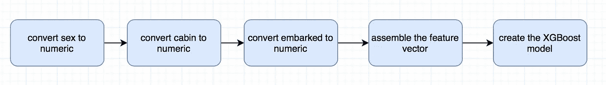

# 使用 Spark 结构化流、XGBoost 和 Scala 进行实时预测

> 原文：<https://towardsdatascience.com/realtime-prediction-using-spark-structured-streaming-xgboost-and-scala-d4869a9a4c66?source=collection_archive---------4----------------------->


在本文中，我们将讨论如何构建一个完整的机器学习管道。第一部分将集中在以标准批处理模式训练二元分类器，第二部分我们将做一些实时预测。

我们将使用来自众多 Kaggle 竞赛之一的[泰坦尼克号:从灾难中学习机器](https://www.kaggle.com/c/titanic/data)的数据。

在开始之前，请了解您应该熟悉 [Scala](https://www.tutorialspoint.com/scala/index.htm) 、 [Apache Spark](https://spark.apache.org) 和 [Xgboost](http://xgboost.readthedocs.io/en/latest/get_started/) 。

所有的源代码也可以在 Github 上找到。酷，现在让我们开始吧！

## 培养

我们将使用 Spark 中的 ML 管道训练一个 XGBoost 分类器。分类器将被保存为输出，并将在 Spark 结构化流实时应用程序中使用，以预测新的测试数据。

**步骤 1:开始 spark 会话**

我们正在创建一个 spark 应用程序，它将在本地运行，并将使用与使用`local[*]`的内核一样多的线程:

```
**val** spark  = SparkSession.*builder*()
  .appName("Spark XGBOOST Titanic Training")
  .master("local[*]")
  .getOrCreate()
```

**步骤 2:定义模式**

接下来，我们定义从 csv 读取的数据的模式。这通常是一个比让 spark 推断模式更好的实践，因为它消耗更少的资源，并且我们完全控制字段。

```
**val** schema = StructType(
  *Array*(*StructField*("PassengerId", DoubleType),
    *StructField*("Survival", DoubleType),
    *StructField*("Pclass", DoubleType),
    *StructField*("Name", StringType),
    *StructField*("Sex", StringType),
    *StructField*("Age", DoubleType),
    *StructField*("SibSp", DoubleType),
    *StructField*("Parch", DoubleType),
    *StructField*("Ticket", StringType),
    *StructField*("Fare", DoubleType),
    *StructField*("Cabin", StringType),
    *StructField*("Embarked", StringType)
  ))
```

**步骤 3:读取数据**

我们将 csv 读入一个`DataFrame`，确保我们提到我们有一个头。

```
**val** df_raw = spark
  .read
  .option("header", "true")
  .schema(schema)
  .csv(filePath)
```

**步骤 4:删除空值**

所有空值都被替换为 0。这并不理想，但对于本教程的目的来说，这是可以的。

```
**val** df = df_raw.na.fill(0)
```

**第五步:将标称值转换为数值**

在浏览这一步的代码之前，让我们简单地浏览一下 Spark ML 的一些概念。他们引入了 ML 管道的概念，这是一组建立在`DataFrames`之上的高级 API，可以更容易地将多个算法合并到一个进程中。管道的主要元素是`Transformer`和`Estimator`。第一个可以表示一种算法，可以将一个`DataFrame`转换成另一个`DataFrame`，而后者是一种算法，可以适合一个`DataFrame`来产生一个`Transformer`。

为了将名义值转换成数值，我们需要为每一列定义一个`Transformer`:

```
**val** sexIndexer = **new** StringIndexer()
  .setInputCol("Sex")
  .setOutputCol("SexIndex")
  .setHandleInvalid("keep")

**val** cabinIndexer = **new** StringIndexer()
  .setInputCol("Cabin")
  .setOutputCol("CabinIndex")
  .setHandleInvalid("keep")

**val** embarkedIndexer = **new** StringIndexer()
  .setInputCol("Embarked")
  .setOutputCol("EmbarkedIndex")
  .setHandleInvalid("keep")
```

我们使用`StringIndexer`来转换值。对于每个`Transformer`,我们将定义包含修改值的输入列和输出列。

**步骤 6:将列组合成特征向量**

我们将使用另一个`Transformer`将 XGBoost `Estimator`分类中使用的列组装成一个向量:

```
**val** vectorAssembler = **new** VectorAssembler()
  .setInputCols(*Array*("Pclass", "SexIndex", "Age", "SibSp", "Parch", "Fare", "CabinIndex", "EmbarkedIndex"))
  .setOutputCol("features")
```

**步骤 7:添加 XGBoost 估计器**

定义将生成模型的`Estimator`。估计器的设置可以在图中定义。我们还可以设置特征和标签列:

```
**val** xgbEstimator = **new** XGBoostEstimator(*Map*[String, Any]("num_rounds" -> 100))
  .setFeaturesCol("features")
  .setLabelCol("Survival")
```

**步骤 8:构建管道和分类器**

在我们创建了所有单独的步骤之后，我们可以定义实际的管道和操作顺序:

```
**val** pipeline = **new** Pipeline().setStages(*Array*(sexIndexer, cabinIndexer, embarkedIndexer, vectorAssembler, xgbEstimator))
```



输入`DataFrame`将被转换多次，最终将产生用我们的数据训练的模型。我们将保存输出，以便在第二个实时应用程序中使用。

```
**val** cvModel = pipeline.fit(df)
cvModel.write.overwrite.save(modelPath)
```

## 预言；预测；预告

我们将使用 Spark 结构化流从一个文件中传输数据。在现实世界的应用程序中，我们从 Apache Kafka 或 AWS Kinesis 等专用分布式队列中读取数据，但对于这个演示，我们将只使用一个简单的文件。

简要描述 [Spark 结构化流](https://spark.apache.org/docs/latest/structured-streaming-programming-guide.html#input-sources)是一个基于 Spark SQL 构建的流处理引擎。它使用了与`DataFrames`相同的概念，数据存储在一个无界的表中，该表随着数据的流入而增加新的行。

**步骤 1:创建输入读取流**

我们再次创建一个 spark 会话，并为数据定义一个模式。请注意，测试 csv 不包含标签`Survival`。最后我们可以创建输入流`DataFrame,` `df`。输入路径必须是我们存储 csv 文件的目录。它可以包含一个或多个具有相同模式的文件。

```
**val** spark: SparkSession = SparkSession.*builder*()
  .appName("Spark Structured Streaming XGBOOST")
  .master("local[*]")
  .getOrCreate()

**val** schema = StructType(
  *Array*(*StructField*("PassengerId", DoubleType),
    *StructField*("Pclass", DoubleType),
    *StructField*("Name", StringType),
    *StructField*("Sex", StringType),
    *StructField*("Age", DoubleType),
    *StructField*("SibSp", DoubleType),
    *StructField*("Parch", DoubleType),
    *StructField*("Ticket", StringType),
    *StructField*("Fare", DoubleType),
    *StructField*("Cabin", StringType),
    *StructField*("Embarked", StringType)
  ))

  **val** df = spark
    .readStream
    .option("header", "true")
    .schema(schema)
    .csv(fileDir)
```

**第二步:加载 XGBoost 模型**

在对象`XGBoostModel`中，我们加载预训练模型，该模型将应用于我们在流中读取的每一批新行。

```
**object** XGBoostModel {

  **private val** *modelPath* = "your_path"

  **private val** *model* = PipelineModel.*read*.load(*modelPath*)

  **def** transform(df: DataFrame) = {
    // replace nan values with 0
    **val** df_clean = df.na.fill(0)

    // run the model on new data
    **val** result = *model*.transform(df_clean)

    // display the results
    result.show()
  }

}
```

**步骤 3:定义自定义 ML 接收器**

为了能够将我们的分类器应用于新数据，我们需要创建一个新的接收器(流和输出之间的接口，在我们的例子中是 XGBoost 模型)。为此，我们需要一个自定义接收器(`MLSink`)、一个抽象接收器提供者(`MLSinkProvider`)和一个提供者实现(`XGBoostMLSinkProvider`)。

```
**abstract class** MLSinkProvider **extends** StreamSinkProvider {
  **def** process(df: DataFrame): Unit

  **def** createSink(
                  sqlContext: SQLContext,
                  parameters: Map[String, String],
                  partitionColumns: Seq[String],
                  outputMode: OutputMode): MLSink = {
    **new** MLSink(process)
  }
}

**case class** MLSink(process: DataFrame => Unit) **extends** Sink {
  **override def** addBatch(batchId: Long, data: DataFrame): Unit = {
    process(data)
  }
}**class** XGBoostMLSinkProvider **extends** MLSinkProvider {
  **override def** process(df: DataFrame) {
    XGBoostModel.*transform*(df)
  }
}
```

**步骤 4:将数据写入我们的自定义接收器**

最后一步是定义一个将数据写入自定义接收器的查询。还必须定义一个检查点位置，以便应用程序在失败时“记住”流中读取的最新行。如果我们运行该程序，每一批新的数据将显示在控制台上，其中也包含预测的标签。

```
df.writeStream
  .format("titanic.XGBoostMLSinkProvider")
  .queryName("XGBoostQuery")
  .option("checkpointLocation", checkpoint_location)
  .start()
```