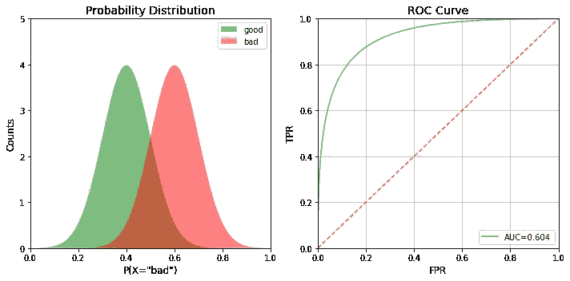
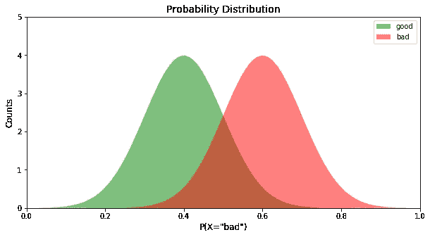
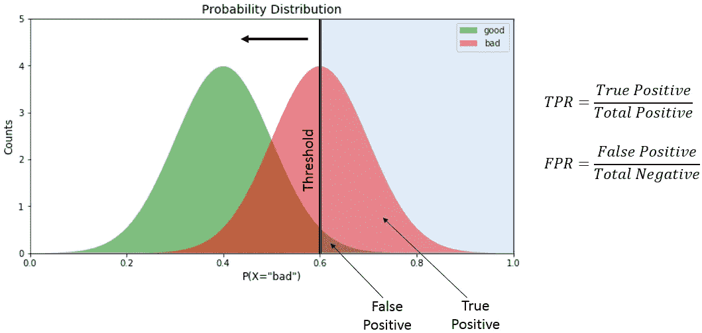
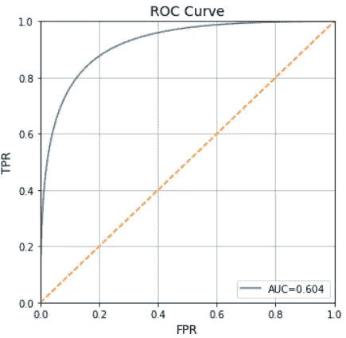
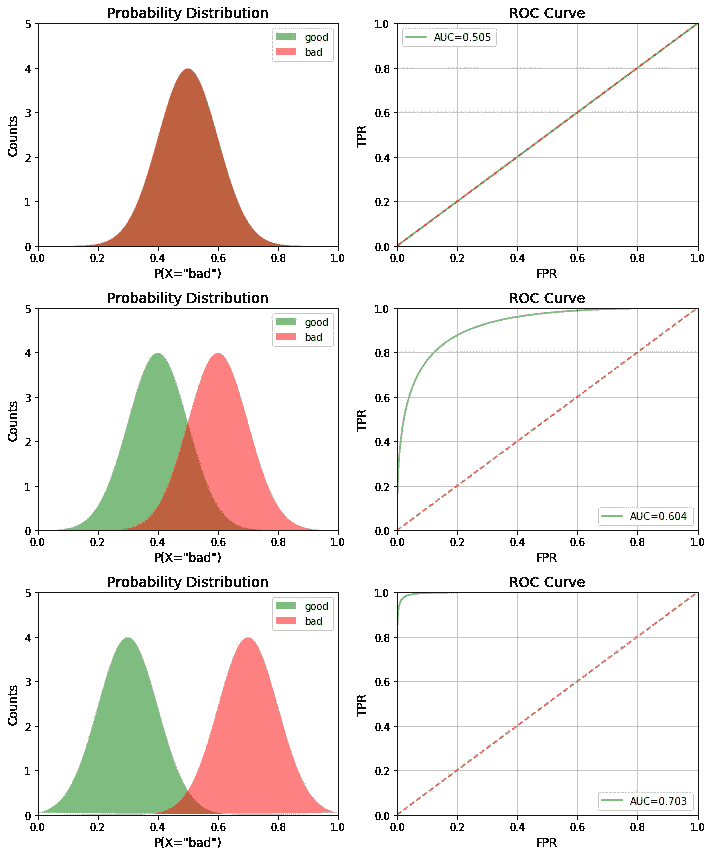

# 接收器工作特性曲线解密(Python 语言)

> 原文：<https://towardsdatascience.com/receiver-operating-characteristic-curves-demystified-in-python-bd531a4364d0?source=collection_archive---------1----------------------->



在数据科学中，评估模型性能非常重要，最常用的性能指标是分类得分。然而，在处理具有严重类别不平衡的欺诈数据集时，一个分类分数没有太大意义。相反，接收机工作特性或 ROC 曲线提供了一个更好的选择。ROC 是信号(真阳性率)对噪声(假阳性率)的图。通过查看 ROC 曲线下的面积(或 AUC)来确定模型性能。最好的 AUC 可能是 1，而最差的是 0.5(45 度随机线)。任何小于 0.5 的值都意味着我们可以简单地做与模型建议完全相反的事情，以使值回到 0.5 以上。

虽然 ROC 曲线很常见，但并没有太多的教学资源解释它是如何计算或得出的。在这篇博客中，我将逐步展示如何使用 Python 绘制 ROC 曲线。之后，我将解释基本 ROC 曲线的特征。

# 类别的概率分布

首先，让我们假设我们的假设模型为预测每个记录的类别产生了一些概率。与大多数二元欺诈模型一样，让我们假设我们的类别是“好”和“坏”，并且该模型产生 P(X=“坏”)的概率。为了创建这个概率分布，我们绘制了一个高斯分布图，每个类别有不同的平均值。想了解更多关于高斯分布的信息，请阅读这篇博客。

```
import numpy as np
import matplotlib.pyplot as pltdef pdf(x, std, mean):
    cons = 1.0 / np.sqrt(2*np.pi*(std**2))
    pdf_normal_dist = const*np.exp(-((x-mean)**2)/(2.0*(std**2)))
    return pdf_normal_distx = np.linspace(0, 1, num=100)
good_pdf = pdf(x,0.1,0.4)
bad_pdf = pdf(x,0.1,0.6)
```

现在我们有了分布，让我们创建一个函数来绘制分布。

```
def plot_pdf(good_pdf, bad_pdf, ax):
    ax.fill(x, good_pdf, "g", alpha=0.5)
    ax.fill(x, bad_pdf,"r", alpha=0.5)
    ax.set_xlim([0,1])
    ax.set_ylim([0,5])
    ax.set_title("Probability Distribution", fontsize=14)
    ax.set_ylabel('Counts', fontsize=12)
    ax.set_xlabel('P(X="bad")', fontsize=12)
    ax.legend(["good","bad"])
```

现在让我们使用这个 **plot_pdf** 函数来生成绘图:

```
fig, ax = plt.subplots(1,1, figsize=(10,5))
plot_pdf(good_pdf, bad_pdf, ax)
```



现在我们有了二元类的概率分布，我们可以用这个分布来推导 ROC 曲线。

# 推导 ROC 曲线

为了从概率分布得出 ROC 曲线，我们需要计算真阳性率(TPR)和假阳性率(FPR)。举个简单的例子，假设阈值在 P(X='bad')=0.6。



真阳性是阈值右侧指定为“坏”的区域。假阳性表示阈值右侧指定为“好”的区域。总正值是“差”曲线下的总面积，而总负值是“好”曲线下的总面积。我们将图中所示的值相除，得出 TPR 和 FPR。我们推导出不同阈值下的 TPR 和 FPR，得到 ROC 曲线。利用这些知识，我们创建了 ROC 绘图函数:

```
def plot_roc(good_pdf, bad_pdf, ax):
    #Total
    total_bad = np.sum(bad_pdf)
    total_good = np.sum(good_pdf)
    #Cumulative sum
    cum_TP = 0
    cum_FP = 0
    #TPR and FPR list initialization
    TPR_list=[]
    FPR_list=[]
    #Iteratre through all values of x
    for i in range(len(x)):
        #We are only interested in non-zero values of bad
        if bad_pdf[i]>0:
            cum_TP+=bad_pdf[len(x)-1-i]
            cum_FP+=good_pdf[len(x)-1-i]
        FPR=cum_FP/total_good
        TPR=cum_TP/total_bad
        TPR_list.append(TPR)
        FPR_list.append(FPR)
    #Calculating AUC, taking the 100 timesteps into account
    auc=np.sum(TPR_list)/100
    #Plotting final ROC curve
    ax.plot(FPR_list, TPR_list)
    ax.plot(x,x, "--")
    ax.set_xlim([0,1])
    ax.set_ylim([0,1])
    ax.set_title("ROC Curve", fontsize=14)
    ax.set_ylabel('TPR', fontsize=12)
    ax.set_xlabel('FPR', fontsize=12)
    ax.grid()
    ax.legend(["AUC=%.3f"%auc])
```

现在让我们使用这个 **plot_roc** 函数来生成绘图:

```
fig, ax = plt.subplots(1,1, figsize=(10,5))
plot_roc(good_pdf, bad_pdf, ax)
```



现在绘制概率分布图和 ROC 图，以便直观比较:

```
fig, ax = plt.subplots(1,2, figsize=(10,5))
plot_pdf(good_pdf, bad_pdf, ax[0])
plot_roc(good_pdf, bad_pdf, ax[1])
plt.tight_layout()
```


# 阶级分离的影响

既然我们可以得到两个图，让我们看看 ROC 曲线如何随着类别分离(即模型性能)的改善而变化。我们通过改变概率分布中高斯分布的平均值来做到这一点。

```
x = np.linspace(0, 1, num=100)
fig, ax = plt.subplots(3,2, figsize=(10,12))
means_tuples = [(0.5,0.5),(0.4,0.6),(0.3,0.7)]
i=0
for good_mean, bad_mean in means_tuples:
    good_pdf = pdf(x, 0.1, good_mean)
    bad_pdf  = pdf(x, 0.1, bad_mean)
    plot_pdf(good_pdf, bad_pdf, ax[i,0])
    plot_roc(good_pdf, bad_pdf, ax[i,1])
    i+=1
plt.tight_layout()
```



如您所见，AUC 随着我们增加类别之间的间隔而增加。

# 放眼 AUC 之外

除了 AUC，ROC 曲线也可以帮助调试模型。通过观察 ROC 曲线的形状，我们可以评估模型的错误分类。例如，如果曲线的左下角更接近随机线，则暗示模型在 X=0 处分类错误。然而，如果右上角是随机的，则意味着误差发生在 X=1 处。此外，如果曲线上有尖峰(而不是平滑的)，这意味着模型不稳定。

# 附加说明

[](/data-science-interview-guide-4ee9f5dc778) [## 数据科学面试指南

### 数据科学是一个相当大且多样化的领域。因此，做一个万事通真的很难…

towardsdatascience.com](/data-science-interview-guide-4ee9f5dc778) [](/fraud-detection-under-extreme-class-imbalance-c241854e60c) [## 极端类别不平衡下的欺诈检测

### 数据科学中的一个热门领域是欺诈分析。这可能包括信用卡/借记卡欺诈、反洗钱…

towardsdatascience.com](/fraud-detection-under-extreme-class-imbalance-c241854e60c)