# 更好地理解深度学习的最新进展

> 原文：<https://towardsdatascience.com/recent-advances-for-a-better-understanding-of-deep-learning-part-i-5ce34d1cc914?source=collection_archive---------3----------------------->

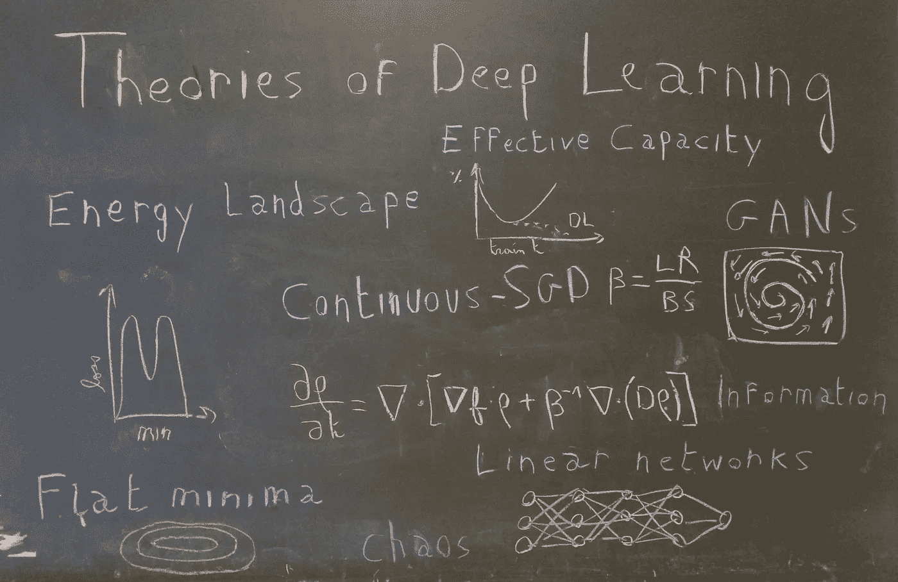

> 我希望生活在一个系统建立在严谨、可靠、可验证的知识之上，而不是炼金术之上的世界。[……]简单的实验和简单的定理是帮助理解复杂的更大现象的**积木**。

这种呼吁更好地**理解深度学习的**是阿里·拉希米在 2017 年 12 月 NIPS 举行的[时间考验奖颁奖典礼](http://www.argmin.net/2017/12/05/kitchen-sinks/)的核心。通过比较深度学习和炼金术，阿里的目标不是解散整个领域，而是[“开启对话”](http://www.argmin.net/2017/12/11/alchemy-addendum/)。这个目标[肯定已经实现](https://syncedreview.com/2017/12/12/lecun-vs-rahimi-has-machine-learning-become-alchemy/)而人们[还在争论](https://twitter.com/RandomlyWalking/status/1017899452378550273)我们目前的深度学习实践应该被认为是炼金术、工程学还是科学。

七个月后，机器学习社区再次聚集，这一次是在斯德哥尔摩举行的机器学习国际会议(ICML)。有超过 5000 名参与者和 629 篇论文发表，这是关于基础机器学习研究的最重要事件之一。而**深度学习理论**成为了大会最大的议题之一。

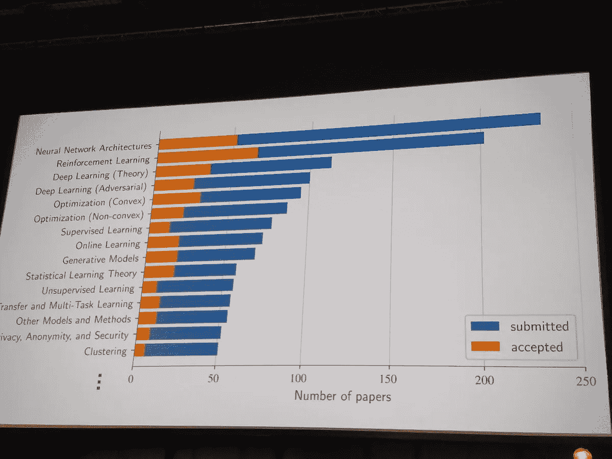

这种重新燃起的兴趣在第一天就显露出来了，大会最大的房间之一挤满了机器学习从业者，他们准备听 Sanjeev Arora 关于深度学习理论理解的教程。在他的演讲中，普林斯顿大学计算机科学教授总结了深度学习理论研究的当前领域，将它们分为四个分支:

*   **非凸优化**:如何理解与深度神经网络相关的高度非凸损失函数？为什么随机梯度下降甚至会收敛？
*   **过度参数化和泛化**:在经典统计理论中，泛化依赖于参数的个数而不是深度学习。为什么？我们能找到另一个好的概括方法吗？
*   深度的作用:深度是如何帮助神经网络收敛的？深度和概括有什么联系？
*   **生成模型**:为什么生成对抗网络(GANs)如此有效？我们可以用什么理论性质来稳定它们或避免模式崩溃？

在这一系列的文章中，我们将基于最近的论文尝试在这四个领域建立直觉，特别关注 ICML 2018。

这第一篇文章将关注深度网络的非凸优化的奥秘。

# 非凸优化

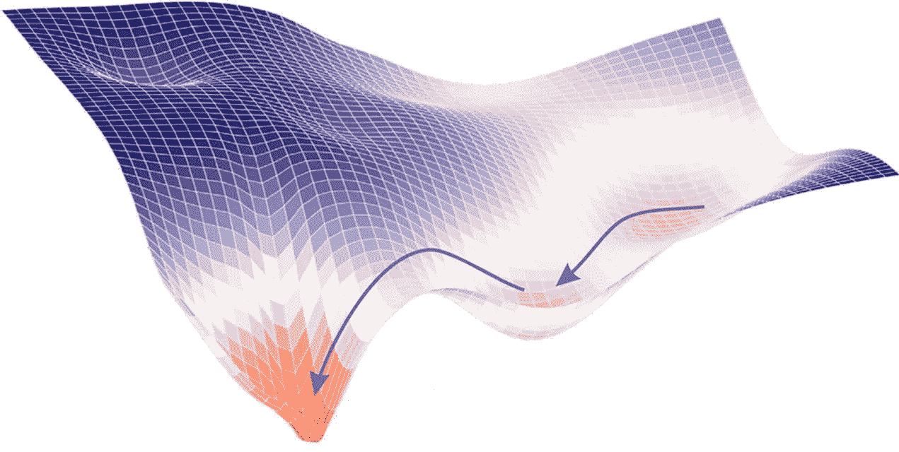

> 我敢打赌，你们中的很多人都尝试过从头开始训练自己的深层网络，并且因为无法让它发挥作用而对自己感觉很糟糕。我不认为这是你的错。我觉得是梯度下降的错。

阿里·拉希米在 NIPS 的演讲中以挑衅的口吻说道。随机梯度下降(SGD)确实是深度学习的基石。它应该找到一个高度非凸优化问题的解决方案，并且理解它何时工作以及为什么工作，是我们在深度学习的一般理论中必须解决的最基本的问题之一。更具体地，对深度神经网络的非凸优化的研究可以分为两个问题:

*   损失函数是什么样的？
*   SGD 为什么会收敛？

# 损失函数是什么样的？

如果我让你想象一个全局最小值，你脑海中浮现的第一个图像很可能是这样的:

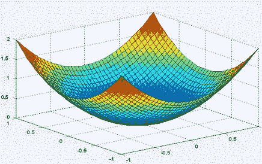

这很正常。在 2D 世界中，找到这样的问题并不罕见，在全局最小值附近，你的函数将是**严格**凸的(这意味着海森矩阵在这一点上的两个特征值将都是严格正的)。但在一个有数十亿参数的世界里，就像深度学习中的情况一样，围绕全局最小值的方向没有一个是平坦的可能性有多大？或者等价地，hessian 不包含单个零(或几乎零)特征值？

Sanjeev Arora 在他的教程中的第一个评论是，损失函数的可能方向的数量随着维度呈指数增长。

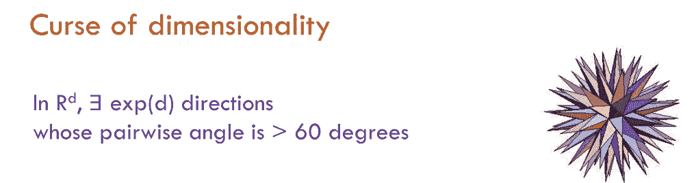

那么，直觉上，似乎一个全局最小值将不会是一个点，而是一个**连通的流形**。这意味着，如果你已经达到了一个全局最小值，你应该能够在一条平坦的路径上行走，在这条路径上所有的点也是最小值。海德堡大学的一个团队已经在大型网络上通过实验证明了这一点，在他们的论文[中，神经网络能源领域基本上没有障碍](https://icml.cc/Conferences/2018/Schedule?showEvent=2780)【1】。他们提出了一个更普遍的说法，即任何两个全局最小值都可以通过一条平坦的路径连接起来。

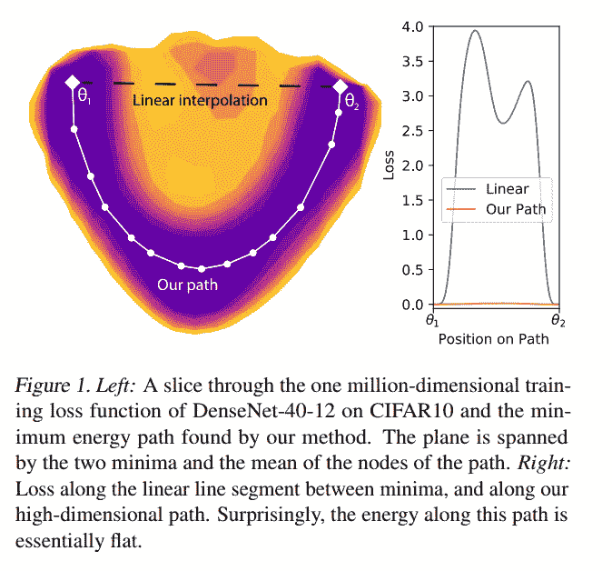

已经知道 MNIST 的 CNN 或 PTB 的 RNN 就是这种情况[2]，但这项工作将这种知识扩展到更大的网络(一些 DenseNets 和 ResNets ),这些网络在更高级的数据集(CIFAR10 和 CIFAR100)上进行训练。为了找到这条路径，他们使用了一种来自分子统计力学的启发式方法，称为 AutoNEB。这个想法是在你的两个极小值之间创建一个初始路径(例如线性)，并在该路径上放置枢轴。然后反复修改枢轴的位置，使每个枢轴的损失最小化，并确保枢轴之间的距离保持不变(通过用弹簧模拟枢轴之间的空间)。

如果他们没有从理论上证明这一结果，他们会对为什么存在这样的路径给出一些直观的解释:

> 如果我们扰动一个单一的参数，比如说增加一个小常数，但让其他参数自由适应这种变化，以尽可能减少损失，有人可能会说，通过某种程度的调整，无数的其他参数可以“弥补”施加在其中一个参数上的变化

因此，本文的结果可以帮助我们通过超参数化和高维空间的透镜以不同的方式看到最小值。

更一般地，当考虑神经网络的损失函数时，你应该始终记住在给定点可能的方向的数量是巨大的。另一个结果是鞍点必须比局部最小值丰富得多:在一个给定的(临界)点，在数十亿个可能的方向中，很可能找到一个向下的方向(如果你不在全局最小值中)。这种直觉在 NIPS 2014 年发表的一篇论文中得到严格的形式化和经验证明:[识别和攻击高维非凸优化中的鞍点问题](https://arxiv.org/abs/1406.2572) [6]

# 为什么 SGD 会收敛(或者不收敛)？

深度神经网络优化中的第二个重要问题与 SGD 的收敛特性有关。虽然这种算法长期以来被视为梯度下降的更快但近似的版本，但我们现在有证据表明 SGD 实际上收敛到更好、更一般的最小值[3]。但是我们能形式化它并定量解释 SGD 逃离局部极小值或鞍点的能力吗？

## SGD 修改了损失函数

论文[另一种观点:新币何时逃脱局部最小值？](https://arxiv.org/abs/1802.06175)【4】表明执行 SGD 相当于对卷积(从而平滑)损失函数进行常规梯度下降。从这个角度出发，在一定的假设下(作者证明这在实践中经常是正确的)，他们证明了 SGD 将设法摆脱局部极小值，并收敛到全局极小值周围的一个小区域。

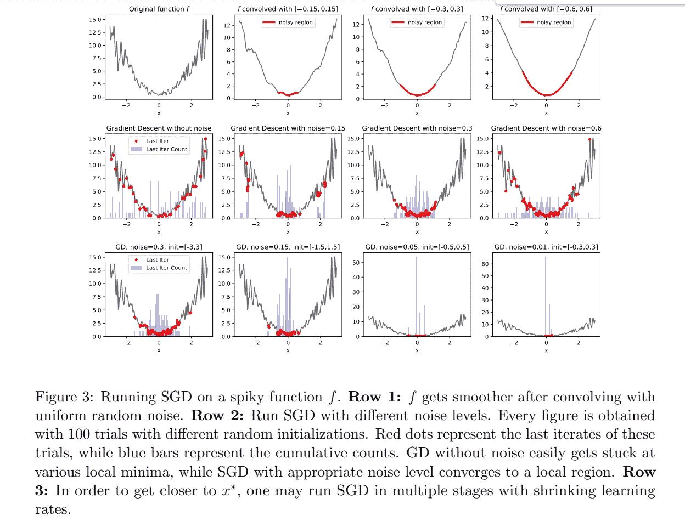

## SGD 受随机微分方程支配

另一种真正改变了我对这种算法的看法的 SGD 方法是*连续 SGD* 。这个想法是由 Yoshua Bengio 在他的关于随机梯度下降、平坦性和一般化的[演讲中提出的，在 ICML 非凸优化研讨会上发表。SGD 没有移动损失函数上的一个点，而是一个**点云**，或者换句话说，**一个分布**。](http://www.iro.umontreal.ca/~bengioy/talks/ICMLW-nonconvex-14july2018.pptx.pdf)

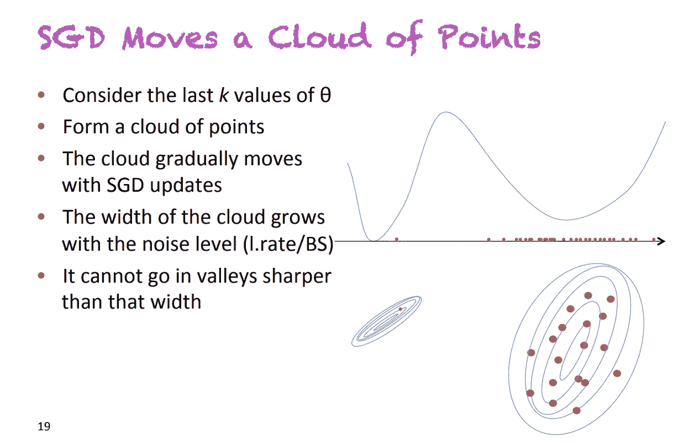

Slide extracted from the presentation [On stochastic gradient descent, flatness and generalization](http://www.iro.umontreal.ca/~bengioy/talks/ICMLW-nonconvex-14july2018.pptx.pdf)*, by Y. Bengio, at ICML 2018\. He presented an alternative way to see SGD, where you replace points by distributions (clouds of points)*

这个点云的大小(即相关分布的方差)与因子 *learning_rate / batch_size* 成比例。Pratik Chaudhari 和 Stefano Soatto 在《机器学习中的几何》研讨会上发表的论文[“随机梯度下降执行变分推理，收敛到深度网络的极限环”](https://arxiv.org/pdf/1710.11029.pdf)【5】中给出了一个证明。这个公式非常直观:低批量意味着非常嘈杂的梯度(因为是在数据集的非常小的子集上计算的)，高学习率意味着嘈杂的步骤。

将 SGD 视为随时间移动的分布的结果是，控制下降的方程现在是[随机偏微分方程](https://en.wikipedia.org/wiki/Stochastic_partial_differential_equation)。更确切地说，在某些假设下，[5]表明这个支配方程实际上是一个 [**福克-普朗克方程**](https://en.wikipedia.org/wiki/Fokker%E2%80%93Planck_equation) 。

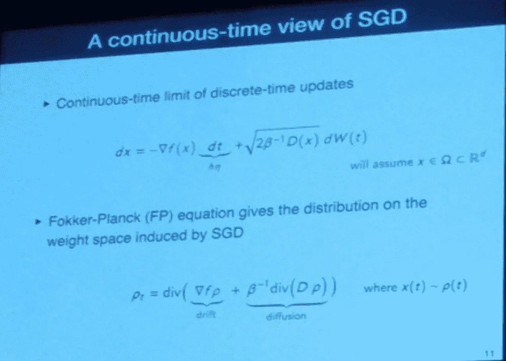

Slide extracted from the presentation *High-dimensional Geometry and Dynamics of Stochastic Gradient Descent for Deep Networks, by P. Chaudhari and S. Soatto, at ICML 2018\. They showed how to pass from a discrete system to a continuous one described by the Fokker-Plank equation*

在统计物理学中，这种类型的方程描述了受到阻力(使分布漂移，即移动其平均值)和随机力(使分布扩散，即增加其方差)作用的粒子的演化。在 SGD 中，阻力由真实梯度模拟，而随机力对应于算法固有的噪声。正如你在上面的幻灯片中所看到的，扩散项与温度项成正比*T = 1/β= learning _ rate/(2 * batch _ size)*，这再次表明了这个比值的重要性！

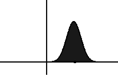

Evolution of a distribution under the Fokker-Planck equation. It drifts on the left and diffuses with time. Source: [Wikipedia](https://en.wikipedia.org/wiki/Fokker%E2%80%93Planck_equation)

使用这个框架，Chaudhari 和 Soatto 证明了我们的分布将单调收敛到某个稳定分布(在 [KL-divergence](https://en.wikipedia.org/wiki/Kullback%E2%80%93Leibler_divergence) 的意义上):

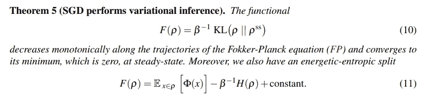

One of the main theorems of [5], proving monotonic convergence of the distribution to a steady state (in the sense of the KL divergence). The second equation shows that minimizing F is equivalent to minimizing a certain potential ϕ as well as maximizing the entropy of the distribution (trade-off controlled by the temperature 1/β)

上面的定理中有几个有趣的地方需要评论:

*   被 SGD 最小化的泛函可以重写为两项之和(等式)。11):一个势φ的期望，和分布的熵。温度 *1/β* 控制着这两项之间的权衡。
*   潜在的φ仅取决于数据和网络的架构(而不是优化过程)。如果它等于损失函数，SGD 将收敛到一个全局最小值。然而，论文表明这种情况很少发生，知道φ离损失函数有多远就会告诉你你的 SGD 收敛的可能性有多大。
*   最终分布的熵取决于比率*学习速率/批量大小*(温度)。直观地说，熵与分布的大小有关，高温通常会导致分布具有高方差，这通常意味着平坦的最小值。由于平坦的最小值通常被认为是更好的概括，这与经验发现一致，即高学习和低批量通常导致更好的最小值。

因此，将 SGD 视为随时间移动的分布向我们展示了 *learning_rate/batch_size* 在收敛性和泛化能力方面比每个分离的超参数更有意义。此外，它能够引入与融合相关的网络潜力，这可以为架构搜索提供良好的度量。

# 结论

寻找深度学习理论的过程可以分为两个部分:首先，通过玩具模型和实验，建立关于它如何以及为什么工作的直觉，然后将这些直觉表达成数学形式，这可以帮助我们解释我们当前的结果并做出新的结果。

在这第一篇文章中，我们试图传达神经网络的高维损失函数和 SGD 的解释的更多直觉，同时表明新类型的形式主义正在以具有深度神经网络优化的真正数学理论为目标而建立。

然而，尽管非凸优化是深度学习的基石，但它的成功主要来自于它在大量层和参数的情况下仍能很好地概括。这将是下一部分的目标。

# 参考

[1]费利克斯·德拉克斯勒、坎比斯·韦施吉尼、曼弗雷德·萨尔姆霍弗、弗雷德·汉普雷希特。[神经网络能源格局基本无障碍](https://icml.cc/Conferences/2018/Schedule?showEvent=2780)， *ICML 2018。*

[2]丹尼尔·弗里曼，琼·布鲁纳。[半整流网络优化的拓扑与几何](https://arxiv.org/abs/1611.01540)，a *rXiv:1611.01540* ，2016。

[3]尼蒂什·什里什·凯什卡尔、迪伊瓦萨·穆迪格雷、豪尔赫·诺切达尔、米哈伊尔·斯梅兰斯基、平·塔克·唐露晓。[关于深度学习的大批量训练:泛化差距与尖锐极小](https://arxiv.org/pdf/1609.04836.pdf)， *ICLR 2017* 。

[4]罗伯特·克莱恩伯格，李沅芷，杨远。[另一种观点:新币何时逃脱局部最小值？](https://arxiv.org/abs/1802.06175)、 *ICML 2018*

[5]斯特凡诺·索阿托·普拉蒂克·乔德里。[随机梯度下降执行变分推理](https://arxiv.org/pdf/1710.11029.pdf)，收敛到深度网络的极限环， *ICLR 2018*

[6]扬·多芬、拉兹万·帕斯卡努、卡格拉尔·古尔切雷、赵京贤、苏亚甘古利、约舒阿·本吉奥。[识别并攻克高维非凸优化中的鞍点问题](https://arxiv.org/abs/1406.2572)， *NIPS 2014*