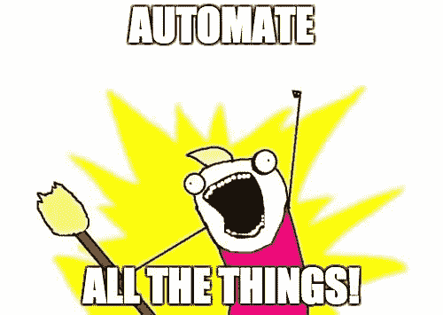
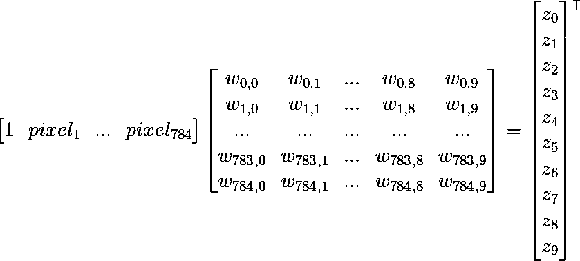

# 用 Scala 识别手写数字

> 原文：<https://towardsdatascience.com/recognising-handwritten-digits-with-scala-9829d035f7bc?source=collection_archive---------5----------------------->

doddle-model: immutable machine learning in Scala.

在过去的几个月里，我开始大量编写 Scala 代码，对于从 Python 移植过来的人来说，我不得不承认，在静态类型的环境中操作比我以前愿意承认的要安全得多。

我的 Python 之旅的主要原因是它的机器学习生态系统，当我开始研究 Scala 中 ML 的状态时，我意识到这两种语言在可用库方面存在巨大差距。特别是，我在寻找一个 Scala 来替代 Python 中的 scikit-learn，公平地说，当我发现没有 Scala 时，我感到很沮丧。当我想起我可以开始自己建造它时，我的失望很快变成了渴望，我也确实这样做了。

这篇文章有两个目的:我想传播关于**的消息，并向非 ML 受众展示如何以一种高度直观而非技术性的方式解决识别手写数字的问题。**

# **介绍**

**这个库叫做 [**doddle-model**](https://github.com/picnicml/doddle-model) ，这个名字是为了强调它的易用性。**

> ****doddle** 英式，非正式:非常简单的任务，例如“这台打印机很容易安装和使用。”**

**它本质上是一个内存中的机器学习库，可以总结为三个主要特征:**

*   **它建立在 [Breeze](https://github.com/scalanlp/breeze) 之上**
*   **它提供了[不可变对象](https://en.wikipedia.org/wiki/Immutable_object),这些对象在并行代码中使用*很容易***
*   **它通过一个类似 scikit-learn 的 API 公开其功能**

**还应该指出的是，该项目正处于早期发展阶段，任何形式的贡献都非常感谢。**

# **问题定义**

**假设你的奶奶让你帮她将一本旧的手写电话簿数字化，将联系人保存在手机上。不幸的是，这个列表很长，作为一个精明的工程师，你很快意识到像这样重要的任务必须自动化。你还记得听说过一个流行的[带标签的手写数字数据库](https://en.wikipedia.org/wiki/MNIST_database)，其中包含 70，000 张图片及其相应的标签，你也许可以用它来帮助你的祖母。你可以看看**图 2** 中的一些例子。**

****

**Image 1: Automate all the things!**

**我们将假设我们已经找到了一种方法来扫描电话簿，并将每个电话号码转换为一组 28x28 灰度图像，其中每个图像代表一个数字。此外，我们将忽略一个事实，即我们不知道如何数字化手写信件，因此将只关注数字本身。**

**给定当前场景，我们感兴趣的是设计一个函数，它将 0 到 255 之间的 784 个整数的向量作为输入，并在输出端产生一个 0 到 9(我们的数字)之间的整数。请记住，灰度图像只包含强度信息，因此 28×28 像素中的每个像素都是一个整数(我们只需将 28×28 矩阵展平为一个向量，以获得 784 个值)。**

****

**Image 2: The digits we scanned from the telephone book (source: [https://en.wikipedia.org/wiki/MNIST_database#/media/File:MnistExamples.png](https://en.wikipedia.org/wiki/MNIST_database#/media/File:MnistExamples.png)).**

# **第一种方法**

**我们将用 ***x*** 表示输入像素向量，用 *y* 表示输出标量。那么我们要寻找的函数就是*f(****x****)= y*。为了方便起见，我们将输出建模为一个分类变量，这无非是说它的值属于一组无序类别中的任何一个，即在我们的例子中是{0，1，2，3，4，5，6，7，8，9}中的一个。如果你看一下[分类分布](https://en.wikipedia.org/wiki/Categorical_distribution)，你可以看到它是由一个概率向量来参数化的，其中每个元素代表第 *k* 个分类的概率，并且它们的总和为 1，因为不存在其他分类。我们可以将这一点结合到我们的函数中，通过说 *f* 的输出不是单个标量 *y* ，而是具有 10 个元素的向量 ***yProb*** ，其中每个元素代表每个可能数字的概率。我们的函数于是变成了*f(****x****)=****yProb***。**

**在这个阶段，我们知道 *f* 的输入是什么(一个展平的图像向量 ***x*** )并且我们知道输出应该是什么样子(一个有 10 个元素的概率向量 ***yProb*** )。现在我们必须弄清楚如何定义函数本身。我们将首先考虑如何为单个类别获得一些任意的实值分数，然后使用这一知识为所有类别获得 10 个实值分数，最后确保这些分数在范围[0，1]内，并且它们的总和确实为 1，因为它们必须表示概率。**

## **我们的功能定义**

**从向量 ***x*** 获得实值标量的一种可能方法是简单地计算 ***x*** 中的值的线性组合。让我们看看如何把它写下来。记住 ***x*** 由 784 个整数组成，即 *pixel_1* ， *pixel_2* ，…， *pixel_783* ， *pixel_784* ，所以要计算这些的线性组合，我们需要 785 个权重 *w_i* 来获得 *z* = *w_0* 如果我们在 ***x*** 的开头插入一个值为 1 的元素，我们可以把这个记为 ***x*** 和 ***w*** 的[点积](https://en.wikipedia.org/wiki/Dot_product)(所有权重 *w_i* 放在一个向量中)，得到 *z* = ***x*****

**这很容易，但是目前，我们只有一个分数 z，实际上我们在输出端需要一个向量 10。嗯，我们可以做的最简单的事情是计算 10 次分数，而不是一次，每次用不同的向量 ***w*** 。我们可以这样写下来:*z _ 0*=***x*ᵀ*w _ 0***，*z _ 1*=***x*ᵀ*w _ 1***， *z_10* = ***x* 同样，如果我们将一个矩阵中的向量***w _ I***w*(每个 ***w_i*** 在 ***W*** 中变成一列)，我们可以将此记为向量矩阵乘法***z***=*****

****让我们看一下我们的函数 *f* 目前的样子，来回顾一下我们到目前为止所做的事情。并且不要担心不知道什么值 ***W*** 持有，我们马上就能到达那里。在**图像 3** 的最左侧是我们的展平图像向量 ***x*** ，带有前置 1，它乘以矩阵 ***W*** 以获得向量 ***z*** ，该向量代表 10 个可能类别(数字)中每一个的实值分数。请注意，我们对每个类别都有一组权重(每个列在 ***W*** 中)，总共有 10*785 个权重。****

********

****Image 3: Our current function that produces 10 real-valued scalars from a flattened image vector.****

****我们的函数定义中只缺少一个需求。我们在本节的开头指定了 ***z*** 的元素必须在范围[0，1]内，并且总和必须为 1，才能被解释为概率。事实证明， [softmax 函数](https://en.wikipedia.org/wiki/Softmax_function)正是我们所寻找的。这很简单，我们不会在这里进行过多的描述，我们要知道的是，它取我们的 ***z*** 并返回 ***yProb*** ，可能看起来像这样***yProb***=[0.024，0.064，0.175，0.475，0.024，0.064，0.175]。如果您对 softmax 函数的定义感兴趣，请点击提供的链接。****

****我们终于知道如何定义我们的 *f* ！这是个好消息，我们几乎可以帮助我们的奶奶解决手机里没有号码的问题了。最终的函数定义如下:*f*(***x***)=*soft max*(***x*ᵀ*w***)。它采用一个展平的图像向量 ***x*** (嗯，我们不能忘记插入 1 作为第一个元素)并返回 10 个可能数字的概率向量。厉害！但是等等，我们还没说重量 ***W*** 呢？！****

## ****重量****

****权重 ***W*** 在 ML 文献中称为模型参数， *f* 称为模型。如果我们随机初始化 ***W*** ，我们很可能会得到一个非常糟糕的模型——预测的数字(向量 ***yProb*** 中具有最大值的类别)大部分时间都是错误的，我们希望找到一种更好的方法。****

****我们还有一件事要处理:带标签的数据集！凭直觉，我们将试图找到一组权重 ***W*** 来很好地处理带标签的数据(我们将称之为**训练数据**，搜索参数将被称为训练)，并希望它们也能很好地处理新数据(从我们祖母的电话簿中扫描的数字)。在这一点上，经过战斗考验的数据科学家可能正在做鬼脸，因为我们不希望仅仅*希望*它会做得很好，我们希望测量它，并确保模型不会犯太多错误。我们不希望模型只是记忆我们的训练示例，而是学习关于数字 2 或数字 9 的概念，并有能力识别这些数字的新的、看不见的图像。****

****让我们定义一下*在我们的场景中是什么意思。我们可以做的是计算我们的模型从训练集中正确获得的图像的比例。这个度量被称为[分类准确度](https://developers.google.com/machine-learning/crash-course/classification/accuracy)，我们可以计算它，因为我们知道训练集中的正确标签是什么。找到 ***W*** 的一种简单方法是简单地尝试随机值并返回具有最高精确度的值。但我们肯定能比随机搜索做得更好，对吧？*****

***同样，我们不想涉及太多的细节，但是有一种迭代优化算法可以找到函数的最小值(查看维基百科页面上的 [gradient descent](https://en.wikipedia.org/wiki/Gradient_descent) 了解更多信息)。这里的想法是，我们指定一个**误差函数**——我们衡量我们的模型在训练集上的预测有多差——并根据参数 ***W*** 将其最小化。梯度下降将会给我们一些 ***W*** 在误差函数方面对我们的训练数据最有效。这个概念在**图 4** 中被形象化:表面是我们的误差函数，X 轴和 Y 轴是我们在*中的两个值(是的，我们实际上有 10*785，但为了形象化，假设我们只有 2 个)，算法沿着红色路径尝试不同的 X 和 Y，最后返回函数值最低的一些 X 和 Y。这个值被称为函数最小值，它在我们的例子中是有意义的，因为我们在寻找误差函数的最小值。****

********

****Image 4: Gradient descent (source: [https://blog.paperspace.com](https://blog.paperspace.com/intro-to-optimization-in-deep-learning-gradient-descent/)).****

****不幸的是，我们不能使用像负分类精度这样的东西作为误差函数，因为梯度下降需要一个可微函数，而精度不是这样。我们可以使用的方法叫做[对数损失](http://wiki.fast.ai/index.php/Log_Loss)，它简单地说我们计算正确类别概率的负对数。我们知道正确的类别是什么，因为我们的训练集是有标签的，所以我们只需从对应于该类别的 ***yProb*** 中取值(姑且称之为 *yProb* )并计算- *log* ( *yProb* )。您可以在**图 5** 中看到，随着 *yProb* 越来越接近 1，该值越来越接近 0。最终的误差函数是我们训练集中所有样本的对数损失的总和(或平均值)。请注意，log loss 还有其他令人满意的属性，这些属性使它成为我们的错误函数的更好选择，但是我们现在不要考虑细节。****

********

****Image 5: Logarithmic loss function (source: [http://wiki.fast.ai](http://wiki.fast.ai)).****

****这实际上是我们第一种方法的精髓，没有什么不能用几行 Scala 实现的！为了回顾我们已经完成的工作，让我们再看一下最重要的步骤:****

*   ****我们设计了一个函数 *f* ，它将一个展平的图像向量 ***x*** 作为输入，并返回一个包含 10 个元素的向量 ***yProb*** ，其中每个元素代表每个可能数字的概率(参数 ***W*** 被合并到*f】*****
*   ****我们已经使用了 *f* 和一个带标签的训练集，通过计算训练集中所有示例的平均对数损失来衡量我们的参数 ***W*** 有多差****
*   ****我们使用了一种优化算法，该算法给出了一些在对数损失误差函数方面表现最佳的 ***W*******
*   ****我们希望返回的 ***W*** 也能适用于电话簿中的数字****

# ****图书馆****

****接下来，我们将看看如何通过使用 [doddle-model](https://github.com/picnicml/doddle-model) 库，用几行 Scala 实现我们到目前为止讨论的所有内容。老实说，该库的具体实现与所介绍的技术有一些重要的不同，这些不同使得整个方法在数值上更稳定、更有效，但是我们现在没有必要讨论这些。让我们直接进入代码。****

****我们将使用来自[mldata.org](http://mldata.org/repository/data/viewslug/mnist-original)的标记数据集，它由 70.000 个标记图像组成。我们将模拟训练和测试数据，仅使用 60.000 张图像进行训练，剩余的 10.000 张用于评估性能。****

****让我们加载数据:****

****如果我们检查形状，我们可以看到`xTrain`和`xTest`中的行代表我们的展平图像向量(每行是一个图像向量)，列代表像素值。`yTrain`和`yTest`持有实际标签，例如前 10 个训练图像上有数字 1、9、2、2、7、1、8、3、3 和 7。****

****训练模型就像下面这样简单:****

****做预测看起来像是:****

****现在我们有了模型预测`yTestPred`和我们知道正确的真实标签`yTest`，我们可以检查模型的预测是否有任何意义。让我们先来看看测试数据的前 10 位数字以及我们对它们的预测。****

****那看起来像它能工作！让我们计算整个测试数据集的分类精度:****

****还不错！我们能够正确地分类 10，000 幅在训练期间没有使用的图像中的 92.22%。这仍然会让我们的奶奶的手机号码不正确，但这是一个很好的起点，我们可以逐步改善！****

# ****表演****

****该库的开发考虑到了性能。参见 [doddle-benchmark](https://github.com/picnicml/doddle-benchmark) 存储库，其中展示了与 scikit-learn 的一些并行性能比较。****

****Breeze(底层数字处理库)利用 [netlib-java](https://github.com/fommil/netlib-java) 访问硬件优化的线性代数库，这是快速执行的主要原因。更多详情请参见[自述文件](https://github.com/picnicml/doddle-model#performance)的性能部分。****

# ****结论****

****如果你已经做到了这一点，给自己一个鼓励，因为你对 softmax 分类器以及如何训练它有相当多的了解。如果你对更多感兴趣，网上有很多免费的好课程和资源。****

****如果您有兴趣了解更多关于[老态龙钟模型](https://github.com/picnicml/doddle-model)的信息，可以看看[老态龙钟模型示例](https://github.com/picnicml/doddle-model-examples)库。它包含当前实现的所有内容的代码示例，应该作为一个很好的起点。****

****如果你有任何问题、建议、评论或只是想聊天，你可以在 [Gitter](https://gitter.im/picnicml/doddle-model) 或 [Twitter](https://twitter.com/nejcilenic) 上给我留言。****