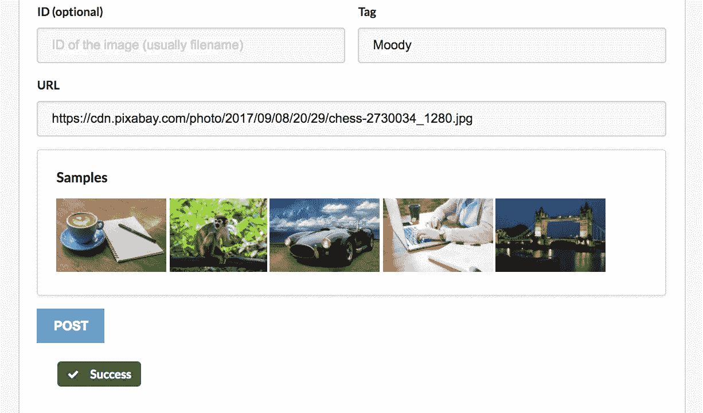
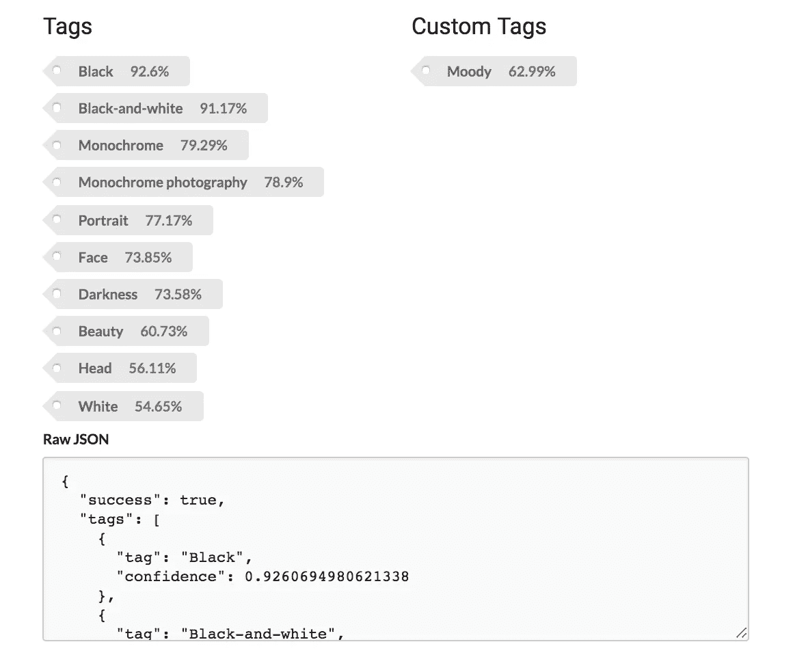

# 在机器学习中，识别上下文仍然很难——下面是解决这个问题的方法

> 原文：<https://towardsdatascience.com/recognizing-context-is-still-hard-in-machine-learning-heres-how-to-tackle-it-ed398a725f8c?source=collection_archive---------9----------------------->

机器学习已经走过了漫长的道路，因为它涉及到识别人脸，物体和其他文字。但它仍然有点纠结的地方是语境。

## 定义上下文

考虑视频质量控制问题。现在有很多工具可以对视频文件进行自动质量控制。它们在检测丢失磁道、文件损坏或元数据不匹配的问题方面做得很好。然而，他们仍然很难告诉你一个图像是否是颠倒的。

当图像颠倒时，人类可以立即分辨出来，但计算机却很难分辨。原因是因为*倒挂*是上下文相关的。

Your brain is telling you that this is wrong

考虑上面的图像。你的大脑告诉你这个图像是颠倒的。有点不对劲。如果这是一个质量控制过程，你应该把它退回去。你也可能会想，这对于计算机来说应该不难理解。

## 为什么电脑看不到颠倒的东西？

也许你可以训练一个机器学习模型来检测有方向的物体。或者试着用很多很多上下颠倒的图片。对于某些用例，这可能行得通。但是当你的模型看到这样的图像时会发生什么呢:

[https://i.pinimg.com/736x/b1/25/71/b12571069c99ac8b8330a6371b9f5ef0--roald-dahl-cockpit.jpg](https://i.pinimg.com/736x/b1/25/71/b12571069c99ac8b8330a6371b9f5ef0--roald-dahl-cockpit.jpg)

这个图像实际上应该是上下颠倒的。作为一名人类质量控制操作员，你不会多看一眼。然而，机器学习模型不会理解上下文，因此会出错。

人类非常擅长上下文。计算机仍然需要一些帮助。

## 但是并不是所有的都失去了

当你可以明确你的用例时，机器学习是最好的。比方说，我想把我所有的图片按照某种上下文分类，比如“喜怒无常”。

> 为了尝试这个，我使用了[机器盒子](https://goo.gl/SQ4u5f)的 Tagbox。让一个可训练的图像识别框在你的计算机上运行大约需要 5 秒钟。

第一步，找一些“喜怒无常”的例子。我从这张图片开始:

Very moody!

我用 Tagbox 的控制台上传了这张照片，并将其标记为“moody”。

Tagbox by Machine Box

几毫秒后，Tagbox 就有了我称之为“喜怒无常”的想法。但是一张照片是不够的。所以我找到了另一张看起来相似的照片，并在 Tagbox 控制台中用另一张我认为“喜怒无常”的照片重复这个过程。

Very moody

在向 Tagbox 展示了两个“moody”的例子后，我准备开始在其他图像上测试它。

> 我使用 Tagbox 控制台手动执行这个任务——当然，API 是用来将这个工作流构建到您的产品和服务中的。

让我们用这张图片来检查我们的模型，看看结果。

Tagbox results

成功！在给它看了两张照片后，它已经了解了一些我的照片的背景，我可以用它们来对剩下的照片进行分类。实际上，我可能想再花 20 分钟进行测试和训练，只是为了确保模型足够健壮以满足我的需求。

关键的一点是，当你心中有一个特定的用例时，机器学习的功能最好，并且可以指导模型应用于该用例。(目前)还没有一种放之四海而皆准的模式。模型越通用，你的用例就需要越通用。

# 什么是机器盒子？

[Machine Box](https://goo.gl/2F11De) 将最先进的**机器学习**功能放入 **Docker 容器**中，这样像您这样的开发人员可以轻松地将自然语言处理、面部检测、对象识别等功能融入其中。到您自己的应用程序中。

这些盒子是为了扩展而建造的，所以当你的应用真正起飞的时候，只需要水平地添加更多的盒子，直到无限甚至更远。哦，它比任何云服务都便宜**([而且可能更好](https://hackernoon.com/which-face-recognition-technology-performs-best-c2c839eb04e7))……而且**你的数据不会离开你的基础设施**。**

**[有戏](https://machinebox.io/docs/facebox/teaching-facebox)让我们知道你的想法。**