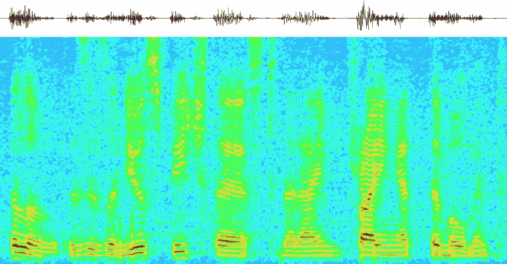
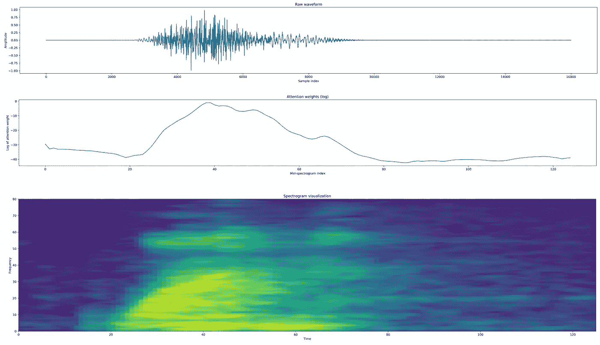
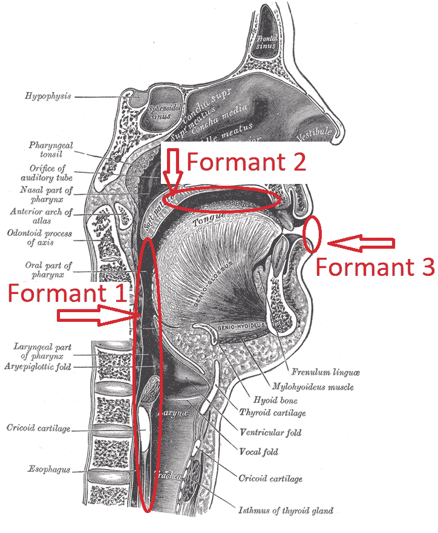
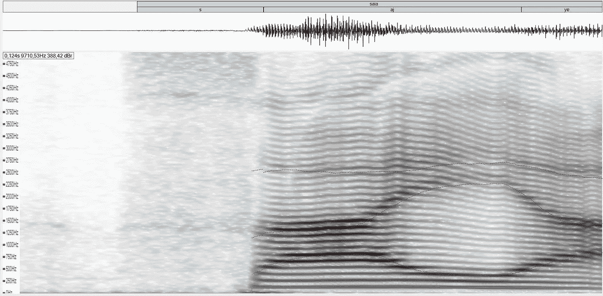
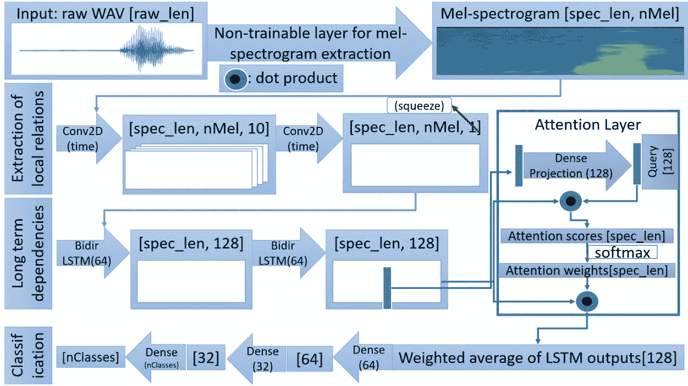
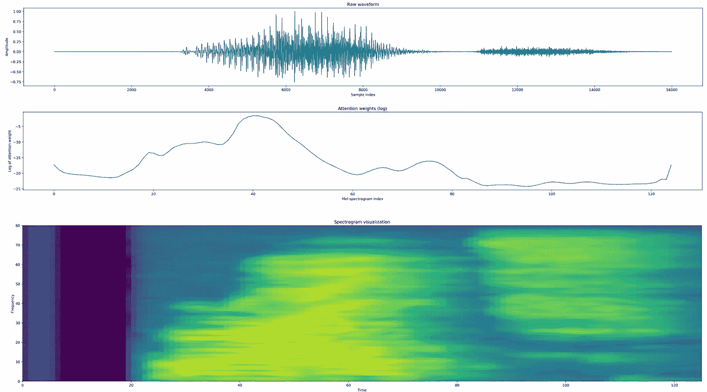

# 用注意递归神经网络识别语音命令

> 原文：<https://towardsdatascience.com/recognizing-speech-commands-using-recurrent-neural-networks-with-attention-c2b2ba17c837?source=collection_archive---------4----------------------->

## 如何为语音应用实现一个可解释的神经模型

Voice spectrogram

语音识别已经成为人机界面(HCI)不可分割的一部分。它们出现在谷歌助手、微软 Cortana、亚马逊 Alexa 和苹果 Siri 等个人助理中，以及自动驾驶汽车 HCI 和员工需要佩戴大量保护设备的活动中(例如，像石油和天然气行业)。

Waveform, neural attention weights and mel-frequency spectrogram for word “one”. Neural attention helps models focus on parts of the audio that really matter.

这种处理大部分是在云中完成的，使用的是强大的神经网络，这些网络经过了海量数据的训练。然而，语音命令模型能够识别单个单词，如“开始”、“停止”、“向左”或“向右”(或“嘿，谷歌”、“Alexa”、“回声”)，由于各种原因，通常在本地运行。首先，将从给定设备获取的所有音频连续流式传输到云中会变得非常昂贵。其次，这在一些应用中甚至是不可能的:考虑海上平台中的操作员想要使用简单的语音命令来控制辅助机器人的情况:可能没有可用的互联网连接或者等待时间可能太长。

在这项工作中，使用了[谷歌语音识别数据集](https://ai.googleblog.com/2017/08/launching-speech-commands-dataset.html)。它包含各种单词的长度为 1s 的简短音频剪辑，是学习如何将深度学习应用于语音的绝佳起点。

# 人声基础

在分析人类声音时，一个非常重要的方面是滤波器，它构成了一个选择性频率传输系统，允许能量通过一些频率，而不允许其他频率。如下图所示，咽、口腔和嘴唇在人类说话中起着重要的作用。

声音共振峰揭示了能量更集中的频率区域。它们是声音频谱中振幅较大的峰值，是元音发音时声道所采用的特定结构所固有的。当说出一个单词时，共振峰与声道的自然共振频率相关联，并取决于舌头相对于内部结构和嘴唇运动的位置。该系统可以近似为具有一个封闭末端(喉)和一个开放末端(唇)的管，通过舌、唇和咽的运动来修改。发生在这个管腔中的共振叫做共振峰。

有趣的是，深度学习实践者很快决定忽略所有这些信息。在百度工作期间，研究员吴恩达继续说，音素是声音的最小组成部分，没有关系。事实上，在一定程度上，重要的是，如果时间间隔足够小，语音大多是一个(准)周期信号。这就产生了忽略信号的相位，只使用其功率谱作为信息源的想法。事实上，声音可以从其功率谱重建(例如，使用 Griffin-Lim 算法或神经声码器)证明了这一点。

尽管在处理原始波形方面已经做了大量的工作(例如，最近的脸书研究中的[)，但是频谱方法仍然很普遍。目前，预处理音频的标准方法是从原始波形计算具有给定跳跃大小的短时傅立叶变换(STFT)。结果称为频谱图，是一个三维排列，显示频率分布和音频强度作为时间的函数，如下图所示。另一个有用的技巧是“拉伸”低频以模仿人类的感知，人类对高频的变化不太敏感。这可以通过计算梅尔频率系数(MFC)来实现。如果你感兴趣的话，有很多详细解释 MFC 的在线资源(](https://code.fb.com/ai-research/wav2letter/)[维基百科是一个很好的开始](https://en.wikipedia.org/wiki/Mel-frequency_cepstrum))。

Diphtongs explicited in word “saia”. Topmost: phonetic notation. Middle: sound waveform. Bottom: Spectrogram with fundamental frequency highlighted in blue and the three first formants highlighted in red.

# 神经注意力结构

既然语音处理的基础是已知的，就有可能提出一种神经网络，它能够处理命令识别，同时仍然在可训练参数的数量方面保持较小的足迹。一个有注意力的循环模型带来各种好处，比如:

*   通过计算输入的重要性权重，使模型可解释；
*   学会识别音频的哪一部分重要；
*   递归神经网络(RNN)架构(如长短期记忆——LSTM 或门控递归单元——GRU)已经证明能够携带信息，同时仍然控制消失/爆发梯度；
*   由于响应延迟 1 秒通常是可以接受的，因此双向 RNN 允许模型提取音频给定点的过去和未来相关性。

Recurrent neural network with attention mechanism. Numbers between [brackets] are tensor dimensions. raw_len is WAV audio length (16000 in the case of audios of length 1s with a sampling rate of 16kHz). spec_len is the sequence length of the generated mel-scale spectrogram. nMel is the number of mel bands. nClasses is the number of desired classes. The activation of the last Dense layer is softmax. The activation of the 64 and 32 dense classification layers is the rectified linear unit (relu).

所提出的架构使用卷积来提取短期依赖性，使用 rnn 和注意力来提取长期依赖性。实施细节可以在[这个资源库](https://github.com/douglas125/SpeechCmdRecognition)中找到。

在 Google Speech 数据集上，当试图识别 20 个单词中的一个，沉默或未知时，所提出的模型达到了 94%以上的准确率。此外，注意力层使模型具有可解释性。例如，在单词“右”的情况下，注意网络将大量注意力放在从 **r** 到 **i** 的过渡上。考虑到在某些情况下 **t** 可能听不到，这是非常直观的。还要注意，注意力权重被放置在过渡中的事实并不意味着模型忽略了音频的其他部分:双向 RNN 带来了来自过去和未来的信息。

Waveform, attention weights and mel-frequency spectrogram of word “right”

# 结论

语音命令识别存在于各种设备中，并被许多 HCI 接口所利用。在许多情况下，希望获得能够在本地运行的轻量级和高精度的模型。这篇文章解释了一种可能的 RNN 架构，它在 Google 语音识别任务上实现了最先进的性能，同时在可训练参数方面仍然保持了较小的影响。[源代码可在 github](https://github.com/douglas125/SpeechCmdRecognition) 上获得。它使用谷歌语音命令数据集(v1 和 v2)来演示如何训练能够识别例如 20 个命令加上静音或未知单词的模型。

该架构能够提取短期和长期的依赖性，并使用注意机制来查明哪个区域具有最有用的信息，然后将这些信息提供给一系列密集层。

在工程应用中，能够解释**哪些特性**用于选择特定类别是很重要的。如上所示，注意机制解释了音频的哪些部分对于分类是重要的，并且还匹配元音过渡区域与识别单词相关的直觉。为了完整起见，[混淆矩阵可以在本文](https://arxiv.org/abs/1808.08929)中找到，并表明如果没有额外的上下文，单词对 tree-three 和 no-down 很难识别。

# 参考

语音命令:有限词汇语音识别数据集[https://arxiv.org/abs/1804.03209](https://arxiv.org/abs/1804.03209)

语音命令识别的神经注意模型[https://arxiv.org/abs/1808.08929](https://arxiv.org/abs/1808.08929)

专业男性歌剧演唱者的共振峰调谐策略，《声音杂志》27(3)(2013)278–288。网址[http://www . science direct . com/science/article/pii/s 089219971200209320](http://www.sciencedirect.com/science/article/pii/S089219971200209320)

腰带和中性风格歌唱之间的呼吸和声学差异，《声音杂志》29(4)(2015)418–5。网址[http://www . science direct . com/science/article/pii/s 089219971400204](http://www.sciencedirect.com/science/article/pii/S089219971400204)

在语音分析中估计预期基频的稳健频域方法，载于[国际创新科学与研究杂志](http://www.ijisr.com/issue/robust-frequency-domain-method-estimation-intended-fundamental-frequency-voice-analysis)

wav2letter++最快的开源语音识别系统[https://arxiv.org/abs/1812.07625](https://arxiv.org/abs/1812.07625)