# 推荐系统——模型和评估

> 原文：<https://towardsdatascience.com/recommendation-systems-models-and-evaluation-84944a84fb8e?source=collection_archive---------3----------------------->

我曾参与构建几种不同类型的推荐系统，我注意到的一件事是每个用例都不同，因为每个用例都旨在解决不同的业务问题。让我们考虑几个例子:

1.  电影/书籍/新闻推荐—推荐增加用户参与度的新内容。目的是向用户介绍他们可能感兴趣的新内容，并鼓励他们在我们的平台上消费更多内容。
2.  股票推荐——推荐对客户最有利可图的股票。推荐的可能是他们历史上交易过的股票。新奇在这里并不重要；股票的盈利能力。
3.  产品建议—建议新旧产品的组合。来自用户历史交易的旧产品作为他们频繁购买的提醒。此外，推荐用户可能喜欢尝试的新产品也很重要。

在所有这些问题中，共同的主线是他们的目标是提高客户满意度，并反过来以增加佣金、提高销售额等形式推动业务。无论使用何种情况，数据通常采用以下格式:

*   客户 ID、产品 ID(电影/股票/产品)、单位数量/评级、交易日期
*   任何其他特征，如产品的细节或客户的人口统计

接下来，我将介绍以下主题:

*   用于构建推荐系统的方法——基于内容、协作过滤、聚类
*   评估指标—统计准确性指标、决策支持准确性指标
*   要记住的事情

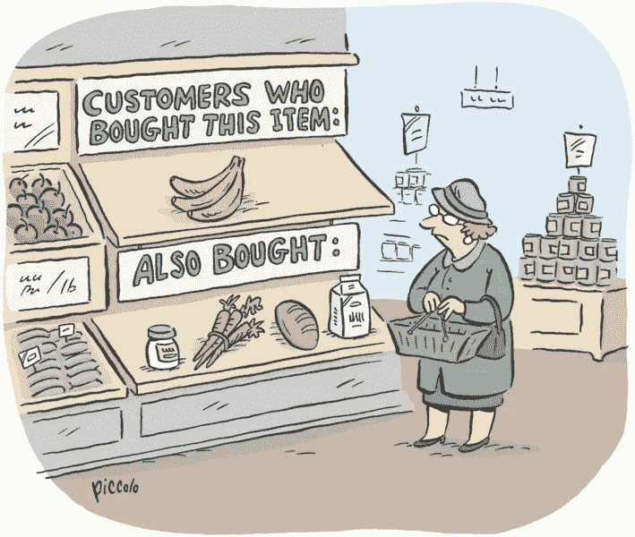

[http://cleverdata.io/basket-analysis-machine-learning/](http://cleverdata.io/basket-analysis-machine-learning/)

# 方法

构建推荐系统有两种主要方法——基于内容的和协同过滤。在下一节中，我将讨论它们中的每一种，以及它们何时适合。

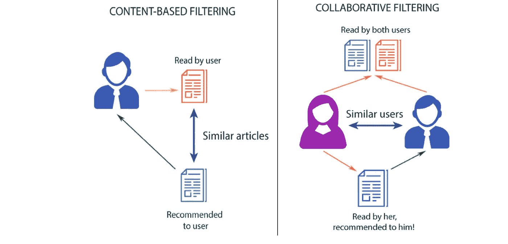

[http://datameetsmedia.com/an-overview-of-recommendation-systems/](http://datameetsmedia.com/an-overview-of-recommendation-systems/)

## 基于内容

这种方法的要点是，我们将用户与他们喜欢或购买的内容或项目相匹配。在这里，用户和产品的属性很重要。例如，对于电影推荐，我们使用诸如导演、演员、电影长度、流派等特征。寻找电影之间的相似之处。此外，我们可以从电影描述和评论中提取情感评分和 tf-idf 评分等特征。(单词的 tf-idf 分数反映了单词对于文档集合中的文档的重要性)。基于内容的推荐的目的是为每个用户和每个项目创建一个“档案”。

考虑一个向用户推荐新闻文章的例子。假设我们有 100 篇文章，词汇量为 n。我们首先计算每篇文章中每个单词的 tf-idf 分数。然后我们构建两个向量:

1.  Item vector:这是一个长度为 n 的向量。对于在该文章中具有高 tf-idf 分数的单词，它包含 1，否则包含 0。

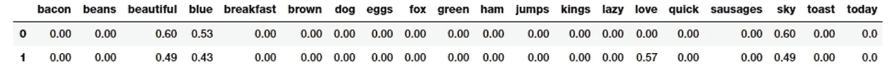

[https://towardsdatascience.com/understanding-feature-engineering-part-3-traditional-methods-for-text-data-f6f7d70acd41](/understanding-feature-engineering-part-3-traditional-methods-for-text-data-f6f7d70acd41)

2.用户向量:同样是 1xN 向量。对于每个单词，我们存储该单词在用户已经消费的文章中出现的概率(即具有高 tf-idf 分数)。这里注意，用户向量是基于项目的属性的(在这种情况下是 tf-idf 单词得分)。

一旦我们有了这些配置文件，我们就可以计算用户和项目之间的相似性。推荐的项目是 1)用户与之具有最高相似性的项目，或者 2)与用户已经阅读的其他项目具有最高相似性的项目。有多种方法可以做到这一点。让我们看看两种常见的方法:

1.  **余弦相似度:** 为了计算用户和项目之间的相似度，我们简单地取用户向量和项目向量之间的余弦相似度。这给了我们用户项目的相似性。

为了推荐与用户已经购买的商品最相似的商品，我们计算用户已经阅读的商品和其他商品之间的余弦相似度。推荐最相似的。因此，这是项目-项目的相似性。

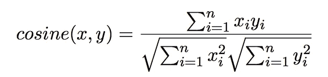

余弦相似度最适合于高维特征，尤其是在信息检索和文本挖掘中。

**2。【Jaccard 相似度:**又称交集超过并集，公式如下:

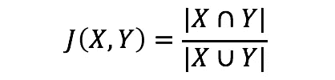

这用于项-项相似度。我们将项目向量相互比较，返回最相似的项目。

Jaccard 相似性仅在向量包含二进制值时有用。如果它们具有可以采用多个值的排名或评级，则 Jaccard 相似性不适用。

除了相似性方法之外，对于基于内容的推荐，我们可以将推荐视为简单的机器学习问题。这里有像随机森林、 [XGBoost](https://heartbeat.fritz.ai/boosting-your-machine-learning-models-using-xgboost-d2cabb3e948f) 等常规的机器学习算法。，派上用场了。

当我们有一大堆“外部”特征时，如天气条件、市场因素等，这种方法很有用。这不是用户或产品的属性，并且可以是高度可变的。例如，前一天的开盘价和收盘价在决定投资特定股票的盈利能力方面起着重要作用。这属于受监督的问题类别，其中标签是用户是否喜欢/点击某个产品(0/1)，或者用户给该产品的评级，或者用户购买的单位数量。

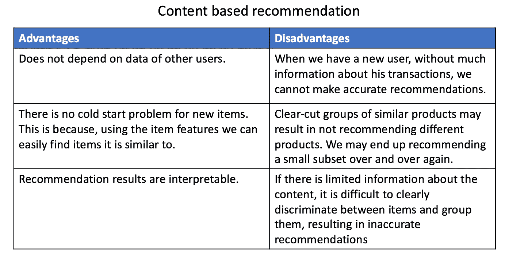

## 协同过滤

协同过滤方法的基本假设是，如果 A 和 B 购买相似的产品，A 更有可能购买 B 已经购买的产品，而不是随机的人已经购买的产品。与基于内容不同，这里没有与用户或项目相对应的特性。我们只有效用矩阵。看起来是这样的:

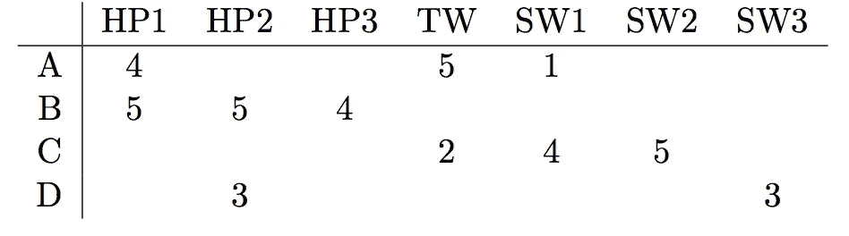

a、B、C、D 是用户，列代表电影。这些值代表用户对电影的评价(1-5)。在其他情况下，这些值可以是 0/1，这取决于用户是否观看了电影。协作过滤可以分为两大类:

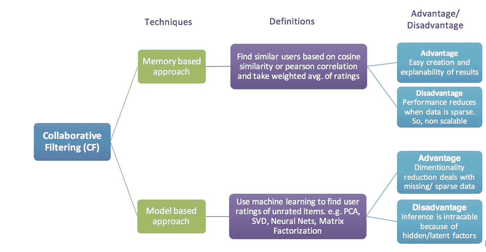

**基于记忆的方法** 对于基于记忆的方法，效用矩阵被记忆，并且通过用效用矩阵的剩余部分询问给定用户来做出推荐。让我们考虑一个同样的例子:如果我们有 *m* 部电影和 *u* 个用户，我们想知道用户 *i* 有多喜欢电影 *k* 。

这是用户 *i* 对她/他评价的所有电影的平均评价。利用这一点，我们估计他对电影 k 的评价如下:

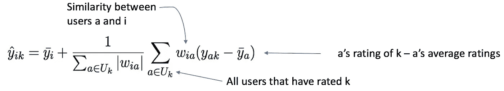

用户 *a* 和 *i* 之间的相似度可以使用任何方法计算，如余弦相似度/雅克卡相似度/皮尔逊相关系数等。
这些结果非常容易创建和解释，但是一旦数据变得过于稀疏，性能就会变差。

**基于模型的方法** 基于模型的方法的一个更普遍的实现是矩阵分解。在这里，我们从效用矩阵中创建用户和项目的表示。看起来是这样的:

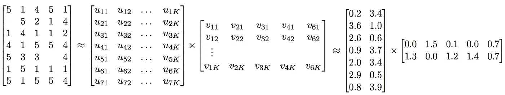

因此，我们的效用矩阵分解成 U 和 V，其中 U 代表用户，V 代表低维空间中的电影。这可以通过使用[矩阵分解](https://heartbeat.fritz.ai/applications-of-matrix-decompositions-for-machine-learning-f1986d03571a)技术，如 SVD 或 PCA，或者通过使用神经网络在一些优化器如 Adam、SGD 等的帮助下学习 2 个嵌入矩阵来实现。

对于用户 *i* 和每部电影 *j* 我们只需要计算评价 *y* 并推荐具有最高预测评价的电影。这种方法在我们有大量数据并且高度稀疏的时候最有用。矩阵分解有助于降低维数，从而加快计算速度。这种方法的一个缺点是，我们往往会失去可解释性，因为我们不知道用户/项目向量的确切元素是什么意思。

## 使聚集

当您的推荐问题将无人监管时，通常会使用聚类。

> 如果您刚刚进入这个行业，并且历史数据/标签数据非常少，您可以根据特性集对观察结果进行聚类，然后根据该聚类中存在的标签向聚类分配建议。

当然，这种解决方案不会立即给出最佳结果，但是在获得足够的数据之前，对于这种情况是一个很好的起点。聚类也可用于为观察值生成元特征。例如，在聚类之后，我可以将 1-k 的值作为新的特征“聚类”分配给每个观察值，然后在所有特征上训练我的主模型。这可以在用户级别或产品级别完成。

# 评估指标

设计推荐系统的一个主要障碍是选择要优化的指标。这可能很棘手，因为在很多情况下，目标是不推荐用户以前购买过的所有相同产品。那么你怎么知道你的模特在推荐产品方面做得好不好呢？

## 统计准确性指标

它们用于通过将预测评级与实际用户评级直接进行比较来评估过滤技术的准确性。平均绝对误差(MAE)、均方根误差(RMSE)和相关性通常被用作统计准确性度量。MAE 是最流行最常用的；它是衡量推荐与用户实际价值的偏差。MAE 和 RMSE 计算如下:

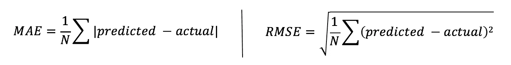

MAE 和 RMSE 越低，推荐引擎预测用户评级就越准确。当建议基于预测评级或交易数量时，这些指标非常有用。它们让我们知道我们的预测评级有多准确，反过来也让我们知道我们的推荐有多准确。

## *决策支持准确性指标*

其中最受欢迎的是精确和召回。它们帮助用户在可用的项目集中选择更相似的项目。度量将预测过程视为一个二元操作，它将好的项目与那些不好的项目区分开来。让我们更详细地看看它们:

**Recall@k 和 Precision@k:** 这些是用于推荐系统的常用指标。让我们从理解推荐系统的精确度和召回率的含义开始:

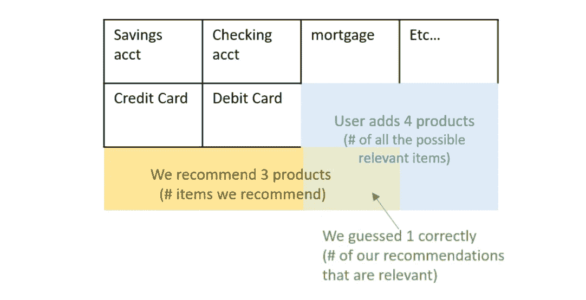

但是，精度和召回率似乎并不关心排序。因此，我们在截止值 k 处使用精度和召回。考虑我们提出 N 个建议，并且只考虑第一个元素，然后只考虑前两个，然后只考虑前三个，等等。这些子集可以通过 k 进行索引。

截止 k、P@k 和 r@k 处的精度和召回率只是通过仅考虑从等级 1 到 *k* 的推荐子集来计算的精度和召回率。推荐的排名由预测值决定。例如，具有最高预测值的产品排名为 1，具有第 k 个最高预测值的产品排名为 k

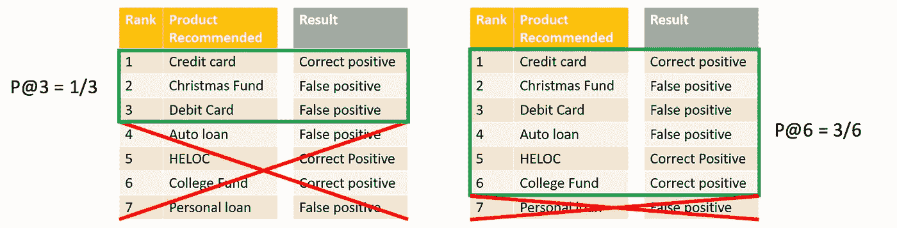

**平均精度:** 如果我们要推荐 N 个项目，在项目的满空间中有 m 个相关项目，平均精度 AP@N 定义为:

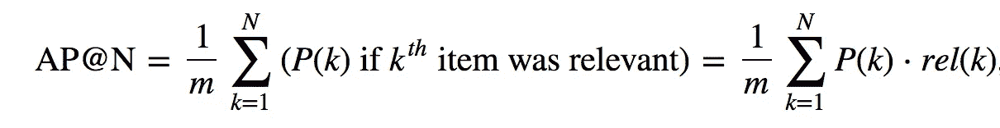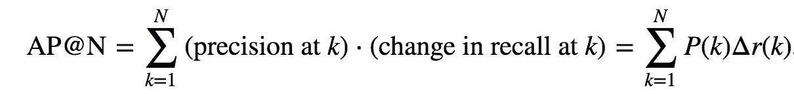

其中 *rel(k)* 只是一个指示符(0/1)，它告诉我们第*个*项是否相关，而 *P(k)* 是精度@k。如果我们推荐 2N 个项而不是 N 个，AP@N 度量表示我们只关心第*个第 N 个*项的平均精度。

> AP 奖励你给出正确的推荐，
> AP 奖励你预先载入最有可能正确的推荐，
> AP 永远不会因为你在你的列表中添加了额外的推荐而惩罚你——只要确保你预先载入了最好的。

**平均平均精度:**

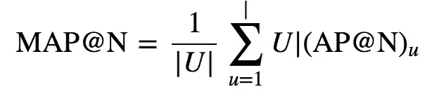

AP 适用于单个数据点，就像单个用户一样。MAP@N 则更进一步，将所有用户的 AP 平均化。

## 其他建议

一个建议(这是一个我不太确定的个人建议)是从用户的历史数据中寻找真实的内容。然后，使用上述任何标准指标，将此内容与建议中的非历史内容进行比较。这让我们知道我们的模型在推荐不直接来自历史交易的产品方面有多好。

# 要记住的事情

在开发推荐系统时，尤其是基于内容的推荐，重要的是要记住不要只针对单一指标进行优化。也就是说，对于新闻文章推荐来说，获得非常高的召回率是不可取的，因为这意味着我们在向用户推荐他们在没有我们推荐的情况下会自然消费的内容。

因此，我们不会以任何方式推动业务。我们需要确保适当的召回率/精确度，作为我们的模型能够学习用户偏好的指标，而不是试图使其尽可能高。此外，从长远来看，我们不想因为一遍又一遍地推荐相同类型的东西而失去用户参与度。因此，如果我们试图最大化精度@k/召回@ k，这是非常可能的。

感谢您的阅读！我将很高兴在评论中收到任何反馈或附加信息！

# 参考

1.  Yannet Interian 在 USF 举办的关于推荐系统的讲座
2.  [这个解释地图的超赞帖子](http://sdsawtelle.github.io/blog/output/mean-average-precision-MAP-for-recommender-systems.html)
3.  [py torch 中协作过滤(矩阵分解)的示例笔记本](https://github.com/neerjad/MachineLearning/blob/master/05-Matrix_factorization_and_NN_PyTorch.ipynb)
4.  更多关于协同过滤的内容请点击:
    [https://towards data science . com/collaborative-filtering-and-embeddings-part-1-63 b 00 b 9739 ce](/collaborative-filtering-and-embeddings-part-1-63b00b9739ce)
    [https://towards data science . com/variables-implementations-of-collaborative-filtering-100385 c 6 dfe 0](/various-implementations-of-collaborative-filtering-100385c6dfe0)

**关于我:**我毕业于 USF 大学数据科学专业，本科学习计算机科学，在构建预测和推荐算法以及为金融和零售客户提供商业见解方面有两年的经验。我对将我的机器学习和深度学习知识应用于现实世界问题的机会感到兴奋。一定要看看我的其他博客[这里](https://medium.com/@neerja.doshi)！
**LinkedIn:**[**https://www.linkedin.com/in/neerja-doshi/**](https://www.linkedin.com/in/neerja-doshi/) **GitHub:**[https://github.com/neerjad/](https://github.com/neerjad/)

**在** [**黑客新闻**](https://news.ycombinator.com/item?id=17347306) **上讨论这个帖子。**

*编者按:准备好钻研一些代码了吗？在 GitHub 上查看*[*Fritz*](https://github.com/fritzlabs)*。您将发现流行的机器和深度学习模型的开源、移动友好的实现，以及用于构建您自己的 ML 支持的 iOS 和 Android 应用程序的培训脚本、项目模板和工具。*

*加入我们的*[*Slack*](https://join.slack.com/t/heartbeat-by-fritz/shared_invite/enQtNTI4MDcxMzI1MzAwLWIyMjRmMGYxYjUwZmE3MzA0MWQ0NDk0YjA2NzE3M2FjM2Y5MjQxMWM2MmQ4ZTdjNjViYjM3NDE0OWQxOTBmZWI)*寻求技术问题的帮助，分享你正在做的事情，或者只是与我们聊聊移动开发和机器学习。关注我们的*[*Twitter*](https://twitter.com/fritzlabs)*和*[*LinkedIn*](https://www.linkedin.com/company/fritz-labs-inc/)*了解移动机器学习世界的所有最新内容、新闻和更多信息。*