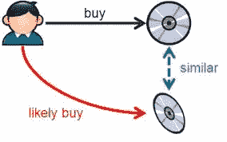
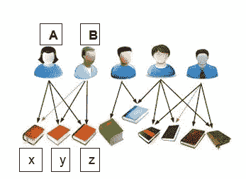
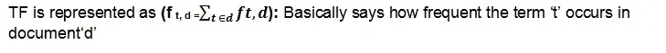
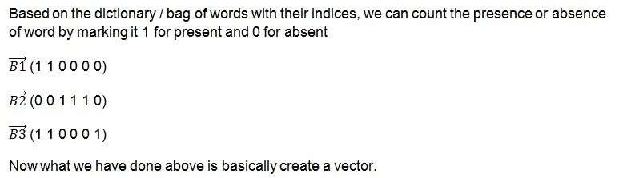
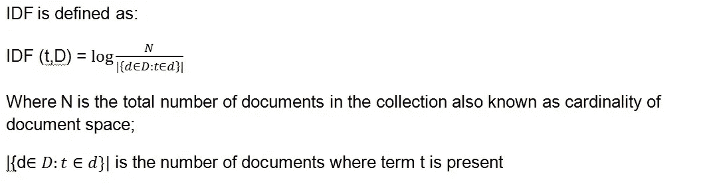
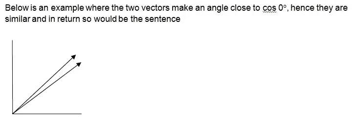

# 推荐引擎——在引擎盖下

> 原文：<https://towardsdatascience.com/recommender-engine-under-the-hood-7869d5eab072?source=collection_archive---------2----------------------->


我们中的许多人在日常生活中被各种各样的推荐轰炸，无论是在电子商务网站还是社交媒体网站上。有些建议看起来很相关，但有些建议会让人产生各种情绪，从困惑到愤怒不等。

基本上有两种类型的推荐系统，基于内容和协同过滤。两者各有利弊，这取决于您想要使用它们的环境。

**基于内容的**:在基于内容的推荐系统中，当向用户推荐项目时，项目的关键字或属性被考虑在内。所以，简而言之，这就像是推荐相似的项目。假设您正在阅读一本关于数据可视化的书，并想寻找同一主题的其他书籍。在这种情况下，基于内容的推荐系统将是合适的。



Image source : [https://blog.guillaumeagis.eu/recommendation-algorithms-with-apache-mahout/](https://blog.guillaumeagis.eu/recommendation-algorithms-with-apache-mahout/)

**协同过滤**:说到点子上了，下图就是最好的例子。客户 A 购买了书籍 x、y、z，客户 B 购买了书籍 y、z。现在，协同过滤技术会向客户 B 推荐书籍 x。这是协同过滤的优点和缺点。如果书 x 是一本非虚构的书，而顾客 B 的喜好完全是虚构的书，这并不重要。建议的相关性可能正确，也可能不正确。通常许多公司使用这种技术，因为它允许他们交叉销售产品。



Image adapted from [https://www.balabit.com/blog/recommender-systems-in-anomaly-detection/](https://www.balabit.com/blog/recommender-systems-in-anomaly-detection/)

**开发基于内容的图书推荐系统——理论**

假设您的图书馆中有一批数据科学书籍，假设您的朋友读了一本关于神经网络的书，并希望阅读同一主题的另一本书，以积累他/她的相关知识。最好的方法是实现一个简单的基于内容的推荐系统。

我们将在这里看三个重要的概念，这三个概念涉及到建立这个基于内容的推荐系统。

*   向量
*   TF-IDF
*   余弦相似性

**矢量**

基本思想是将文本或单词转换成向量，并在向量空间模型中表示。这个想法太美了，从本质上来说，向量的这个想法使得机器学习和人工智能的快速发展成为可能。事实上，Geoffrey Hinton(“深度学习之父”)在 MIT technology review [的一篇文章](https://www.technologyreview.com/s/608911/is-ai-riding-a-one-trick-pony/)中承认，多伦多的人工智能研究所被命名为“向量研究所”，因为向量的美丽属性在深度学习和神经网络的其他变体领域帮助了他们。

**TF — IDF**

TF- IDF 代表术语频率和逆文档频率。TF-IDF 有助于评估文档中某个单词的重要性。

**TF —词频**



为了确定术语/单词在文档中出现的频率，并以向量形式表示文档，让我们将其分解为以下步骤。

**步骤 1** :创建一个存在于整个文档空间的单词字典(也称为单词包)。我们忽略了一些常用词，也称为停用词，如 the，of，a，an，is 等，因为这些词非常常见，对我们选择重要词的目标没有帮助

在当前的例子中，我使用了包含 50 本书标题的文件“test1.csv”。但是为了证明这一点，只需考虑由 3 个书名(文档)组成整个文档空间。所以 B1 是一个文档，B2 和 B3 是其他文档。B1、B2、B3 共同构成了文档空间。

B1 —推荐系统

B2——统计学习的要素

B3 —推荐系统—高级

现在创建这些词的索引(停止词被忽略)

1.推荐人 2。系统 3 要素 4。统计学 5。学习 6。先进的

**第二步**:形成矢量



词频帮助我们识别该词或词在文档中出现的次数，但也有一个固有的问题，TF 更重视频繁出现的词/词，而忽略了罕见词/词的重要性。这不是一个理想的情况，因为生僻字包含更多的重要性或信号。这个问题由以色列国防军解决。

有时一个单词/术语在较长的文档中比在较短的文档中出现得更频繁；因此，执行术语频率标准化。

TFn =(术语 t 在文档中出现的次数)/(文档中的总术语数)，其中 n 表示归一化。

**IDF(逆文档频率):**



在 IDF 定义的一些变体中，在文档中没有出现术语的情况下，将 1 添加到分母，以避免被零除的情况。

基本上，一个简单的定义是:

IDF = ln(文档总数/包含术语 t 的文档数)

现在，让我们从我们自己的字典或单词包中取一个例子来计算 IDF

我们有 6 个术语或单词，如下所示

1.推荐人 2。系统 3 要素 4。统计学 5。学习 6。先进的

我们的文件是:

B1 —推荐系统

B2——统计学习的要素

B3 —推荐系统—高级

现在 IDF(w1)= log 3/2；IDF(w2)= log 3/2；IDF(w3)= log 3/1；IDF(W4)= log 3/1；IDF(W5)= log 3/1；IDF(w6) = log 3/1

(注:取自然对数和 w1..w6 表示单词/术语)

然后我们又得到一个向量，如下所示:

= (0.4054, 0.4054, 1.0986, 1.0986, 1.0986, 1.0986)

**TF-IDF 重量:**

现在最后一步是得到 TF-IDF 的重量。TF 向量和 IDF 向量被转换成矩阵。

那么 TF-IDF 重量表示为:

**TF-IDF 权重= TF (t，d) * IDF(t，D)**

这与我们通过执行以下 python 代码获得的矩阵相同:

```
tfidf_matrix = tf.fit_transform(ds['Book Title'])
```

**余弦相似度:**

余弦相似性是两个非零向量之间相似性的度量。向量表示的一个美妙之处是，我们现在可以看到，两个句子有多紧密的联系，基于它们各自的向量所成的角度。

余弦值的范围从-1 到 1。

因此，如果两个向量形成一个角度 0，那么余弦值将是 1，这反过来意味着句子彼此密切相关。

如果两个向量是正交的，即 cos 90,则意味着句子几乎是不相关的。



**开发基于内容的图书推荐系统—实现**

下面是要点链接，我用 python 写了几行代码来实现一个简单的基于内容的图书推荐系统。我添加了注释(在#后面的单词)来清楚地说明每一行代码在做什么。

输出

test1.csv 中的 id 和书名列表如下(显示了 20 行)

既然您已经阅读了这篇文章，您可能也喜欢阅读……..(嗯没关系；) )

以下链接也提供了相同的文章:

[](https://www.linkedin.com/redir/redirect?url=https%3A%2F%2Fwww%2Elinkedin%2Ecom%2Fpulse%2Fcontent-based-recommender-engine-under-hood-venkat-raman&urlhash=wCLR&_t=tracking_anet) [## 如何建立一个简单的基于内容的图书推荐系统

### 我们中的许多人在日常生活中被各种各样的建议轰炸，无论是在电子商务网站还是社交媒体上…

www.linkedin.com](https://www.linkedin.com/redir/redirect?url=https%3A%2F%2Fwww%2Elinkedin%2Ecom%2Fpulse%2Fcontent-based-recommender-engine-under-hood-venkat-raman&urlhash=wCLR&_t=tracking_anet) 

来源:

[TF-IDF](http://www.tfidf.com/)

[卡格尔](https://www.kaggle.com/cclark/simple-content-based-recommendation-engine/notebook)

[向量空间模型](https://en.wikipedia.org/wiki/Vector_space_model)

[深度学习 4j](https://deeplearning4j.org/bagofwords-tf-idf)

[Sklearn 余弦相似度](http://scikit-learn.org/stable/modules/metrics.html#cosine-similarity)

[sk learn tfidf 矢量器](http://scikit-learn.org/stable/modules/generated/sklearn.feature_extraction.text.TfidfVectorizer.html)

[马克·李约瑟博客](http://www.markhneedham.com/blog/2016/07/27/scitkit-learn-tfidf-and-cosine-similarity-for-computer-science-papers/)

[麻省理工科技评论](https://www.technologyreview.com/s/608911/is-ai-riding-a-one-trick-pony/)

代码链接:[https://gist . github . com/venkara fa/0da 815727 f1 ee 098 b 201 c 371 b 60 B2 d 72](https://gist.github.com/venkarafa/0da815727f1ee098b201c371b60b2d72)