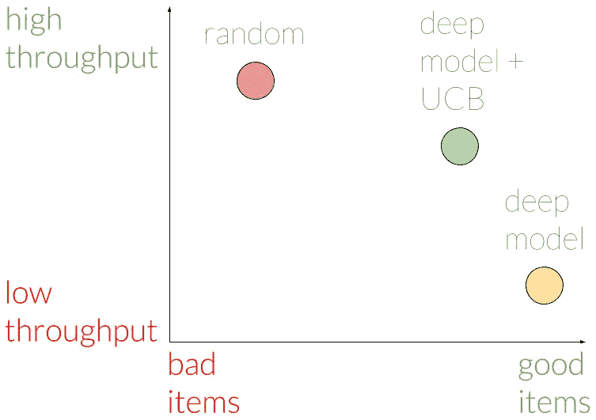

# 推荐系统:利用不确定性探索未知

> 原文：<https://towardsdatascience.com/recommender-systems-exploring-the-unknown-using-uncertainty-d3177a68143a?source=collection_archive---------18----------------------->

现在我们知道了[存在哪些不确定性类型](https://engineering.taboola.com/using-uncertainty-interpret-model)并且[学会了一些建模它们的方法](https://engineering.taboola.com/neural-networks-bayesian-perspective)，我们可以开始讨论如何在我们的应用中使用它们。

在本帖中，我们将介绍勘探开发问题，并向您展示不确定性如何帮助解决这个问题。我们将重点探索推荐系统，但同样的想法也可以应用于强化学习的许多应用中——无人驾驶汽车、机器人等。

# 问题设置

推荐系统的目标是推荐用户可能会发现相关的项目。在 Taboola，相关性是通过点击来表达的:我们显示一个包含内容推荐的小部件，用户可以选择是否要点击其中一个项目。

用户点击一个商品的概率叫做*点击率* (CTR)。如果我们知道所有商品的点击率，那么推荐哪些商品的问题就很简单了:简单地推荐点击率最高的商品。

问题是我们不知道 CTR 是什么。我们有一个模型来估计它，但它显然不是完美的。不完美的一些原因是推荐系统固有的不确定性类型，我们在本系列的第一篇文章中讨论过。

# 开发与勘探的权衡

所以现在我们面临着一个具有挑战性的情况——一个我们在日常生活中都很熟悉的情况:想象你刚刚走进一家冰激凌店。你现在面临着一个至关重要的决定——在大约 30 种口味中，你只需要选择一种！

你可以采取两种策略:要么选择你最喜欢的口味，你已经知道这是最好的；或者探索你从未尝试过的新口味，也许会发现一种新的最佳口味。

这两种策略——开发和探索——也可以在推荐内容时使用。我们可以利用具有高点击率和高确定性的项目——可能是因为这些项目已经向类似的用户展示了数千次；或者我们可以探索过去没有向很多用户展示过的新项目。将探索融入到你的推荐策略中是至关重要的——没有探索，新的商品就没有机会与更老、更熟悉的商品竞争。

# 让我们探索探索的方法

你能实现的最简单的探索-开发方法是ϵ-greedy 算法，在这里你分配ϵ流量的百分比来以随机的方式探索新的项目。剩下的流量留给开发。

尽管不是最佳的，这种方法很容易理解。它可以作为更复杂方法的坚实基础。那么，我们如何以更明智的方式寻找好的商品呢？

Looking for good items in a wise manner

一种更先进的方法——置信上限(UCB)——使用不确定性。每个项目都与其预期的 CTR 和该 CTR 上的置信界限相关联。置信界限反映了我们对项目 CTR 的不确定程度。普通 UCB 算法通过单独使用经验信息来跟踪预期的点击率和置信界限:对于每个项目，我们跟踪经验点击率(相似用户点击它的百分比)，并且通过假设二项式分布来计算置信界限。

以你经常点的纯巧克力口味为例。你知道它很好——你给了它 8 颗星(满分 10 分)。今天，一种新的口味已经到来。你没有关于它的经验信息，这意味着它可以是 1 到 10 颗星中的任何一颗。利用这个置信区间，如果你想探索，你会选择新口味，因为有可能是 10 星口味。

这种策略正是 UCB 所要做的——你选择具有最高置信上限值的项目——在我们的例子中，置信上限超过 CTR 估计。这种策略背后的动机是，随着时间的推移，经验的 CTR 将趋向于真实的 CTR，并且置信界限将缩小到 0。经过足够的时间，我们将探索一切。

另一种流行的方法是*汤普森抽样*方法。在这种方法中，我们使用项目 CTR 的整个估计分布，而不仅仅是一个置信界限。对于每个项目，我们从其分布中抽取一个 CTR。

当可用项目的数量固定时，这些方法可能工作得很好。不幸的是，在 Taboola，每天都有数以千计的新商品进入系统，而其他商品则被淘汰。当我们得到一个项目的合理置信界限时，它可能会离开系统。我们的努力将会白费。这就像是在进行一次世界旅行，每天都要去一个新城镇，那里有大量的冰淇淋可供探索。恐怖啊！

我们需要一种方法来估计一个新项目的点击率，而不需要展示它一次。我们需要一些美食评论杂志，引导我们通过自助餐的内容推荐。

考虑一种刚刚上市的新型巧克力口味。既然你知道你喜欢巧克力，你很有可能也会喜欢这种新口味。在香草 UCB 方法中(不，那不是一种味道的名字)，你不能推断它——你只依赖经验信息。

在未来的文章中，我们将详细阐述如何使用神经网络来估计一个新项目的 CTR，以及不确定性的水平。利用这种不确定性，我们可以应用 UCB 方法来探索新的项目。与依赖经验数据的普通 UCB 不同，这里我们可以使用模型的估计来避免显示点击率低的项目。我们可以赌我们认为会赢的马。

🐎

# 在线指标和结果

我们如何知道我们对新项目的探索有多好？我们需要一些勘探吞吐量指标。在 Taboola 中，我们有 A/B 测试基础设施，支持在不同流量份额上运行的许多模型。

回到冰淇淋！假设你带了你的朋友来帮助你探索不同的口味。显然，如果你的一个朋友随机选择口味，他有最好的探索吞吐量，但不是最聪明的。另一个朋友点了别人觉得好吃的口味，他最喜欢，但对探索的努力毫无贡献。

在 Taboola，我们测量探索吞吐量如下:对于每个已经显示足够多次的项目，并且在足够多的不同上下文中(例如，不同的网站),我们声明该项目已经通过了探索阶段。接下来，我们分析哪些模型促成了这一成功。为了计数，一个模特必须展示那个项目足够多的次数。

从这个角度来看，模型的吞吐量被定义为它所贡献的项目数量。

使用这个度量标准，我们能够断言随机显示项目确实会产生最好的吞吐量，但是有坏项目的趋势。不使用 UCB 方法的模型显示出好的项目，但是吞吐量较差。具有 UCB 的模型在吞吐量方面介于两者之间，与非 UCB 模型相比，仅显示了稍微差一些的项目。

因此，我们得出结论，我们的 UCB 模型在探索新项目和选择好项目之间有一个很好的权衡。我们相信，从长远来看，这种权衡是值得的。

# 最后的想法

对于推荐系统领域的许多公司来说，探索-开发问题是一个令人兴奋的挑战。我们希望我们的进步将有助于其他人向他们的用户提供最好的服务。我们相信这是尚未完成的大旅程中的一小步，我们对这个领域在未来几年将会呈现什么样的形态很感兴趣。

在本系列的下一篇文章中，我们将详细阐述用于估算 CTR 和不确定性的模型，敬请关注。

*这是与我们在今年 KDD 会议的研讨会上提交的论文相关的系列文章的第三篇:* [*深度密度网络和推荐系统中的不确定性*](https://arxiv.org/abs/1711.02487) *。*

*第一篇帖子可以在这里找到***。**

**第二篇帖子可以在* [*这里找到*](https://engineering.taboola.com/neural-networks-bayesian-perspective) *。**

**原载于*[*engineering.taboola.com*](https://engineering.taboola.com/uncertainty-ctr-prediction-one-model-clarify)*由我和* [*约尔泽尔德斯*](http://anotherdatum.com/)*