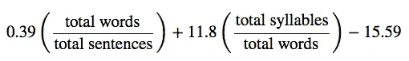
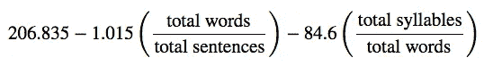
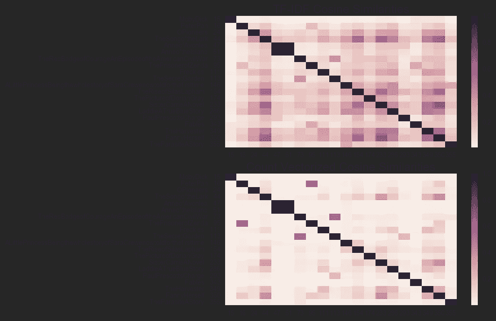
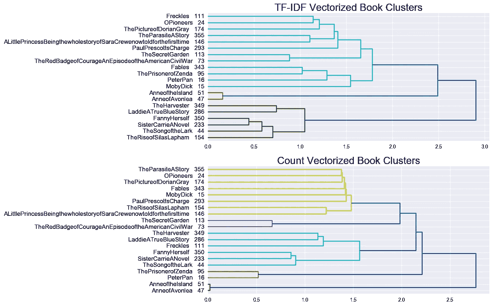
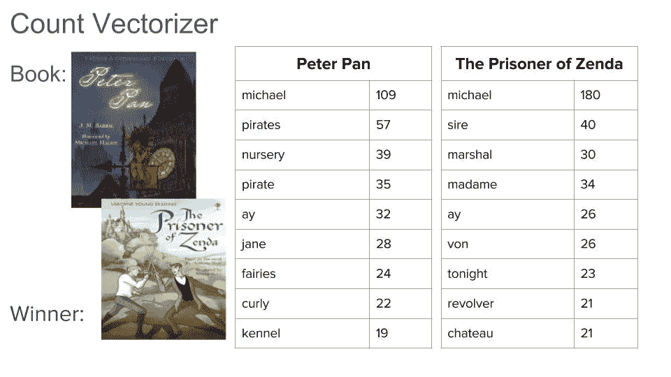
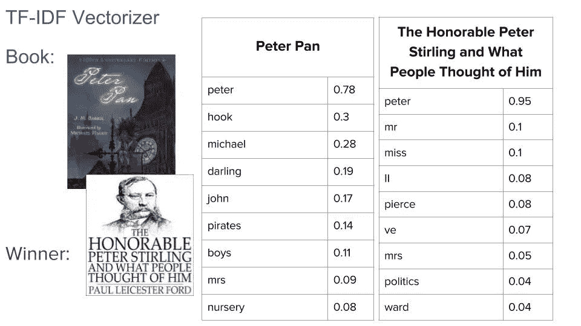

# 推荐古腾堡计划的书籍

> 原文：<https://towardsdatascience.com/recommending-books-from-project-gutenberg-a7222c945ebd?source=collection_archive---------3----------------------->

## 为年轻读者选择他们喜欢阅读的书籍对父母和教育工作者来说是一个挑战。我的解决方案是建立一个推荐引擎，既考虑阅读水平，也考虑最近阅读的书籍的主题，并返回下一步阅读的建议。

Photo by [freestocks](https://unsplash.com/@freestocks?utm_source=medium&utm_medium=referral) on [Unsplash](https://unsplash.com?utm_source=medium&utm_medium=referral)

我从[古腾堡计划](http://www.gutenberg.org/wiki/Main_Page)中提取数据，该网站提供超过 53，000 本在美国版权已经过期的免费电子书。

**背景:**为了正确理解和享受一篇文章，从而作为一个读者继续发展，让孩子们接触到对他们来说既有吸引力又在他们最近发展区内的书籍是很重要的。

最近发展区，通常缩写为 ZPD，是一个描述孩子自己能做什么，在帮助下能做什么，以及超出他们能力的概念。在阅读发展中，我们希望确保孩子们既能准确地阅读单词，又能理解他们正在阅读的内容，否则他们会对文本感到厌倦或沮丧。

阅读水平:我的推荐引擎很大一部分是基于阅读水平的，其中有许多不同的衡量标准。我想确保推荐的文本在读者的 ZPD 范围内，所以我需要找到一种方法来量化读者能读和不能读之间的差距。一些阅读水平是用基于单词长度和句子长度的公式计算出来的，其他的考虑单词难度和等级水平单词列表。在这个项目中，我选择使用[Flesch Kincaid Grade Level](https://en.wikipedia.org/wiki/Flesch%E2%80%93Kincaid_readability_tests)来衡量阅读水平。我做了这个选择，因为这是一个被广泛接受的方法，也可以直接计算，而不需要输入等级级别单词列表。考虑到我的数据集中的大部分书籍都是在当前的年级词汇标准之前编写的，我对使用年级词汇列表持谨慎态度，并且我希望能够比较不同时期的书籍。

使用以下公式计算文本的 Flesch Kincaid 等级级别:

得出的数字在某种程度上与孩子在学校的年级水平相对应，尽管实际上每个年级学生的阅读水平差异很大。

还有另一个相关的衡量标准，叫做 Flesch reading-easy test，分数越高说明材料越容易阅读，分数越低说明段落越难阅读。90 分以上的分数表明这篇课文非常易读，一般 11 岁的学生都能很容易理解。分数低于 30 表明该文本很难阅读，最好由大学毕业生理解。Flesch 轻松阅读的公式是:

我选择使用 Flesch Kincaid 等级标准，因为随着书的难度增加，阅读水平也会提高，这更直观。我确实计算了每本书的阅读水平。从这一点开始，当我提到阅读水平时，我指的是弗莱施.金凯的水平。

## 推荐系统

我的推荐系统的前提是将读者最近喜欢阅读的书名作为输入，并输出推荐书籍的列表。我这样做是通过首先获得图书馆中可用书籍的子集，只包括比他们输入的书籍的阅读水平低一个年级和高四分之一年级的书籍。

一旦我有了可接受书籍的子集，我就确定这些书籍的主题有多相似。我使用 [Jaccard 相似度](https://en.wikipedia.org/wiki/Jaccard_index)来比较由提交文本的人确定的主题列表。

The Jaccard similarity of the subjects of these two books is high because the two books have a lot of subjects in common.

我也想比较一下这两本书的实际内容。我找到了书籍的[计数矢量化](http://scikit-learn.org/stable/modules/generated/sklearn.feature_extraction.text.CountVectorizer.html)文本之间的[余弦距离](https://en.wikipedia.org/wiki/Cosine_similarity)。余弦距离显示了这些书的字数是多么的不同。

此外，我还计算了这些书的 [tf-idf](https://en.wikipedia.org/wiki/Tf%E2%80%93idf) 矢量化文本之间的余弦距离。这些距离是基于单词在书中的重要性。

这给了我三个书籍推荐，我将在下面进行比较。

## **结果分析**

**主题相似度结果:**
主题相似度推荐的书看起来很有推荐的合理性。例如，彼得潘的顶级搜索结果是发生在奥兹国的书籍，它们在“少年”、“幻想”、“想象”、“虚构”和“地方”上匹配。一个喜欢关于一个幻想世界的书的读者可能想读一个不同的世界，这是有道理的。然而，如果这本书的写作风格截然不同，读者可能仍然不会喜欢这本书，所以我将在下面分析基于文本的建议。

**Count vectorizer vs . tf-idf:**
我的第一直觉是 TF-IDF 会给出比 Count vectorizer 更好的推荐，因为它更关注单词的重要性，而不仅仅是单词数。因此，根据 count vectorizer，长度非常不同但单词相似的两本书最终会非常不同，但使用 tf-idf 会非常相似。事实上，从一些 count 矢量化书籍和 tf-idf 书籍的热图中可以看出，tf-idf 书籍总体上比 count 矢量化书籍显示出更多的相似性。然而，有几本书，如《曾达的囚徒》和《彼得潘》，在 count 矢量化热图中表现得特别明显。

The rectangle showing the relationship between The Prisoner of Zenda (book 95) and Peter Pan (book 16) is much darker when the Count Vectorizer is used.

通过查看由它们的计数向量距离和它们的 tf-idf 向量距离聚类的相同书籍，也可以清楚地看到，这些书籍最终被不同地聚类。

最终，哪些距离将更好地提供推荐仍然不清楚，直到我们看到哪些实际的单词被抽出。

为彼得潘使用计数矢量器方法的第一本书是曾达奖。

这可以与使用 tf-idf 矢量器的彼得潘的顶级书籍进行比较:

从这些表格以及其他推荐给彼得潘的书和我看过的其他书的类似数据来看，很明显 tf-idf 推荐的书大多基于相似的角色名字。以此为基础推荐书籍并不理想。例如，尊贵的彼得·斯特林与彼得潘毫无关系，我也不会向喜欢彼得潘的孩子推荐这本书。因此，看起来计数矢量器是目前推荐书籍的更好方法。

**结论:**我的推荐系统的管道有效地提取了书籍，但是为了评估这些推荐的书籍有多好，还需要进一步的分析。我对如何做到这一点有一些想法:

1.我想为我的推荐者建立一个用户界面，让用户完成一项调查，陈述他们认为自己对这三种方法的推荐有多好。

2.我还会将我的系统给出的推荐与外部来源(比如亚马逊)的推荐进行比较。这确实带来了一些问题，例如亚马逊推荐的大多数书籍在古登堡计划中不可用，但这是一个如何评估我的系统的想法，如果我获得更多数据的话。

3.更直接的是，我想通过重新运行 tf-idf 矢量器来过滤掉专有名词，从而尝试改进我的建议。这将有助于解决上面的问题,《彼得·斯特林》是推荐给彼得潘的第一本书，因为这两本书的主要人物都叫彼得。