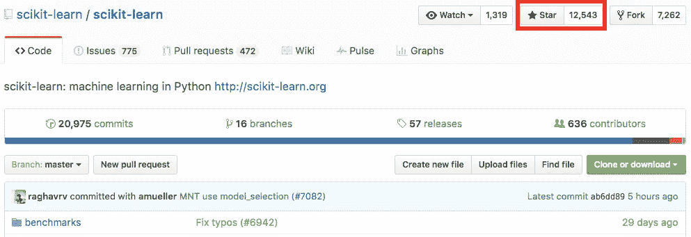

# 使用 Google BigQuery 和隐式库推荐 GitHub 存储库

> 原文：<https://towardsdatascience.com/recommending-github-repositories-with-google-bigquery-and-the-implicit-library-e6cce666c77?source=collection_archive---------1----------------------->

跟踪 GitHub 中发布的所有优秀的资源库是一项不可能的任务。[趋势列表](https://github.com/trending)帮助不大。正如你可能已经读到的，[按受欢迎程度排序并不像看起来那么简单。这里列出的大多数东西通常与我使用的堆栈无关。](https://medium.com/@jbochi/how-not-to-sort-by-popularity-92745397a7ae)

这是推荐系统的一个很好的用例。它们帮助我们以个性化的方式过滤信息——存储库。当我们不知道该键入什么时，我认为它们是一个搜索查询。

推荐系统有几种方法，但通常分为两大类，协作式和基于内容的过滤。以下是 W [ikipedia](https://en.wikipedia.org/wiki/Recommender_system) 的定义:

> [协同过滤](https://en.wikipedia.org/wiki/Collaborative_filtering)根据用户过去的行为(之前购买或选择的项目和/或对这些项目的数字评级)以及其他用户做出的类似决定来构建模型。[基于内容的过滤](https://en.wikipedia.org/wiki/Content-based_filtering)方法利用项目的一系列离散特征来推荐具有相似属性的附加项目。

在这种特殊的情况下，很难应用基于内容的方法，因为很难直接通过内容来度量存储库的相似性:代码、文档、标签等等。协同过滤更适合，也更容易应用。正如我在[之前的帖子](https://medium.com/@jbochi/how-not-to-sort-by-popularity-92745397a7ae)中所说，即使人们没有对你的内容进行评级，隐性反馈也足够了。

在这种情况下，我们可以使用当前流行的程序员冷静作为隐式反馈库星星:



Stolen from a [talk](https://github.com/JuliaKikuye/meetup_machine_learning_recsys/blob/master/talk.ipynb) that Julia and I gave at [Porto Alegre Machine Learning Meetup](https://www.meetup.com/Machine-Learning-Porto-Alegre/) (in Portuguese)

我们将从 Google Big Query 获得本月给出的随机恒星样本，并使用令人惊叹的[隐式](https://github.com/benfred/implicit/)库，该库实现了精彩论文[对隐式反馈数据集](http://yifanhu.net/PUB/cf.pdf)的协同过滤。算法本身我就不说了，不过你可以看看论文或者[这篇博文来自](http://www.benfrederickson.com/matrix-factorization/) [Ben Frederickson](http://www.benfrederickson.com/) 《隐式》的作者。

以下是获取数据的查询:

```
WITH stars AS (
     SELECT actor.login AS user, repo.name AS repo
     FROM githubarchive.month.201706
     WHERE type="WatchEvent"
),
repositories_stars AS (
     SELECT repo, COUNT(*) as c FROM stars GROUP BY repo
     ORDER BY c DESC
     LIMIT 1000
),
users_stars AS (
    SELECT user, COUNT(*) as c FROM  stars
    WHERE repo IN (SELECT repo FROM repositories_stars)
    GROUP BY user HAVING c > 10 AND C < 100
    LIMIT 10000
)
SELECT user, repo FROM stars
WHERE repo IN (SELECT repo FROM repositories_stars)
AND user IN (SELECT user FROM users_stars)
```

请注意，我筛选了排名前 1000 的存储库，并随机抽取了 10000 名给排名前 1000 的存储库打了 10 到 100 星的用户。我们希望对关注热门项目的人进行抽样调查，但我们不想让那些给所有东西都打星的用户，因为他们不会添加太多信息。

重要的是要意识到我们不需要所有用户的所有明星来给每个人推荐。添加更多数据会提高推荐质量，但也会增加训练时间。如果我们[采样正确](https://www.quora.com/How-do-I-speed-up-matrix-factorization-by-sampling-users-without-losing-precision)，就不会损害模型精度。

好了，说够了，我们如何获得数据和训练模型？

```
data = pd.io.gbq.read_gbq(query, dialect="standard", project_id=project_id)# map each repo and user to a unique numeric value
data['user'] = data['user'].astype("category")
data['repo'] = data['repo'].astype("category")# create a sparse matrix of all the users/repos
stars = coo_matrix((np.ones(data.shape[0]),
                   (data['repo'].cat.codes.copy(),
                    data['user'].cat.codes.copy())))# train model
model = AlternatingLeastSquares(factors=50,
                                regularization=0.01,
                                dtype=np.float64,
                                iterations=50)confidence = 40
model.fit(confidence * stars)
```

仅此而已。只有 7 行 Python。而且快得惊人。在不到 10 秒的时间内提取数据并训练模型**。我选择了通常工作良好的参数，但是如果我们认真对待它，我们应该做一些[验证](https://gist.github.com/jbochi/2e8ddcc5939e70e5368326aa034a144e#file-evaluation-ipynb)。我们跳过这个，直接看结果。与 [tensorflow](https://github.com/tensorflow/tensorflow) 有什么相似之处？**

```
# dictionaries to translate names to ids and vice-versa
repos = dict(enumerate(data['repo'].cat.categories))
repo_ids = {r: i for i, r in repos.iteritems()}model.similar_items(repo_ids['tensorflow/tensorflow'])][(u'tensorflow/tensorflow', 1.0000000000000004),
 (u'jikexueyuanwiki/tensorflow-zh', 0.52015405760492706),
 (u'BVLC/caffe', 0.4161581732982037),
 (u'scikit-learn/scikit-learn', 0.40543551306117309),
 (u'google/protobuf', 0.40160716582156247),
 (u'fchollet/keras', 0.39897590674119598),
 (u'shadowsocksr/shadowsocksr-csharp', 0.3798671235574328),
 (u'ethereum/mist', 0.37205191726130321),
 (u'pandas-dev/pandas', 0.34311692603549021),
 (u'karpathy/char-rnn', 0.33868380215281335)]
```

看起来没错！列表中的几乎所有内容都与机器学习和数据科学有关。

产生用户推荐呢？嗯，我们可以直接使用`model.recommend`为训练集中的用户获得推荐，但我们需要从 GitHub API 为所有其他用户获得用户星级。

下面是从 GitHub 的 API 中获取星星并创建一个新的用户项目矩阵的代码。

```
def user_stars(user):
    repos = []
    url = "[https://api.github.com/users/{}/starred](https://api.github.com/users/{}/starred)".format(user)
    while url:
        resp = requests.get(url, auth=github_auth)
        repos += [r["full_name"] for r in resp.json()]
        url = resp.links["next"]["url"] if "next" in resp.links else None
    return reposdef user_items(u_stars):
    star_ids = [repo_ids[s] for s in u_stars if s in repo_ids]
    data = [confidence for _ in star_ids]
    rows = [0 for _ in star_ids]
    shape = (1, model.item_factors.shape[0])
    return coo_matrix((data, (rows, star_ids)), shape=shape).tocsr()
```

好的，我应该检查哪些存储库？

```
def recommend(user_items):
    recs = model.recommend(userid=0, user_items=user_items, recalculate_user=True)
    return [(repos[r], s) for r, s in recs]jbochi = user_items(user_stars("jbochi"))
recommend(jbochi)[(u'ansible/ansible', 1.3480146093553365),
 (u'airbnb/superset', 1.337698670756992),
 (u'scrapy/scrapy', 1.2682612609169515),
 (u'grpc/grpc', 1.1558718295721062),
 (u'scikit-learn/scikit-learn', 1.1539551159232055),
 (u'grafana/grafana', 1.1265144087278358),
 (u'google/protobuf', 1.078458167396922),
 (u'lodash/lodash', 1.0690341693223879),
 (u'josephmisiti/awesome-machine-learning', 1.0553796439629786),
 (u'd3/d3', 1.0546232373207065)]
```

我发现这些建议非常有用。请注意，我们传递了一个全新的用户评级矩阵，其中只有一个用户，并设置了标志`recalculate_user=True`。

这个功能是最近[添加的](https://github.com/benfred/implicit/pull/35)，可以用来为不在训练集中的用户生成推荐，或者在他或她消费更多项目时更新用户推荐。

我添加到库中的另一个无耻的功能是[解释推荐](https://github.com/benfred/implicit/pull/37)的能力:

```
def explain(user_items, repo):
    _, recs, _ = model.explain(userid=0, user_items=user_items, itemid=repo_ids[repo])
    return [(repos[r], s) for r, s in recs]explain(jbochi, 'fchollet/keras')[(u'pandas-dev/pandas', 0.18368079727509334),
 (u'BVLC/caffe', 0.15726607611115795),
 (u'requests/requests', 0.15263841163355341),
 (u'pallets/flask', 0.15259412774463132),
 (u'robbyrussell/oh-my-zsh', 0.1503775470984523),
 (u'apache/spark', 0.12771260655405856),
 (u'tensorflow/tensorflow', 0.12343847633950071),
 (u'kripken/emscripten', 0.12294875917036562),
 (u'videojs/video.js', 0.12279727716802587),
 (u'rust-lang/rust', 0.10859551238691327)]
```

它会返回我标上星号的对某个特定推荐贡献最大的存储库。结果意味着模型推荐 *keras* 因为我主演过*熊猫*和*咖啡馆*。

我希望你喜欢！这是[笔记本，上面有你用用户名运行它所需的所有代码](https://gist.github.com/jbochi/2e8ddcc5939e70e5368326aa034a144e)。

别忘了给[隐](https://github.com/benfred/implicit/)一颗星。本应得的。