# Tensorflow 中的重建主分量、全局对比度、范围归一化层[TF 中的手动反推]

> 原文：<https://towardsdatascience.com/reconstructive-principle-component-global-contrast-ranged-normalization-layer-in-tensorflow-bbe08714dd85?source=collection_archive---------11----------------------->

Photo by [Daniel Olah](https://unsplash.com/photos/HNkgPFBShSw?utm_source=unsplash&utm_medium=referral&utm_content=creditCopyText) on [Unsplash](https://unsplash.com/?utm_source=unsplash&utm_medium=referral&utm_content=creditCopyText)

今天，我想练习我的矩阵演算，以及创造性地创建一些层。我认为实现不同的层是一个好主意，可以在以后使用。下面是我想练习的层次列表。

***a .行均值减法层
b .行标准差层
c .范围归一化层
d .全局对比度归一化层
e .重构主成分层***

> **请注意，这篇帖子是出于我自己的教育目的。**

***a .逐行均值减去图层***

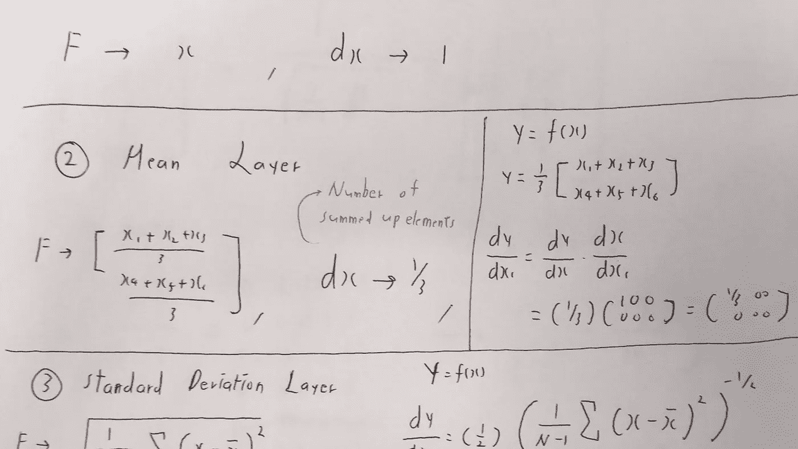

让我们从简单的开始，只是减去平均行的方式。如上所述，导数非常简单。

以上是一个张量流实现，另外，我已经创建了一个训练阶段变量，所以在测试阶段我们可以使用训练数据的移动平均值。

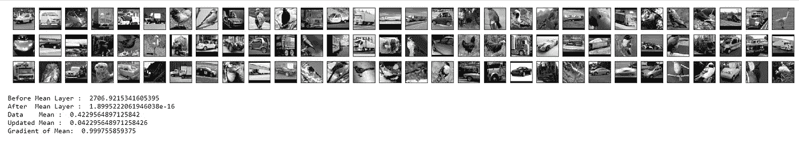

让我们做一个简单的健全性检查，在层之前，每一行数据的平均值是 0.4229564897125843，在层之后，它非常接近于零。此外，我们可以看到移动平均平均值已更新为 0.042，这是意料之中的，因为我使用的 beta 值为 0.9。最后，梯度在我们预期的范围内，因为 1-(1/4096) = 0.999755859。

***b .逐行标准差层***

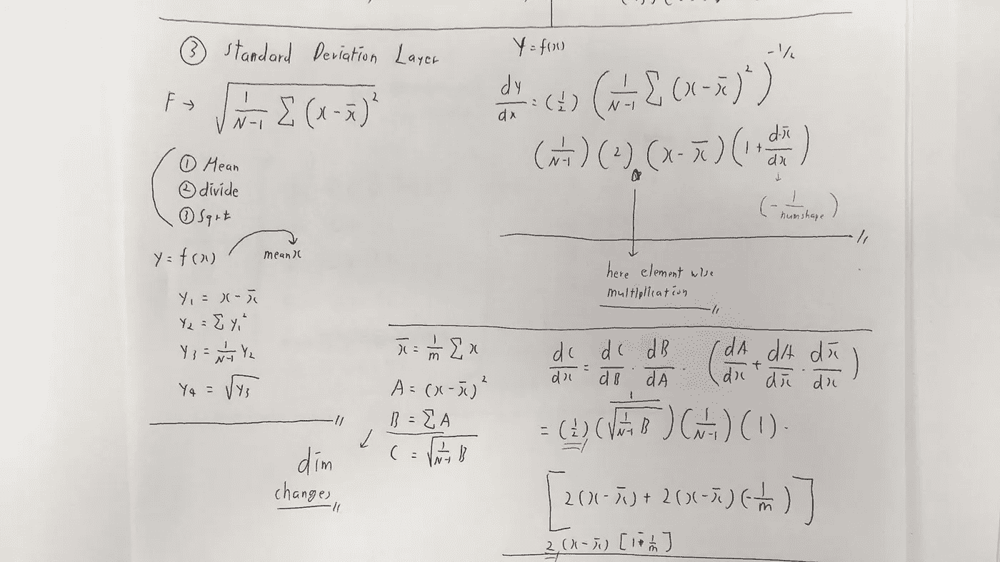

这一层实际上并不做太多事情，而是简单地计算每一行的标准偏差值并将其返回。(我只是想练习一下。)

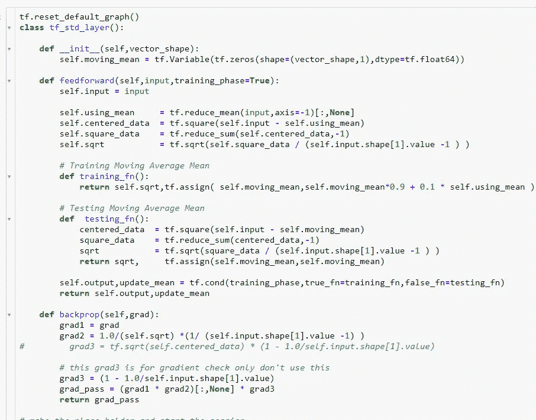

上面是一个 tensorflow 实现，我再次设置了训练阶段变量来区分训练和测试阶段。

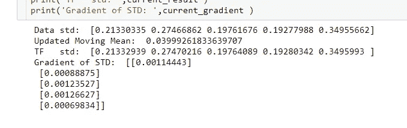

在通过该层传递数据之后，我们可以看到它已经正确地返回了每个数据行的标准偏差值。

***c .范围归一化层***

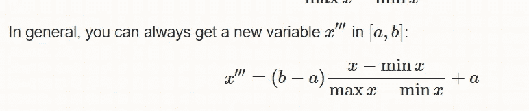

Image from this [website](https://stats.stackexchange.com/questions/178626/how-to-normalize-data-between-1-and-1)

可以对任何范围的值进行归一化，而不仅仅是 0 和 1。使用这个概念，我们还可以通过层进行反向传播。首先让我们用手算一下。

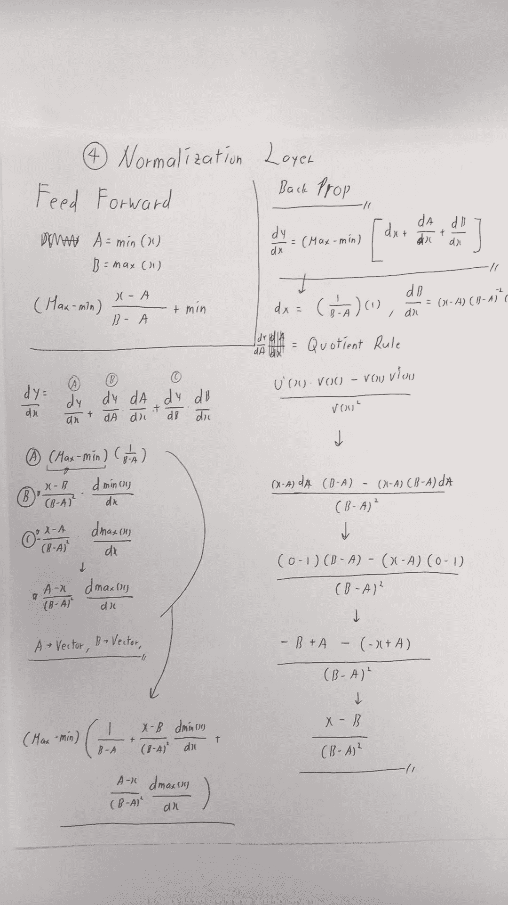

现在，既然已经完成了，让我们用张量流来实现它。

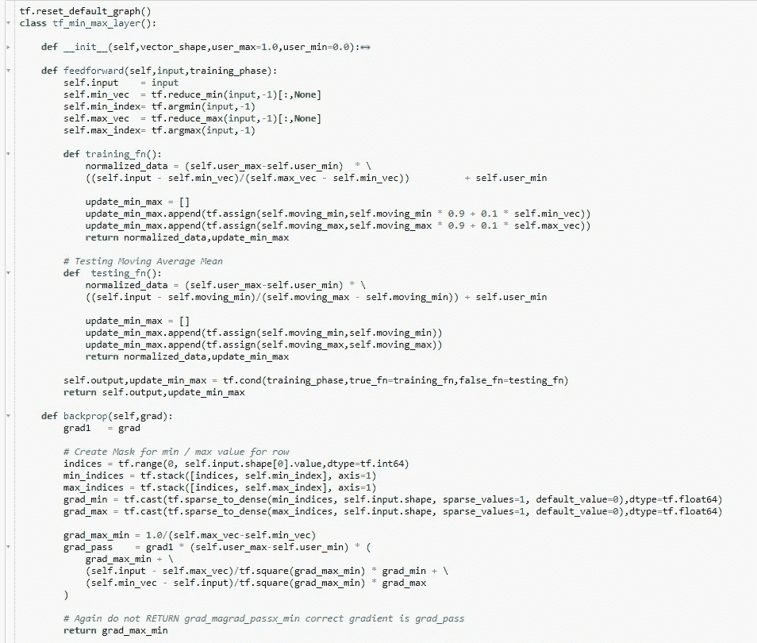

看起来很棒，现在我们可以做简单的健全性检查，看看该层是否正常工作。(同样，对于这一层，我有一个移动最小值以及移动最大值。)

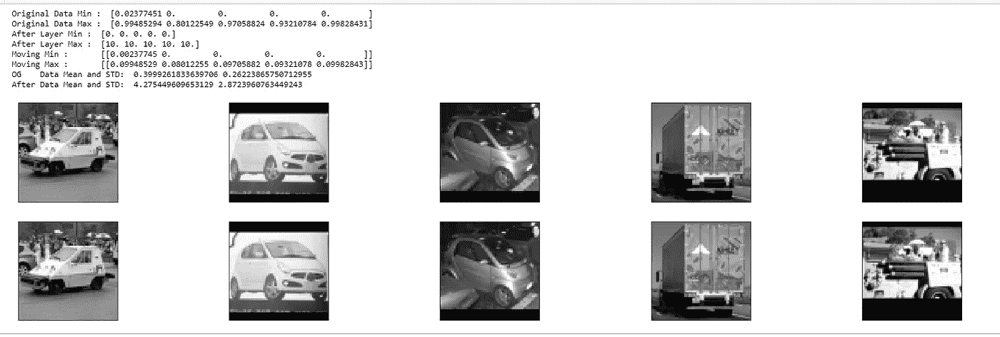

我将最大范围设置为 10，因此我们在范围 0-10 之间归一化我们的图像数据。我们看不出差别，但是所有数据的平均值增加了大约 4。

***d .全局对比度归一化图层***

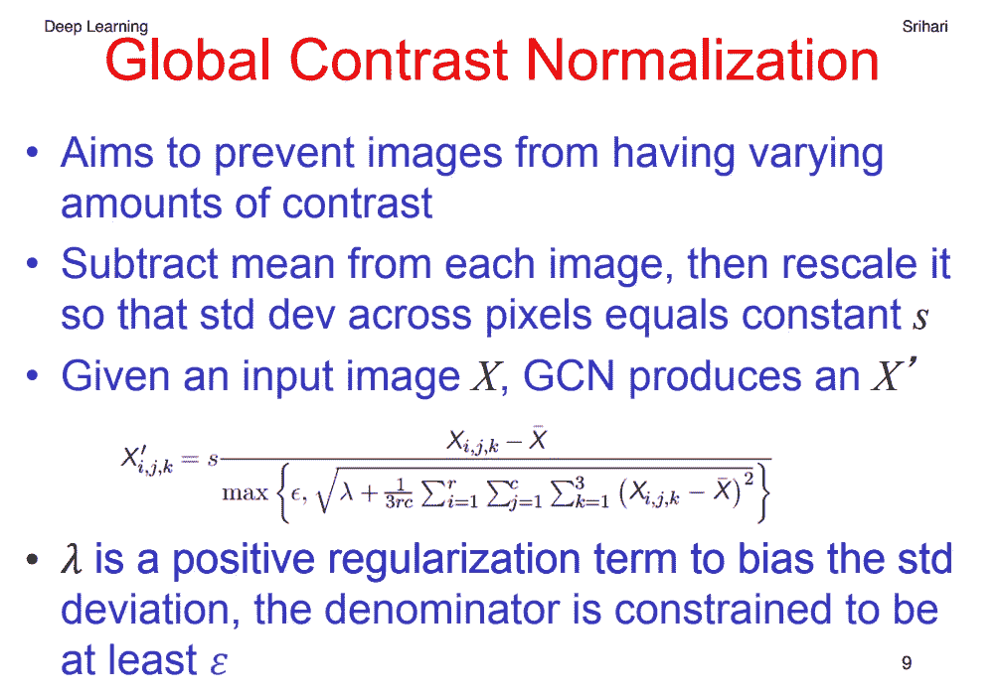

Image from this [website](https://cedar.buffalo.edu/~srihari/CSE676/12.2%20Computer%20Vision.pdf)

GCN 可以用作预处理步骤，但是由于大多数计算只是简单的矩阵运算，我们也可以通过它反向传播。(但请注意，我将使用 GCN 的一个软化版本，而不是一个最大值函数，我只是将ε值相加，以避免被零除。).如果您想了解更多，请点击[此处](https://stackoverflow.com/questions/27955695/whats-the-difference-between-standardization-and-global-contrast-normalization)。

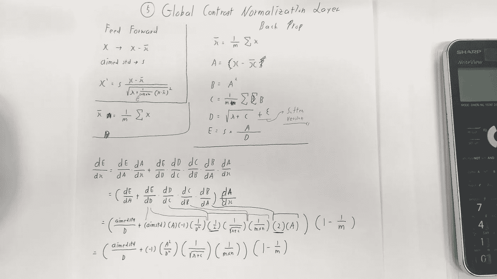

现在我们有了计算方法，让我们用 numpy 实现来看看这个函数是如何改变每张图片的对比度的。

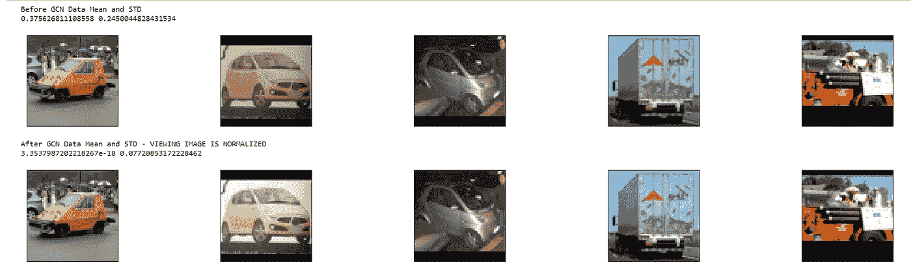

从第二幅图像中，我们可以看到标准化后它变得更亮，但最明显的是当前图像批次的标准偏差降低了。

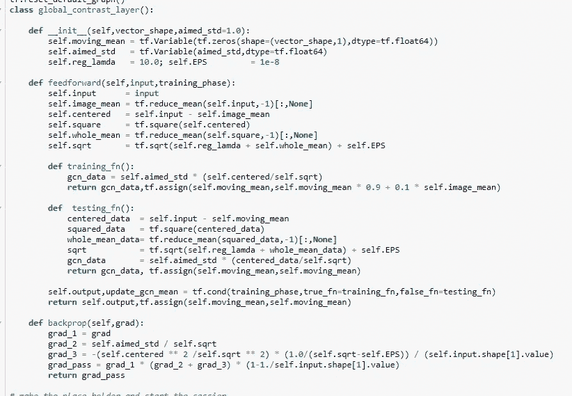

同样，我创建了一个移动平均变量，以防万一，如果我们想区分培训和测试阶段。

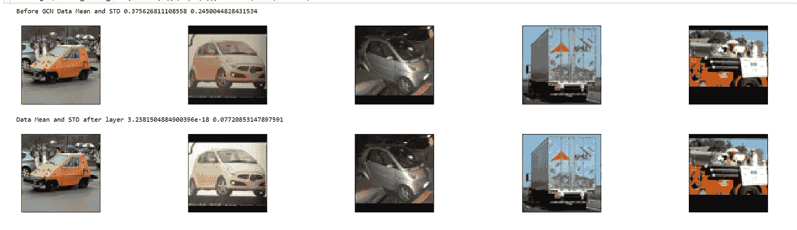

我们可以看到，我们的 GCN 层给出了与 numpy 版本相同的结果。

***e .重建主构件层***

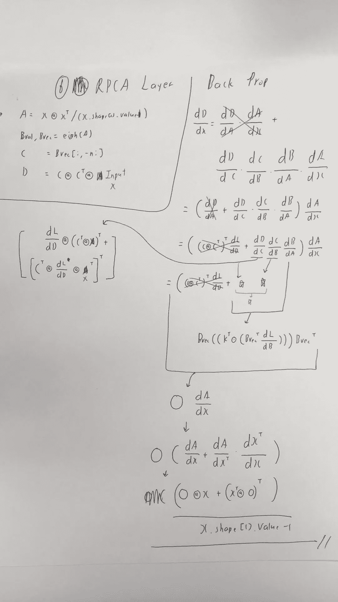

这一层的想法非常简单，使用 PCA，我们可以通过执行原始数据和投影矩阵之间的矩阵乘法来执行降维。但是我们也可以仅使用主成分的顶部 k 个元素来重建原始数据。因为所有的运算都是矩阵运算，我们可以通过它反向传播。

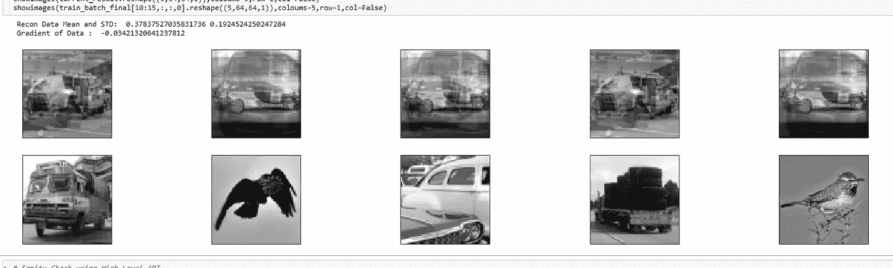

在重建之后，我们现在可以看到所有的图像都是彼此混合的，并且图像批次的平均值和标准值是 0.37 和 0.19。

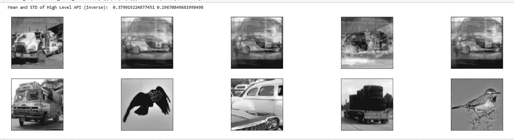

最后，让我们做一个简单的健全性检查，看看高级 api (sklearn 分解 pca)是否给我们一个类似的结果。在第三个数字之后，值改变了，这可能是因为我使用特征值分解，而 sklearn 使用奇异值分解。

**交互代码**

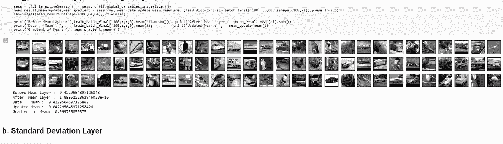

*对于 Google Colab，您需要一个 Google 帐户来查看代码，并且您不能在 Google Colab 中运行只读脚本，因此请在您的操场上创建一个副本。最后，我永远不会请求允许访问你在 Google Drive 上的文件，仅供参考。编码快乐！*

要获取这篇文章的代码，请点击这里。

**遗言**

我应该用 tf 梯度来仔细检查所有的梯度是否正确，这是我的错误。

如果发现任何错误，请发电子邮件到 jae.duk.seo@gmail.com 给我，如果你想看我所有写作的列表，请在这里查看我的网站。

**参考**

1.  tensorflow？，h. (2018)。如何在 tensorflow 中定义条件语句？。堆栈溢出。检索于 2018 年 10 月 22 日，来自[https://stack overflow . com/questions/41789209/how-to-define-condition-statement-in-tensor flow](https://stackoverflow.com/questions/41789209/how-to-define-condition-statement-in-tensorflow)
2.  误差，t. (2018)。tensorflow:在 tf.map_fn 的 fn 中创建变量时返回值错误。堆栈溢出。检索于 2018 年 10 月 22 日，来自[https://stack overflow . com/questions/45789822/tensor flow-creating-variables-in-fn-of-TF-map-fn-returns-value-error](https://stackoverflow.com/questions/45789822/tensorflow-creating-variables-in-fn-of-tf-map-fn-returns-value-error)
3.  数字/数字。(2018).GitHub。检索于 2018 年 10 月 22 日，来自[https://github . com/numpy/numpy/blob/v 1 . 15 . 1/numpy/core/_ methods . py](https://github.com/numpy/numpy/blob/v1.15.1/numpy/core/_methods.py)
4.  标准差。(2018).Davidmlane.com。检索于 2018 年 10 月 22 日，来自[http://davidmlane.com/hyperstat/A16252.html](http://davidmlane.com/hyperstat/A16252.html)
5.  (2018).Dotnetperls.com。检索于 2018 年 10 月 22 日，来自[https://www.dotnetperls.com/arg-max-tensorflow](https://www.dotnetperls.com/arg-max-tensorflow)
6.  Scherfgen，D. (2018)。导数计算器带步骤！。Derivative-calculator.net。检索于 2018 年 10 月 22 日，来自[https://www.derivative-calculator.net/](https://www.derivative-calculator.net/)
7.  TensorFlow，A. (2018)。在张量-张量流中调整单个值。堆栈溢出。检索于 2018 年 10 月 22 日，来自[https://stack overflow . com/questions/34685947/adjust-single-value-within-tensor-tensor flow](https://stackoverflow.com/questions/34685947/adjust-single-value-within-tensor-tensorflow)
8.  Tensorflow，B. (2018)。张量流中的二元掩码。堆栈溢出。检索于 2018 年 10 月 22 日，来自[https://stack overflow . com/questions/40443951/binary-mask-in-tensor flow](https://stackoverflow.com/questions/40443951/binary-mask-in-tensorflow)
9.  tf.self _ 共轭 _eig | TensorFlow。(2018).张量流。检索于 2018 年 10 月 23 日，来自[https://www . tensor flow . org/API _ docs/python/TF/self _ agreement _ EIG](https://www.tensorflow.org/api_docs/python/tf/self_adjoint_eig)
10.  五氯苯甲醚，O. (2018)。从 sklearn PCA 获得特征值和向量。堆栈溢出。检索于 2018 年 10 月 23 日，来自[https://stack overflow . com/questions/31909945/get-eigen-values-and-vectors-from-sk learn-PCA](https://stackoverflow.com/questions/31909945/obtain-eigen-values-and-vectors-from-sklearn-pca)
11.  [http://scikit-learn/scikit-learn](http://scikit-learn/scikit-learn)。(2018).GitHub。检索于 2018 年 10 月 23 日，来自[https://github . com/sci kit-learn/sci kit-learn/blob/BAC 89 c 2/sk learn/decomposition/PCA . py # L106](https://github.com/scikit-learn/scikit-learn/blob/bac89c2/sklearn/decomposition/pca.py#L106)
12.  tf.self _ 共轭 _eig | TensorFlow。(2018).张量流。检索于 2018 年 10 月 23 日，来自[https://www . tensor flow . org/API _ docs/python/TF/self _ agreement _ EIG](https://www.tensorflow.org/api_docs/python/tf/self_adjoint_eig)
13.  (2018).Arxiv.org。检索于 2018 年 10 月 23 日，来自[https://arxiv.org/pdf/1709.06079.pdf](https://arxiv.org/pdf/1709.06079.pdf)
14.  (2018).People.maths.ox.ac.uk 检索 2018 年 10 月 23 日，来自[https://people.maths.ox.ac.uk/gilesm/files/NA-08-01.pdf](https://people.maths.ox.ac.uk/gilesm/files/NA-08-01.pdf)
15.  矩阵？，H. (2018)。如何标准化一个矩阵？。堆栈溢出。检索于 2018 年 10 月 23 日，来自[https://stack overflow . com/questions/4544292/how-do-I-standard-a-matrix/40951248](https://stackoverflow.com/questions/4544292/how-do-i-standardize-a-matrix/40951248)
16.  PreMBA 分析方法。(2018).Ci.columbia.edu。检索于 2018 年 10 月 23 日，来自[http://ci.columbia.edu/ci/premba_test/c0331/s6/s6_4.html](http://ci.columbia.edu/ci/premba_test/c0331/s6/s6_4.html)
17.  1?，H. (2018)。如何将-1 和 1 之间的数据归一化？。交叉验证。检索于 2018 年 10 月 23 日，来自[https://stats . stack exchange . com/questions/178626/how-to-normalize-data-between-1-and-1](https://stats.stackexchange.com/questions/178626/how-to-normalize-data-between-1-and-1)
18.  标准差公式。(2018).Mathsisfun.com。检索于 2018 年 10 月 23 日，来自[https://www . mathsisfun . com/data/standard-deviation-formulas . html](https://www.mathsisfun.com/data/standard-deviation-formulas.html)
19.  实施主成分分析(PCA)。(2014).塞巴斯蒂安·拉什卡博士。检索于 2018 年 10 月 23 日，来自[https://sebastianraschka . com/Articles/2014 _ PCA _ step _ by _ step . html](https://sebastianraschka.com/Articles/2014_pca_step_by_step.html)
20.  (2018).Cedar.buffalo.edu。检索 2018 年 10 月 23 日，来自[https://cedar . buffalo . edu/~ Sri Hari/CSE 676/12.2% 20 computer % 20 vision . pdf](https://cedar.buffalo.edu/~srihari/CSE676/12.2%20Computer%20Vision.pdf)
21.  预处理)，W. (2018)。标准化和全局对比度正常化有什么区别？(图像预处理)。堆栈溢出。检索于 2018 年 10 月 23 日，来自[https://stack overflow . com/questions/27955695/标准化和全局对比标准化的区别是什么](https://stackoverflow.com/questions/27955695/whats-the-difference-between-standardization-and-global-contrast-normalization)
22.  预处理)，W. (2018)。标准化和全局对比度正常化有什么区别？(图像预处理)。堆栈溢出。检索于 2018 年 10 月 23 日，来自[https://stack overflow . com/questions/27955695/what-the-difference of-standardization-and-global-contrast-normalization](https://stackoverflow.com/questions/27955695/whats-the-difference-between-standardization-and-global-contrast-normalization)
23.  python？，H. (2018)。如何在 python 中实现全局对比度归一化？。数据科学堆栈交换。检索于 2018 年 10 月 23 日，来自[https://data science . stack exchange . com/questions/15110/how-to-implementation-global-contrast-normalization-in-python](https://datascience.stackexchange.com/questions/15110/how-to-implement-global-contrast-normalization-in-python)