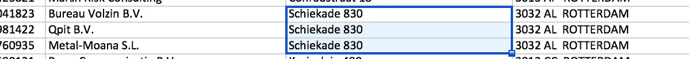
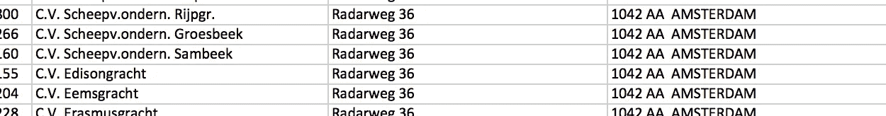
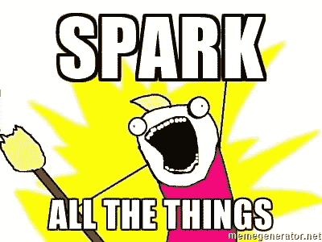
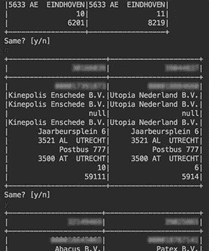
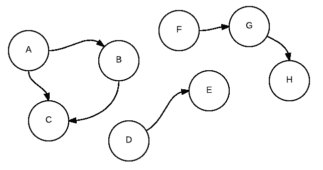
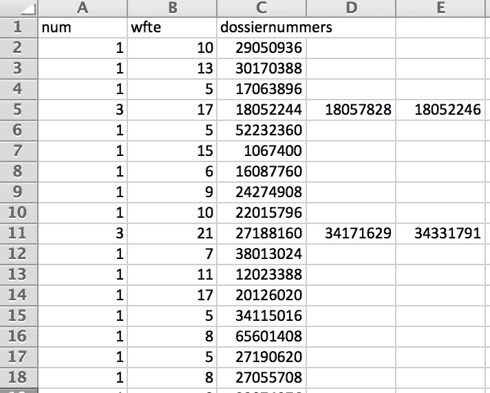

# 与 Apache Spark 的 MLlib & GraphX 的记录链接

> 原文：<https://towardsdatascience.com/record-linking-with-apache-sparks-mllib-graphx-d118c5f31f83?source=collection_archive---------1----------------------->

## 一种可扩展的模糊数据匹配方法

## 挑战

最近，Datlinq 的一位同事让我帮她解决一个数据问题，这个问题看起来非常简单。
她从商会(Kamer van Koophandel: KvK)购买了一小组数据，其中包含大约 5 万家小公司(5-20 名全职员工)，在网上很难找到。
她注意到许多公司共用同一个地址，这是有道理的，因为许多公司倾向于聚集在商业区。

然而，她还发现，同一地址上的许多公司实际上是一个公司，分多次注册。

这两家公司在技术上是不同的，但在这种特殊情况下，应被视为一家拥有联合劳动力的公司。

> 因此，我们只需将“属于”的公司组合在一起，并将在那里工作的 FTE 汇总为一个实体。

## 方法

当然，我一开始做了一些 if-then-else 编码，但是 a .那很快就变得一团糟，b .那有什么乐趣呢？

因此，我定义了实现动态、可扩展和可配置解决方案的步骤:

*   加载/清除数据
*   创建距离度量
*   组合所有数据
*   手动训练匹配组合
*   训练模型
*   在模型中运行所有组合
*   制作所有链接记录的图表
*   提取所有连接的顶点，并将它们保存为唯一的组
*   将这些组合并到一个数据源中，该数据源包含 1 个 id、汇总的 FTE 和分组 id 列表

这些步骤中的任何一个都可以通过大量的工具、库和语言来完成，但是有一个似乎(几乎)适合它们中的每一个:
[Apache Spark](http://spark.apache.org/)

好吧，我可能有点偏见，我认为 Python 和 SciKit learn 也足够了，除了 Spark 似乎有点过头，但我喜欢 Scala 和 Spark…

所以我点燃了美好的火花

## 1.加载/清除数据

数据以 Excel 格式提供，所以简单的“另存为”csv 开始了这一步

此外，这一步相当直接；数据非常干净。我只是选择了模型可能感兴趣的字段/特征。
*稍后我将介绍 KvKRecord 案例类*

## 2.创建距离度量

要查看来自同一数据源的两个记录是否“匹配”，理论上你必须比较每一个组合。

> 这种比较本身就是这种努力的全部挑战，这就是机器学习介入的地方。

但是 ML 模型仍然需要一个“特征向量”来训练、测试和预测，所以我需要创建一个方法来比较两个 *KvKRecords* 并返回这个“特征向量”

我选择创建一个*向量*，其中每个元素对应于 case 类的每个属性之间的距离度量。

我使用 *Math.log10* 和一个除法来归一化整数之间的距离，以获得 0 和 1 之间的所有数字(我事先知道范围)。这不是最好的方法，但我强烈怀疑这些都无关紧要，所以我几乎没有花时间调优非字符串特性。

对于字符串比较，有[很多很多选项](http://www.joyofdata.de/blog/comparison-of-string-distance-algorithms/)
，但我最终使用了 [Jaro-Winkler](https://en.wikipedia.org/wiki/Jaro%E2%80%93Winkler_distance) 。我想试试其他的，但这似乎工作得很好，并返回一个介于 0 和 1 之间的正常值。

## 3.组合所有数据

我在这里有一些优势，因为地址数据非常干净，所以我不必创建笛卡尔乘积，而只需在地址上连接。使用 *joinWith* 方法， *KvKRecords* 保持完整，特征向量被附加上。

> 现在，我们有了一个经过筛选的数据集，包含了同一地址的所有公司组合。

我不得不指出，这多少是一种欺骗。有些公司地址相同，但地址符号不同，尽管提供的数据非常清晰。

例如，" *Keizersgracht 62"* 和"*Keizersgracht 62–64 "*和" *Keizersgracht 62-A"* 可能被认为是相同的地址，但排除了这种方式。然而，我们也可以假设，谁注册这些公司，使用相同的地址，如果它是同一家公司？我不知道，但在快速手动检查后，这种影响似乎可以忽略不计/不存在。

一种替代方法是做一个完整的笛卡尔乘积(将每个公司与其他公司匹配)，并在不同街道/城市的公司上训练该工具。我担心，不匹配的公司之间的纯粹差异会使模型远离实际上位于同一地址的公司之间的细微差别。

## 4.手动训练匹配组合

如果你没有东西来训练你的 ML，所有这些组合和向量不会让你去任何地方。我需要一个带标签的数据集用于监督学习。

用 Excel 基于原始 csv 手动创建这些，看起来容易出错而且很麻烦，所以作为一个优秀的(懒惰的)开发人员，我编写了一个程序来帮助我创建一个带标签的训练集。

console output

我必须承认，我只为这个项目创建了大约 100 个带标签的样本(使用< 0.2%), but the features are pretty simple and the work was extremely boring, so I was ok with it.

The *LabeledVector* case 类，因为它具有名为“ *features* ”和“ *label* ”的属性，这是 Spark MLlib 模型的默认属性。

## 5.训练模型

> 现在我们有了这个漂亮的标记数据集，我们准备好展示我们的机器学习肌肉了。

不过，我不得不让你有点失望，因为我刚刚使用 [Spark 的 MLLib](http://spark.apache.org/docs/latest/ml-guide.html) 创建了一个直接的逻辑回归模型，但结果才是最重要的。

其他项目使用随机森林、感知器甚至朴素贝叶斯可能会更好，但我基于这种方法得到了一些好结果:

*   精确度:0.96
*   ROC 曲线下面积:0.92

*(如果有人知道如何从 Spark 轻松地***创建 ROC/AUC-plot，请告诉我)**

*更多的时间可以花在超参数调整上，但是拥有超过 80 个训练样本也会有所帮助；-)*

## *6.在模型中运行所有组合*

*下一步是将这个模型应用到我们的组合数据集*

*因为我们的 *comparableDataset* 已经有了所需的' *features* : Vector '，我可以应用这个模型，它添加了*标签*和*概率*列。*

> *对于链接，我们现在只对实际的匹配感兴趣，所以得到的数据集只有被认为相同的公司的组合。*

**PredictedVector* 又是一个简单明了的 case 类。*

## *7.制作所有链接记录的图表*

*拥有一个包含所有关联公司的数据集固然很好，但要真正理解这些数据，我必须按“独立组”进行分组。含义:*

**

*(A，B)
(A，C)
(B，C)
(D，E)
(F，G)
(G，H)*

*需要产生以下结果:*

*(A，B，C)
(D，E)
(F，G，H)*

*任何熟悉离散数学/图论的人都会注意到这些可以用图形来表示。*

> *有很多很酷的工具可以用来处理图形，我最喜欢的一个是 [Neo4j](https://neo4j.com/) ，但是 Spark 还是提供了开箱即用的 [GraphX](http://spark.apache.org/docs/latest/graphx-programming-guide.html) ，所以我们现在还是坚持使用它。*

*我只需要把我们的数据集变成两个 RDD，即:边和顶点。*

## *8.提取所有连接的顶点，并将它们保存为唯一的组*

*现在有了一个图( *linkedGraph* )，我想找到所有不相连的子图并把它们组合在一起。*

> *这里神奇的关键词是:[连通分量](https://en.wikipedia.org/wiki/Connected_component_(graph_theory))*

*GraphX 方法 *connectedComponents* 创建了每个 *VertexId* 和其子图中最小的 *VertexId* 的元组列表。*

*反转这些元组并在最小的 *VertexId* 上分组，创建了一个连接的 *VertexId 的* c.q .子图列表*

*使用广播查找，我将这些 VertexId 重新映射到相应的 *KvKRecord* 。*

*最后，我得到了一个包含所有唯一组的数据集，以及该组中所有 *KvKRecords* 的列表。*

## *9.在单个数据源中组合组*

*最后一步是为我的同事创建一个 csv 文件，用于她的特定用例。*

*整个代码虽然对这个过程不感兴趣，但它的目的是将这些结果整理成一个 csv 文件，该文件可以由 MS Excel 以*

**【关联公司数量】*；*【总 FTE】*；*【公司 id /栏目】**

**

# *结论*

*最终，这个看似简单的数据问题有了一个相当复杂的解决方案，并且花费了我比预期更多的时间。*

*但是我并没有对结果失望，也没有选择在 Scala & Spark 中构建它。我学到了很多东西，并相信随着时间的推移，它将改进这个项目和其他项目。事实上，我可以在我的机器上运行这段代码，也可以在云中运行 100 个节点的集群，而不需要修改任何代码，这仍然让我感到惊讶。*

*我分享这个的原因是:*

*   *通知你星火的威力:*不吓人，好玩！**
*   *去炒作机器学习:*很酷，但还是软件开发带试用&错误。**
*   *淡化大数据:*重要的不总是规模。数据还是数据。**
*   *帮助/激励有类似问题的人:*分享是关爱；-)**
*   *请对本文、我的方法、代码或任何东西进行反馈:*！**