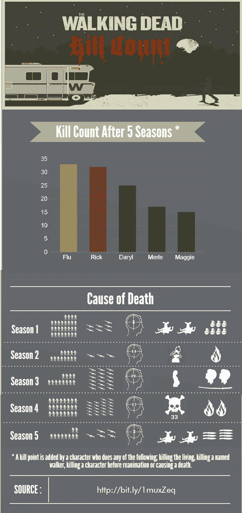
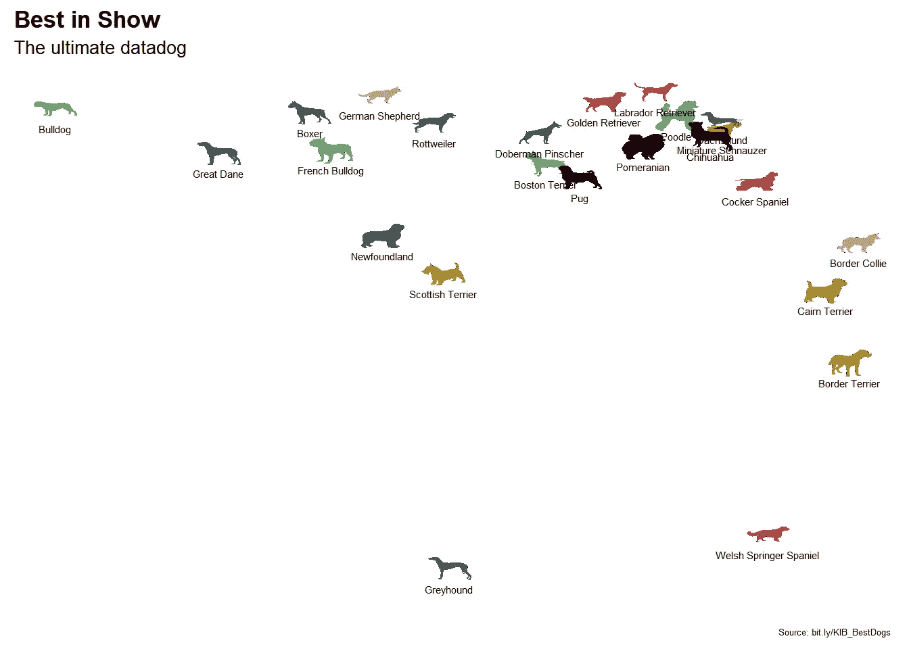
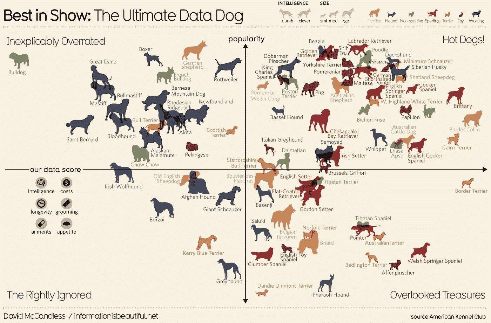

# 从《知识是美丽的》一书中再现数据可视化

> 原文：<https://towardsdatascience.com/recreating-data-visualizations-from-the-book-knowledge-is-beautiful-e455e7126071?source=collection_archive---------9----------------------->

在这个系列中，我将着手重现大卫·麦克肯多斯在 r。

当你看完第一部分后，在这里看看这个系列的其他帖子:[第二部分](/recreating-more-data-visualizations-from-the-book-knowledge-is-beautiful-part-ii-2f1d1da68e3a)，[第三部分](/recreating-more-data-visualizations-from-the-book-knowledge-is-beautiful-part-iii-5fd393b4c548)，[第四部分](/recreating-more-data-visualizations-from-the-book-knowledge-is-beautiful-part-iv-686938a84c9e)。

David McCandless 是两本最畅销的信息图表书籍的作者，他在 TED 上做了一个关于数据可视化的演讲。我在 2015 年买了他的第二本书[《知识是美丽的》](https://informationisbeautiful.net/2014/knowledge-is-beautiful/)，里面有 196 张漂亮的信息图。

那时，我真的迷上了**行尸走肉**，他的书启发我制作了自己的信息图:



最近，我试图想到一些有趣的数据可视化项目，并决定从书中选择几个可以在`R`中尽可能接近地重新创建的项目。

对于那些喜欢这类练习的人来说，这本书是一个极好的资源，因为**书中的每一个可视化都与一个在线数据集配对，以便** [根据你的兴趣进行探索！！！](http://www.informationisbeautiful.net/data/)。我从来不知道数据集有多丰富，直到我尝试重新创建我的第一个可视化，“最佳展示”。[中的数据集为**最好单独显示**中的](https://moldach.github.io/dataRbeautiful/bit.ly/KIB_BestDogs)，是一个有八张工作表的 excel 文件！

McCandles 说整本书花了他两年 15832 个小时，我对此毫不怀疑。如果你只关心可操作的结果，快速绘制一个 EDA 绘图对于一个会议来说是快速而简单的。然而，如果你出版的东西需要一些时间来创造一个惊人的视觉效果。

# 最佳表演

**最佳展示**是狗狗轮廓的散点图，根据狗狗的类别进行颜色编码，相应地调整大小，并根据它们的智力指向左边或右边。

让我们加载环境；我喜欢`needs()`包，它使得将&加载包安装到`R`变得简单。

```
knitr::opts_chunk$set(echo = TRUE)
if (!require("needs")) {
  install.packages("needs", dependencies = TRUE)
  library(needs)
}
```

如上所述，数据是一个包含八张工作表的 excel 文件。我们可以用`read_excel()`读入 Excel 文件，并用`sheet =`参数指定我们想要访问的工作表。

```
# install&Load readxl package
needs(here,
      readxl,
      stringr,
      dplyr,    # to use select()
      magrittr) # to use %<>% operators

path = here()

# Specify the worksheet by name
dog_excel <- read_excel("~/bestinshow.xlsx", sheet = "Best in show full sheet", range = cell_rows(3:91))

# Pick the desired variables
dog_excel %<>%
  select(1,3,5:6, "intelligence category", "size category")

# Rename the columns
colnames(dog_excel) <- c("breed", "category", "score", "popularity", "intelligence", "size")

# Remove first row (non-descript column names)
dog_excel <- dog_excel[-1,]
```

创建一个 HTML 表格(支持过滤、分页和排序。这只适用于 RMarkdown，不适用于媒体，所以你需要检查一下**github . io**https://moldach.github.io/dataRbeautiful/index.html

```
needs(DT)
datatable(dog_excel, options = list(pageLength = 5))
```

看看数据集中的`intelligence`等级。

```
# What are the intelligence levels?
unique(dog_excel$intelligence)
## [1] "Brightest"     "Above average" "Excellent"     "Average"      
## [5] "Fair"          "Lowest"
```

McCandless 将狗分为“笨”和“聪明”两类。但是这里我们看到在这个*干净的*数据集中有类别。因此，让我们将前三个因素指定为`clever`，将其他三个因素指定为`dumb`

```
dog_excel$intelligence %<>% 
  str_replace(pattern = "Brightest", replace = "clever", .) %>%   
  str_replace(pattern = "Above average", replace = "clever", .) %>% 
  str_replace(pattern = "Excellent", replace = "clever", .) %>% 
  str_replace(pattern = "Average", replace = "dumb", .) %>% 
  str_replace(pattern = "Fair", replace = "dumb", .) %>% 
  str_replace(pattern = "Lowest", replace = "dumb", .)
```

原始可视化中有 87 只狗。我在 SuperColoring.com 的[](http://www.supercoloring.com)**上找到了 [**知识共享 4.0 许可**](https://creativecommons.org/licenses/by-sa/4.0/) 下的 24 个剪影。这意味着我可以以任何媒体或格式自由复制和再分发，只要我给出网页的链接，并注明作者的姓名和许可证。我已经将该信息包含在一个`.csv.`中，我们将使用它来对 McCandless 的数据进行子集化(两个数据集都可以在 [my Github repo](https://github.com/moldach/dataRbeautiful) 中找到)。**

```
needs(readr)
dog_silhouettes <- read_csv("~/dog_silhouettes.csv")

dog_df <- dog_excel %>% 
  inner_join(dog_silhouettes, by = "breed")

# change popularity from string into numeric values
dog_df$popularity <- as.numeric(dog_df$popularity)
```

**我们需要使用`magick`包来使`.svg`轮廓周围的白色背景透明，将图像缩放到普通大小(按宽度)，并保存为`.png`的。**

```
needs(magick)

file.names <- dir(path, pattern = ".svg")

for (file in file.names){
  # read in the file
  img <- image_read_svg(file)
  # scale all images to a common scale
  img_scaled <- image_scale(img, 700)
  # make the background transparent
  img_trans <- image_transparent(img_scaled, 'white')
  # get rid of .svg ending
  file_name <- str_replace(file, pattern = ".svg", replace = "")
  # write out the file as a .png
  image_write(img_trans, paste0(file_name, ".png"))
}
```

**一些狗的侧影指向相反的方向。我们需要使用`magick`包装中的`image_flop()`,这样所有包装都面向同一个方向。稍后，我们可以通过智能对数据帧进行子集划分，这样`clever`和`dumb`狗就面向相反的方向。**

```
path = here()

flop.images <- c("~/labrador-retriever-black-silhouette.png", "~/border-terrier-black-silhouette.png", "~/boxer-black-silhouette.png", "~/french-bulldog-black-silhouette.png", "~/german-shepherd-black-silhouette.png", "~/golden-retriever-black-silhouette.png", "~/greyhound-black-silhouette.png", "~/rottweiler-black-silhouette.png")

for(i in flop.images){
  i <- str_replace(i, pattern = "~/", replace = "")
  img <- image_read(i)
  img_flop <- image_flop(img)
  image_write(img_flop, i)
}
```

**下一步是根据类别给狗上色。**

**让我们写一个函数，可以给它三个参数:1) `df`一个数据帧，2) `category`它是狗的类型，3) `color`每个`category`的特定颜色。**

**第一步是只选择那些属于感兴趣的`category`的狗。这可以通过`dplyr`封装中的`filter()`来完成。但是，如果你想使用`dplyr`功能，比如`filter()`，你需要[按照这个网站上的说明](https://rpubs.com/hadley/dplyr-programming)；用`enquo`设定。**

```
img_color <- function(df, category, color){
  # Make filter a quosure
  category = enquo(category)
  # subset df on category
  new_df <- df  %>% 
    filter(category == !!category)
  # get directory paths of images for the for loop 
  category_names <- new_df$breed  %>%
    tolower() %>% 
    str_replace_all(" ", "-") %>% 
    paste0("-black-silhouette.png")
  for(name in category_names){
    img <- image_read(name)
    img_color <- image_fill(img, color, "+250+250")
    image_write(img_color, name)
  }
}
```

**我想在 R 内尽可能接近地复制图形，所以为了复制可视化的颜色，我扫描了这本书，保存了图像，然后使用这个[工具来获取 html 颜色代码](https://html-color-codes.info/colors-from-image/)。**

**现在让我们使用上面创建的函数根据它们的`category`给狗的轮廓上色。**

```
# Herding color "#D59E7B"
img_color(dog_df, "herding", "#D59E7B")

# Hound color "#5E4D6C"
img_color(dog_df, "hound", "#5E4D6C")

# Non-sporting color "#6FA86C"
img_color(dog_df, "non-sporting", "#6FA86C")

# Sporting color "#B04946"
img_color(dog_df, "sporting", "#B04946")

# Terrier color "#A98B2D"
img_color(dog_df, "terrier", "#A98B2D")

# Toy color "#330000"
img_color(dog_df, "toy", "#330000")

# Working color "#415C55"
img_color(dog_df, "working", "#415C55")
```

**好了，终于到了可视化的时候了。**

**通常人们用`ggplot2`中的`geom_point()`绘制点，但在这种情况下，我想要每个品种的图像。我们可以使用`ggimage`包，稍微调整一下，我们就可以基于`intelligence`翻转图像。`ggimage`不像`ggplot2`那样支持颜色作为一种审美，这就是我之前手动分配颜色&尺寸的原因。**

**由于`popularity`分数范围从 1 到 140，1 是最受欢迎的**，我们需要用`scale_y_reverse()`反转 y 轴。****

```
**needs(ggplot2,
      ggimage)
# add "~/" to get filenames of images for plotting
dog_df$name <- paste0("~/", dog_df$name)

# create a ggplot/ggimage object
p <- ggplot(subset(dog_df, intelligence == "clever"), aes(x = score, y = popularity, image = name), alpha = 0.5) + geom_image(image_fun = image_flop) + geom_image(data=subset(dog_df, intelligence == "dumb")) +
  labs(title = "Best in Show", subtitle = "The ultimate datadog", caption = "Source: bit.ly/KIB_BestDogs") +
  labs(x = NULL, y = NULL) +
  theme(panel.background = element_blank(),
        legend.position = "top", 
        legend.box = "horizontal",
        plot.title = element_text(size = 13,
                                  # I'm not sure what font he chose so I'll pick something I think looks similar
                                 family = "AvantGarde",
                                 face = "bold", 
                                              lineheight = 1.2),
        plot.subtitle = element_text(size = 10,
                                     family = "AvantGarde"), 
        plot.caption = element_text(size = 5,
                                    hjust = 0.99),  
        axis.text = element_blank(), 
        axis.ticks = element_blank()) +
  scale_y_reverse()**
```

****最后一步是在狗的品种下面添加文本注释。因为我用`intelligence`对`dog_df`进行了子集化，所以如果我试图用`geom_text()`进行注释，它只会注释部分数据。我们将需要函数 instea，因为 geome 不是从数据帧的变量映射而来，而是作为向量传入。****

```
**# Add annotations
p + annotate("text", x=dog_df$score[1:24], y=((dog_df$popularity[1:24])+6), label = dog_df$breed[1:24], size = 2.0)**
```

********

****可视化看起来与原始相似，并突出了所包含的大部分美学。人们总是可以在 Adobe Illustrator 或 Inkscape 中添加额外的细节，使其看起来更像最终的可视化效果****

********

****敬请关注第二部分！****