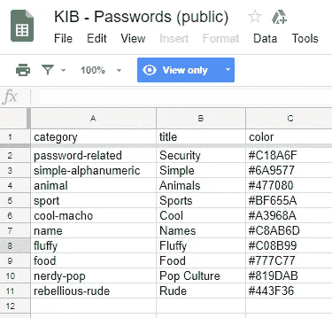
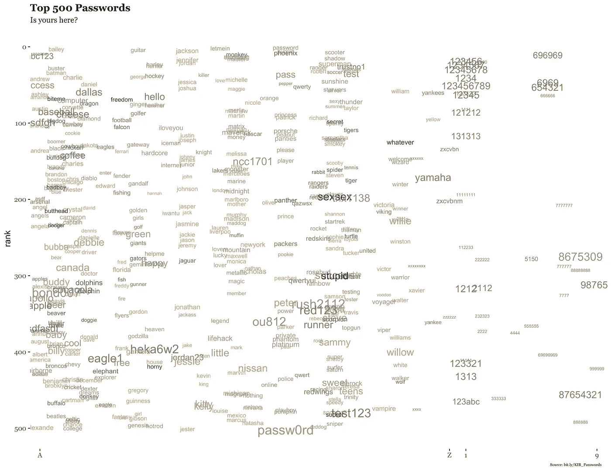
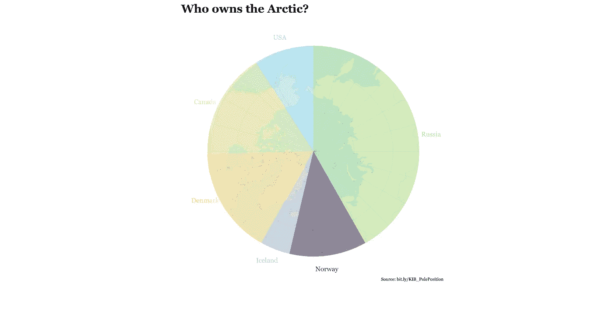

# 从《知识是美丽的》一书中再现(更多)数据可视化:第二部分

> 原文：<https://towardsdatascience.com/recreating-more-data-visualizations-from-the-book-knowledge-is-beautiful-part-ii-2f1d1da68e3a?source=collection_archive---------5----------------------->

在本系列的第二部分中，我将继续重现 David McCandless 在 r。

David McCandless 是两本最畅销的信息图书籍的作者，他在 TED 上做了一个关于数据可视化的精彩演讲。他的第二本书 [*知识是美丽的*](https://informationisbeautiful.net/2014/knowledge-is-beautiful/) ，于 2015 年出版，包含 196 幅美丽的信息图，耗时 15832 小时完成。

当你完成了这一部分，看看这个系列的其他帖子:第一部分[、](/recreating-data-visualizations-from-the-book-knowledge-is-beautiful-e455e7126071)[第三部分](/recreating-more-data-visualizations-from-the-book-knowledge-is-beautiful-part-iii-5fd393b4c548)、[第四部分](/recreating-more-data-visualizations-from-the-book-knowledge-is-beautiful-part-iv-686938a84c9e)。

# 密码

这个可视化图形是一个散点图，根据密码中的第一个字符[A 到 Z]，然后是[0 到 9]，沿 x 轴从左到右排列常用密码。密码根据类别进行颜色编码，根据密码的强度和 y 轴上的使用频率进行大小调整。

在上一篇文章中，我从 Google Docs 下载了 excel 格式的数据，并用`readxl`包中的`read_excel()`函数加载了相应的工作表。

令人沮丧的是，数据有时可以在 pdf 中分发。例如，拉斐尔·伊里扎里(Rafael Irizarry)使用波多黎各政府新发布的数据，对 2017 年毁灭性飓风玛丽亚(Maria)后波多黎各的超额死亡率进行了新的计算。 [Irizarry 的帖子附有数据，但遗憾的是它是 PDF 格式的](https://simplystatistics.org/2018/06/08/a-first-look-at-recently-released-official-puerto-rico-death-count-data/)。

[tabulizer](https://github.com/ropensci/tabulizer) 库提供了到 [Tabula java 库](https://github.com/tabulapdf/tabula-java/)的 R 绑定，可以用来从 PDF 文档中提取表格。

数据集位于这里:[bit.ly/KIB_Passwords](https://docs.google.com/spreadsheets/d/1cz7TDhm0ebVpySqbTvrHrD3WpxeyE4hLZtifWSnoNTQ/edit#gid=24)。我们来导入一下:

```
# Download tabular data from a pdf spanning multiple pages
library(tabulizer)passwords <- "~/passwords.pdf"# The table spreads across five pages
pages <- c(1:5)df_total <- data.frame()for (i in pages) {
    out <- extract_tables(passwords, page = i)
    out <- as.data.frame(out)
    colnames(out) <- c("rank","password","category", "online_crack", "offline_crack", "rank_alt", "strength","font_size")
    out <- out[-1,1:8]
    df_total <- rbind(df_total, out)
}
```

在继续之前，需要对数据进行一些清理。

```
df_total <- na.omit(df_total)
df_total$rank <- as.numeric(df_total$rank)
```

沿着 x 轴，根据密码的第一个字符对密码进行分类。我们可以使用`dplyr`的`mutate()`函数内的`grepl`来创建新的宁滨列的每个密码。

```
# make a group for passwords beginning in A-Z and through 0-9
df_total <- df_total %>% 
  mutate(group = case_when(grepl("^A", password, ignore.case = TRUE) ~ "A",
  grepl("^B", password, ignore.case = TRUE) ~ "B",
  grepl("^C", password, ignore.case = TRUE) ~ "C",
  grepl("^D", password, ignore.case = TRUE) ~ "D",
  grepl("^E", password, ignore.case = TRUE) ~ "E",
  grepl("^F", password, ignore.case = TRUE) ~ "F",
  grepl("^G", password, ignore.case = TRUE) ~ "G",
  grepl("^H", password, ignore.case = TRUE) ~ "H",
  grepl("^I", password, ignore.case = TRUE) ~ "I",
  grepl("^J", password, ignore.case = TRUE) ~ "J",
  grepl("^K", password, ignore.case = TRUE) ~ "K",
  grepl("^L", password, ignore.case = TRUE) ~ "L",
  grepl("^M", password, ignore.case = TRUE) ~ "M",
  grepl("^N", password, ignore.case = TRUE) ~ "N",
  grepl("^O", password, ignore.case = TRUE) ~ "O",
  grepl("^P", password, ignore.case = TRUE) ~ "P",
  grepl("^Q", password, ignore.case = TRUE) ~ "Q",
  grepl("^R", password, ignore.case = TRUE) ~ "R",
  grepl("^S", password, ignore.case = TRUE) ~ "S",
  grepl("^T", password, ignore.case = TRUE) ~ "T",
  grepl("^U", password, ignore.case = TRUE) ~ "U",
  grepl("^V", password, ignore.case = TRUE) ~ "V",
  grepl("^W", password, ignore.case = TRUE) ~ "W",
  grepl("^X", password, ignore.case = TRUE) ~ "X",
  grepl("^Y", password, ignore.case = TRUE) ~ "Y",
  grepl("^Z", password, ignore.case = TRUE) ~ "Z",
  grepl("^0", password, ignore.case = TRUE) ~ "0",
  grepl("^1", password, ignore.case = TRUE) ~ "1",
  grepl("^2", password, ignore.case = TRUE) ~ "2",
  grepl("^3", password, ignore.case = TRUE) ~ "3",
  grepl("^4", password, ignore.case = TRUE) ~ "4",
  grepl("^5", password, ignore.case = TRUE) ~ "5",
  grepl("^6", password, ignore.case = TRUE) ~ "6",
  grepl("^7", password, ignore.case = TRUE) ~ "7",
  grepl("^8", password, ignore.case = TRUE) ~ "8",
  grepl("^9", password, ignore.case = TRUE) ~ "9"))# get rid of NA's
df_total <- na.omit(df_total)
```

默认情况下，0–9 在 A-Z 之前，但是 McCandless 可视化将 A-Z 放在 0–9 之前，所以让我们重新安排一下。

```
df_total$group <- factor(df_total$group, levels = c("A", "B", "C", "D", "E", "F", "G", "H", "I", "J", "K", "L", "M", "N", "O", "P", "Q", "R", "S", "T", "U" , "V", "W", "X", "Y", "Z", "1", "2", "3", "4", "5", "6", "7", "8", "9"))
```

是时候重新创建数据可视化了。我们使用`geom_text()`来显示密码，根据密码强度调整大小，颜色与 McCandless 使用的主题和颜色相协调



```
library(ggplot2)
library(extrafont) # For the Georgia fontggplot(df_total, aes(x = group, y = rank)) +
geom_text(aes(label = password, color=category, size = font_size, alpha = 0.95)) + 
  # add the custom colors
  scale_color_manual(values=c("#477080", "#A3968A", "#C08B99", "#777C77", "#C8AB6D", "#819DAB", "#C18A6F", "#443F36", "#6A9577", "#BF655A")) +
  scale_y_continuous(position = "right", breaks = c(1,10,50,100,250,500)) + 
  scale_x_discrete(breaks = c("A","Z","1","9")) +
  scale_y_reverse() +
  labs(title = "Top 500 Passwords", subtitle = "Is yours here?", caption = "Source: bit.ly/KIB_Passwords") +
  labs(x = NULL, position = "top") +
theme(legend.position = "none",
      panel.background = element_blank(),
        plot.title = element_text(size = 13, 
                                  family = "Georgia", 
                                  face = "bold", lineheight = 1.2), plot.subtitle = element_text(size = 10,
                                     family = "Georgia"), 
        plot.caption = element_text(size = 5,
                                    hjust = 0.99, family = "Georgia"),  
        axis.text = element_text(family = "Georgia"))
```



McCandless 制作的数据集包含了很多关于密码如何被破解的信息。[它也有一些选择密码的提示](https://docs.google.com/spreadsheets/d/1cz7TDhm0ebVpySqbTvrHrD3WpxeyE4hLZtifWSnoNTQ/edit#gid=23)。不过，这个 [xkcd](https://xkcd.com/) 漫画可以很好地解释 TLDR:


在顶部框架中，密码破解软件更容易猜出 **Tr0ub4dor & 3** 密码，因为它比**correct horse battery staple**的熵更小，而且人类也更难记住，导致不安全的做法，如将密码写在显示器上的便利贴上。所以你应该总是把一个容易记住的句子转换成一个容易记住的密码，而不是一个随机的字母数字。

# 一茶匙糖

[糖数据集](https://docs.google.com/spreadsheets/d/1NUvUicSvcUq-BEoK5ATR2cCpXHmP7oRGEFgHuAhnBww/edit#gid=31)可视化是一个圆形条形图，显示了常见饮料中的糖的茶匙数。该图使用了`ggplot2` *的`coord_polar`选项(为了简化这篇文章，我排除了数据管理代码，而是提供了一个* `*.csv*` *文件以备绘图)。*

```
sugar <- read.csv("sugar.csv")# Re-order the factors the way they appear in the data frame
names <- sugar$drinks
names
sugar$drinks <- factor(sugar$drinks, levels = rev(sugar$drinks), ordered = TRUE)# Create a custom color palette
custompalette <- c("#C87295", "#CE7E9C", "#CE7E9C", "#C3C969", "#B77E94", "#693945", "#63645D", "#F9D9E0", "#B96E8E", "#18090E", "#E1E87E", "#B47E8F", "#B26F8B", "#B47E8F", "#B26F8B", "#B47E8F", "#B26F8B", "#9397A0", "#97B7C4", "#9AA24F", "#6B4A4F", "#97A053", "#B7BB6B", "#97A053", "#B7BB6B", "#97A053", "#B7BB6B", "#97A053", "#B7BB6B",
"#CED97B", "#E4E89C", "#C87295", "#CE7E9C")ggplot(sugar, aes(x = drinks, y = teaspoons, fill = drinks)) +
  geom_bar(width = 0.75, stat = "identity") +
  coord_polar(theta = "y") +
  xlab("") + ylab("") +
  labs(title = "Teaspoons", caption = "Source: bit.ly/KIB_Sugar") +
  # Increase ylim to avoid having a complete circle and set custom breaks to range of teaspoons
  scale_y_continuous(limits = c(0,65), breaks=seq(0,26,1)) +
  scale_fill_manual(values = custompalette) +
  theme(legend.position = "none", 
        axis.text.y = element_blank(),
        axis.text.x = element_text(color = "white", family = "Georgia"),
        axis.ticks = element_blank(), 
        panel.background = element_rect(fill = "black", color = NA),
        plot.title = element_text(color = "white", 
                                  size = 13, 
                                  family = "Georgia", 
                                  face = "bold", lineheight = 1.2), 
        plot.caption = element_text(size = 5,
                                    hjust = 0.99, 
                                    color = "white", 
                                    family = "Georgia"),
        panel.grid.major.y = element_line(color = "grey48", size = 0.05, linetype = "dotted"),
        panel.grid.minor.y = element_blank(),
        panel.grid.major.x = element_blank())
```


最好是在条形旁边手动添加标签，而不是在`axis.text.y =`中调整`hjust`。

尽管我认为这种视觉效果在美学上是令人愉悦的，但如果不提这些类型的图形最终应该被避免，那将是我的失职，因为很难/误导性地辨别群体之间的差异([这里有一个很好的链接，深入解释了 wh](http://www.visualisingdata.com/2017/09/problems-barc-charts/) y)。

说到良好的数据可视化实践，大多数人会告诉你避免饼图、炸药图等。然而，我每天都能在学术出版物、政府报告等中看到它们。

谁知道呢，你的雇主可能会要求你制作一份背景带有公司标志的定制信息图。嗯，你很幸运！

大卫·麦克肯多斯在书中加入了一个 pieplot，我认为复制这个 pie plot 会很有用；仅仅是为了展示如何在绘图中包含背景图像。

# 谁拥有北极？

根据国际法，包括北极及其周围北冰洋区域在内的公海不属于任何国家。然而，延伸至北极大陆架的领土主张属于加拿大、俄罗斯、丹麦、挪威、美国和冰岛。

虽然在[数据集中有很多信息](https://docs.google.com/spreadsheets/d/1WUdFWTjR5UMLJtjVtKjOOvoTBApI2qJ_WDJr65S6Z5Q/edit#gid=0)，但我找不到他用于可视化的原始数据。因此，在这个例子中，我只给出一个大概的估计。

```
library(magick)# use image under Creative Commons Attribution-Share Alike 3.0 Unported license.
img <- image_read("[https://upload.wikimedia.org/wikipedia/commons/9/91/Arctic_Ocean_location_map.svg](https://upload.wikimedia.org/wikipedia/commons/9/91/Arctic_Ocean_location_map.svg)")bitmap <- img[[1]]
bitmap[4,,] <- as.raw(as.integer(bitmap[4,,]) * 0.4)
taster <- image_read(bitmap)# custom pallete
my_palette <- c("#ADDFEA","#E3E9A3", "#FFD283", "#CAC3CF", "#62465F", "#B8E29B")# Make data frame
df <- data.frame(
  country = c("USA", "Russia", "Norway", "Iceland", "Denmark", "Canada"), 
  percentage = c(10,46,13,5,18,18))# Re-order the factors the way they appear in the data frame
df$country <- factor(df$country, levels = c("USA", "Canada", "Denmark", "Iceland", "Norway", "Russia"), ordered = TRUE)g <- ggplot(df, aes(x = "", y=percentage, fill = country)) +
  geom_bar(width = 1, stat = "identity") +
  coord_polar("y", start=0) +
  scale_y_continuous(breaks = c(105,25,53,62,75,90),labels = c("USA", "Russia", "Norway", "Iceland", "Denmark", "Canada")) +
    xlab("") + ylab("") +
  labs(title = "Who owns the Arctic?", caption = "Source: bit.ly/KIB_PolePosition") +
  scale_fill_manual(values = my_palette) +
  theme(legend.position = "none", 
        axis.text.y = element_blank(),
        axis.text.x = element_text(color = c("#ADDFEA","#B8E29B", "#62465F", "#CAC3CF", "#FFD283", "#E3E9A3"), family = "Georgia", size = 7.6),
        axis.ticks = element_blank(), 
        panel.background = element_blank(),
        axis.line = element_blank(),
        plot.title = element_text(size = 13, 
                                  family = "Georgia", 
                                  face = "bold", lineheight = 1.2), 
        plot.caption = element_text(size = 5,
                                    hjust = 0.99, 
                                    vjust = 15,
                                    family = "Georgia"),
        panel.grid.minor = element_blank(),
        panel.grid.major = element_blank())# You need to fiddle with the settings in RStudio and then Export to PDF, JPG, TIFF, etc.
library(grid)
grid.newpage()
g
grid.draw(rasterGrob(width = 0.34, height = 0.666, image=taster, just = "centre", hjust = 0.46, vjust = 0.47))
```



更多怪异但(有时)有用的情节见[异种图](https://xeno.graphics/?utm_campaign=Data_Elixir&utm_medium=email&utm_source=Data_Elixir_179)。

本系列可复制的代码和内容可以在 [Github](https://github.com/moldach/dataRbeautiful) 上找到

希望你喜欢这篇文章，并继续关注第三部分！