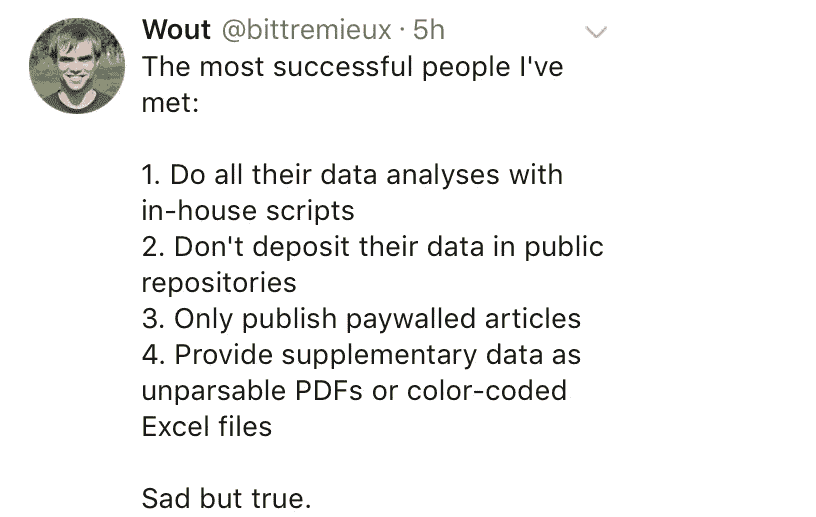
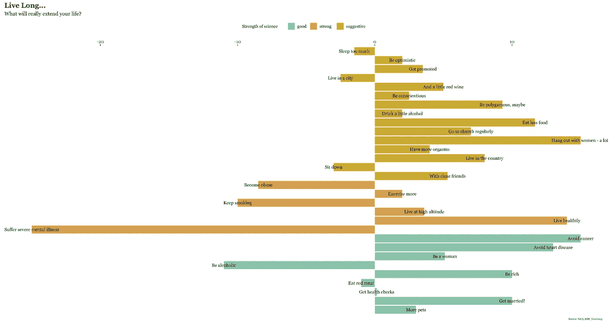
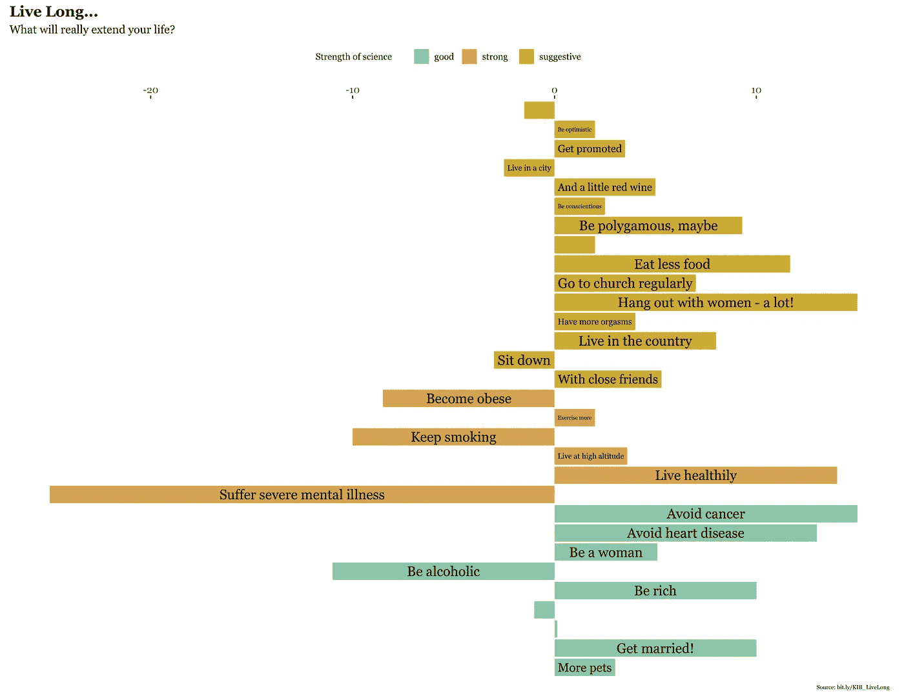
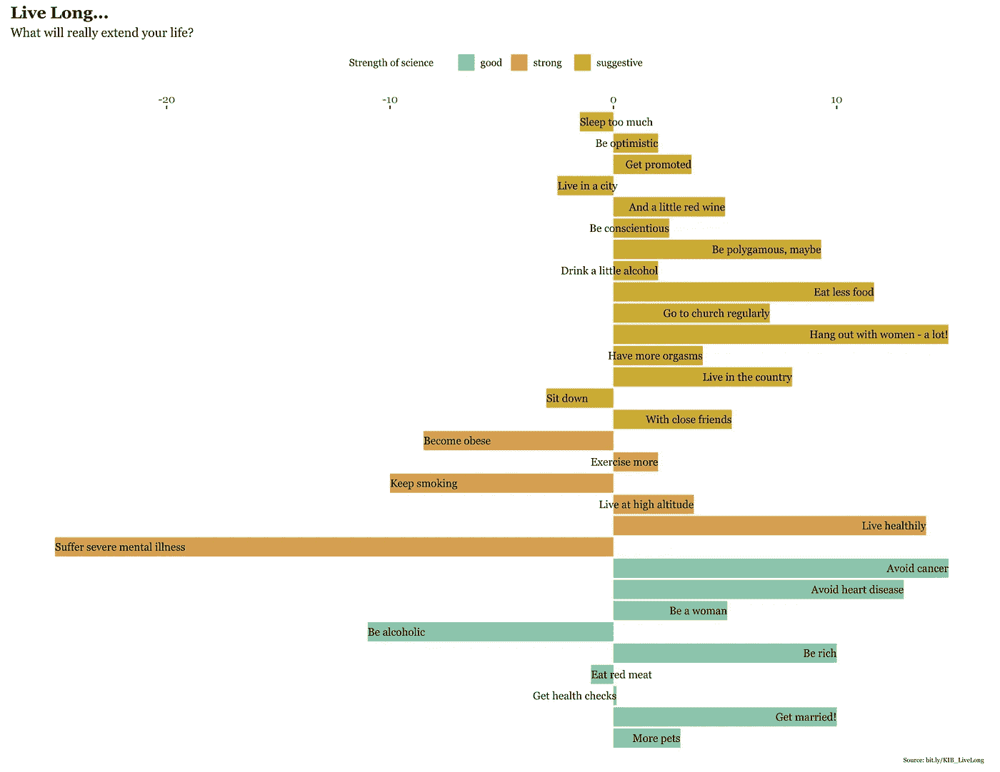
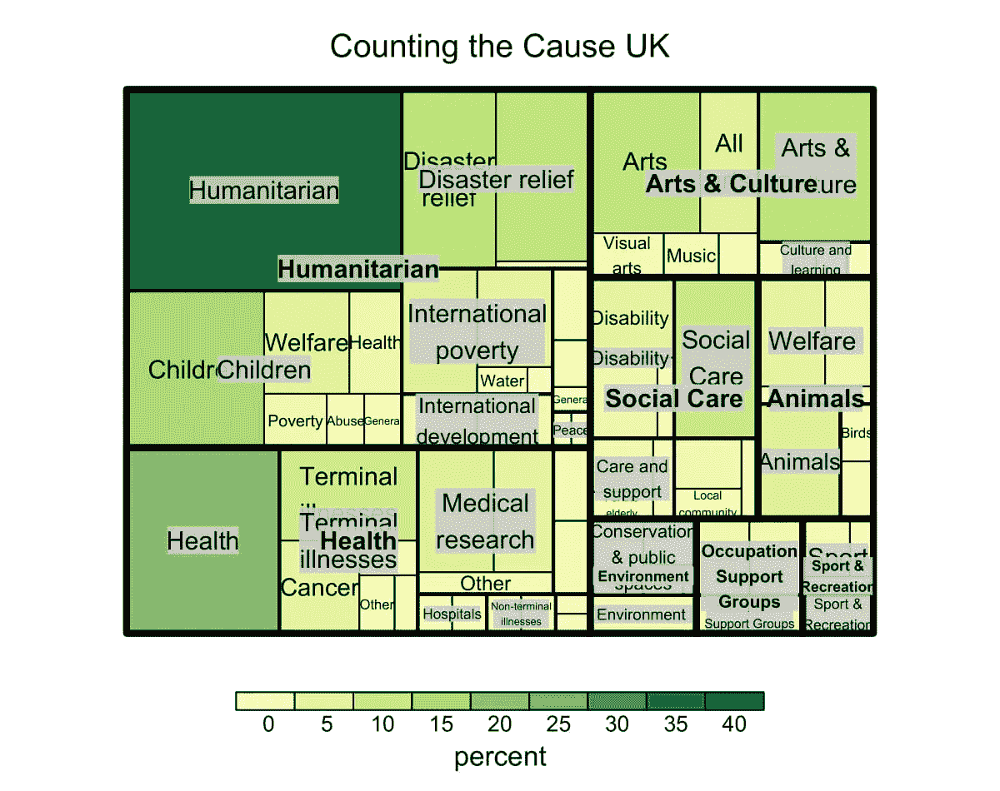

# 从《知识是美丽的》一书中再现(更多)数据可视化:第三部分

> 原文：<https://towardsdatascience.com/recreating-more-data-visualizations-from-the-book-knowledge-is-beautiful-part-iii-5fd393b4c548?source=collection_archive---------6----------------------->

欢迎来到本系列的第三部分，在第`R`部分，我重新创建了数据可视化，来自大卫·麦坎多斯的《知识是美丽的》一书[](https://informationisbeautiful.net/2014/knowledge-is-beautiful/)*。*

*该系列的第 [I](/recreating-data-visualizations-from-the-book-knowledge-is-beautiful-e455e7126071) 、 [II](https://medium.com/@MattOldach_65321/recreating-more-data-visualizations-from-the-book-knowledge-is-beautiful-part-ii-2f1d1da68e3a) 、 [IV](/recreating-more-data-visualizations-from-the-book-knowledge-is-beautiful-part-iv-686938a84c9e) 部分的链接可在此处找到。*

*数据科学中的挫折有很多，例如:*

**

*考虑上面的第 4 点。即使数据是可用的，它仍然可以以令人沮丧的格式分发。在本系列的第一部分中，我展示了如何使用`readxl`包访问特定的 excel 表格。在第二部分中，我展示了如何用`tabulizer`包解析 R 中的 PDF 表格。一些人可能会感兴趣， [Luis D. Verde](https://twitter.com/LuisDVerde) 最近发表了一篇关于[如何在 R](https://luisdva.github.io/rstats/excel-trivia/) 中处理 Excel 中令人沮丧的单元格格式的伟大文章。*

*尽管 McCandless 公开了所有数据，但在制作可视化之前，我还是做了一些清理工作。我决定，既然这个系列的重点是数据可视化，我将把数据管理代码留在这个系列的其余部分，而是提供为`ggplot`准备好的`tidy`数据的`.csv`文件。*

# *长寿*

*长寿可视化是一个发散的条形图，描绘了某些行为如何影响你的寿命。*

```
*library(dplyr)
library(ggplot2)# load the data
livelong <- read.csv("livelong.csv")# Order by action
livelong$action <- factor(livelong$action, levels = c("Sleep too much", "Be optimistic", "Get promoted", "Live in a city", "Live in the country", "Eat less food", "Hang out with women - a lot!", "Drink a little alcohol", "Be conscientious", "Have more orgasms", "And a little red wine", "With close friends", "Be polygamous, maybe", "Go to church regularly", "Sit down", "More pets", "Eat red meat", "Avoid cancer", "Avoid heart disease", "Be alcoholic", "Get health checks", "Get married!", "Be rich", "Be a woman", "Suffer severe mental illness", "Become obese", "Keep smoking", "Live healthily", "Exercise more", "Live at high altitude"))# Set legend title
legend_title <- "Strength of science"# Make plot
p <- ggplot(livelong, aes(x = action, y = years, fill=strength)) +
  geom_bar(stat = "identity") +
  scale_fill_manual(legend_title, values = c("#8BC7AC","#D99E50","#CDAD35")) +
  labs(title = "Live Long...", subtitle = "What will really extend your life?", caption = "Source: bit.ly/KIB_LiveLong") +
  scale_y_continuous(position = "bottom") +
  scale_x_discrete(limits = rev(factor(livelong$action))) +
  #scale_x_reverse() +
  coord_flip() +
  theme(legend.position = "top",
      panel.background = element_blank(),
        plot.title = element_text(size = 13, 
                                  family = "Georgia", 
                                  face = "bold", lineheight = 1.2), plot.subtitle = element_text(size = 10,
                                     family = "Georgia"), 
        plot.caption = element_text(size = 5,
                                    hjust = 0.99, family = "Georgia"),  
        axis.text = element_text(family = "Georgia"),
      # Get rid of the y- and x-axis titles
      axis.title.y=element_blank(),
      axis.title.x=element_blank(),
      # Get rid of axis text
      axis.text.y = element_blank(),
      axis.ticks.y = element_blank(),
      legend.text = element_text(size = 8, family = "Georgia"),
      legend.title = element_text(size = 8, family = "Georgia"),
      legend.key.size = unit(1,"line"))*
```

*好的，这是第一次尝试用`geom_text()`做注释*

```
*p + geom_text(aes(label = action), size = 3, family = "Georgia")*
```

**

*人们会立即注意到文本注释没有对齐。此外，由于条形图在中心(零)发散，修改`hjust`参数本身并不能解决问题。*

*一个可能的解决方法是使用`ggfittext`包，它通过`geom_fit_text()`函数将文本约束在一个定义的区域内，该函数的工作方式与`ggplot2::geom_text()`差不多。*

```
*# currently only supported by the dev version
devtools::install_github("wilkox/ggfittext")
library(ggfittext)p + geom_fit_text(aes(label = action), position = "stack", family = "Georgia")*
```

**

*我们看到小条没有被注释，因为字符串太大了，无法在条中显示。*

*最初的可视化从来不会将文本限制在条中，所以最好的方法是向表中添加一个变量，允许您左对齐一些标签，右对齐其他标签。*

```
*# Set postive as "Up" and negative numbers as "Down"
livelong$direction <- ifelse(livelong$years > 0, "Up", "Down")livelong$just <- ifelse(livelong$direction=="Down",0,1)p + geom_text(aes(label = action), size = 3, family = "Georgia", hjust=livelong$just)*
```

**

*这证明了盒子的合理性，因此减少你寿命的行为是左调整的，而延长你寿命的行为是右调整的。唯一的问题是，在最初的可视化中，文本排列在图表的中心。我不知道如何做到这一点，所以加分，如果你能想出这一点，并张贴到评论！*

*一个视觉上吸引人的选择是把名字放在栏外。*

```
*livelong$just <- ifelse(livelong$direction=="Up",0,1)p + geom_text(aes(label = action), size = 3, family = "Georgia", hjust=livelong$just)*
```

**

# *盘点原因英国*

***统计英国**慈善事业[数据集](https://docs.google.com/spreadsheets/d/16q9OGYALTfyAwXDuH46UdCK2TJPcabo5U0UBKXaVgfQ/edit#gid=4)显示了英国公民捐赠最多的慈善机构。*

*我们可以使用`Treemap`库创建一个类似的可视化。它创建嵌套矩形的分层显示，然后平铺在代表子分支的较小矩形内。*

```
*library(treemap)my_data <- read.csv("treemap.csv")tm <- treemap(my_data, index = c("main","second", "third"), vSize = "percent", vColor = "percent", type = "value", title = "Counting the Cause UK")*
```

**