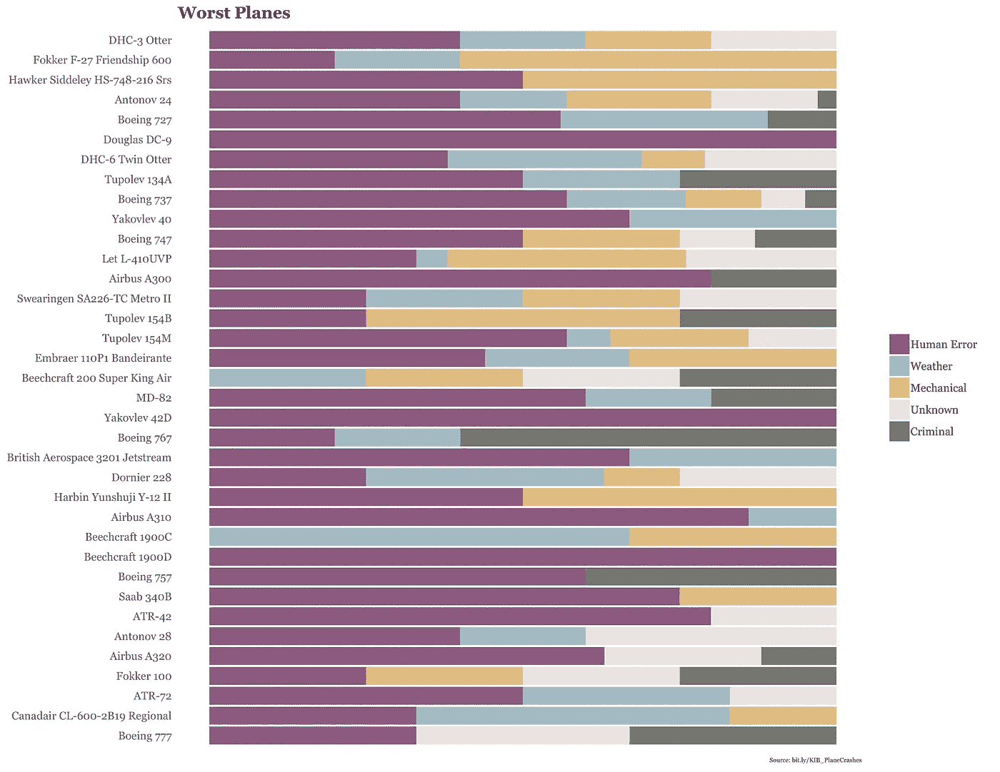
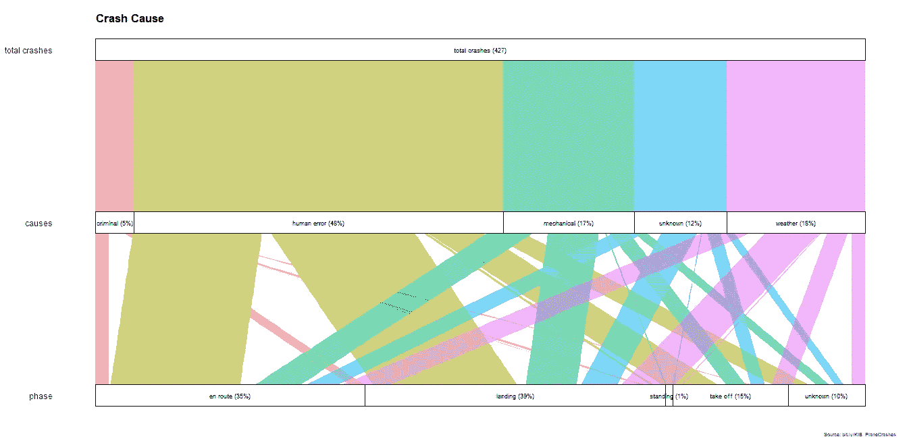
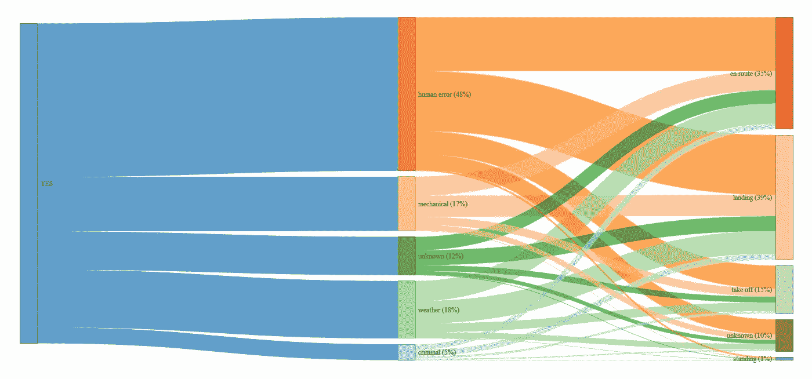
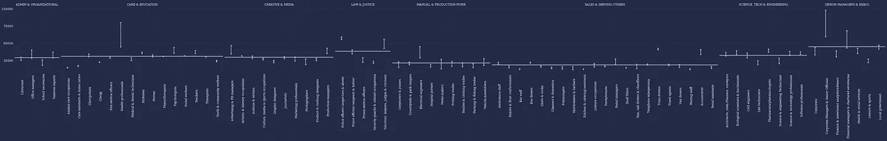

# 从《知识是美丽的》一书中再现(更多)数据可视化:第四部分

> 原文：<https://towardsdatascience.com/recreating-more-data-visualizations-from-the-book-knowledge-is-beautiful-part-iv-686938a84c9e?source=collection_archive---------6----------------------->

欢迎来到本系列的最后一部分，在这里我用 R 语言重新创建了 David McCandless 所著的《知识是美丽的》一书中的数据可视化。

此处可找到该系列第[部分 I](/recreating-data-visualizations-from-the-book-knowledge-is-beautiful-e455e7126071) 、 [II](https://medium.com/@MattOldach_65321/recreating-more-data-visualizations-from-the-book-knowledge-is-beautiful-part-ii-2f1d1da68e3a) 、 [III](/recreating-more-data-visualizations-from-the-book-knowledge-is-beautiful-part-iii-5fd393b4c548) 的链接。

# 飞机坠毁

这个[数据集](https://docs.google.com/spreadsheets/d/1RT25s5oCsHJrahZkL6KWxAa2ZM9kD2aRakN9Cil_vHQ/edit#gid=11)将用于几个可视化。

第一个可视化是一个堆积条形图，显示了从 1993 年到 2017 年 1 月的每架飞机失事的原因(*为非军事、医疗或私人包机航班*)。

```
library(dplyr)
library(ggplot2)
library(tidyr)
library(extrafont)df <- read.csv("worst_plane.csv")# Drop the year plane model entered service
mini_df <- df %>% 
  select(-year_service) %>% 
# Gather the wide dataframe into a tidy format
  gather(key = cause, value = proportion, -plane)
# Order by cause
mini_df$cause <- factor(mini_df$cause, levels = c("human_error","weather", "mechanical", "unknown", "criminal"), ordered = TRUE)# Create vector of plane names according to year they entered service
names <- unique(mini_df$plane)
names <- as.vector(names)
# sort by factor
mini_df$plane <- factor(mini_df$plane, levels = names)ggplot(mini_df, aes(x=plane, y=proportion, fill=cause)) +
  geom_bar(stat = "identity") +
  coord_flip() +
  # Reverse the order of a categorical axis
  scale_x_discrete(limits = rev(levels(mini_df$plane))) +
  # Select manual colors that McCandless used
  scale_fill_manual(values = c("#8E5A7E", "#A3BEC7", "#E1BD81", "#E9E4E0", "#74756F"), labels = c("Human Error", "Weather", "Mechanical", "Unknown", "Criminal")) +
  labs(title = "Worst Planes", caption = "Source: bit.ly/KIB_PlaneCrashes") +
  scale_y_reverse() +
  theme(legend.position = "right",
      panel.background = element_blank(),
        plot.title = element_text(size = 13, 
                                  family = "Georgia", 
                                  face = "bold", lineheight = 1.2),
      plot.caption = element_text(size = 5,
                                    hjust = 0.99, family = "Georgia"),
      axis.text = element_text(family = "Georgia"), 
      # Get rid of the x axis text/title 
      axis.text.x=element_blank(),
      axis.title.x=element_blank(),
      # and y axis title
      axis.title.y=element_blank(),
      # and legend title
      legend.title = element_blank(),
      legend.text = element_text(family = "Georgia"),
      axis.ticks = element_blank())
```



第二个可视化是一个冲积图，我们可以使用`ggalluvial`包。我应该提到的是，McCandless 最初的可视化要比现在产生的更加花哨，但是显示了相同的基本信息。

```
library(alluvial)
library(ggalluvial)crash <- read.csv("crashes_alluvial.csv")# stratum = cause, alluvium = freqggplot(crash, aes(weight = freq,
                  axis1 = phase,
                  axis2 = cause,
                  axis3 = total_crashes)) +
  geom_alluvium(aes(fill = cause),
                width = 0, knot.pos = 0, reverse = FALSE) +
  guides(fill = FALSE) +
  geom_stratum(width = 1/8, reverse = FALSE) +
  geom_text(stat = "stratum", label.strata = TRUE, reverse = FALSE, size = 2.5) +
  scale_x_continuous(breaks = 1:3, labels = c("phase", "causes", "total crashes")) +
  coord_flip() +
  labs(title = "Crash Cause", caption = "Source: bit.ly/KIB_PlaneCrashes") +
  theme(panel.background = element_blank(),
        plot.title = element_text(size = 13, 
                                  family = "Georgia", 
                                  face = "bold",
                                  lineheight = 1.2,
                                  vjust = -3,
                                  hjust = 0.05), 
        plot.caption = element_text(size = 5,
                                    hjust = 0.99, family = "Georgia"),  
        axis.text = element_text(family = "Georgia"),
      axis.text.x = element_blank(),
      axis.ticks.x = element_blank(),
      axis.ticks.y = element_blank())
```



在我看来，产生桑基图的一个更干净的方法是用包`flipPlot` [包](https://www.r-bloggers.com/how-to-create-sankey-diagrams-from-tables-data-frames-using-r/)。

```
devtools::install_github(Displayr/flipPlots)
library(flipPlots)# reorder the df
crash$total_crashes <- rep("YES", 25)# plot
SankeyDiagram(crash[, -4], link.color = "Source", label.show.varname = FALSE, weights = crash$freq)
```



我可能只是旋转图像和标签，并将“是”改为“总崩溃数(427)”

# 性别差距

该图描绘了英国不同行业中男性和女性的工资差距，以及同一类别中每个职位的平均工资。我们可以使用`group_by()` 和`summarize_at()`为每个类别创建一个新变量，然后使用`facet_wrap()`。由于位置仅属于一个类别，您需要设置`scales = "free_x"`用于遗漏观察。

```
gendergap <- read.csv("gendergap.csv")# gather the dataset
tidy_gap <- gendergap %>% 
  gather(key = sex, value = salary, -title, -category)category_means <- tidy_gap %>% 
  group_by(category) %>%
  summarize_at(vars(salary), mean)tidy_gap %>% ggplot(aes(x = title, y = salary, color = sex)) +
  facet_grid(. ~ category, scales = "free_x", space = "free") +
  geom_line(color = "white") +
  geom_point() +
  scale_color_manual(values = c("#F49171", "#81C19C")) +
  geom_hline(data = category_means, aes(yintercept = salary), color = "white", alpha = 0.6, size = 1) +
  theme(legend.position = "none",
      panel.background = element_rect(color = "#242B47", fill = "#242B47"),
      plot.background = element_rect(color = "#242B47", fill = "#242B47"),
      axis.line = element_line(color = "grey48", size = 0.05, linetype = "dotted"),
      axis.text = element_text(family = "Georgia", color = "white"),
      axis.text.x = element_text(angle = 90),
      # Get rid of the y- and x-axis titles
      axis.title.y=element_blank(),
      axis.title.x=element_blank(),
      panel.grid.major.y = element_line(color = "grey48", size = 0.05),
      panel.grid.minor.y = element_blank(),
      panel.grid.major.x = element_blank(),
      strip.background = element_rect(color = "#242B47", fill = "#242B47"),
      strip.text = element_text(color = "white", family = "Georgia")) 
```



我不确定如何处理的一件事是 x 轴上每个变量之间的间距。由于每个刻面有不同数量的变量，如果能指定他们想要沿 x 轴等间距作为`facet_wrap()`中的一个选项就更好了；然而，我认为这是不可能的(如果你知道一个变通办法，请留下评论！).

##编辑 2018 年 9 月 5 日

多亏了 StackOverflow 的非常有帮助的[社区的帮助，我知道我需要的是`facet_grid()`而不是`facet_wrap()`。如果任何人知道如何手动调整 x 轴上每个类别之间的距离(例如*或*最小化间距)，将获得加分。](https://stackoverflow.com/questions/51052566/dealing-with-variable-axis-scales-in-facet-wrap?noredirect=1#comment91218664_51052566)

这就是我的全部，做这个系列很有趣，我希望你喜欢！