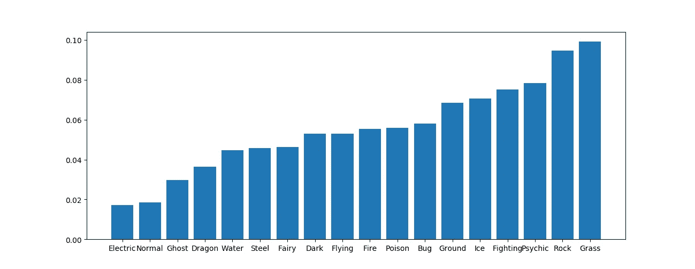
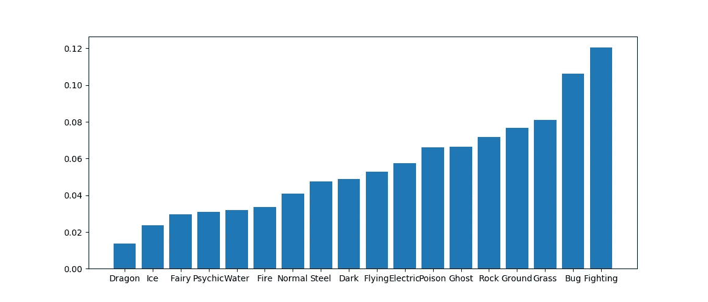
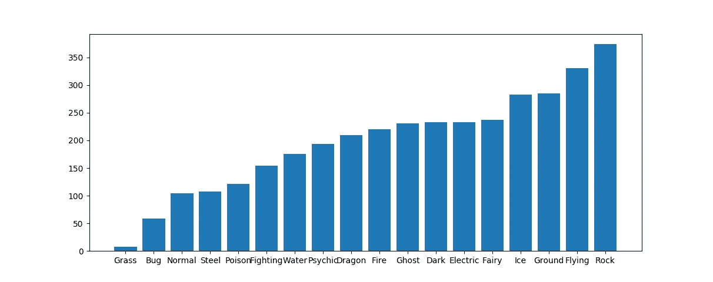
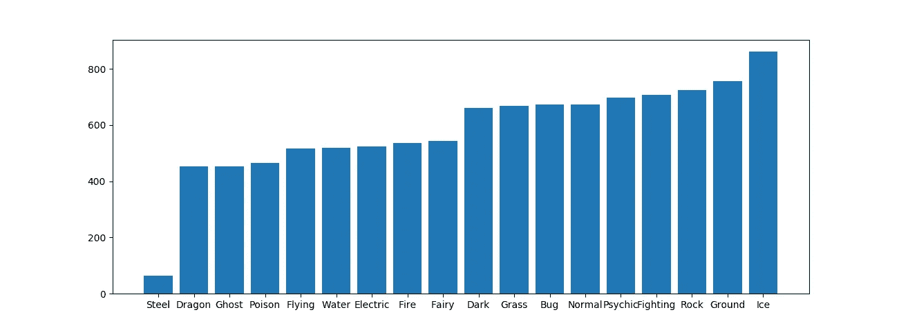

# 最好的神奇宝贝类型是什么？度量的力量

> 原文：<https://towardsdatascience.com/recreational-data-science-whats-the-best-pok%C3%A9mon-type-d3fcd28ea740?source=collection_archive---------2----------------------->


Source: [Pixabay](https://pixabay.com/en/pokemon-smartphone-pokemon-go-1601390/)

我们都知道最好的类型是什么(通灵。证明我错了。)，但是数据怎么说呢？

有时候，数据科学是关于做出艰难的选择，或者为公司赚很多钱。但在其他时候，数据科学可能只是一个雨天周末的有趣爱好。

本周，我一直忙于一项大学作业:我和几个同学不得不编写 PageRank 算法——在人工智能和 NLP 吃掉其他一切之前，谷歌曾用于搜索的算法。

## 什么是 PageRank？

PageRank 是一种算法，用于获得系统连接部分的排名——非常适合网站排名，这是它的最初目的。

基于其最初的任务，它测量并排列许多相互链接(边)的节点(网站)的重要性或影响力。

该算法将一个有向图作为其输入，并返回其节点的排名——以及一些介于 0 和 1 之间的评分——以及一些标准:

*   如果更多的节点链接到你，你的排名会更高。
*   如果链接到更多的节点，那么链接到另一个节点就不太相关了。
*   被排名较高的节点链接更好。

这与一个大网站的想法是一致的，比如 Medium，会被很多来源链接，而被一个大网站链接(比如脸书的主页)也意味着你的网站非常相关。您还可以使用它来模拟科学论文或出版物的相关性(使用引用作为链接)，或者动物在给定生态系统中被吃掉的概率(用食物链作为图形)。

所以我一直想写一篇有趣的文章，我有这个 PageRank 实现…我不能错过这个机会。

## 获取数据

首先，我开始着手收集数据。

因为我想建模的只是类型关系，所以我打算使用 Bulbapedia(神奇宝贝的 Wiki)——但后来我发现其他人可能已经编写了这部分代码。实际上，几秒钟的搜索让我[到了这个令人敬畏的链接](https://dkmathstats.com/a-pokemon-types-table-in-python/)，从中我获得了游戏中类型优势的 Python 矩阵。
这使用了第六代的类型和关系。我还没抽时间弹第七首，所以我不介意。

已经用 Python 加载了原始矩阵，我必须给它正确的格式:PageRank 作为输入的那种图中的链接没有权重——它们是二进制的:要么链接到某个东西，要么不链接(如果有不同的 PageRank 实现来解决这个问题，请在评论中告诉我！).

如果你没有玩过神奇宝贝或者你对细节不清楚，每种类型都可以对另一种类型保持中立(大多数类型都是相互中立的)，具有优势(造成 2 倍伤害)，劣势(造成 1/2 伤害)或者免疫(0 伤害)。

我将这种格式(4 种不同的关系)转移到二进制域的方式是简单地绘制两个不同的图形:一个是攻击者的，一个是防御者的。我还把免疫和抵抗归为一类(防御优势，如果你愿意的话)——我希望这不会冒犯任何铁杆粉丝。

还有另一个问题:PageRank 没有考虑链接到自己的网站，所以我们不能使用关于神奇宝贝类型对自己脆弱或对自己有效的数据。(充分披露:在这篇文章的初稿中，我没有意识到这一点，一位读者让我注意到了我的错误。结果变了。)

## PageRank 结果

这是我从模拟攻击类型中得到的结果。如果类型 A 对类型 B 非常有效，我只将类型 A 链接到类型 B，而不将任何类型链接到它们自己(因为这违反了 PageRanks 的前提条件)。



Somehow grass wins? And Rock is a very close second, with Psychic third.

正如我所料，灵媒进入了前 3 名。龙有一个非常糟糕的地方，这让我很惊讶，除了龙的一个优点是对其他龙非常有效，这是这个算法无法捕捉到的。电动类型排在最后，尽管水应该是最常见的神奇宝贝类型。

与此同时，防御型的结果也相当令人惊讶:



龙最后出来，尾巴上结着冰。另一方面，战斗和 Bug 是最重要的，是最有抵抗力的类型。尽管臭虫不是一种很强的防御类型，但它能抵抗三种不同的类型，其中一种是战斗型，它在排行榜上名列第一，这也解释了为什么它会如此接近榜首。

*(免责声明:在之前的草稿里我说冰抗龙，其实只是龙弱于冰而已。抱歉。)*

我觉得结果不太直观，也许不同的模型会更好。例如，这个模型不能捕捉一个弱于自身的类型，也不能处理水型神奇宝贝比龙型神奇宝贝出现的频率高多少。

这里有一个[到原始结果](https://gist.github.com/StrikingLoo/ecfa2b111dcff7f2aec1f8eab2bee59e)的链接，以防你想以不同的方式可视化它们。

## 尝试不同的指标

我对我在进攻端的成绩很满意，但是防守型神奇宝贝的排名不可能有那么好。所以我开始寻找其他的衡量标准。

我想也许一个简单的衡量标准

```
sum (Damage modifier)*(#pokémon of that type) over every type
```

可以产生更直观的结果，类似于“预期损害”。让我们看看我有什么。

我发现了一个 [redditor，他友好地收集了每种类型的神奇宝贝](https://www.reddit.com/r/pokemon/comments/8o6fow/number_of_pokemon_per_type_ranking_chart/)的数量，所以我引用他作为我的来源。

对于每一种神奇宝贝，我都会数两次，如果它们很弱，0 表示它们有免疫力，一半表示它们有抵抗力，一次表示没有抵抗力。



Expected dealt damage for attacking pokemon types, against other pokemon. Minus 1000 for centering.

这次

*   臭虫是第二弱的。
*   草最后出来。它在其他排名中名列第一。
*   岩石、地面、冰和飞行非常接近前四名。
*   洛克在这两个进攻指标上都做得很好。

看起来即使草类比其他种类更强，但是这些种类的神奇宝贝却更少。不过，摇滚似乎一直都不错。将来，我可能会在不考虑传奇神奇宝贝的情况下再看看这些数字，因为它们无论如何都不能用于比赛。



Expected received damage (bigger is worse) by type. Minus 600 for centering.

如果我反其道而行之，仅根据类型来计算神奇宝贝应该受到的“预期伤害”,这些是关键的见解:

*   钢铁是最好的防御神奇宝贝类型，可能是由于它对毒药的免疫和许多抗性。它以超过 20%的优势战胜了第二种类型。
*   讽刺的是，最糟糕的防御类型是冰，其预期伤害比钢高 50%。
*   地面和岩石是一贯良好的伤害处理者，但却是非常糟糕的防御类型，这使得游戏场保持公平。
*   不出所料，Bug 不仅是一个糟糕的进攻者，也是一个糟糕的防守者。

我个人觉得这些排名比第一批更直观。

对于那些想看这个分析的全部结果的人来说，这些数字可以在这个[要点](https://gist.github.com/StrikingLoo/6019d69d8ea20129963ec5e65c2bb6c9)中找到。

## 最终结论

看到这些数字后，我觉得我对神奇宝贝的种类有了更好的直觉。老实说，最让我惊讶的是这个系统有多公平:从某些指标来看，最好的神奇宝贝在其他指标上是最差的，大多数都落在中间。大多数玩家做出的一些假设已经被证实了:臭虫不是一个非常强大的类型(如果把它考虑在分析中，它缺乏强大的攻击会使它更弱)，岩石和地面是非常好的玻璃炮(所以继续教非地面类型的神奇宝贝地震)，大多数类型只是落在中间。此外，钢是一个非常可爱的坦克。

在未来，我可能会回来做另一个更细致的分析，查看当前元的状态，或者按类型查看神奇宝贝的统计数据，特别是将它们分为特殊坦克、物理坦克、特殊 DPS 和物理 DPS。

我希望你觉得这很有趣，甚至发人深省。我很乐意接受任何批评或想法。你对这篇文章或这些结果有什么看法？你认为还有哪些问题可以用 PageRank 很好地建模？你认为做其他什么分析会很有趣？
请在评论中告诉我所有这些问题的答案！

*关注我获取更多数据科学和分析文章，如果你喜欢阅读这些文章，请考虑* [*支持我的写作习惯。*](http://buymeacoffee.com/strikingloo)