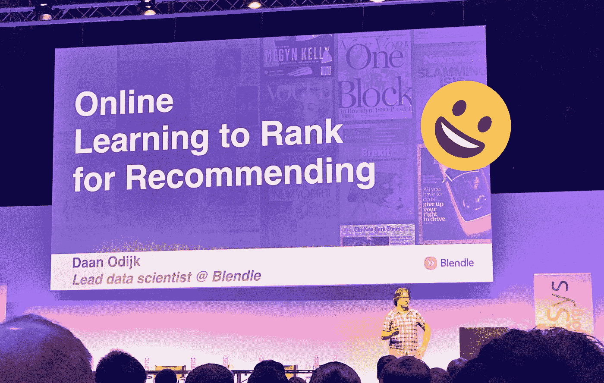
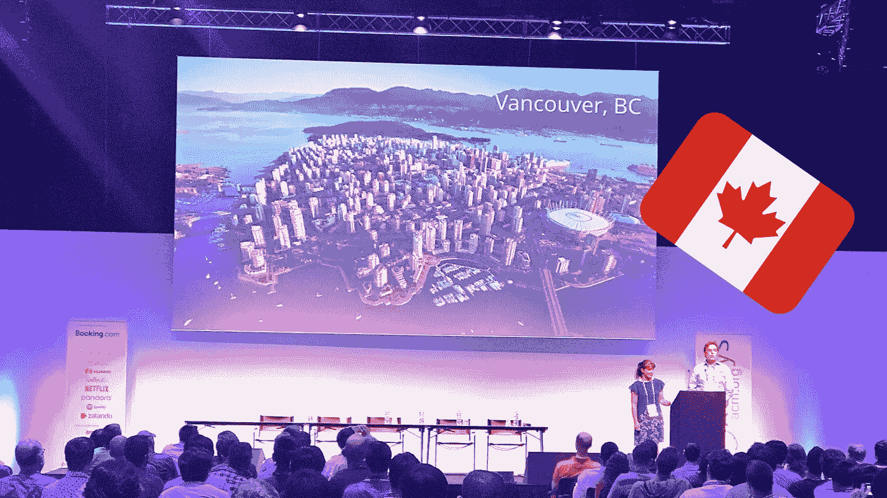

# RecSys 2017

> 原文：<https://towardsdatascience.com/recsys-2017-2d0879351097?source=collection_archive---------7----------------------->


Not a bad location for a conferance

每年推荐系统社区(学术界和工业界都一样)聚集在一起分享关于推荐系统的研究、思想和想法。今年的会议在科莫湖举行，有 40 多场演讲、11 场行业讲座、10 场研讨会和 4 场辅导课，吸引了 600 多名与会者。

如果我对下面的文章有任何误解，请纠正我。

# 关键主题

在整个会议中，我认为有三个强有力的主题贯穿始终；

*   *深度学习* —正如在许多其他学科(NLP 和计算机视觉)中看到的那样，深度学习继续变得越来越受欢迎。尽管这些论文声称在测试数据集的准确性方面取得了显著的进步，但许多论文已经开始批评它的有效性，并质疑与类似模型相比，这种复杂系统的价值。
*   *个性化*——和任何推荐器一样，其目标之一是在正确的时间呈现用户想要的信息。个性化推荐采取了多种形式，从尝试在 LtR 模型中使用个人信息对项目进行排序，使用更高层次的 RNNs 对会话推荐进行个性化，到为系统内的每个用户训练模型。每个放映效果导致对用户的个性化推荐。
*   *工业界与学术界*——这场战斗已经持续了多年，尽管这两者之间似乎是一种健康的关系。工业似乎带来了有趣的数据和真实的生活结果。然而学术界展示了许多关于推荐的有趣模型和理论(例如会话式推荐系统)。尽管在将学术界应用到工业规模之间，甚至在如何将一些模型应用到一台机器之外之间，似乎存在着差距。

# 有趣的论文

提交了一些有趣的论文，以下是非常好的。这些论文通常简单明了地表达了他们想要达到的目标，并有效地传达了一个概念。

***控制学习排名推荐中的人气偏差***

```
Abdollahpouri, H., Burke, R., & Mobasher, B. (2017). Controlling Popularity Bias in Learning-to-Rank Recommendation (pp. 42–46). Presented at the the Eleventh ACM Conference, New York, New York, USA: ACM Press. [http://doi.org/10.1145/3109859.3109912](http://doi.org/10.1145/3109859.3109912)
```

推荐面临的挑战之一是如何让用户发现日志尾部的项目。因为长尾中的项目可能比高度流行的项目更与用户相关。本文作者将项目分为高、中、低三个等级。目的是最终的推荐列表应该由 50/50 的高等级和中等级项目组成。为了实现这一点，研究人员引入了矩阵分解方法的调节阶段，该方法基于指示项目对是否在不同等级类别中的相异矩阵。这只会影响项目嵌入，而不会影响用户嵌入。

结果表明，用户可以在不降低质量的情况下向用户推荐大量的长尾项目(通过 NDCG@10 测量)。在实施这种简单的方法中，有两个潜在的好处，首先，探索了目录的更大推广，因此如果在生产环境中实施，可以获得更大量的反馈。第二，用户之间推荐的多样性增加，从而减少了正在创建的*过滤器 bubel* 的变化。

尽管这可能不是突破性的，但简单的想法有时会对产生建议产生最大的影响。尽管与任何矩阵工厂方法一样，将它扩展到真实世界数据的能力总是引起我的兴趣，但与之前的实验一样，矩阵分解似乎只适用于用户活动大小变化较小的数据集，并且容易受到噪声数据集的影响。

***当递归神经网络遇到邻居时进行基于会话的推荐***

```
Jannach, D., & Ludewig, M. (2017). When Recurrent Neural Networks meet the Neighborhood for Session-Based Recommendation (pp. 306–310). Presented at the the Eleventh ACM Conference, New York, New York, USA: ACM Press. [http://doi.org/10.1145/3109859.3109872](http://doi.org/10.1145/3109859.3109872)
```

在演示结束时，这篇论文似乎在房间里引起了一点紧张。尽管它强调了使用深度学习系统的一个问题，即人们可以使用基本(更简单)的 ML 模型获得类似(或更好)的结果。作者比较了门控循环单元(GRU4REC) [1](#fn1-15433) 和 kNN 的一些设置，以生成会话推荐。结果表明，与使用复杂的 GRUs 相比，使用 kNN 方法可以获得相似或更好的精度。尽管当两种方法结合使用时可以达到最佳效果。

***在 Zalando*** 开发大规模推荐系统的实践经验

```
Freno, A. (2017). Practical Lessons from Developing a Large-Scale Recommender System at Zalando (pp. 251–259). Presented at the the Eleventh ACM Conference, New York, New York, USA: ACM Press. [http://doi.org/10.1145/3109859.3109897](http://doi.org/10.1145/3109859.3109897)
```

RecSys 的一个优点是在会议记录中混合了行业领先的论文。来自 Zalando 的这篇文章重点介绍了他们如何在多个产品中大规模部署学习排名(LTR)。为了扩展模型学习，他们采用成对方法，这样就可以使用 Spark 和 SparkML 等分布式框架进行大规模学习。

***一种基于梯度的自适应学习框架，用于高效的个人推荐***

```
Ning, Y., Shi, Y., Hong, L., Rangwala, H., & Ramakrishnan, N. (2017). A Gradient-based Adaptive Learning Framework for Efficient Personal Recommendation (pp. 23–31). Presented at the the Eleventh ACM Conference, New York, New York, USA: ACM Press. [http://doi.org/10.1145/3109859.3109909](http://doi.org/10.1145/3109859.3109909)
```

本文提出了一个有趣的模型(或多个模型)。其前提是，当训练一个模型来生成推荐时，它是根据一个全局目标函数来学习的，该目标函数产生系统内用户的平均模型。为了使用户或用户组的模型个性化，作者建议可以首先训练多个时期的“全局”模型，然后将模型的模型权重转移到“局部”模型，以继续对用户子集进行训练，从而提高个性化推荐器模型的个性化和训练速度。

# 有趣的礼物

在整个会议中，许多行业的焦点都集中在演讲上。这些研究本质上不一定是学术性的，但却很好地揭示了建议研究如何在实践中应用，以及如何在规模上进行编排。

网飞——如果没有网飞的介绍，这就不是一个推荐会议。正如在推荐和推荐系统的介绍中所强调的，它们受到过去用户行为的影响，并影响未来用户的意图。因此，如何在推荐器中建模时间，允许开发的模型与时间的时间效应隔离。

[**Déjà Vu:推荐系统中时间和因果关系的重要性**](//www.slideshare.net/justinbasilico/deja-vu-the-importance-of-time-and-causality-in-recommender-systems) 出自 [**贾斯汀巴西利科**](//www.slideshare.net/justinbasilico)

*   最大限度地减少系统内的反馈循环
*   允许有控制地探索建议
*   增量



Blendal 是一家专注于新闻推荐的丹麦公司。他们展示的产品/挑战是他们如何每天获取 7000 篇新文章，并在早上 7 点前通过个性化电子邮件推荐给用户(供他们评论工作时使用)。通过使用用户建模和基于内容的功能，他们能够为用户选择相关的文章。尽管这个演讲有趣的部分是他们使用了一个带交错的凌渡 bandit 来在线调整模型的参数，允许系统从用户的隐含反馈中学习。

[**blend le @ rec sys’17:在线学习推荐系统排名**](//www.slideshare.net/dodijk/blendle-recsys17-online-learning-to-rank-for-recommender-systems) 来自 [**金奎大奥迪克**](https://www.slideshare.net/dodijk)

*   人类策划的候选集
*   德国强盗
*   团队草稿交错
*   多样化


**EA(在游戏里)** —我被这个演示给惊喜了。它展示了推荐不仅仅是整个系统的一种算法，它会影响用户体验的每一个阶段。然而，这不仅仅是一个推荐者，而是一套互动系统，所有这些系统都旨在引导玩家完成游戏，优化用户流失率。

## 总的来说，这是一个了不起的会议，我等不及明年的温哥华了。



See you next year

1.  Bala zs hid ASI、Alexandros Karatzoglou、Linas Baltrunas 和 Domonkos Tikk。2016.基于会话的递归神经网络推荐。学习表征国际会议论文集(ICLR 16)。ACM。h p://arxiv . org/ABS/1511.06939[↩︎](#fnr1-15433)