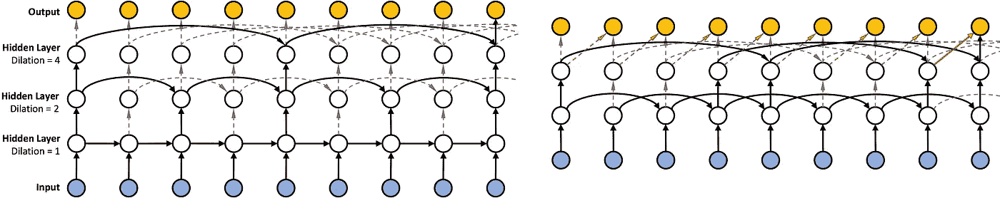
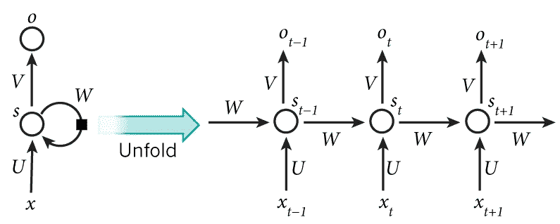

# 构建你自己的递归神经网络

> 原文：<https://towardsdatascience.com/recurrent-neural-networks-6b67535550ca?source=collection_archive---------8----------------------->

神经网络是一类模仿人脑的机器学习算法，而 [**递归神经网络**](https://en.wikipedia.org/wiki/Recurrent_neural_network) 是一个子类，可以很好地处理数据序列，如文本。

用一个普通的神经网络，你得到一组输入数据，让它通过网络，得到一组输出

为了训练深度学习模型，你需要知道模型应该理想地输出什么，这通常被称为你的标签或目标变量。神经网络将其输出的数据与目标进行比较，并更新网络学习以更好地模拟目标。

递归神经网络(RNNs)在建模序列数据中是有用的，序列数据涉及时间模式，如文本、图像字幕、ICU 患者数据等。这是一个简单的带反馈的前馈神经网络。在每个时间步，基于当前的输入和过去的输出，它生成新的输出。一个简单的递归神经网络架构看起来像:

rnn 比简单的前馈神经网络灵活得多。我们可以向 rnn 传递可变大小的输入，甚至得到可变大小的输出。例如，可以模拟 RNN 来一点一点地学习二进制加法。它学习二进制加法器的状态机图。经过训练后，我们只需向它传递两个任意大小的输入，它就可以生成正确的输出，而无需执行任何加法运算！RNN 能够自己隐含地学习这些语义。

为了让 RNNs 工作，需要大量的数据来找到一个好的模型，我尝试了各种 RNNs 架构，这些架构具有不同的层数、每层中隐藏单元的数量、序列长度和批量大小。所有这些超参数都应该根据数据集进行智能调整，否则可能会出现过度拟合或拟合不足的情况。生成的结果将严重依赖于数据，并且由于数据是从各种网站爬取的，因此有时可能会令人反感且不合适。

# 递归神经网络的步骤

# **初始化**

这是初始化权重的第一步，你可以用三种不同的方式初始化。

1)全零。

2)随机值(取决于激活函数)

3) Xavier 初始化:区间内的随机值从[-1/√n，1/√n]，
其中 n 为入局连接数

构建一个

# **正向传播**

前向传播的作用是穿过终点。

s_t=f(Ux_t+Ws_(t-1))

新状态

s_(t-1):旧状态

x_t:某一时间步的输入向量

函数 f 通常是非线性的，例如 **tanh** 或 **ReLU**

# 计算损失

寻找损失是训练的重要阶段损失函数决定了你的模型的状态让我们试试

交叉熵损失:

L(y，o)=-1/n∑_(n∈n)ࣼy _ nlog⁡(o_n)〗

# **随机梯度下降(SGD)**

这是优化你的模型的最流行的方法，SGD 是你分批发送输入而不是全部输入的方法，通过这种方法你可以很容易地缩放你的模型。

# **穿越时间的反向传播(BPTT)**

这是一种技术，在这种技术中，您将再次遍历到起点，并根据优化器的结果更新您的权重。

用于脚本生成的递归神经网络的实现

 [## karthiktsaliki/script _ generation _ rnn

### 训练了一个生成电视节目脚本的 rnn。

github.com](https://github.com/karthiktsaliki/script_generation_rnn/blob/master/dlnd_tv_script_generation.ipynb)