# Python 中的递归神经网络实例

> 原文：<https://towardsdatascience.com/recurrent-neural-networks-by-example-in-python-ffd204f99470?source=collection_archive---------0----------------------->


([Source](https://www.pexels.com/photo/agriculture-alternative-energy-clouds-countryside-414837/))

## 利用递归神经网络撰写专利摘要

当我第一次尝试研究递归神经网络时，我犯了一个错误，那就是试图先学习 LSTMs 和 GRUs 之类的东西背后的理论。在看了几天令人沮丧的线性代数方程后，我在用 Python 进行深度学习的[](https://www.manning.com/books/deep-learning-with-python)**中看到了下面这段话**

> **总之，你不需要了解 LSTM 细胞的具体架构的一切；作为一个人类，理解它不应该是你的工作。请记住 LSTM 细胞的作用:允许过去的信息在以后被重新注入。**

**这是库喀拉斯(Francois Chollet)的作者，深度学习方面的专家，他告诉我，我不需要理解基础水平的所有东西！我意识到我的错误是从理论的底层开始，而不是试图建立一个递归神经网络。**

> **此后不久，我改变了策略，决定尝试学习数据科学技术的最有效方法:找到问题并解决它！**

**这种[自上而下的方法](https://course.fast.ai/about.html)是指在 *之前学习*如何* ***实现*** *一种方法* ***回溯并覆盖* ***理论*** 。通过这种方式，我能够在前进的道路上找到我需要知道的东西，当我回来研究这些概念时，我有了一个框架，我可以将每个想法放入其中。在这种心态下，我决定不再担心细节，完成一个递归神经网络项目。*****

*本文介绍了如何在 Keras 中构建和使用递归神经网络来撰写专利摘要。这篇文章没有什么理论，但是当你完成这个项目的时候，你会发现你在这个过程中得到了你需要知道的东西。最终结果是，你可以构建一个有用的应用程序，并弄清楚自然语言处理的深度学习方法是如何工作的。*

*完整的代码可以从 GitHub 上的一系列 [Jupyter 笔记本中获得。我还提供了所有的](https://github.com/WillKoehrsen/recurrent-neural-networks)[预训练模型](https://github.com/WillKoehrsen/recurrent-neural-networks/tree/master/models)，这样你就不用自己花几个小时训练它们了！为了尽可能快地开始并研究模型，参见[循环神经网络快速入门](https://github.com/WillKoehrsen/recurrent-neural-networks/blob/master/notebooks/Quick%20Start%20to%20Recurrent%20Neural%20Networks.ipynb)，为了更深入的解释，参见[深入循环神经网络](https://github.com/WillKoehrsen/recurrent-neural-networks/blob/master/notebooks/Deep%20Dive%20into%20Recurrent%20Neural%20Networks.ipynb)。*

# *递归神经网络*

*在开始实现之前，至少理解一些基础知识是有帮助的。在高层次上，一个[递归神经网络](http://karpathy.github.io/2015/05/21/rnn-effectiveness/) (RNN)处理序列——无论是每日股票价格、句子还是传感器测量——一次一个元素，同时保留序列中先前出现的内容的*内存*(称为状态)。*

**循环*表示当前时间步的输出成为下一个时间步的输入。对于序列中的每个元素，模型不仅考虑当前的输入，还会考虑它对前面元素的记忆。*

*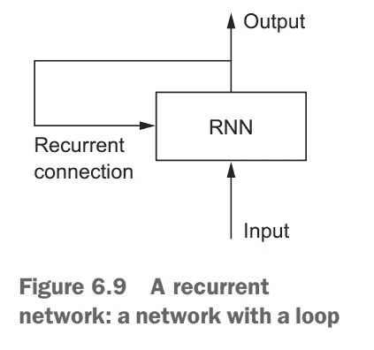*

*Overview of RNN ([Source](https://www.manning.com/books/deep-learning-with-python))*

*这种记忆使网络能够按顺序学习*长期依赖性*，这意味着它可以在进行预测时考虑整个上下文，无论是句子中的下一个单词、情感分类还是下一次温度测量。RNN 是为了模仿人类处理序列的方式而设计的:在形成反应时，我们会考虑整个句子，而不是单词本身。例如，考虑下面的句子:*

*"在乐队热身的前 15 分钟，音乐会很无聊，但随后就变得非常令人兴奋。"*

*一个孤立地考虑单词的机器学习模型——比如一个[单词包模型](https://en.wikipedia.org/wiki/Bag-of-words_model)——可能会得出这个句子是否定的结论。相比之下，RNN 人应该能够看到“但是”和“非常令人兴奋”这些词，并意识到句子从否定变成了肯定，因为它已经查看了整个序列。阅读一个完整的序列给我们一个处理其意义的环境，一个编码在循环神经网络中的概念。*

*RNN 的核心是由记忆细胞构成的一层。目前最受欢迎的细胞是[长短期记忆](https://en.wikipedia.org/wiki/Long_short-term_memory) (LSTM)，它保持细胞状态和进位，以确保信号(梯度的[形式的信息)在序列处理时不会丢失。在每个时间步，LSTM 考虑当前字、进位和单元状态。](https://stats.stackexchange.com/questions/185639/how-does-lstm-prevent-the-vanishing-gradient-problem)*

*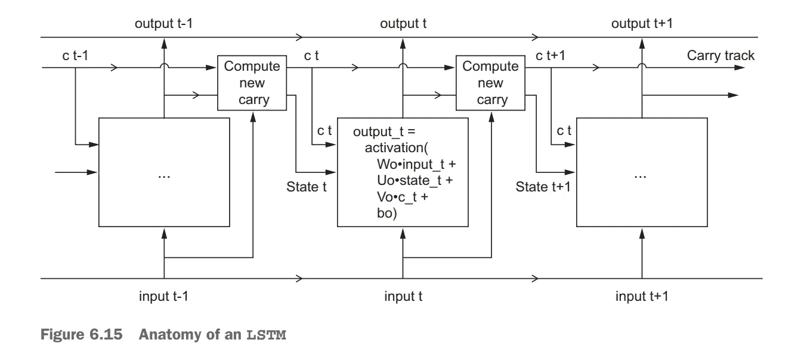*

*LSTM (Long Short Term Memory) Cell ([Source](https://www.manning.com/books/deep-learning-with-python))*

*LSTM 有 3 个不同的门和权重向量:有一个“忘记”门用于丢弃不相关的信息；一个“输入”门用于处理当前输入，一个“输出”门用于在每个时间步产生预测。然而，正如 Chollet 指出的，试图给细胞中的每一个元素赋予特定的含义是徒劳的。*

*每个单元元件的功能最终由在训练期间学习的参数(权重)决定。随意标记每个细胞部分，但它不是有效使用的必要条件！回想一下，用于[序列学习](https://machinelearningmastery.com/sequence-prediction-problems-learning-lstm-recurrent-neural-networks/)的递归神经网络的好处是它保持整个序列的记忆，防止先前的信息丢失。*

## *问题定式化*

*有几种方法我们可以制定的任务，训练 RNN 写文本，在这种情况下，专利摘要。但是，我们将选择将其训练为多对一序列映射器。也就是说，我们输入一系列单词，然后训练模型来预测下一个单词。在被传递到 LSTM 层之前，单词将被映射到整数，然后使用嵌入矩阵(预训练的或可训练的)被映射到向量。*

*当我们去写一个新的专利时，我们传入一个单词的起始序列，对下一个单词进行预测，更新输入序列，进行另一个预测，将这个单词添加到序列中，然后继续我们想要生成的单词。*

*该方法的步骤概述如下:*

1.  *将摘要从字符串列表转换为整数列表(序列)*
2.  *根据序列创建要素和标注*
3.  *使用嵌入层、LSTM 层和密集层构建 LSTM 模型*
4.  *加载预先训练的嵌入*
5.  *训练模型以预测下一步工作*
6.  *通过传入起始序列进行预测*

*请记住，这只是问题的一种表述:我们还可以使用字符级模型，或者对序列中的每个单词进行预测。正如机器学习中的许多概念一样，没有一个正确的答案，但这种方法在实践中效果很好。*

# *数据准备*

*即使神经网络具有强大的表示能力，获得高质量、干净的数据集也是至关重要的。这个项目的原始数据来自 [USPTO PatentsView](http://www.patentsview.org/querydev/) ，在这里你可以搜索在美国申请的任何专利的信息。我搜索了“神经网络”这个词，并下载了由此产生的专利摘要——总共 3500 篇。我发现最好在一个狭窄的主题上进行训练，但也可以尝试不同的专利。*

*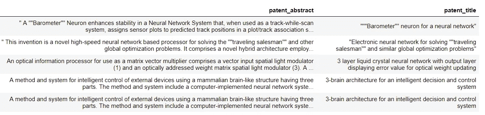*

*Patent Abstract Data*

*我们将从专利摘要作为字符串列表开始。我们模型的主要数据准备步骤是:*

1.  *删除标点符号，将字符串拆分成单个单词的列表*
2.  *将单个单词转换成整数*

*这两个步骤都可以使用 [Keras](https://keras.io/preprocessing/text/#tokenizer) `[Tokenizer](https://keras.io/preprocessing/text/#tokenizer)`类来完成。默认情况下，这会删除所有标点符号，小写单词，然后将单词转换为整数的`sequences`。一个`Tokenizer`首先是一个字符串列表上的`fit`，然后将这个列表转换成一个整数列表的列表。下面演示了这一点:*

*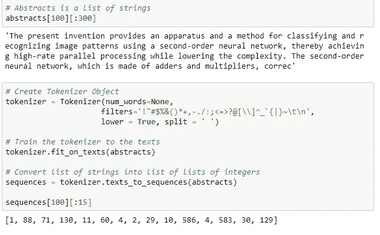*

*第一个单元的输出显示原始摘要，第二个单元的输出显示标记化序列。每个抽象现在都表示为整数。*

*我们可以使用经过训练的记号赋予器的`idx_word`属性来计算这些整数的含义:*

*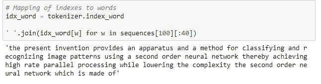*

*如果你仔细观察，你会注意到`Tokenizer`去掉了所有的标点符号，所有的单词都变成了小写。如果我们使用这些设置，那么神经网络将不会学习正确的英语！我们可以通过将过滤器更改为`Tokenizer`来调整这一点，以便不删除标点符号。*

```
*# Don't remove punctuation or uppercase
tokenizer = Tokenizer(num_words=None, 
                     filters='#$%&()*+-<=>@[\\]^_`{|}~\t\n',
                     lower = False, split = ' ')*
```

*查看不同实现的笔记本，但是，当我们使用预先训练的嵌入时，我们必须删除大写字母，因为嵌入中没有小写字母。当训练我们自己的嵌入时，我们不必担心这一点，因为模型将学习小写和大写的不同表示。*

# *功能和标签*

*前一步将所有摘要转换成整数序列。下一步是创建一个有监督的机器学习问题，用它来训练网络。有许多方法可以为文本生成设置递归神经网络任务，但我们将使用以下方法:*

> *给网络一个单词序列，训练它预测下一个单词。*

*单词数作为参数留下；在这里显示的例子中，我们将使用 50，这意味着我们给我们的网络 50 个单词，并训练它预测第 51 个单词。训练网络的其他方法是让它预测序列中每一点的下一个单词——对每个输入单词进行预测，而不是对整个序列进行一次预测——或者使用单个字符训练模型。这里使用的实现不一定是最佳的——没有公认的最佳解决方案——*但是它工作得很好*！*

*创建特征和标签相对简单，对于每个抽象(用整数表示)，我们创建多组特征和标签。我们使用前 50 个单词作为特征，第 51 个单词作为标签，然后使用单词 2-51 作为特征，预测第 52 个单词，依此类推。这给了我们更多的训练数据，这是有益的，因为网络的[性能与它在训练期间看到的数据量](https://research.google.com/pubs/archive/35179.pdf)成比例。*

*创建要素和标注的实现如下:*

*这些特征以形状`(296866, 50)`结束，这意味着我们有将近 300，000 个序列，每个序列有 50 个标记。在递归神经网络的语言中，每个序列有 50 个*时间步*，每个时间步有 1 个特征。*

*我们可以将标签保留为整数，但是当标签被一次性编码时，神经网络能够最有效地训练。我们可以使用下面的代码非常快速地用`numpy`对标签进行一次性编码:*

*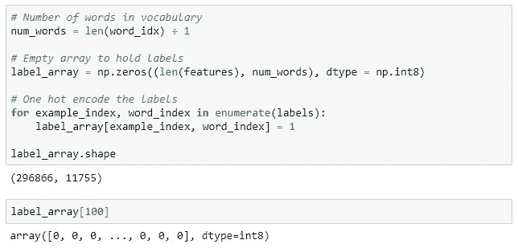*

*为了找到与`label_array`中的一行相对应的单词，我们使用:*

*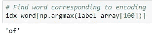*

*在正确格式化我们所有的特性和标签之后，我们希望将它们分成一个训练集和一个验证集(详见笔记本)。这里很重要的一点是同时改变特性和标签，这样相同的摘要就不会出现在同一个集合中。*

# *构建递归神经网络*

*Keras 是一个不可思议的库:它允许我们用几行可理解的 Python 代码构建最先进的模型。虽然[其他神经网络库可能更快或更灵活](https://deepsense.ai/keras-or-pytorch/)，但在开发时间和易用性方面，没有什么能胜过 Keras。*

*下面是一个简单 LSTM 的代码，并附有解释:*

*我们正在使用 Keras `Sequential` API，这意味着我们一次构建一层网络。这些层如下所示:*

*   *一个将每个输入单词映射到 100 维向量的`Embedding`。嵌入可以使用我们在`weights`参数中提供的预训练权重(一秒钟内更多)。如果我们不想更新嵌入，可以设置`False`。*
*   *一个`Masking`层，用于屏蔽任何没有预训练嵌入的单词，这些单词将被表示为全零。训练嵌入时不应使用该层。*
*   *网络的核心:一层`LSTM` 单元，带有[脱落以防止过拟合](https://machinelearningmastery.com/dropout-regularization-deep-learning-models-keras/)。由于我们只使用一个 LSTM 层，它*不会*返回序列，对于使用两个或更多层，请确保返回序列。*
*   *激活`relu`的全连接`Dense`层。这为网络增加了额外的表示能力。*
*   *一个`Dropout`层，用于防止过度拟合训练数据。*
*   *一个`Dense`全连接输出层。这为使用`softmax`激活的 vocab 中的每个单词产生一个概率。*

*该模型使用`Adam`优化器(随机梯度下降的变体)进行编译，并使用`categorical_crossentropy`损失进行训练。在训练期间，网络将试图通过调整可训练参数(权重)来最小化日志损失。与往常一样，使用[反向传播](http://neuralnetworksanddeeplearning.com/chap2.html)计算参数的梯度，并用优化器更新。因为我们正在使用 Keras，所以我们不用担心这是如何在幕后发生的,,只需要正确设置网络。*

*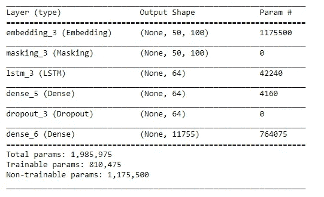*

*LSTM network layout.*

*在不更新嵌入的情况下，网络中需要训练的参数要少得多。[对](https://machinelearningmastery.com/reshape-input-data-long-short-term-memory-networks-keras/) `[LSTM](https://machinelearningmastery.com/reshape-input-data-long-short-term-memory-networks-keras/)` [层的输入是](https://machinelearningmastery.com/reshape-input-data-long-short-term-memory-networks-keras/) `[(None, 50, 100)](https://machinelearningmastery.com/reshape-input-data-long-short-term-memory-networks-keras/)` [这意味着](https://machinelearningmastery.com/reshape-input-data-long-short-term-memory-networks-keras/)对于每一批(第一维)，每个序列有 50 个时间步长(字)，每个时间步长在嵌入后有 100 个特征。LSTM 图层的输入总是具有`(batch_size, timesteps, features)`形状。*

*构建这个网络有很多方法，笔记本中还介绍了其他几种方法。例如，我们可以使用两个相互堆叠的`LSTM`层，一个处理来自两个方向的序列的`Bidirectional LSTM`层，或者更多的`Dense`层。我发现上面的设置运行良好。*

## *预训练嵌入*

*一旦网络建立起来，我们仍然需要为它提供预先训练好的单词嵌入。你可以在网上找到许多在不同语料库(大量文本)上训练过的嵌入。我们将使用的是斯坦福提供的[，有 100、200 或 300 种尺寸(我们将坚持 100)。这些嵌入来自](https://nlp.stanford.edu/data/) [GloVe(单词表示的全局向量)](https://nlp.stanford.edu/projects/glove/)算法，并在维基百科上进行训练。*

*即使预训练的嵌入包含 400，000 个单词，我们的 vocab 中也包含一些单词。当我们用嵌入来表示这些单词时，它们将具有全零的 100 维向量。这个问题可以通过训练我们自己的嵌入或者通过将`Embedding`层的`trainable`参数设置为`True`(并移除`Masking`层)来解决。*

*我们可以从磁盘中快速加载预训练的嵌入，并使用以下代码创建一个嵌入矩阵:*

*这是给 vocab 中的每个单词分配一个 100 维的向量。如果单词没有预先训练的嵌入，那么这个向量将全为零。*

*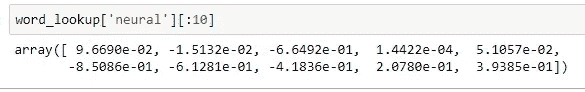*

*为了探索嵌入，我们可以使用余弦相似度来在嵌入空间中找到与给定查询词最接近的词:*

*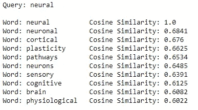*

*[嵌入是被学习的](/neural-network-embeddings-explained-4d028e6f0526)，这意味着表征专门应用于一个任务。当使用预先训练的嵌入时，我们希望嵌入所学习的任务足够接近我们的任务，所以嵌入是有意义的。如果这些嵌入是在 tweets 上训练的，我们可能不会期望它们工作得很好，但是因为它们是在 Wikipedia 数据上训练的，它们应该普遍适用于一系列语言处理任务。*

*如果您有大量的数据和计算机时间，通常最好学习自己的特定任务的嵌入。在笔记本中，我采用了两种方法，学习到的嵌入表现稍好。*

# *训练模型*

*随着训练和验证数据的准备、网络的构建和嵌入的加载，我们几乎已经为模型学习如何编写专利摘要做好了准备。然而，在训练神经网络时，最好使用[模型检查点和 Keras 回调形式的早期停止](https://keras.io/callbacks/):*

*   *模型检查点:在磁盘上保存最佳模型(通过验证损失来衡量),以便使用最佳模型*
*   *提前停止:当验证损失不再减少时，停止训练*

*使用[提前停止](https://stats.stackexchange.com/questions/231061/how-to-use-early-stopping-properly-for-training-deep-neural-network)意味着我们不会过度适应训练数据，也不会浪费时间训练那些不会提高性能的额外时期。模型检查点意味着我们可以访问最好的模型，如果我们的训练被中断 1000 个纪元，我们也不会失去所有的进展！*

*然后，可以使用以下代码训练该模型:*

*在一个 [Amazon p2.xlarge 实例](https://aws.amazon.com/ec2/instance-types/p2/)(0.90 美元/小时的预订)上，完成这个任务需要 1 个多小时。一旦训练完成，我们可以加载回最佳保存的模型，并评估验证数据的最终时间。*

```
*from keras import load_model# Load in model and evaluate on validation data
model = load_model('../models/model.h5')
model.evaluate(X_valid, y_valid)*
```

*总体而言，使用预训练单词嵌入的模型实现了 23.9%的验证准确率。考虑到作为一个人，我发现很难预测这些摘要中的下一个词，这很好！对最常见的单词(“the”)的简单猜测产生了大约 8%的准确度。笔记本中所有型号的指标如下所示:*

*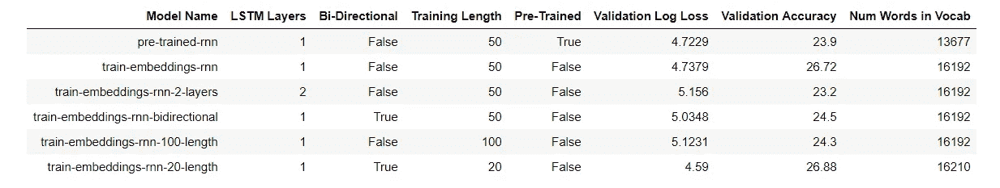*

*最佳模型使用预先训练的嵌入和如上所示的相同架构。我鼓励任何人尝试用不同的模式训练！*

# *专利摘要生成*

*当然，虽然高指标很好，但重要的是网络是否能产生合理的专利摘要。使用最佳模型，我们可以探索模型生成能力。如果你想在你自己的硬件上运行这个，你可以在这里找到[笔记本](https://github.com/WillKoehrsen/recurrent-neural-networks/blob/master/notebooks/Exploring%20Model%20Results.ipynb)，在 GitHub 上找到[预训练模型](https://github.com/WillKoehrsen/recurrent-neural-networks/tree/master/models)。*

*为了产生输出，我们用从专利摘要中选择的随机序列作为网络的种子，让它预测下一个单词，将预测添加到序列中，并继续预测我们想要的任意多个单词。一些结果如下所示:*

*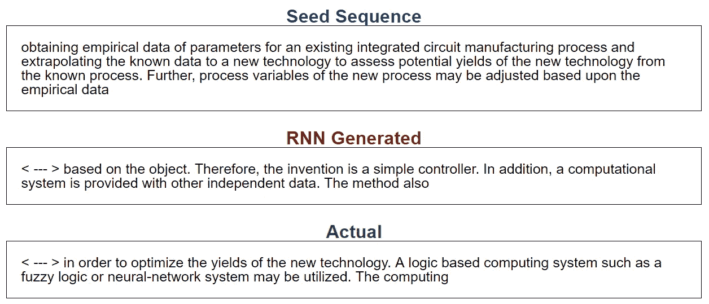*

*输出的一个重要参数是[预测](https://medium.com/machine-learning-at-petiteprogrammer/sampling-strategies-for-recurrent-neural-networks-9aea02a6616f)的*差异*。我们不是使用概率最高的预测单词，而是将多样性注入到预测中，然后选择概率与更多样的预测成比例的下一个单词。多样性太高，生成的输出开始看起来是随机的，但太低，网络会进入输出的递归循环。*

*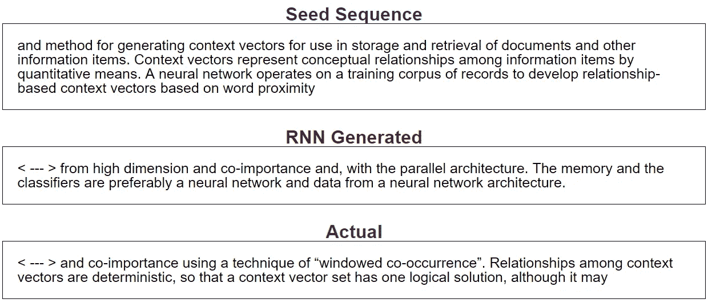*

*输出还不算太差！有时很难确定哪些是计算机生成的，哪些是机器生成的。这部分是由于专利摘要的[本质，大多数时候，它们听起来不像是人类写的。](http://www.wipo.int/standards/en/pdf/03-12-a.pdf)*

*网络的另一个用途是用我们自己的启动序列来播种它。我们可以使用任何我们想要的文本，看看网络会把它带到哪里:*

*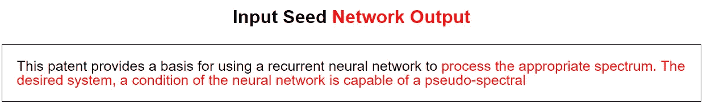*

*同样，结果并不完全可信，但它们确实很像英语。*

## *人还是机器？*

*作为递归神经网络的最终测试，我创建了一个游戏来猜测是模型还是人产生了输出。这是第一个例子，其中两个选项来自计算机，一个来自人类:*

*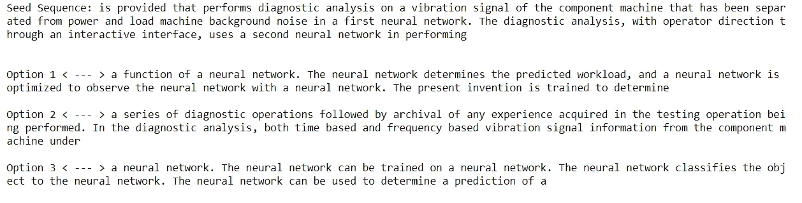*

*你的猜测是什么？答案是第*秒*是一个人写的实际摘要(嗯，它是摘要中的实际内容。我不确定这些摘要是人写的)。这里还有一个:*

*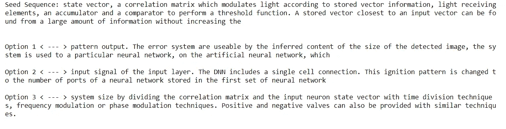*

*这一次*第三部*有了一个有血有肉的作家。*

*我们可以使用额外的步骤来解释该模型，例如发现哪些神经元随着不同的输入序列而变亮。我们还可以查看学习到的嵌入(或者用[投影工具](https://projector.tensorflow.org)可视化它们)。我们将在另一个时间讨论这些话题，并得出结论，我们现在知道如何实现一个递归神经网络来有效地模仿人类文本。*

# *结论*

*认识到递归神经网络没有语言理解的概念是很重要的。它实际上是一台非常复杂的模式识别机器。然而，与马尔可夫链或频率分析等方法不同，rnn 基于序列中元素的*排序进行预测。从哲学角度来看，[你可能会认为人类只是极端的模式识别机器](https://bigthink.com/endless-innovation/humans-are-the-worlds-best-pattern-recognition-machines-but-for-how-long)，因此递归神经网络只是像人类机器一样工作。**

*递归神经网络的用途远远不止文本生成，还包括[机器翻译](https://machinelearningmastery.com/encoder-decoder-recurrent-neural-network-models-neural-machine-translation/)、[图像字幕](https://cs.stanford.edu/people/karpathy/sfmltalk.pdf)和[作者身份识别](https://arxiv.org/ftp/arxiv/papers/1506/1506.04891.pdf)。虽然我们在这里讨论的这个应用程序不会取代任何人类，但可以想象，随着更多的训练数据和更大的模型，神经网络将能够合成新的、合理的专利摘要。*

*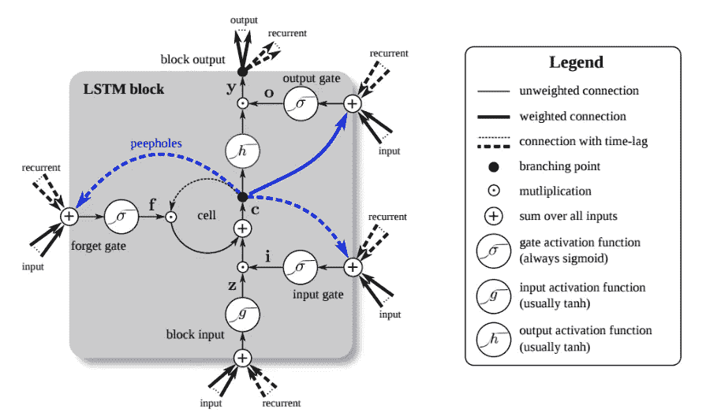*

*A Bi-Directional LSTM Cell ([Source](https://developer.nvidia.com/discover/lstm))*

*人们很容易陷入复杂技术背后的细节或理论，但学习数据科学工具的更有效方法是[深入研究并构建应用](https://github.com/DOsinga/deep_learning_cookbook)。一旦你知道了一项技术的能力以及它在实践中是如何工作的，你就可以随时回头去了解这个理论。我们大多数人不会设计神经网络，但学习如何有效地使用它们是值得的。这意味着收起书本，打破键盘，编写你自己的网络。*

*一如既往，我欢迎反馈和建设性的批评。可以通过推特 [@koehrsen_will](http://twitter.com/@koehrsen_will) 或者通过我的网站 [willk.online](https://willk.online) 找到我。*