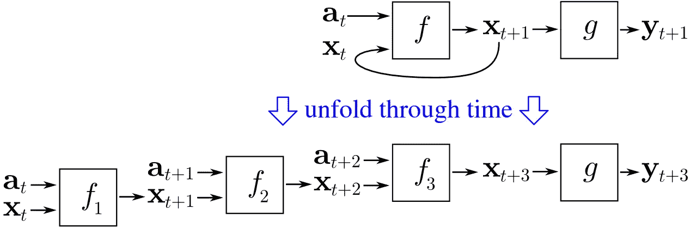
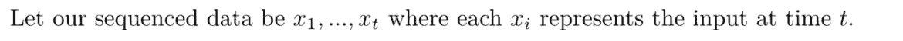
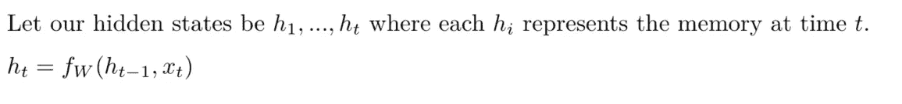

# 用于语言理解的递归神经网络

> 原文：<https://towardsdatascience.com/recurrent-neural-networks-for-language-understanding-10c649f8ac15?source=collection_archive---------12----------------------->

递归神经网络(RNNs)已经被认为在机器翻译、情感分析、语音识别和许多其他机器学习任务中实现了最先进的性能。它们的优势在于处理顺序数据和各种长度的输入输出的能力。

这些神奇的网络并不新鲜。事实上，它们是在 20 世纪 80 年代开发的——但是比非递归神经网络的计算成本更高，直到(相对)最近计算资源的改进，RNNs 才开始流行。

本文将在 NLP 的背景下介绍递归神经网络。

## 从序列数据中学习

前馈神经网络假设所有输入都是相互独立的。虽然对于许多分类任务来说，这是一个合理的假设，但它无法捕捉到在顺序数据中发现的关系。

在顺序数据中，顺序很重要。以文字为例。我们通过每一个单词来发展对文本的理解。我们必须按顺序处理课文，并结合之前所学的知识处理每个单词，以形成正确的理解。

递归神经网络通过使用先前学习的信息来预测下一个输出，从而缓解了这个问题。在语言环境中，RNNs 将从前面的单词中学到的信息存储在“记忆”中，并使用这些知识来更好地理解下一个单词。

Language is a puzzle! Words needs to be pieced together for us to see the big picture.

内存的使用也允许 rnn 处理不同长度的序列。这在诸如机器翻译等我们不知道输入和输出有多长的任务中特别有用。

以下是 RNNs 可以使用的几种输入/输出配置:

*   **一对一网络:**香草神经网络接受一个向量作为输入，返回一个向量作为输出。rnn 也可以这样配置。
*   **多对一网络:**RNN 也可以接受几个向量作为输入来模拟顺序关系，但返回一个向量作为输出。
*   **多对多网络:**一个 RNN 也可以接受多个向量作为输入，返回多个向量作为输出。

## 不同输入/输出配置的示例

**一对一:**我们对基于毒性的聊天室消息分类感兴趣。我们决定最好的嵌入技术将基于频率，并选择使用 TF-IDF 将每个消息嵌入到一个向量中。输出也是一个向量，每个坐标对应于每个类。

**多对一:**我们认为基于频率嵌入聊天室消息是个坏主意，而且单词的顺序很重要。因此，我们通过使用预先训练的 word2vec 模型，将消息中的每个单词嵌入到它自己的向量中。模型输出不会改变。

**多对多:**我们已经超越了简单的文本分类器，开始训练一个 RNN 来翻译英语和法语之间的信息。在这种情况下，单词的顺序当然很重要。我们将英语输入编码成几个向量(每个词一个向量)，并使用输出向量来确定法语翻译的顺序。

## 训练递归神经网络

从传统的神经网络训练 RNN 的区别在于更新权重的方式。在 RNN 中更新权重最常用的方法是**通过时间反向传播(BPTT)。**

回想一下用于训练普通神经网络的梯度下降算法:

1.  **初始化重量**
2.  使用权重从输入生成输出(输出计算为输入的加权和)
3.  **使用激活功能转换输出**
4.  计算**输出误差**(转换输出和目标之间的差值)
5.  **反向传播误差**使用偏导数寻找梯度
6.  通过**梯度下降**更新权重
7.  重复步骤 2-6，直到满足某个停止标准

当执行 BPTT 时，我们需要将我们的网络“展开”成按时间步长分解的层。

**注:**我们经常把顺序数据分解成“时间步长”。第一个数据点将是时间 1 的输入，依此类推。

Wikipedia illustration of BPTT

在展开我们的循环层之后，我们剩下看起来像几个非循环层的东西。与上述算法的唯一不同之处在于:

1.  渐变是通过跨所有展开的层而不是一个层反向传播而生成的。总损失计算为所有时间步长的平均损失。
2.  权重由所有展开的层共享。它们在最后使用累积的梯度进行更新。

## 使用递归神经网络

如果我们正在处理文本数据，其中每个单词都映射到它自己的向量，那么每个单词都将是一个单独的数据点。

使用关于网络权重 w 的函数来计算隐藏状态。该函数的参数是先前的隐藏状态和当前时间步长的输入向量。 [Tanh](https://en.wikipedia.org/wiki/Hyperbolic_function) 和 [ReLU](https://en.wikipedia.org/wiki/Rectifier_(neural_networks)) 是一些常用的计算隐藏状态的函数。

我们通过使用权重来计算输出，以获得最后隐藏状态的加权和。这些输出可以用来进行预测或生成新的序列。

## 对消失/爆炸梯度的关注

类似于非常深的前馈神经网络，rnn 容易受到通过反向传播的消失/爆炸梯度的影响(回想一下，一个递归层被展开成许多非递归层)。

幸运的是，有几种方法可以解决这些问题。

**消失渐变:**

*   使用门控机制，以便不是所有的隐藏状态都被存储。这是通过替代 RNN 单位完成的，如 [LSTM](https://en.wikipedia.org/wiki/Long_short-term_memory) 和 [GRU](https://en.wikipedia.org/wiki/Gated_recurrent_unit) 。
*   使用 ReLU 作为激活功能

**爆炸渐变:**

*   [渐变裁剪](http://theai.wiki/Gradient%20Clipping):设置渐变值的最大阈值；剪裁阈值以上所有渐变

## 结论

尽管有额外的训练复杂性，RNNs 在机器学习中已经变得非常流行。在 NLP 之外，递归神经网络也被用于视频分类、语音识别和时间序列数据中的异常检测。

# 感谢您的阅读！

如果你喜欢这篇文章，可以看看我关于数据科学、数学和编程的其他文章。[通过 Medium](https://medium.com/@mandygu) 关注我的最新更新。😃

作为一个业余爱好项目，我还在[www.dscrashcourse.com](http://www.dscrashcourse.com/)建立了一套全面的**免费**数据科学课程和练习题。

如果你想支持我的写作，下次你报名参加 Coursera 课程时，可以考虑使用我的会员链接。完全公开—我从每一次注册中获得佣金，但不会对您产生额外费用。

再次感谢您的阅读！📕