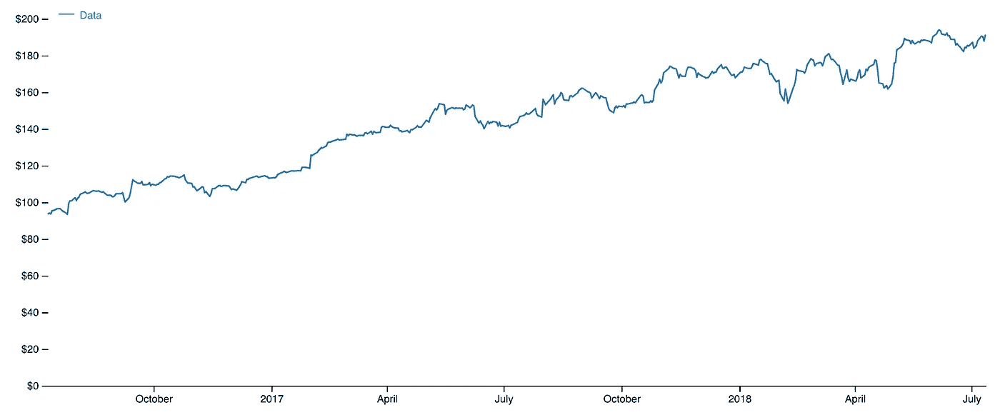
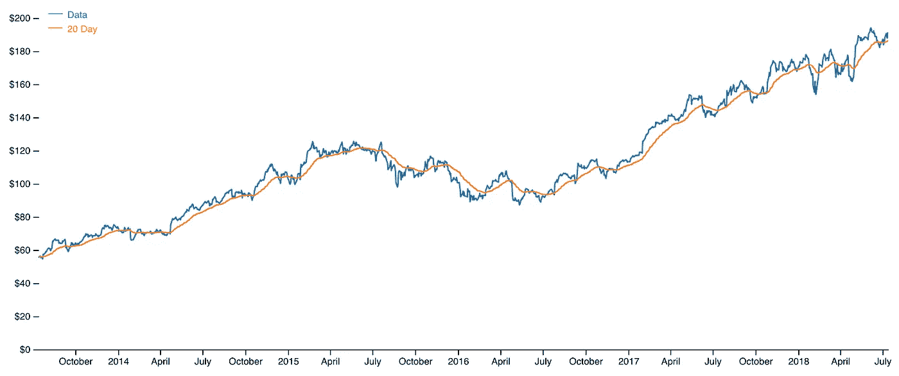
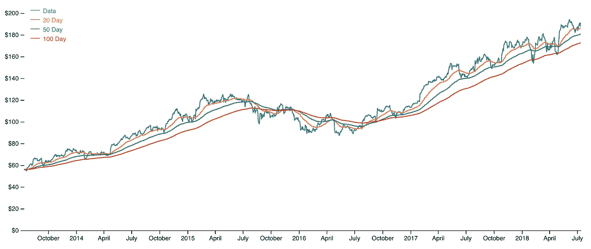

# 用 Ramda 进行递归滚动计算

> 原文：<https://towardsdatascience.com/recursive-rolling-calculations-with-ramda-adf494958a37?source=collection_archive---------23----------------------->

## 在函数式编程范式中使用递归来创建移动平均值很有趣


Image by stokpic via Pixabay.com (https://pixabay.com/users/stokpic-692575/)

对于对随时间波动的数据集感兴趣的人来说，滚动平均或移动平均是最受欢迎的趋势指标之一。对于交易者来说尤其如此，他们总是在金融市场的不断变化中努力解读趋势信号。

本文面向具有数据科学背景，并且有兴趣学习更多关于函数式编程方法的人。递归是一个需要花费一些时间和思想来理解的概念，所以我想展示一个在现实世界中使用递归的实用方法。

我的主要目标是使用递归的函数方法而不是“for 循环”来计算移动平均线(特别是指数移动平均线)。我将非常依赖 Ramda.js，这是一个非常有用的函数式 Javascript 库。

## 递归

我假设这篇文章的读者熟悉移动平均线，所以让我们直接跳到递归。这个帖子的灵感直接来源于[这篇文章](https://medium.com/ventre-tech/recursion-made-simple-with-roman-numerals-4ae3cab27755)和[这篇文章](https://medium.com/ventre-tech/haskells-triangle-or-more-fun-with-recursion-9350155689ac)。在 Google 中输入“递归”会得到如下定义:

> 递归过程或定义的重复应用

这是一个递归定义——酷！

递归函数是根据自身定义的函数。考虑递归函数的另一种方式是，它调用自己——直到它不调用为止。运行`const squareMe = n => squareMe(n*n)`会一遍又一遍的运行，迅速吹爆你的调用栈。

这就是为什么我们需要一个“基本情况”，这是一个定义函数何时终止的条件。

此外，递归函数实际上需要调用自身，这被称为“递归”

最后，为了做任何有用的事情，递归函数需要有一个“动作”

为了演示递归函数的这三个组成部分，让我们编写一个从 1 数到给定数字的函数:

```
// ES6
const countTo = (num, arr=[], startingN=1) => {
  // Base case:
  if (arr.length === num) return arr;
  // Recursion and action:
  return countTo(num, arr.concat(startingN), startingN + 1); 
};
```

调用`countTo(10)`返回`[1, 2, 3, 4, 5, 6, 7, 8, 9, 10]`，通过调用动作(`arr.concat`和`startingN+1`)递归调用自身，直到遇到基本情况`arr.length === num`时终止。

耶！没有循环了！

递归是 for 循环的一种替代方法，也是一种更实用的遍历数据集以获得所需结果的方法。

## 拉姆达

Ramda.js 是一个轻量级的、功能性的 Javascript 库，它是为那些希望保持代码纯净和功能性、函数不可变和没有副作用的人而设计的。哦，还有*数据排在最后*——这样更好。

# 简单移动平均线

让我们从一系列数字的简单移动平均开始:

```
//ES6
import R from 'ramda';const sma = (num, data, arr = []) => {
  if (data.length === 0) return arr;
  if (data.length < num) return sma(
    num,
    data.slice(1), 
    R.prepend('not yet!', arr),
  );
  const newData = R.tail(data);
  const movingMean = R.mean(
    R.slice(0, num, data)
  );
  return sma(
    num,
    newData,
    R.append(movingMean, arr)
  );
};
```

这个功能有三个部分。

一旦`data`参数的长度达到 0，第一个`if`语句就返回`arr`。这是“基本情况”。

当`data`参数的长度小于`num`参数的长度时，第二个`if`语句递归调用`sma`，使用 Ramda 的`prepend`添加‘还没有！’串到`arr`前面。

最后的`return`语句是这个函数的核心。它将 Ramda 的`mean`函数应用于`newData`的适当元素，每次返回一个新的`arr`并附加平均值。

这里要强调的最后一点是，每次函数调用自己时，它是如何在`newData`上这样做的，它只是返回`data`而没有第一个元素(`R.tail`)。让我们在每个`return`语句之前添加一个`console.log`语句，这样我们就可以确切地看到`sma`内部发生了什么:

这显示了调用`sma`时的确切情况。在该函数第一次运行后，它返回一个带有首字母`data`的前三个数字的平均值的`arr`的副本。该函数第二次运行时，将返回第一个元素被切掉的`arr`副本的前三个数字的平均值。

你明白了！

注意，在递归过程的最后，`'not yet'`字符串必须加在`arr`的前面。此外，由于这些是占位符，我们没有得到实际值，这就引出了本文的下一步:指数移动平均线。

# 指数移动平均线

到目前为止，我们已经介绍了递归的基本知识，并在 Ramda 的帮助下，将它们应用于创建一个简单的列表移动平均值。

让我们以不同的方式处理这个概念，将它应用到现实世界的情况中。我们将使用 IEX API 从股票交易所获取一些纵向数据:

这个函数从 IEX 交易 API 获取 AAPL 数据，并返回一个带有`date`和`value`的对象列表。该数据集的图表如下所示:



Image by author

现在，我们需要编写一个函数，给出这个数据集的指数加权移动平均，为此，我们将使用吴恩达在这里提出的指数加权移动平均。把它写成一个 javascript 函数看起来是这样的【第 8 行】:

哇哦。让我们把这个拆开。

首先，`ewa`有两个参数- `decay`是您想要权衡的天数，而`data`是您想要操作的对象列表。接下来，`ewa`定义了`beta`，它是使用一点指数代数从`decay`计算出来的，本质上控制算法的平滑。

函数`checkArr`是算法的神奇之处。在`ewa`的第一次迭代中，`arr`为空，因此`checkArr`只是将新`arr`的第一个元素的`value`设置为`data`[第 7 行]中的第一个`value`。没有之前的数据点来指数加权！在其余的`ewa`递归调用中，`checkArr`返回算法中由`beta`控制的加权值，因为`arr`不再为空。

现在，我们可以在图表中添加一个`ewa(20, getData())`:



Image by author

## 更多拉姆达！

在函数式编程中,“curried”函数是这样一种函数，如果提供的参数少于它所需要的参数，它将返回一个采用剩余参数的新函数。当您需要编写新函数时，这种技术非常有用。让我们使用拉姆达的`curry`函数来创建一堆不同的`ewa`函数:

```
const curriedEwa = R.curry(ewa);const ewaTwenty = curriedEwa(20);const ewaFifty = curriedEwa(50);const ewaHundred = curriedEwa(100);
```

现在，将`ewaTwenty`、`ewaFifty`和`ewaHundred`制成图表给我们看:



Image by author

函数式编程 FTW！

这里有很多内容，我希望我已经帮助展示了递归和 Ramda 是多么有用。如果你还不熟悉这些概念，你可能需要一段时间来理解它们(至少对我来说是这样)。然而，我已经建立了一个[可观察笔记本](https://beta.observablehq.com/@johnwcothran/a-recursive-rolling-average-function-with-ramdajs)，在那里你可以深入探究这篇文章中的代码。