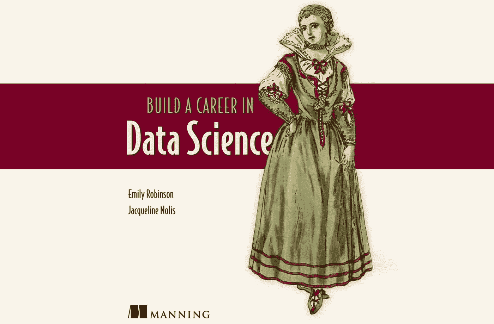

# 数据科学面试中的危险信号

> 原文：<https://towardsdatascience.com/red-flags-in-data-science-interviews-4f492bbed4c4?source=collection_archive---------1----------------------->

*这篇文章是与 Warby Parker 的数据科学家* [*艾米丽·罗宾逊*](http://hookedondata.org/) *共同撰写的。我和她还写了一本相关的书:* [*打造你的数据科学生涯*](http://bestbook.cool) *。*

在面试任何职位时，你应该像他们评价你一样评价这家公司。虽然你可以在 glassdoor 和类似的网站上预先研究这家公司，但面试是更深入了解这家公司并提出重要问题的最佳途径。公司永远不会直接告诉你他们不适合工作，所以你必须自己寻找迹象。

以下是我们列出的 12 个迹象，你面试的公司应该避免这些迹象(以及面试时应该问的问题)。前六个主要适用于已经拥有多名数据科学家或分析师的公司。如果你正考虑加入一家公司，成为他们的第一位数据科学家，你将面临一系列完全不同的挑战，包括很可能要做大量的数据工程工作(见标志 1)和传播数据科学思维。必须有人去做，但我们通常不建议你在第一份数据科学工作中这样做，除非你有工程背景，并且想做这项工作。如果只有一个数据科学领导者，并且他们正在建立一个团队，询问他们计划如何处理下面提出的问题，但请记住，承诺一个理想的系统总是比实现一个更容易。

# 数据科学团队如何运行的危险信号

## 1.没有数据工程或基础设施。

数据科学要求数据易于分析。如果公司没有一个维护良好的数据基础设施，您就没有工作所需的东西。数据工程师是为分析准备数据的人，如果你的公司没有数据，你就必须自己做这项工作。如果你觉得自己有资格担当数据工程师的角色，这可能没问题，但否则你将很难交付任何有价值的东西。

*面试时要问的问题:您的数据基础架构是什么样的，由谁维护？数据通常采用什么格式(Excel、SQL 数据库、csv)？*

## 2.数据科学家之间没有同行评审。

一个强大的数据科学团队将有办法确保错误不会从缝隙中溜走。这些可以包括代码审查、实践演示，以及与团队的一致检入。如果团队没有始终如一地做这些，直到工作已经交付，错误才会被发现，这通常以某人受到斥责而告终。

*要问的问题:团队采取什么步骤进行 QA 和同行评审？*

## 3.团队中没有标准的语言。

许多数据科学团队采取的方法是让团队中的任何人使用他们想要的任何语言。这个想法是，如果每个人都使用他们最喜欢的语言，工作将会完成得更快。这有一个巨大的问题:当每个人都使用不同的语言时，没有人能够把工作交给其他人。每项数据科学任务都将有一个人负责，如果他们辞职、生病或只是需要帮助，没有人能够做到这一点，这将创造一个非常紧张的环境。使用 R，Python，甚至我们敢说 SAS 都没问题，但是团队中要有一套一致的语言。

要问的问题:你的团队使用什么语言，你如何决定是否采用一种新的语言？

## 4.他们不了解[需求](https://hackernoon.com/the-ai-hierarchy-of-needs-18f111fcc007)的数据层次。

类似于没有数据基础设施，一些公司在没有基础的情况下对人工智能等概念感到非常兴奋。机器学习和人工智能要求一家公司具有高水平的数据科学成熟度，包括理解如何建立模型、模型的局限性以及如何部署模型。当他们不切实际的期望变成现实时，你可能会受到责备。

*要问的问题:公司如何平衡花费在人工智能等复杂方法上的时间与清理数据、检查数据质量和添加日志记录等基础工作？*

## 5.没有版本控制。

成熟的数据科学团队使用 git 来跟踪分析和代码的变化。其他团队则使用共享网络文件夹之类的方法，这种方法不会让您看到什么时候发生了变化，为什么会发生变化，或者以前的版本。有时候，团队根本不共享代码，只是在数据科学家的个人笔记本电脑上工作。像躲避瘟疫一样避开最后这些群体。没有共享代码的方法意味着团队不能一起工作。

要问的问题:如何在团队中共享代码？所有代码都是共享的还是只有一部分？

## 6.运行报告的人和进行分析的人之间没有明确的界限。

创建和维护报告、构建数据科学模型以及将机器学习模型投入生产所需的技能都是不同的。如果公司没有一个明确的方法来确定谁做什么工作，你可能开始你的工作，并最终做完全不同于你预期的工作。你不会希望在第一天上班时，期望建立一个时间序列预测，然后发现你的工作是刷新每月的销售 Excel 电子表格。

*提问:报告、分析和生产模型构建任务是如何划分的？*

# 他们如何重视人的危险信号

## 1.完全没有结构的面试过程。

结构化面试流程意味着每个候选人都会得到一套相同的问题，可以更加平等地进行比较。这不仅能减少偏见(https://HBR . org/2016/04/how-to-take-the-bias-out-of-interview),还要求团队仔细考虑他们带来的人身上什么是重要的。如果面试过程是无组织的，面试官似乎会不假思索地问一些问题，那么这是一个强烈的信号，表明他们还没有弄清楚自己想要一个什么样的候选人，以及如何得到它。如果他们不知道自己想要什么，你就很难在工作中给他们想要的。

*建议:看看他们是否带了一系列问题去面试，或者问他们如何选择问你什么的元问题。*

## 2.没时间回答你的问题。

因为面试也是为了让你了解公司，你需要有时间这样做。如果你没有时间问问题，面试官不会让你感到舒服，也不会让你评估自己的适合度。

*建议:如果你参加了面试，但没有时间提问，记下来，然后问面试官什么时候提问比较合适。*

## 3.面试不需要编码。

虽然编程不是数据科学家最重要的技能，但它是你在工作中必须要做的事情。面试中的编码部分可以是现场测试，也可以是带回家的测试，但它肯定是存在的。如果面试过程不包括编程，可能有以下几个原因:(1)数据科学团队是新的，所以没有人能主持面试。在这种情况下，要知道你在工作中不会得到支持。(2)团队没有时间去创造一个编程面试。这是他们不重视招聘的一个迹象。(3)他们不会编程，不会在工作中使用 Tableau、Excel 等 BI 工具。(4)他们非常信任你的简历，所以他们不需要测试你，而这只是他们迫切想雇用你的一个迹象。

建议:如果面试不包括编程部分，问他们如何判断哪些候选人具备这份工作的技能。

## 4.头几个月没有计划。

公司发布招聘信息是有充分理由的。如果他们不能清楚地说出你在头几个月要做什么，原因可能是“我们完全被工作压得喘不过气来，我们会把人扔向这个问题，直到我们能处理它。”这是一种极其危险的团队成长方式。更糟糕的是，这通常发生在没有新员工入职流程的公司。所以这些情况对整个团队来说都是极度紧张的，这通常也会落在你身上。

建议:询问他们是否为你的起步制定了明确的项目和入职流程。如果他们对此没有极其精确的答案，那就跑。

## 5.不支持继续教育。

数据科学是一个巨大且快速发展的领域，如果你不坚持学习，你就会落后。团队应该有一些方法来帮助人们跟上，无论是为在线教育提供资金还是参加会议，每月一次的会议，在会上你可以讨论行业博客文章，鼓励参加会议或参与开源，或者一系列的演讲。这也表明他们愿意投资于他们的员工。

*建议:询问他们如何支持团队的继续教育。是否有会议或研讨会的资金？*

## 6.面试官对该职位的回答不一致

通常面试会让你和公司里的很多人交谈，包括你未来的经理、队友和商业利益相关者。如果他们每个人都告诉你不同的事情，比如责任级别、工作类型、角色提供的服务以及你必须工作的时间，他们自己可能不会同意。如果他们不能达成一致，尤其是在与你最终要做的工作相关的事情上，你的工作将会充满冲突。

*建议:记录人们在不同的面试中所说的话。如果你发现不一致，问为什么。*

虽然这 12 面旗帜看起来很多，但公司倾向于不展示其中任何一面或大部分，只展示中间的几面。通过留意他们，你可以避免得到你不喜欢的工作的问题。祝你好运！

如果你想要大量的方法来帮助你在数据科学领域发展职业生涯，可以看看 Emily Robinson 和我写的书: [*在数据科学领域建立职业生涯*](http://bestbook.cool) 。我们将带您了解成为数据科学家所需的技能，找到您的第一份工作，然后晋升到高级职位。

