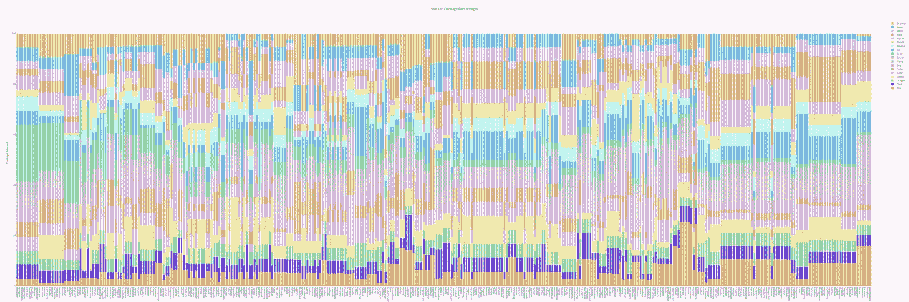
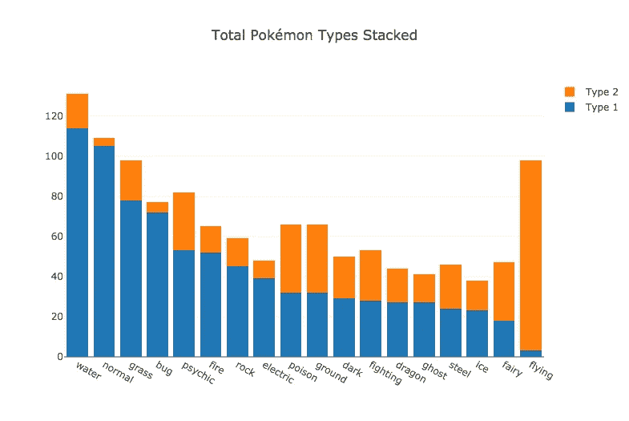
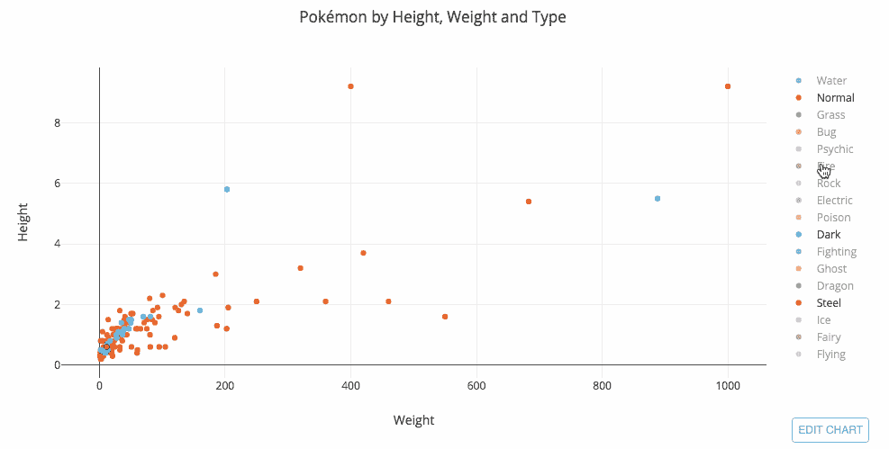
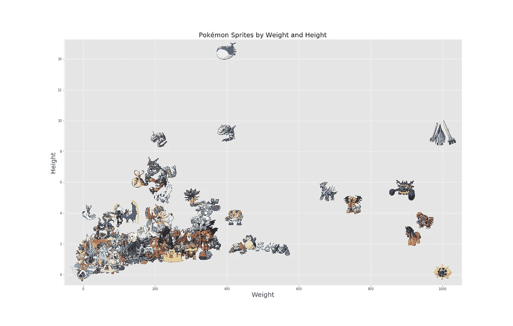
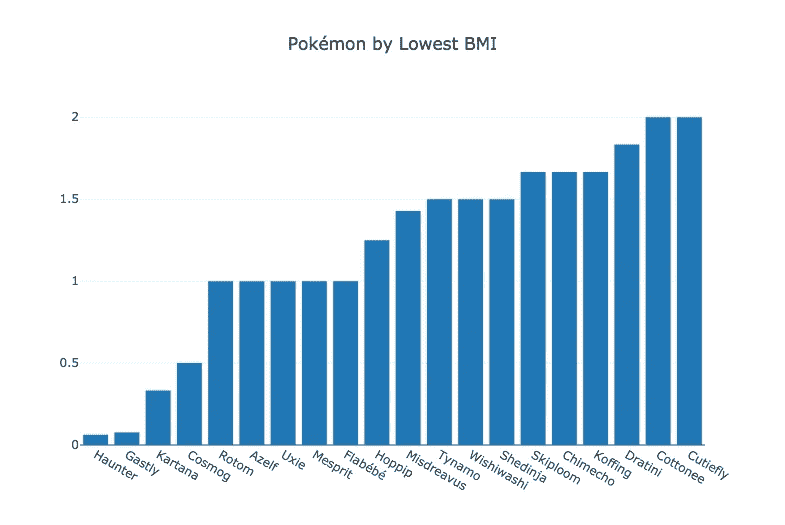
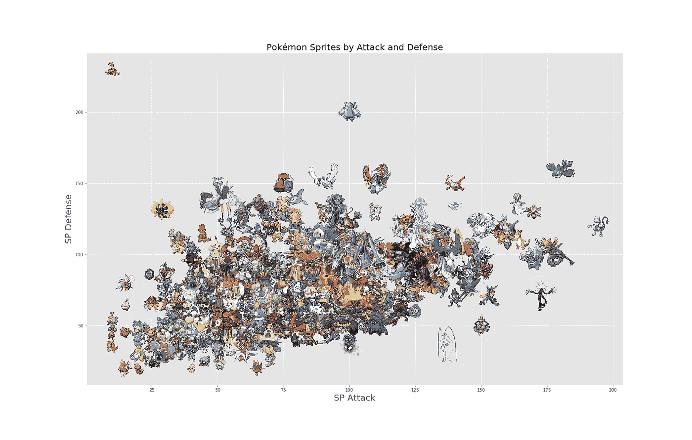
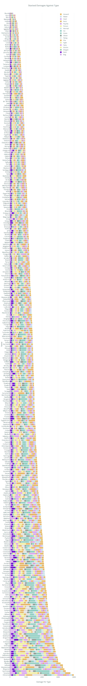
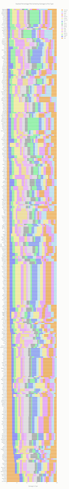
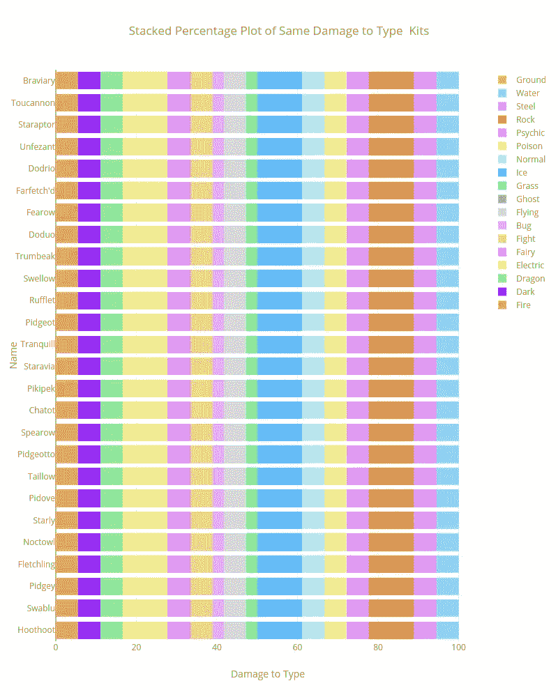

# DataVis 战斗入门:了解我的神奇宝贝

> 原文：<https://towardsdatascience.com/reddit-datavis-entry-getting-to-know-my-pok%C3%A9mon-e0bcf4b4b803?source=collection_archive---------10----------------------->

Stacked percentage bar chart sorted by total damage against Grass-type Pokémon (Plotly).

这是我第二次参加 Reddit 上的 DataVis 挑战赛。数据来源: [*Kaggle*](https://www.kaggle.com/rounakbanik/pokemon) *和*[*Bulbepedia*](https://bulbapedia.bulbagarden.net/wiki/Main_Page)*为图片。所有的图形都是用 Python 做的，用的是 Plotly 和 Matplotlib。此外，作为免责声明，我绝不是神奇宝贝专家，所以如果一些数据没有准确解读，提前道歉。我理解他们的特点和历史有许多细微差别，所以我愿意让顽固分子在必要的地方补充他们的意见。*

*这些数据图片和平而来* ✌

# **探索数据集**

## 按类型分类的神奇宝贝

我想看的第一个变量是神奇宝贝类型的总数。许多神奇宝贝都是混合的，所以有第一类和第二类:

Stacked bar chart of Pokémon Type 1 and Type 2 (Plotly).

正如你所看到的，水型神奇宝贝是最常见的，其次是普通的和草。飞行型神奇宝贝是最常见的 2 型，其次是毒型、地型和仙型。

## 身体质量指数的神奇宝贝

一旦 [Medium](https://medium.com/u/504c7870fdb6?source=post_page-----e0bcf4b4b803--------------------------------) 决定允许 HTML 嵌入，我的帖子将停止展示这些 gif。

Scatter plot by Weight, Height and Traces by Type 1 (Plotly).

虽然这种视觉效果在互动时相对信息量大，但显示神奇宝贝精灵或图像的静态图像也能让这些生物活起来。

经过多次努力将这些图像作为 Matplotlib 的标记导入，我终于设法让这个图表工作起来:)

Scatter plot by Pokémon weight and height, with markers as sprite images (Matplotlib). You can find the code [here](https://gist.github.com/feeblefruits/20e7f98a4c6a47075c8bfce7c06749c2).

科斯莫姆——右下角的神奇宝贝——和它正上方的 Celesteela 重量相当。然而，科斯莫姆的身体质量指数矮化了其余的神奇宝贝，我们可以在下面看到:

另一方面，在排名最低的身体质量指数，鬼斯通、鬼斯和卡尔塔纳名列榜首。

## 受到伤害的神奇宝贝

Scatter plot by Pokémon SP attack and SP defense, with markers as sprite images (Matplotlib).

数据集中变量最多的特征类别是攻击。更确切地说，是每个神奇宝贝对另一个特定类型的神奇宝贝的攻击伤害。例如，水型神奇宝贝对火型、地型、岩石型的神奇宝贝伤害更大，但是对电型和草型的神奇宝贝⚡非常脆弱🔥💧🌿

舒克尔的攻击构成绝对值看起来是这样的，每种颜色代表对给定类型的伤害:

Sum of all damage against type equals 200

而赫拉克罗斯的是这样的:

Sum off all damage against type equals 3977.5

这些横条是用 ***计算攻击伤害*伤害类型*** 然后叠加而成。我用的是绝对数字，因为它增加了一个有趣的视角，关于彼此相关的伤害输出。然而，这不是他们攻击伤害的总和**，而是每种攻击伤害的总和**。我希望这有意义。

Pokémon damage to type stacked in absolute numbers where **values = *attack damage * damage to type*** *(Plotly).*

鉴于以上伤害是由绝对数字组成的，查看百分比也很有趣。

Pokémon damage to type stacked in percentages where **values = (*attack damage * damage to type) / sum of damages * 100*** *(Plotly).*

我们看到上图中有几块颜色相同的“积木”,最明显的是 Braviary 和 Hoothoot 之间。挑出这一组，我们看到他们的装备完全一样。

Stacked percentage graph with equal Damage to Type values.

*就这样！感谢你阅读这篇文章。如果你喜欢它，给我一两下掌声，并分享一些你的想法或评论。干杯！*

Shuckle… I couldn’t resist.