# Reddit 的 DataViz 战役:美国宇航局宇航员埃达

> 原文：<https://towardsdatascience.com/reddits-dataviz-battle-nasa-astronaut-eda-6f34a59962e?source=collection_archive---------20----------------------->

这是我第一次参加 Reddit 的 [r/dataisbeautiful](https://www.reddit.com/r/dataisbeautiful/) 。所有的可视化都是在 Tableau Public 中完成的。

我们大多数人都梦想有一天成为宇航员。尤里·加加林(宇航员)第一个登上太空的人，以及无数其他宇航员都曾登上太空。我们已经到达了月球，也许火星很快也会到达。在这篇文章中，我在 Reddit 的 DataViz Battle 中可视化了来自 [NASA 宇航员](https://docs.google.com/spreadsheets/d/1kG9Jwknb6siBk0nm8lW40ltkJQuXPekc8zXikXp-rdg/edit?hl=en_US&hl=en_US#gid=0)数据库的 NASA 宇航员数据。

## 处理缺失数据

在上面的数据集中，工作栏的很多值都丢失了，所以我通过查看维基百科上的宇航员个人职业或 NASA 职业部分，艰难地添加了工作描述。通过这个过程，我学到了很多关于宇航员的知识。

*   艾伦·谢泼德——第一个进入太空的美国人(知道这一点)。
*   哈里森·施密特——最近在月球上行走的活人。
*   诺曼·塔加德——第一位美国宇航员(俄罗斯宇航员)。
*   拉维什·马尔霍特拉——他可能是第一个登上月球的印度人。[如果拉克什·夏尔马没有入选，拉维什·马尔霍特拉可能成为第一个进入太空的印度人。](https://www.youtube.com/watch?v=155O9XQcTYg)
*   尤金·塞尔南——最后一个登上月球的人，出演了纪录片《最后一个登上月球的人》。(知道这个)。

在浏览网页的时候，我了解了一些悲惨的事故和成为宇航员的艰难历程。向所有宇航员致敬。

## 按性别分类的宇航员

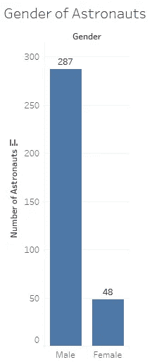

从柱状图中，我们可以看到男宇航员比女宇航员多。人数低于男宇航员可能有社会或政治原因，还有许多其他原因。检查这个[连杆](https://www.quora.com/Why-do-you-think-there-are-so-few-women-astronauts-i-e-12-men-have-so-far-walked-on-the-Moon-but-no-women)。随着时间的推移，女宇航员的数量可能会增加。

## 宇航员在太空的时间。

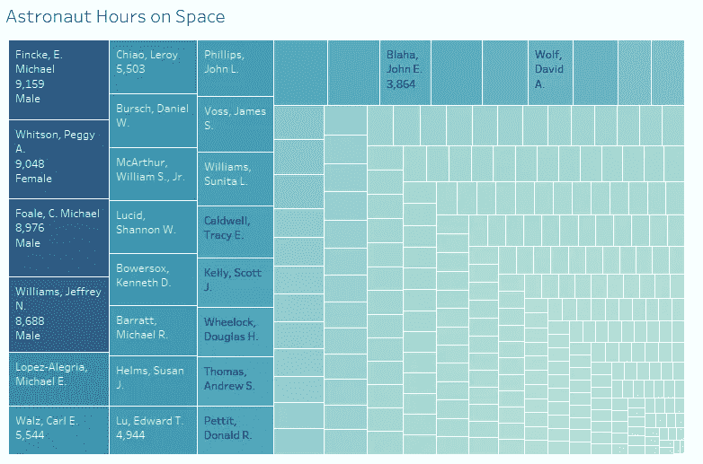

从上面的树状图中，我们可以看到迈克尔·芬克是在太空时间最多的宇航员。该数据集可能是旧的，因为目前佩吉惠特森超过迈克尔芬克和斯科特·凯利在第二位。很高兴看到 4 名女性在顶端(佩吉，鲁西德，苏珊，苏尼塔)，因为女宇航员较少。

## 宇航员太空飞行

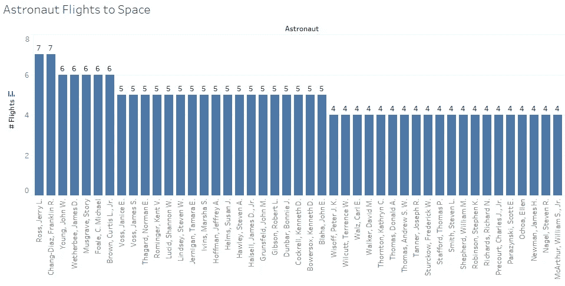

从上面的柱状图中，我们可以看到，在太空飞行次数最多的宇航员(上图)较少。很可能，大部分花费时间最长的宇航员很少飞行，花更多的时间在太空上。

## 宇航员分组

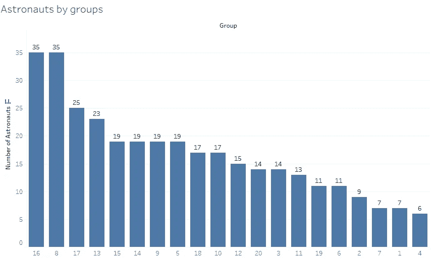

我们可以看到第 16 组和第 8 组有最多的宇航员。第 16 组是从 1996 年开始的选拔组，在那一年，国际空间站需要机组人员和常规航天飞机。[第 8 组](https://en.wikipedia.org/wiki/NASA_Astronaut_Group_8)是 1978 年开始的选拔组，经过 9 年的选拔。经过这么长时间的选拔，更多的宇航员被选拔出来，形成了两个宇航员小组:飞行员和任务专家。

## 宇航员出生日期

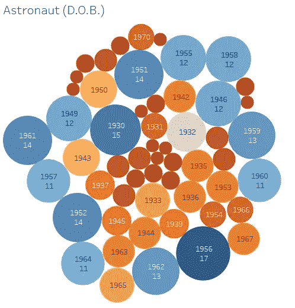

这种拥挤的气泡可视化没有多大意义，因为出生年份对宇航员有影响，但我们可以推断大多数宇航员出生于 1930 年，1940 年，1950 年，1960 年。可能是因为苏联和美国之间的太空竞赛。

## 当年选出的宇航员人数

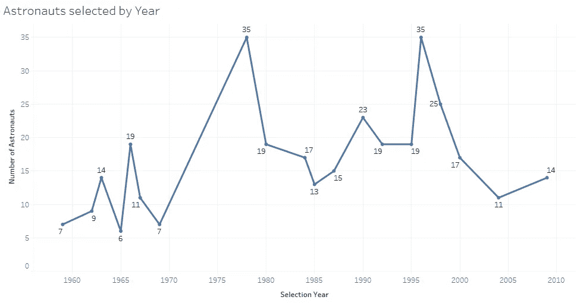

我们可以从 1975 年上方的线形图中看到，宇航员人数突然增加，与 1996 年相似。它的情况类似于上面讨论的宇航员分组。

## 由军事/民用专业挑选的宇航员

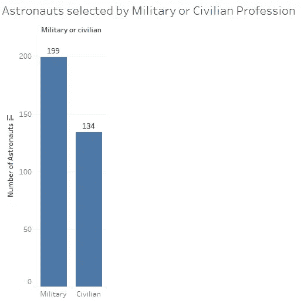

从上面的柱状图中，我们可以看到军用宇航员比民用宇航员多。以前，也许是因为项目都被列为情报目的，或者是因为训练压力很大，更多的军事人员被招募为宇航员。甚至平民宇航员也在增加，因为成为一名宇航员需要一定的专业知识和训练。

## 宇航员的军事细节

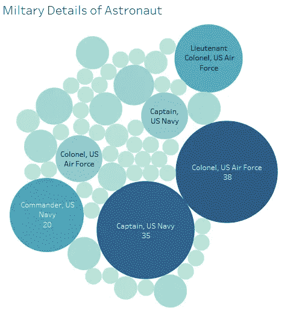

从上面，我们了解到，在军事职位中，大多数是在美国空军和美国海军担任上尉、指挥官、上校。由于岗位上有经验丰富的个人，他们占据了大部分宇航员的份额。

## 宇航员身份

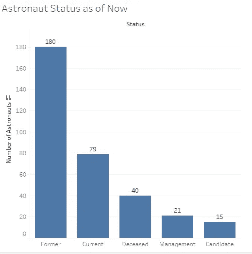

从上面的柱状图中，我们可以推断出他们大多数是前宇航员。当前描绘当前工作的宇航员。死者包括那些死于悲惨事故或自然死亡的宇航员。

## 宇航员的工作

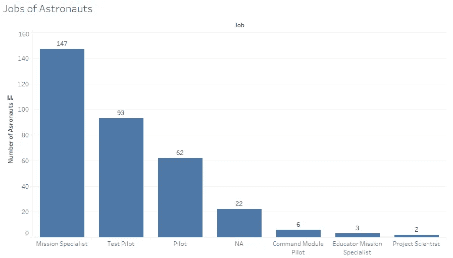

从上面的柱状图中，我们可以看到大多数宇航员的工作都是专业化的。任务专家宇航员是指拥有博士、工程师、内科医生、地质学学位以及更多其他学位的人，这些对于任何太空计划的实施都是必不可少的。试飞员和飞行员都曾在美国空军服役。点击此[链接](https://en.wikipedia.org/wiki/Astronaut_ranks_and_positions)了解更多关于宇航员的职责。

## 团体航班

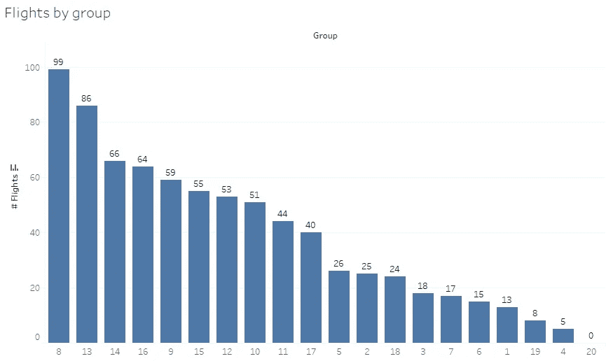

从上面的柱状图中，我们可以看到第 8 组有更多的飞行，因为他们有更多的宇航员成员，所以进行了更多的飞行。这是 9 年以来的选择小组，新的 35 名成员被选中，第一次形成了两个不同的飞行员小组-任务专家，飞行员。第 20 组的飞行次数等于 0，可能是因为太空计划没有启动。

## 每年累计小时数和航班数

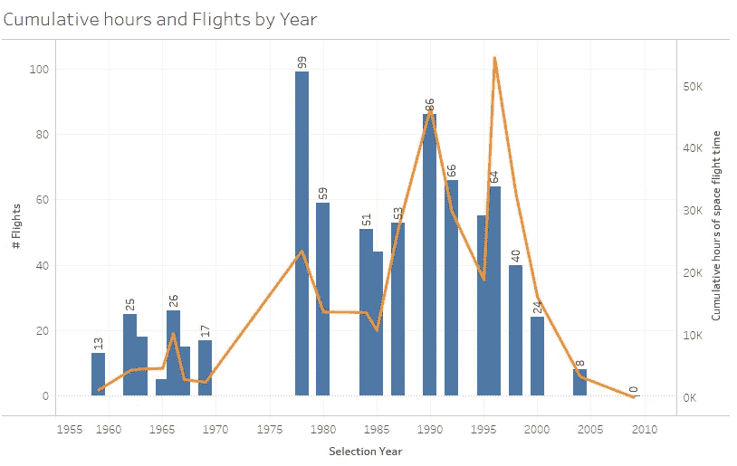

从上面的双轴图中，我们可以看到，20 世纪 70 年代后期，宇航员的数量和飞行次数更多，即第 8 组，但矛盾的是，累计飞行时间更少。类似地，在 1996 年期间，即第 16 组有 64 次飞行，但累积飞行小时相对较多，因为迈克尔·芬克和斯科特·凯利在该组中，他们在累积飞行小时图表中处于顶端。最终，第 20 组的航班数为 0，因为该数据仅截止到 2010 年，没有更新到 2018 年。

## 按工作列出的累计小时数和航班数

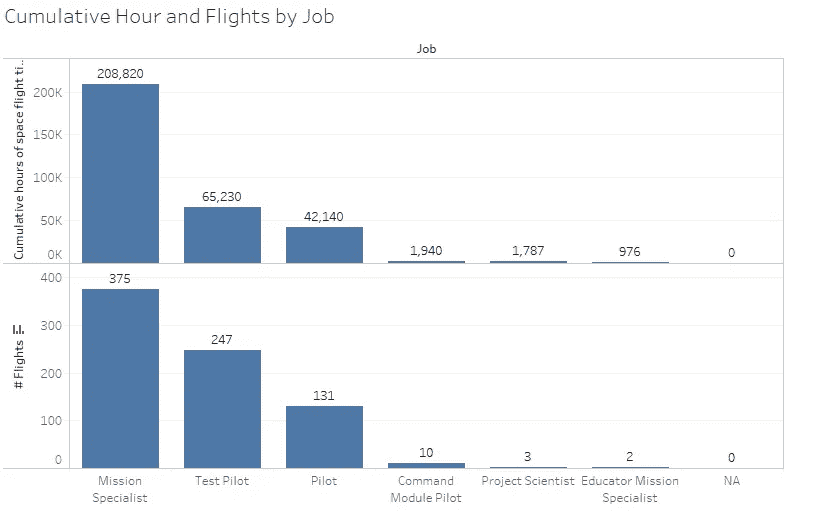

从上面，我们可以推断任务专家对任何太空计划都是至关重要的，因为他们在太空中有最多的飞行和累计飞行小时。试飞员和飞行员是指导太空计划的重要组成部分，在太空中有很高的飞行高度和小时时间。

## Tableau 可视化和故事: [Reddit NASA 宇航员](https://public.tableau.com/profile/badreesh.shetty#!/vizhome/RedditNasaAstronauts/NASAAstronauts)

## 结论

因此我们得出结论，任务专家和飞行员在任何项目中都是重要的个体。任务专家长时间在太空旅行。试飞员和飞行员的宇航员有军事经历，任务专家有专业学位。大多数宇航员是男性，但人数逐年变化。