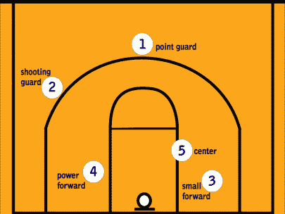
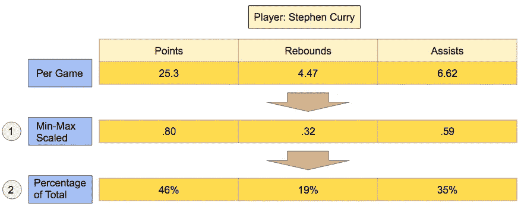
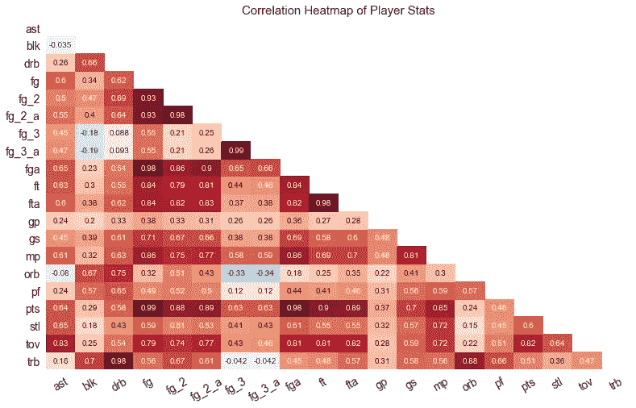
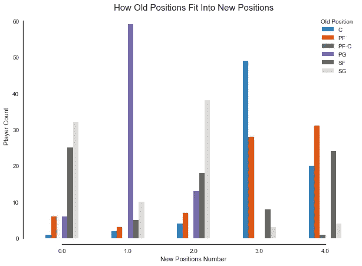
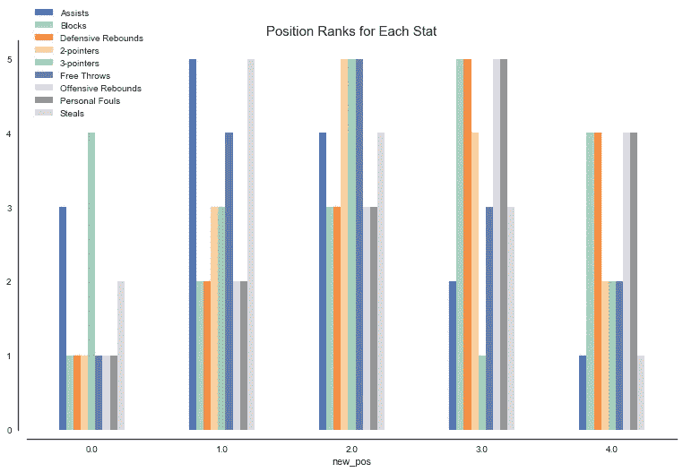

# 用无监督学习重新定义篮球位置

> 原文：<https://towardsdatascience.com/redefining-basketball-positions-with-unsupervised-learning-34988d03057?source=collection_archive---------0----------------------->

NBA 总决赛结束了。最后一瓶香槟已经被倒空，五彩纸屑开始沉降。既然金州勇士队已经完成了在篮球界释放他们超凡脱俗的统治地位，我认为这将是结束一个以硬木为重点的机器学习项目的好时机。

勇士队是篮球运动中一种新趋势的主要展示者，这种趋势主张传球第一，芭蕾舞般美丽的运动，而不是通过个人的伟大来统治。因此，传统的位置，如“控球后卫”和“中锋”，似乎真的不再适用于他们的球员了。当德雷蒙德·格林带领球队助攻并成为进攻的焦点时，斯蒂芬·库里真的是控球后卫吗？在今年总决赛的失败端，当勒布朗·詹姆斯几乎每一次控球都把球带到地板上时，你真的能把凯里·欧文称为骑士的控卫吗？

Diagram showing location for traditional positions

使用无监督的机器学习方法，我量化了一组五个全新的位置，不是由任意的头衔定义的，而是由球员在球场上的统计贡献定义的。

# **数据**

这个项目的数据是从 basketball-reference.com 刮来的，涉及 2016-2017 赛季常规赛。为了将玩家分组到新的位置，我分两步将数据标准化:

首先，我对数据进行了最小-最大缩放，使得每个统计值只在 0 和 1 之间变化。考虑到像得分和抢断这样的类别在很大程度上是不同的，重要的是将它们标准化，这样它们在决定位置分配时就具有同等的权重。

A diagram showing the data normalization steps for a single player, Stephen Curry

其次，我计算了每个属性占玩家总体统计贡献的百分比。对于每个属性，最终的属性数等于特定属性除以玩家所有属性的总和。这是一种表示玩家贡献的*类型*的方式，并对他们总体贡献的*数量*进行标准化。例如，如果一名球员场均 10 个篮板和 6 分，而在其他地方没有贡献，我想将他们的数据换算成与一名场均 5 个篮板和 3 分的球员相同的值。

# 使聚集

An animation demonstrating the process of k-means clustering

为了将球员分组到新的位置，我使用了一种叫做“K 均值聚类”的方法该技术将数据分组到 *k* 个簇中，其中每个条目(在本例中为玩家)根据其最近的质心点进行聚类。该过程从五个随机质心开始，然后迭代重复，根据最近的质心重新分组点，并将质心移动到平均位置，直到聚类分配没有变化。左边的例子显示了这个过程的二维视图。对于球员分组的过程，维度要高得多，每个属性类别都有一个维度。

## 为分组挑选统计数据

篮球参考中的 NBA 数据包括以下类别:

*   点
*   助攻
*   失误
*   篮板总数
*   进攻篮板
*   防守篮板
*   两分球
*   三分球
*   两点尝试
*   三分球尝试
*   等等。

A heat map showing correlations between different player stats. Dark red indicates high correlation.

这些类别中的许多都是高度相关的，在某些情况下，它们是一回事。在选择使用什么属性时，我必须考虑哪些属性是相互独立的。对于防守，进攻和总篮板这样的类别，决定是相当简单的，因为总篮板数与进攻和防守篮板数相同。但是，由于高度相关的统计数据并不统计同一件事，因此做出决定更加困难。例如，助攻和失误是高度相关的。控球多的球员往往助攻高失误多，但显然助攻和失误是完全不同的统计。我选择将相关性阈值设置为 0.80，这样，如果任何两个统计数据的相关性超过了这个阈值，我就会丢弃其中一个。在失误和助攻的情况下，我选择只用助攻。

我决定对玩家进行以下统计:

*   助攻
*   阻碍
*   防守篮板
*   进攻篮板
*   两个指针
*   三分球
*   罚中次数
*   个人犯规
*   偷

# 结果

我们可以使用一种称为“轮廓得分”的度量来评估新位置的区分程度，该度量给出了一个介于-1 和 1 之间的值，表示聚类重叠的程度。新职位分配的侧影得分为 **.857** ，表明职位之间的分化非常明显。稍后我将探索这些集群如何在玩家的基础上重叠。

看看新职位与传统职位的对比，就能了解新职位是如何定义的。下图显示了每个新位置中每个旧位置的玩家数量。

在一定程度上，新的任务遵循传统的，但也有相当多的混合。例如，一号位几乎完全是控卫，但除此之外，新的位置是两到三个传统位置的混合。举几个例子，零号位是得分后卫和小前锋的组合，三号位大多是中锋和大前锋形式的大个子。

# 它们是如何叠加的？

How each new position ranks in their contribution to the stats used for clustering. On the y-axis, five represents the highest rank, and one represents the lowest.

我们可以看看每个新位置在用于聚类的统计类别方面的排名，以了解哪些类型的球员属于每个组。我将更深入地探究这些排名，并使用它们来开发一个指代每个新职位的术语。

## **位置 0** :三点专家

除了三分球排名第二，这些球员对球队的贡献并不大。他们在九个类别中的六个类别中排名倒数第一，在任何一个类别中都没有排名第一。这是一个在今天的 NBA 非常受欢迎的球员，当他们有机会的时候，他会成为运球突破的受益者，并钉上空位三分。

**著名球员**

*   史密斯
*   埃里克·戈登
*   凯尔·科沃尔
*   特雷沃·阿里扎

## 职位 1:辅导员

助攻排名第一，这些球员是他们球队进攻的引擎。这些不再仅仅是传统的控球后卫，尽管这个位置主要是由这些球员组成的。考虑到他们站在后场促进进攻的程度，他们在抢断上排名第一也就不足为奇了。虽然这一类别中最著名的玩家是得分机器，但这些玩家不一定需要得分很多才能在游戏中留下印记。

**知名玩家**

*   勒布朗·詹姆斯
*   斯蒂芬·库里
*   德雷蒙德·格林
*   詹姆斯·哈登
*   克里斯·保罗
*   拉简·朗多

## 位置 2:指定计分员

这个位置包括 NBA 中的许多大牌明星，那些以其令人难以置信的技术获得所有人关注的得分手。他们在二分、三分和罚球中排名最高。按照传统的标准，这个位置主要是得分后卫，但这个类别的最佳射手分散在各种传统的位置上。他们也在很大程度上促进了进攻，助攻排名第二。

**著名球员**

*   凯文·杜兰特
*   拉塞尔·维斯特布鲁克
*   伊塞亚·托马斯
*   保罗·乔治
*   吉米·巴特勒
*   凯里·欧文

## 位置 3:固定大人物

虽然这不仅仅包括中锋，但这一类别囊括了大多数仍在 NBA 打球的老派大个子。他们三分球排名最后，但是他们碾压篮板，攻防篮板排名第一。他们确实得到了一些得分，但主要是在篮下，在两分球中排名第二。他们的个人犯规也排在第一位，你会看到篮板专家的犯规，因为他们在篮筐附近推挤时会受到犯规。

**知名玩家**

*   安东尼·戴维斯
*   鲁迪·戈贝尔
*   迪安卓·乔丹
*   卡尔-安东尼·唐斯
*   哈桑·怀特塞德
*   尼古拉·约基奇

## **位置 4:移动 Bigs**

这个位置囊括了在 NBA 风靡一时的伸展四人/移动大个子。他们在篮板、犯规和个人犯规方面的排名仅次于传统巨头，得分更少，但通过更多的三分来平衡。他们的防守贡献比传统大个子更有限，抢断排名最后。

**知名玩家**

*   凯文·乐福
*   德克·诺维斯基
*   凯利·奥里尼克
*   达里奥·沙里奇

## 探索职位

现在，让我们深入研究这些球员级别的新任务，看看不同类别的位置表现如何。

Figure 1\. Players’ points, rebounds, and assists, colored by their new position. Rollover to see a player’s name and stats.

图 1 显示了**指定得分手**(绿色)在得分上的优势，以及**固定大个子**(橙色)在篮板上的优势。**辅导员**(蓝色)在助攻方面表现突出，得分也高于大多数人。

Figure 2\. Players’ twos, threes, and points, colored by their new position. Rollover to see a player’s name and stats.

图 2 很好地区分了**固定大个子**、**指定得分手**和**三分专家**。三分专家的三分命中率更高，而指定的得分手类别在二分和三分之间更加平衡，大个子几乎没有三分。

我们还可以从这些图表中看到位置之间相对清晰的划分，没有大量的重叠，正如基于强大的轮廓得分所预期的那样。

# 结论

通过根据玩家的真实贡献来检查职位，我以一种更准确地反映玩家角色的方式来定义职位。当勒布朗·詹姆斯和凯文·杜兰特在球队中扮演不同的角色时，我们不再称他们为“小前锋”。勒布朗詹姆斯是骑士队的调解人，凯文·杜兰特是勇士队的指定得分手。