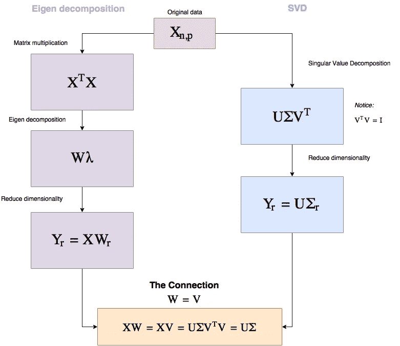
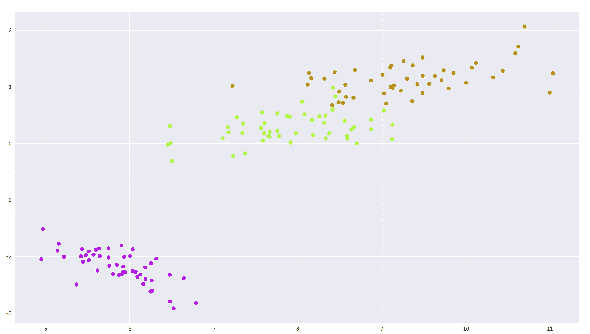
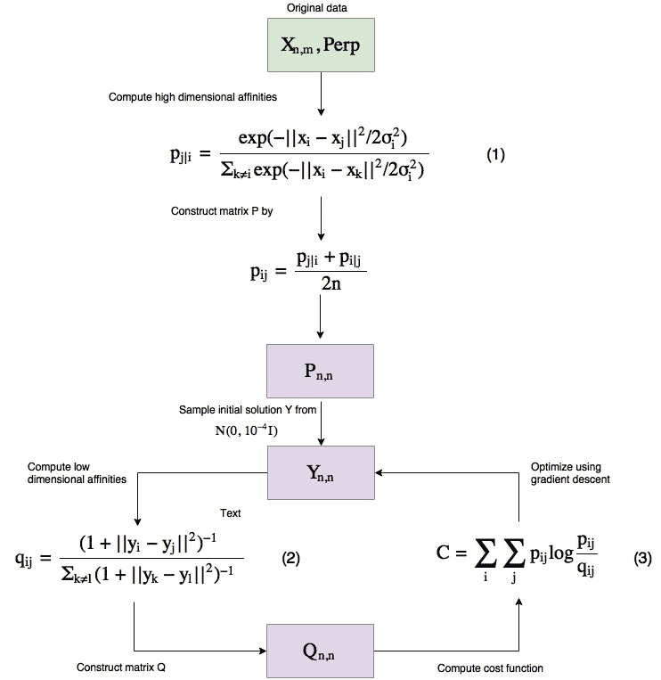
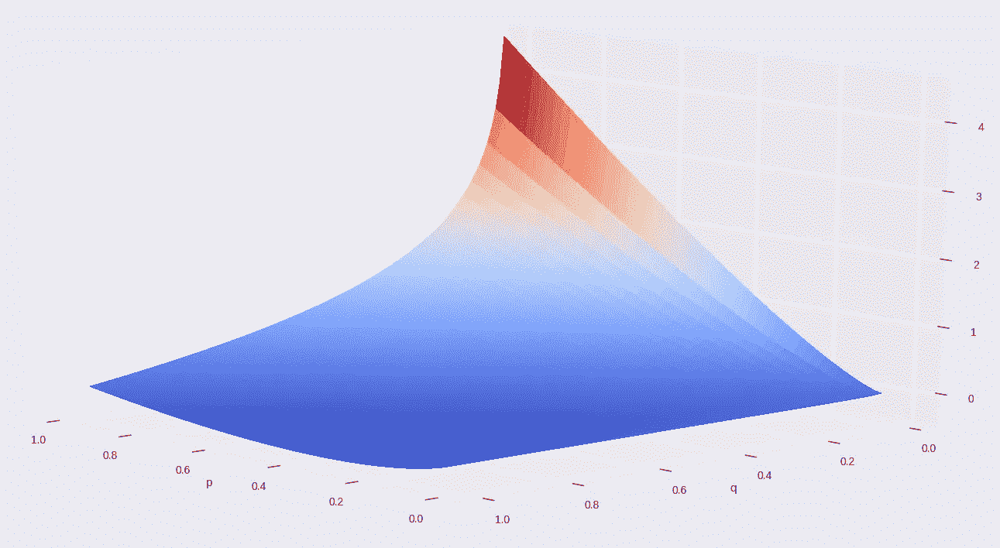
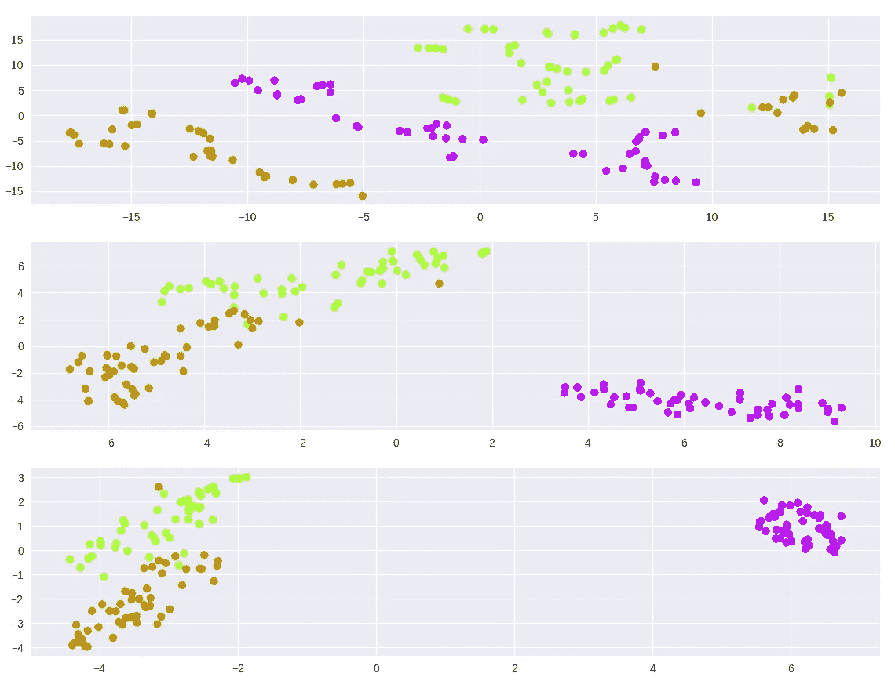
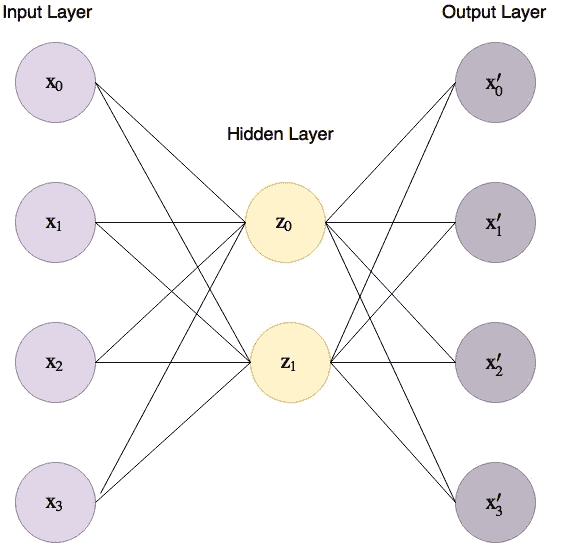
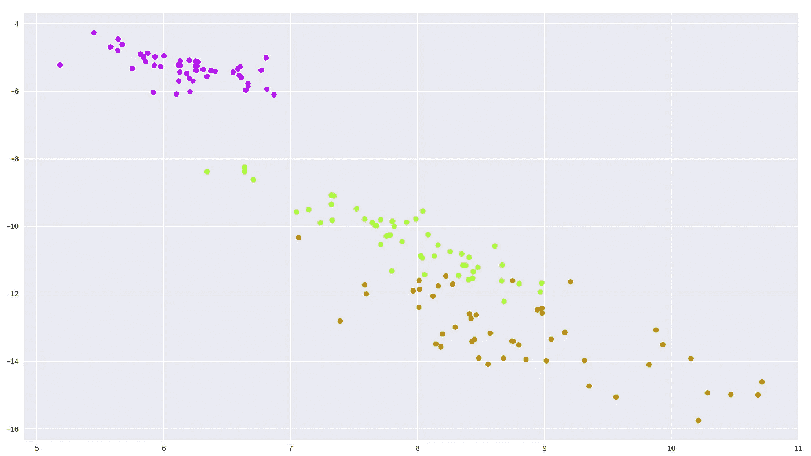

# 通过降维技术降低维数

> 原文：<https://towardsdatascience.com/reducing-dimensionality-from-dimensionality-reduction-techniques-f658aec24dfe?source=collection_archive---------0----------------------->

在这篇文章中，我将尽我所能去揭开三种降维技术的神秘面纱；主成分分析，t-SNE 和自动编码器。我这样做的主要动机是，这些方法大多被视为黑盒，因此有时会被误用。理解它们将为读者提供工具来决定使用哪一个、何时使用以及如何使用。我将通过检查每种方法的内部原理，并使用 TensorFlow 从头开始编写每种方法的代码(不包括 t-SNE)。为什么是 TensorFlow？因为它主要用于深度学习，所以让我们给它一些其他的挑战:)
这篇文章的代码可以在[这个笔记本](https://github.com/eliorc/Medium/blob/master/PCA-tSNE-AE.ipynb)中找到。

# 动机

在处理实际问题和实际数据时，我们经常会处理高达数百万的高维数据。
虽然数据在其原始的高维结构中表现得最好，但有时我们可能需要降低它的维数。
减少维度的需求通常与可视化相关(减少到 2-3 个维度，以便我们可以绘制出来)，但情况并非总是如此。
有时我们可能更看重性能而不是精度，因此我们可以将 1，000 维数据减少到 10 维，这样我们就可以更快地处理它(例如计算距离)。有时降低维度的需求是真实的，并且有许多应用。

在我们开始之前，如果你必须为以下情况选择一种降维技术，你会选择哪一种？

1.  您的系统使用余弦相似性来测量距离，但您需要向一些可能根本不熟悉余弦相似性的非技术委员会成员展示这一点，您会如何做？
2.  你需要将数据压缩到尽可能小的维度，而给你的约束是保持大约。80%的数据，你会怎么做？
3.  你有一个通过长时间收集的某种数据的数据库，并且数据(相似类型)不时地不断进来。
    您需要减少现有的数据和任何新数据，您会选择哪种方法？

我希望这篇文章能帮助你更好地理解降维，这样你会对类似的问题感到舒服。

让我们从 PCA 开始。

# **PCA**

PCA(**P**principal**C**component**A**analysis)可能是书中最古老的技巧。
PCA 得到了很好的研究，有许多方法可以获得相同的解决方案，我们将在这里讨论其中的两种，特征分解和奇异值分解(SVD ),然后我们将在 TensorFlow 中实现 SVD 方法。

从现在开始，X 将是我们的数据矩阵，形状为(n，p ),其中 n 是例子的数量，p 是维数。
因此，给定 X，这两种方法都将试图以自己的方式找到一种方法来操纵和分解 X，以便稍后我们可以将分解的结果相乘，从而在更少的维度中表示最大的信息。我知道我知道，这听起来很可怕，但我会省去你大部分的数学，但保留有助于理解方法利弊的部分。

因此，特征分解和奇异值分解都是分解矩阵的方法，让我们看看它们如何在 PCA 中帮助我们，以及它们是如何联系的。看一下下面的流程图，我会马上解释。



Figure 1 PCA workflow

那么你为什么要关心这个呢？这两个过程中有一些非常基本的东西告诉我们很多关于 PCA 的事情。
正如您所看到的，这两种方法都是纯线性代数，这基本上告诉我们，使用 PCA 是从不同的角度查看真实数据——这是 PCA 的独特之处，因为其他方法从低维数据的随机表示开始，并试图让它像高维数据一样运行。
其他一些值得注意的事情是，所有的运算都是线性的，SVD 的运算速度非常非常快。同样给定相同的数据，PCA 将总是给出相同的答案(这对于其他两种方法是不正确的)。

注意，在 SVD 中，我们如何选择 r (r 是我们想要减少的维数)最左边的σ值来降低维数？
σ有一些特殊之处。
σ是一个对角矩阵，有 p(维数)个对角值(称为奇异值)，它们的大小表示它们对保存信息的重要性。
因此，我们可以选择降低维度，使维度数量保持大约。给定数据的百分比量，我将在代码中演示(例如，给我们减少维数的能力，限制最多丢失 15%的数据)。

如你所见，在 TensorFlow 中编写代码非常简单——我们要编写的是一个具有`fit`方法和`reduce`方法的类，我们将向其提供维度。

# **代码(PCA)**

让我们看看`fit`方法是怎样的，假设`self.X`包含数据和`self.dtype=tf.float32`

```
**def fit**(self):
    self.graph = tf.Graph()
    **with** self.graph.as_default():
        self.X = tf.placeholder(self.dtype, shape=self.data.shape)

        # Perform SVD
        singular_values, u, _ = tf.svd(self.X)

        # Create sigma matrix
        sigma = tf.diag(singular_values)

    **with** tf.Session(graph=self.graph) **as** session:
        self.u, self.singular_values, self.sigma = session.run([u, singular_values, sigma],
                                                               feed_dict={self.X: self.data})
```

所以`fit`的目标是创建我们的σ和 U 以备后用。
我们从给出奇异值的线`tf.svd`开始，奇异值是图 1 中表示为σ的对角线值，以及矩阵 U 和 v。
然后`tf.diag`是 TensorFlow 将 1D 向量转换为对角线矩阵的方法，在我们的例子中，这将产生σ。
在`fit`调用结束时，我们将得到奇异值σ和 u。

现在让我们实现`reduce`。

```
**def reduce**(self, n_dimensions=**None**, keep_info=**None**):
    **if** keep_info:
        # Normalize singular values
        normalized_singular_values = self.singular_values / sum(self.singular_values)

        # Create the aggregated ladder of kept information per dimension
        ladder = np.cumsum(normalized_singular_values)

        # Get the first index which is above the given information threshold
        index = next(idx **for** idx, value **in** enumerate(ladder) **if** value >= keep_info) + 1
        n_dimensions = index

    **with** self.graph.as_default():
        # Cut out the relevant part from sigma
        sigma = tf.slice(self.sigma, [0, 0], [self.data.shape[1], n_dimensions])

        # PCA
        pca = tf.matmul(self.u, sigma)

    **with** tf.Session(graph=self.graph) **as** session:
        **return** session.run(pca, feed_dict={self.X: self.data})
```

所以你可以看到`reduce`要么得到`keep_info`要么得到`n_dimensions`(我没有实现输入检查，其中 ***只有一个必须被提供*** )。
如果我们提供`n_dimensions`，它将简单地减少到那个数字，但是如果我们提供`keep_info`，它应该是一个介于 0 和 1 之间的浮点数，我们将保留原始数据中的那么多信息(0.9 —保留 90%的数据)。
在第一个‘if’中，我们归一化并检查需要多少个奇异值，基本算出了`keep_info`中的`n_dimensions`。

在图中，我们只需根据需要对σ(sigma)矩阵进行切片，并执行矩阵乘法。

因此，让我们在鸢尾数据集上尝试一下，这是 3 种鸢尾花的(150，4)数据集。

```
**from** sklearn **import** datasets
**import** matplotlib.pyplot **as** plt
**import** seaborn **as** sns

tf_pca = TF_PCA(iris_dataset.data, iris_dataset.target)
tf_pca.fit()
pca = tf_pca.reduce(keep_info=0.9)  # Results in 2 dimensions

color_mapping = {0: sns.xkcd_rgb['bright purple'], 1: sns.xkcd_rgb['lime'], 2: sns.xkcd_rgb['ochre']}
colors = list(map(**lambda** x: color_mapping[x], tf_pca.target))

plt.scatter(pca[:, 0], pca[:, 1], c=colors)
```



Figure 2 Iris dataset PCA 2 dimensional plot

还不错吧。

# t-SNE

t-SNE 是一种相对(相对于 PCA)的新方法，起源于 2008 年([原文链接](http://www.jmlr.org/papers/volume9/vandermaaten08a/vandermaaten08a.pdf))。
它也比 PCA 更难理解，所以请多包涵。
我们对 t-SNE 的符号如下，X 将是原始数据，P 将是保存高维(原始)空间中 X 中的点之间的相似性(距离)的矩阵，而 Q 将是保存低维空间中的数据点之间的相似性的矩阵。如果我们有 n 个数据样本，那么 Q 和 P 都将是 n 乘 n 的矩阵(从任意点到包括自身在内的任意点的距离)。
现在 t-SNE 有其“特殊的方法”(我们很快就会谈到)来测量事物之间的距离，一种方法用于测量高维空间中数据点之间的距离，另一种方法用于测量低维空间中数据点之间的距离，第三种方法用于测量 P 和 q 之间的距离。
摘自原始论文，一个点 x_j 到另一个点 x_i 的相似性由“ *p_j|i， 如果在以 x_* i”为中心的高斯分布下，邻居按照概率密度的比例被挑选，则 x_i 将挑选 x_j 作为其邻居。
“什么？”不要担心，正如我所说，SNE 霸王龙有它测量距离的方式，所以我们将看看测量距离的公式(亲和力)，并从中挑选出我们需要的洞察力来理解 SNE 霸王龙的行为。

从高层次上讲，这就是算法的工作方式(注意，与 PCA 不同，它是一种迭代算法)。



Figure 3 t-SNE workflow

让我们一步一步地检查这个。
算法接受两个输入，一个是数据本身，另一个叫做 perf(Perp)。
简单地说，困惑就是你希望如何在优化过程中平衡数据的局部(接近点)和全局结构之间的焦点——文章建议将这个值保持在 5 到 50 之间。
更高的复杂度意味着数据点将更多的点视为其近邻，而更低的复杂度意味着更少。
困惑确实会影响你的可视化效果，要小心，因为它会在可视化的低维数据中产生误导现象——我强烈建议阅读这篇关于[如何正确使用 t-SNE 的伟大文章](http://distill.pub/2016/misread-tsne/),它涵盖了不同困惑的影响。

这种困惑从何而来？它用于计算等式(1)中的σ_i，并且由于它们具有单调的联系，它被二分搜索法发现。所以σ_i 基本上是用我们提供给算法的困惑度为我们计算出来的。

让我们看看这些方程告诉了我们关于 SNE 霸王龙的什么。
在我们探索等式(1)和(2)之前，要知道 p_ii 设置为 0，q_ii 也设置为 0(尽管如果我们将它们应用于两个相似的点，等式不会输出 0，但这只是给定的)。
现在来看等式(1)和(2 ),我希望你注意到，如果两个点靠近(在高维表示中),分子将产生大约 1 的值，而如果它们相距很远，我们将得到一个无穷小的值——这将有助于我们稍后理解成本函数。

现在我们已经可以看到一些关于 SNE 霸王龙的事情。
一个是解释 t-SNE 曲线中的距离可能会有问题，因为亲缘关系方程是这样建立的。
这意味着聚类之间的距离和聚类大小可能会产生误导，并且也会受到所选困惑的影响(同样，我会让您参考上一段中的精彩文章，以查看这些现象的可视化)。
第二件事是注意在等式(1)中我们是如何计算点与点之间的欧几里德距离的？这是非常强大的，我们可以用我们喜欢的任何距离度量来切换距离度量，余弦距离，曼哈顿距离或任何你想要的度量(只要它保持[空间度量](https://en.wikipedia.org/wiki/Metric_space))并保持低维亲和力不变——这将导致以欧几里得方式绘制复杂的距离。
例如，如果你是一名首席技术官，你有一些数据，你用余弦相似度来衡量其距离，而你的首席执行官希望你展示某种表示数据的图表，我不确定你是否有时间向董事会解释什么是余弦相似度以及如何解释聚类，你可以简单地绘制余弦相似度聚类，就像使用 t-SNE 的欧几里德距离聚类，我认为这非常棒。
在代码中，您可以在`scikit-learn`中通过向`TSNE`方法提供一个距离矩阵来实现这一点。

好，现在我们知道，当 x_i 和 x_j 接近时，p_ij/q_ij 值较大，当它们较大时，p _ ij/q _ ij 值很小。
让我们通过绘制成本函数(称为[kull back–lei bler 散度](https://en.wikipedia.org/wiki/Kullback%E2%80%93Leibler_divergence))并检查没有求和部分的等式(3)来看看它如何影响我们的成本函数。



Figure 4 t-SNE cost function without the summation part

这很难理解，但是我确实把轴的名字放在那里了。如你所见，成本函数是不对称的。
对于在高维空间(p 轴)中邻近但在低维空间中由远点表示的点，它产生了较大的成本，而对于在高维空间中由近点表示的远点，它产生了较小的成本。
这更加说明了 t-SNE 情节中距离解释能力的问题。

让我们 t-SNE 虹膜数据集，看看发生了什么不同的困惑

```
model = TSNE(learning_rate=100, n_components=2, random_state=0, perplexity=5)
tsne5 = model.fit_transform(iris_dataset.data)

model = TSNE(learning_rate=100, n_components=2, random_state=0, perplexity=30)
tsne30 = model.fit_transform(iris_dataset.data)

model = TSNE(learning_rate=100, n_components=2, random_state=0, perplexity=50)
tsne50 = model.fit_transform(iris_dataset.data)

plt.figure(1)
plt.subplot(311)
plt.scatter(tsne5[:, 0], tsne5[:, 1], c=colors)

plt.subplot(312)
plt.scatter(tsne30[:, 0], tsne30[:, 1], c=colors)

plt.subplot(313)
plt.scatter(tsne50[:, 0], tsne50[:, 1], c=colors)

plt.show()
```



Figure 5 t-SNE on iris dataset, different perplexities

正如我们从数学中所理解的，您可以看到，给定一个很好的困惑，数据确实会聚类，但请注意对超参数的敏感性(如果不为梯度下降提供学习率，我无法找到聚类)。
在我们继续之前，我想说 t-SNE 是一个非常强大的方法，如果你正确地应用它，不要把你学到的东西带到负面，只是要知道如何使用它。

接下来是自动编码器。

# 自动编码器

虽然 PCA 和 t-SNE 是方法，但自动编码器是一系列方法。
自动编码器是一种神经网络，该网络旨在通过使用比输入节点更少的隐藏节点(在编码器的末端)来预测输入(输出被训练为尽可能与输入相似),将尽可能多的信息编码到隐藏节点。
我们的 4 维虹膜数据集的基本自动编码器如图 6 所示，其中连接输入层和隐藏层的线称为“编码器”，隐藏层和输出层之间的线称为“解码器”。



Figure 6 Basic auto encoder for the iris dataset

那么为什么自动编码器是一个家族呢？因为我们唯一的限制是输入和输出层的维度相同，所以我们可以创建任何架构来最好地编码我们的高维数据。

自动编码器从一些随机的低维表示(z)开始，通过改变连接输入层和隐藏层以及隐藏层和输出层的权重，逐渐下降到它们的解决方案。

到目前为止，我们已经了解了一些关于自动编码器的重要知识，因为我们控制了网络的内部，我们可以设计出能够挑选出特征之间非常复杂的关系的编码器。
自动编码器的另一个优点是，由于在训练结束时我们有了导致隐藏层的权重，我们可以对某些输入进行训练，如果稍后我们遇到另一个数据点，我们可以使用这些权重减少其维数，而无需重新训练——但要小心，这只有在数据点与我们训练的数据有些相似时才有效。

在这种情况下，探索自动编码器的数学可能很简单，但不太有用，因为对于我们将选择的每个架构和成本函数，数学会有所不同。
但是，如果我们花点时间思考一下自动编码器权重的优化方式，我们就会明白我们定义的成本函数具有非常重要的作用。
由于自动编码器将使用成本函数来确定它的预测有多好，我们可以使用这种能力来强调我们想要的东西。
无论我们想要欧几里德距离还是其他度量，我们都可以通过代价函数，使用不同的距离方法，使用非对称函数等等，将它们反映在编码数据上。更强大的地方在于，由于这本质上是一个神经网络，我们甚至可以在训练时对类别和样本进行加权，以赋予数据中某些现象更多的意义。这为我们压缩数据的方式提供了极大的灵活性。

自动编码器非常强大，在某些情况下与其他方法相比已经显示出一些很好的结果(只是谷歌“PCA vs 自动编码器”)，所以它们绝对是一种有效的方法。

让 TensorFlow 为虹膜数据集创建一个基本的自动编码器，并绘制它

# 代码(自动编码器)

同样，我们将分成`fit`和`reduce`

```
**def fit**(self, n_dimensions):
    graph = tf.Graph()
    **with** graph.as_default():

        # Input variable
        X = tf.placeholder(self.dtype, shape=(**None**, self.features.shape[1]))

        # Network variables
        encoder_weights = tf.Variable(tf.random_normal(shape=(self.features.shape[1], n_dimensions)))
        encoder_bias = tf.Variable(tf.zeros(shape=[n_dimensions]))

        decoder_weights = tf.Variable(tf.random_normal(shape=(n_dimensions, self.features.shape[1])))
        decoder_bias = tf.Variable(tf.zeros(shape=[self.features.shape[1]]))

        # Encoder part
        encoding = tf.nn.sigmoid(tf.add(tf.matmul(X, encoder_weights), encoder_bias))

        # Decoder part
        predicted_x = tf.nn.sigmoid(tf.add(tf.matmul(encoding, decoder_weights), decoder_bias))

        # Define the cost function and optimizer to minimize squared error
        cost = tf.reduce_mean(tf.pow(tf.subtract(predicted_x, X), 2))
        optimizer = tf.train.AdamOptimizer().minimize(cost)

    **with** tf.Session(graph=graph) **as** session:
        # Initialize global variables
        session.run(tf.global_variables_initializer())

        **for** batch_x **in** batch_generator(self.features):
            self.encoder['weights'], self.encoder['bias'], _ = session.run([encoder_weights, encoder_bias, optimizer],
                                                                        feed_dict={X: batch_x})
```

这里没什么特别的，代码是很容易解释的，我们保存了我们的编码器权重，所以我们可以减少下面的`reduce`方法中的数据。

```
**def reduce**(self):
    **return** np.add(np.matmul(self.features, self.encoder['weights']), self.encoder['bias'])
```

嘣，就这么简单:)

让我们看看它是如何做到的(批量大小为 50，1000 个时期)



Figure 7 Simple Auto Encoder output on iris dataset

即使不改变架构，我们也可以继续使用批量大小、时期数量和不同的优化器，我们会得到不同的结果——这是刚刚出现的结果。
请注意，我只是为超参数选择了一些任意值，在实际场景中，我们将通过交叉验证或测试数据来衡量我们的表现，并找到最佳设置。

# 最后的话

像这样的帖子通常以某种比较图表、优点和缺点等结尾。但是这与我想要达到的目标恰恰相反。
我的目标是公开这些方法的私密部分，这样读者就能够找出并理解每种方法的优点和缺点。我希望你喜欢这本书，并且学到了一些新东西。

向上滚动到文章的开头，到那三个问题，现在对它们感觉更舒服了吗？