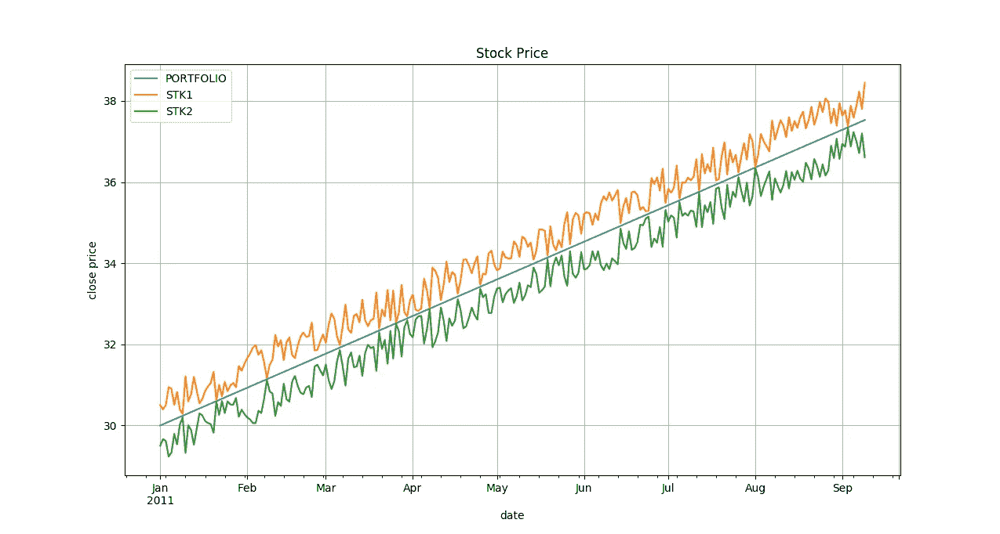
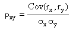

# 通过组合高风险股票进行投资来降低风险

> 原文：<https://towardsdatascience.com/reducing-risk-by-building-portfolio-8772d1ce0f21?source=collection_archive---------8----------------------->


Photo by [Nathan McBride](https://unsplash.com/@nathan_mcb?utm_source=medium&utm_medium=referral) on [Unsplash](https://unsplash.com?utm_source=medium&utm_medium=referral)

(这篇文章也可以在[我的博客](https://kylelix7.github.io/)中找到)

# 风险回报权衡

风险和回报的权衡在资本主义是众所周知的。你可能听说过，如果你想要更高的回报，你需要冒更大的风险。这似乎是一条黄金法则。但是也有可能将两只或更多的高风险股票组合起来，建立一个投资组合，从而降低风险，但不会显著降低回报。

在金融领域，风险包括投资的实际回报与预期回报不同的可能性。因此，风险通常用历史价格的标准差来衡量。它有时被称为波动性。标准差越高意味着风险越高。

为了演示的目的，我编写了两套人工股票价格。价格也有相同的趋势。同样，一个投资组合由 50%的股票 1 和 50%的股票 2 组成(如果你还没有一个环境设置，查看这篇[文章](https://medium.com/@kyle.jinhai.li/collect-trading-data-with-pandas-library-8904659f2122)中的步骤 1)。

```
**import** pandas **as** pd
**import** numpy **as** np
**import** matplotlib.pyplot **as** plt

periods = 252
noise = np.random.rand(252)
rng = pd.date_range(**'1/1/2011'**, periods=periods, freq=**'D'**)
*# Artificially build two stock stock 1 and stock 2* stk1 = (np.arange(1, 1+(.001)*(periods), .001)) * 30 + noise
stk2 = (np.arange(1, 1+(.001)*(periods), .001)) * 30 - noise

*# Build a porfolio with stock 1 and stock 2 weighted 50% respectively* portfolio = .5 * stk1 + .5 * stk2
df = pd.DataFrame(index=rng, data={**'STK1'**: stk1, **'STK2'**: stk2, **'PORTFOLIO'**: portfolio})
print(df.head())
```

数据帧的输出

```
 PORTFOLIO       STK1       STK2
2011-01-01      30.00      30.661445  29.338555
2011-01-02      30.03      30.355423  29.704577
2011-01-03      30.06      30.098417  30.021583
2011-01-04      30.09      30.749702  29.430298
2011-01-05      30.12      30.156122  30.083878
...
```

绘制单个股票价格和投资组合价值

```
ax = df.plot(title=**'Stock Price'**)
ax.set_xlabel(**'date'**)
ax.set_ylabel(**'close price'**)
ax.grid()
plt.show()
```

正如我们在下面的图表中看到的，股票 1 和股票 2 全年都在上涨，从大约 30 涨到大约 37。价格在类似范围内偏离预期值(因为添加了噪声)。但总体趋势是上升的。这也表明股票 1 和股票 2 具有相似的风险水平。然而，投资组合的价值不断上升，没有波动。从回报的角度来看，投资组合的最终价值约为 37 英镑，产生了类似的回报。也就是说，将两只风险较高的股票组合在一起，我们可以得到一个风险较低的投资组合，并获得相同水平的回报。



# 为什么？

如果我们仔细看看这两只股票的波动运动，从代码或图形。当股票 1 向上偏离时，股票 2 向下偏离相同的值。这使得两只股票的风险相互抵消。因此，它会产生一条平滑(风险较小)的线。

# 神奇之处——数学

我们如何在数学中衡量这种波动关系？我们需要它来编写代码，找出现实世界中现有的股票。可以用股票日收益率的**相关系数**(不是协方差)来衡量。

从[投资媒体](https://www.investopedia.com/terms/c/correlationcoefficient.asp)，

> 相关系数是确定两个变量运动相关程度的一种度量。相关系数的值范围是-1.0 到 1.0。如果计算出的相关性大于 1.0 或小于-1.0，则表明出现了错误。相关性为-1.0 表示完全负相关，而相关性为 1.0 表示完全正相关。



要将其转换为代码，我们首先需要计算两只股票的日收益率。每日回报计算简单如

每日回报=价格 _t1 /价格 _t0 - 1

一旦我们有了每日收益，就可以用一行代码计算相关系数🐼

```
daily_return = (df / df.shift(1) - 1).dropna()
print(**"daily_return\n"**, daily_return.head())
corr = daily_return.corr()
print(**"corr: "**, corr)
```

为了验证，我们打印了相关系数。结果证明，股票 1 和股票 2 的日收益率为-0.999787，表明日收益率反向变动。

```
daily_return             
             PORTFOLIO      STK1      STK2
2011-01-02   0.001000 -0.009390  0.011869
2011-01-03   0.000999 -0.008664  0.010894
2011-01-04   0.000998  0.019264 -0.017346
2011-01-05   0.000997  0.011912 -0.010373
2011-01-06   0.000996 -0.025108  0.028800corr:      PORTFOLIO      STK1      STK2
PORTFOLIO   1.000000  0.012499 -0.000667
STK1        0.012499  1.000000 -0.999787
STK2       -0.000667 -0.999787  1.000000
```

我们可以利用相关系数来发现现实世界中的股票，以优化投资组合。如果你想了解更多关于机器学习的知识，educative.io 中有一系列[课程很有帮助。这些课程包括像基本的 ML，NLP，图像识别等主题。](https://www.educative.io/profile/view/6083138522447872?aff=VEzk)

***来自《走向数据科学》编辑的提示:*** *虽然我们允许独立作者根据我们的* [*规则和指导方针*](/questions-96667b06af5) *发表文章，但我们不认可每个作者的贡献。你不应该在没有寻求专业建议的情况下依赖一个作者的作品。详见我们的* [*读者术语*](/readers-terms-b5d780a700a4) *。*

推荐阅读:

[动手机器学习](https://www.amazon.com/gp/product/1492032646/ref=as_li_tl?ie=UTF8&camp=1789&creative=9325&creativeASIN=1492032646&linkCode=as2&tag=blog023b-20&linkId=e6994d31d10e7ac4d35d9889cfe5622e)

[用于数据分析的 Python:与 Pandas、NumPy 和 IPython 的数据争论](https://www.amazon.com/gp/product/1491957662/ref=as_li_tl?ie=UTF8&camp=1789&creative=9325&creativeASIN=1491957662&linkCode=as2&tag=blog023b-20&linkId=be0bbd6ab4fd578397d9c14facc76911)

[对冲基金真正在做什么](https://www.amazon.com/gp/product/1631570897/ref=as_li_tl?ie=UTF8&camp=1789&creative=9325&creativeASIN=1631570897&linkCode=as2&tag=blog023b-20&linkId=d7bb68173b008df1b500073e3a8d054e)

我的帖子:

[我关于 FAANG 访谈的帖子](https://medium.com/@fin.techology/my-posts-about-faang-interview-20e529c5f13f?source=your_stories_page---------------------------)

[我的 YouTube 频道](https://bit.ly/3bBOjtJ)

[我关于金融和科技的帖子](https://medium.com/@fin.techology/my-posts-about-finance-and-tech-7b7e6b2e57f4?source=your_stories_page---------------------------)

[从 CRUD web 应用开发到语音助手中的 SDE——我正在进行的机器学习之旅](https://medium.com/@fin.techology/from-crud-app-dev-to-sde-in-voice-assistant-my-ongoing-journey-to-ml-4ea11ec4966e?)

[全栈开发教程:将 AWS Lambda 无服务器服务集成到 Angular SPA 中](/full-stack-development-tutorial-integrate-aws-lambda-serverless-service-into-angular-spa-abb70bcf417f)

[全栈开发教程:用运行在 AWS Lambda 上的无服务器 REST API 提供交易数据](/full-stack-development-tutorial-serverless-rest-api-running-on-aws-lambda-a9a501f54405)

[全栈开发教程:在 Angular SPA 上可视化交易数据(1)](/full-stack-development-tutorial-visualize-trading-data-on-angular-spa-7ec2a5749a38)

[强化学习:Q 学习简介](https://medium.com/@kyle.jinhai.li/reinforcement-learning-introduction-to-q-learning-444c951e292c)