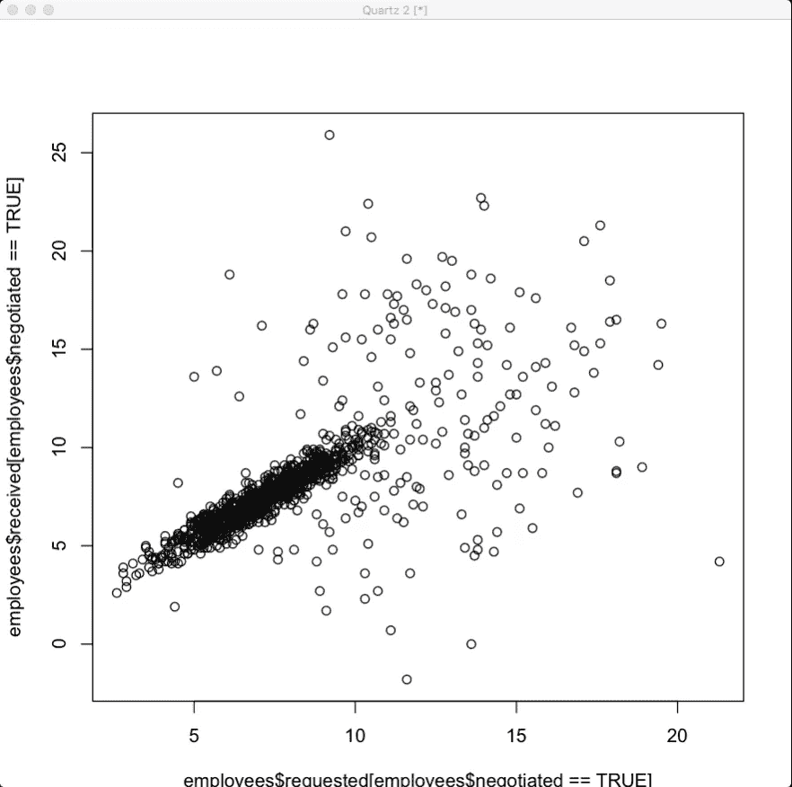

# 回归

> 原文：<https://towardsdatascience.com/regression-99fd94bcf769?source=collection_archive---------1----------------------->

**预测**

回归是一种非常强大的统计工具，如果使用正确，它有能力帮助您预测某些值。

当与受控实验一起使用时，回归可以帮助你预测未来。

企业疯狂地使用它来帮助他们建立模型来解释客户行为。

明智地使用回归分析确实是非常有益的。

**算法—** 完成计算需要遵循的任何程序。

在一个算法里面会有一个方法来预测一些事情。

预测对于数据分析来说是一件大事。有人会说，一般来说，**、**和**预测**合起来就是数据分析的*定义*。

你可能需要预测的事情:

*   人民的行动
*   市场动向
*   重要事件
*   实验结果
*   不在我们数据中的东西

你应该问自己的问题:

*   我有足够的数据来预测吗？
*   我的预测有多好？
*   是定性的还是定量的？
*   我的客户很好地使用了预测吗？
*   我预测的极限是什么？

**散点图**

散点图是显示数据中丰富模式的快捷方式。任何时候你有两个变量的观察数据，你应该考虑使用散点图。

以下是一个 R 散点图示例:

散点图显示了*观察结果如何*相互配对，一个好的散点图可以是你如何证明**原因的一部分。**

**回归线**就是最符合平均值图表上的点的线。您可以用一个简单的等式来表示它们，这将允许您预测范围内任何 x 变量的 y 变量。

确保你的线路有用。如果您的数据显示线性相关，则该线非常有用。

**相关性**是两个变量之间的线性关联，对于线性关联，散点图点需要大致沿着一条线。

你可以有强或弱的相关性，它们由一个**相关系数**来衡量，也称为*r。*为了使你的回归线有用，数据必须显示出强线性相关性。

*r* 范围从-1 到 1，其中 0 表示*不相关*，1 或-1 表示两个变量之间的*完美关联*。