# 用回归分析预测房价

> 原文：<https://towardsdatascience.com/regression-analysis-model-used-in-machine-learning-318f7656108a?source=collection_archive---------1----------------------->

机器学习模型


# 介绍

回归分析是数据统计分析的基本方法。这是一种统计方法，允许估计变量之间的关系。人们需要确定因变量，它将根据自变量的值而变化。例如，房子的价值(因变量)根据房子的平方英尺(自变量)而变化。回归分析是预测分析中非常有用的工具。

*E*(*Y*|**X**)=*f*(**X**， **β** )

# 分析背后的统计数据

用图表很容易理解(来源:维基百科)

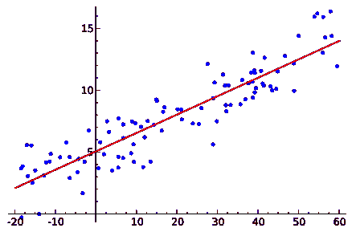

*Y = f(X) = 𝛽0 + 𝛽1 * X*

𝛽0 是这条线的截击点

𝛽1 是这条线的斜率

线性回归算法用于预测数据点之间的关系(直线)。可以有许多不同的(线性或非线性)方法来定义这种关系。在线性模型中，它基于截距和斜率。为了找出最佳关系，我们需要用数据训练模型。

在应用线性回归模型之前，我们应该确定感兴趣的变量之间是否存在关系。散点图是帮助确定两个变量之间关系强度的良好起点。相关系数是变量之间关联的一个有价值的量度。其值在-1(弱关系)和 1(强关系)之间变化。

一旦我们确定变量之间存在关系，下一步就是确定变量之间的最佳拟合关系(直线)。最常用的方法是残差平方和(RSS)。该方法计算观测数据(实际值)与其与建议的最佳拟合线(预测值)的垂直距离之间的差异。它计算每个差值的平方，并将所有差值相加。

MSE(均方误差)是通过将 RSS 除以总观察数据点来衡量估计量的质量。它总是一个非负数。越接近零的值表示误差越小。RMSE(均方根误差)是 MSE 的平方根。RMSE 是估计值与观察值的平均偏差的度量。这比 MSE 更容易观察到，MSE 可能是一个很大的数字。

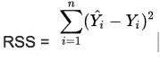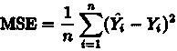

***RMSE****(MSE 的平方根)=√(****MSE****)*

额外数量的变量将增加模型的维数。

*y = f(x)= 𝛽0+𝛽1 * x1+𝛽1 * x2+𝛽1 * x3*

# 使用的工具

1.  计算机编程语言
2.  Graphlab
3.  s 帧(类似于熊猫数据帧)

# 数据加载

使用华盛顿地区西雅图的房屋数据。它包含以下各列和大约 21，000 行。

Id:日期:价格:卧室:卫生间:sqft_living sqft_lot:楼层:滨水:景观:条件:等级:sqft _ above:sqft _ basement:yr _ build:yr _ revenued:zip code:lat:long:sqft _ living:sqft _ lot

```
*> homesales = graphlab.SFrame(‘home_data.gl’)**> homesales*
```

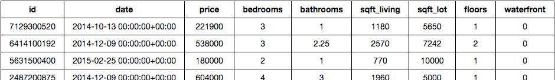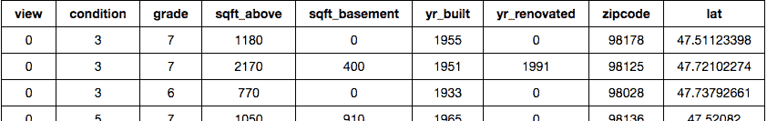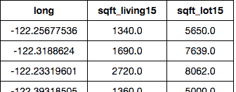

我们需要了解两个变量之间是否有关系。我们来挑房价和居住平方英尺。

```
*> homesales.show(view=”Scatter Plot”, x=”sqft_living”, y=”price”)*
```

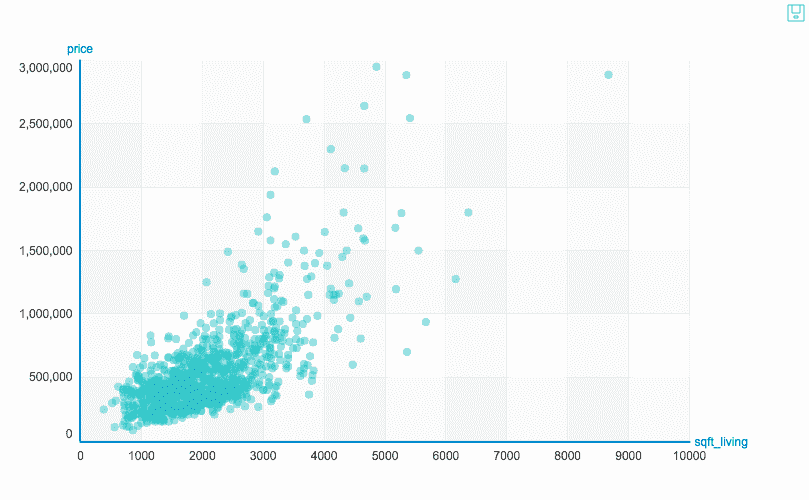

我们可以观察到居住面积平方英尺和房价是有关系的。

让我们使用带误差线的箱线图来观察数据，以了解邮政编码的价格。

```
*> homesales.show(view=’BoxWhisker Plot’, x=’zipcode’, y=’price’)*
```

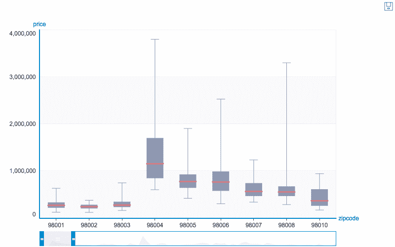

探索和理解周围的数据总是一个好主意。Graphlab 有一个显示数据统计的好方法。

```
*> my_features = [‘bedrooms’, ‘bathrooms’, ‘sqft_living’, ‘sqft_lot’, ‘floors’, ‘zipcode’]*
```

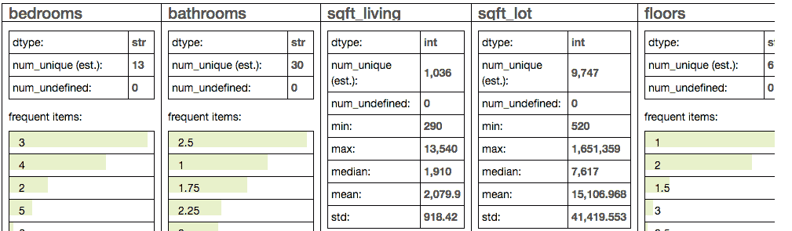

# 预测分析

第一步是得到训练数据集和测试数据集。让我们用 80%作为训练数据，剩下的 20%用于测试。

```
*> train_data, test_data = homesales.random_split(0.8, seed=0)*
```

让我们建立一个平方英尺的回归模型，并存储结果。因变量价格是模型需要预测的。

```
*> sqft_model = graphlab.linear_regression.create(train_data, target=’price’, features=[‘sqft_living’], validation_set=None)*
```

我们可以使用 matplotlib 绘制模型值和实际值。

```
*> plt.plot(test_data[‘sqft_living’],test_data[‘price’],’.’, test_data[‘sqft_living’],sqft_model.predict(test_data),’-’)*
```

蓝点代表显示房价和居住面积平方英尺之间关系的测试数据。绿线显示了使用我们构建的“sqft_model”线性回归模型对给定平方英尺的房价(因变量)的预测。

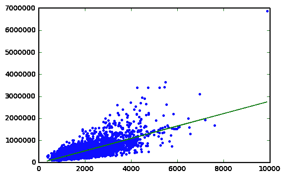

# 结果

让我们挑选一所房子，并使用“sqft_model”预测其价值。

```
*> house2 = homesales[homesales[‘id’]==’5309101200']**> house2*
```

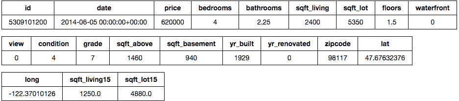

现在让我们使用“sqft_model”来预测房子价值。

```
*> print sqft_model.predict(house2)*
```

[629584.8197281545]

其预测值为 629，584 美元，与实际值 620，000 美元非常接近。

虽然我们的模型运行得相当好，但预测值和实际值之间存在差距。

```
*> print sqft_model.evaluate(test_data)*
```

*{ ' max _ error ':41425228938，' RMSE ':25358 }*

“最大误差”是由异常值引起的。它显示在 matplot 可视化的右上角。该模型基于 RMSE 的误差值为 255，191 美元。