# 机器学习:回归—预测房价(第二课)

> 原文：<https://towardsdatascience.com/regression-predict-house-price-lesson-2-5e23bec1c09d?source=collection_archive---------0----------------------->

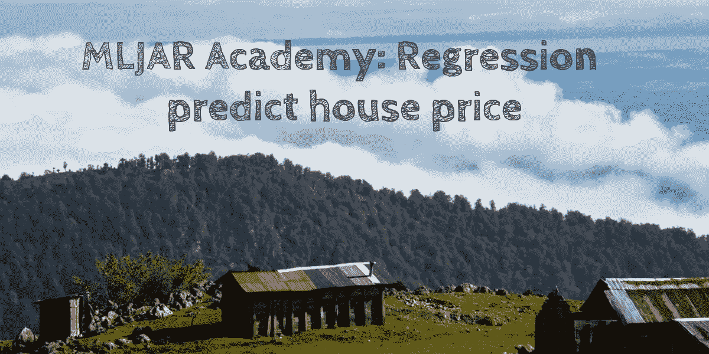

你要卖掉你的房子，你想知道它的合适价格吗？我们会用 ML 来猜测房价——怎么猜？请阅读:)

在上一篇文章中，你将从 ML word 中学习一些基本术语。在这篇文章中，我们将重点关注监督学习，我们将做一些很酷的事情——建立一个 ML 模型，根据其属性预测房价。

先说一些理论。在监督学习中，您可以根据响应类型选择算法:

*   如果你的回答是连续的(一些数字)，那么你将做**回归**，你需要回归任务的算法。
*   如果你的回答是分类的(类别或类)，那么你将做**分类**，你需要得到分类算法

例如，如果您正在建立一个模型来预测“热或不热”，并且您正在预测 1-10 范围内的值，那么这就是回归，如果您的响应是热或不热，那么这就是分类。

在这个例子中，我们将建立一个预测模型来预测房价(价格是一个定义范围内的数字，所以这将是一个回归任务)。例如，你想卖一栋房子，但你不知道你能接受的价格——不能太低也不能太高。要找到房价，你通常会尝试在你的社区找到类似的房产，并根据收集到的数据评估你的房价。我们会做一些类似的事情，但是用机器学习的方法！好，我们开始吧！

我们将使用波士顿住房数据集，你可以从[这里](https://www.kaggle.com/c/house-prices-advanced-regression-techniques/data)下载。然而，我在原始数据集上为你做了一个小技巧，帮助你更好地理解 ML，我把它分成训练和测试样本——你可以从[我的 github](https://github.com/pplonski/datasets-for-start/tree/master/house_prices) 得到。我们将使用训练样本(data_train.csv 文件)进行模型学习，使用测试样本(data_test.csv)进行预测。我将数据分为两组，向您展示如何使用训练好的模型来预测未知。如果你对数据中每一列的含义感兴趣，你可以在这里查看[。对于模型培训，我们将使用](https://www.kaggle.com/c/house-prices-advanced-regression-techniques/data) [MLJAR](https://mljar.com) ，因为它具有简单的 web 界面(如果您没有帐户，请注册并获得免费的启动信用)。让我们开始一个新项目。确保选择**回归**作为任务。这很重要，因为不同的算法用于回归，不同的算法用于分类。

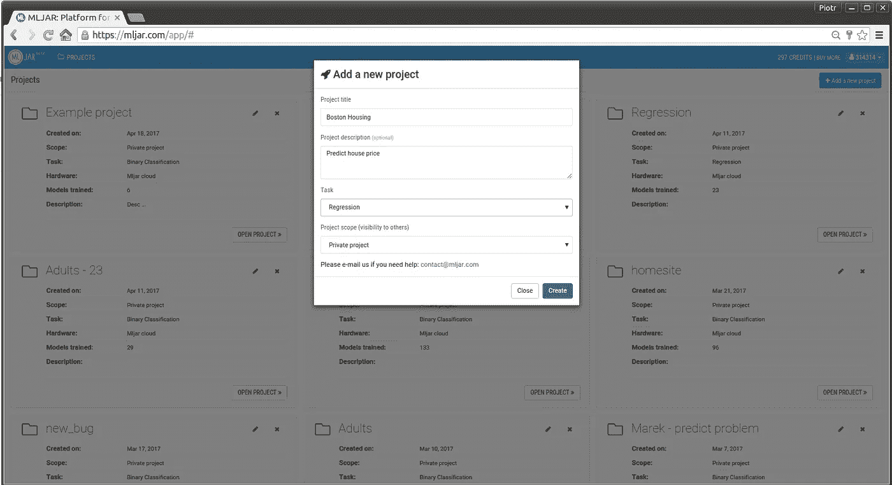

好的，请添加训练和测试数据集。在添加测试数据集期间，重要的是勾选:**该数据集将仅用于预测**(我们不会使用该数据集中的真实销售价格，我们将预测它！).

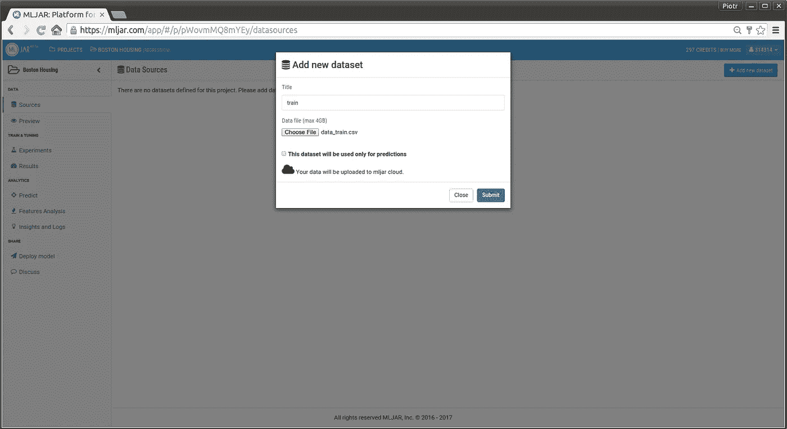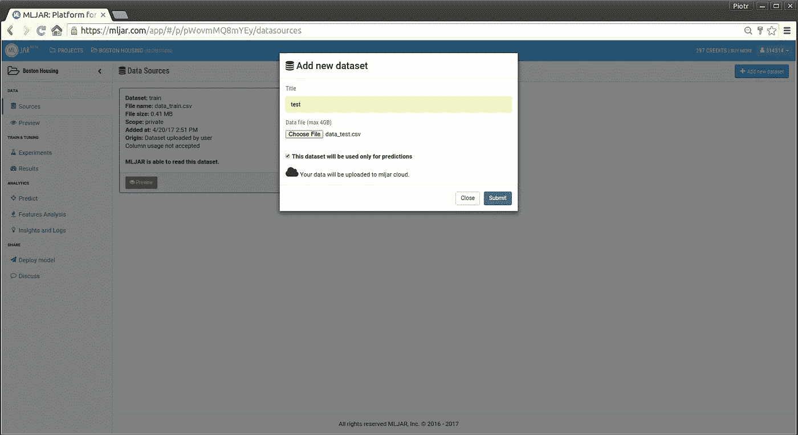

之后，我们需要指定列的用法。MLJAR 试图猜测应该使用哪一列。请将“目标”设置为训练数据集的**销售价格**的列用途。对于测试数据集，请将“不要使用它”设置为**销售价格**的列用途。对于每个数据集，我们需要在顶部“接受属性用法”。

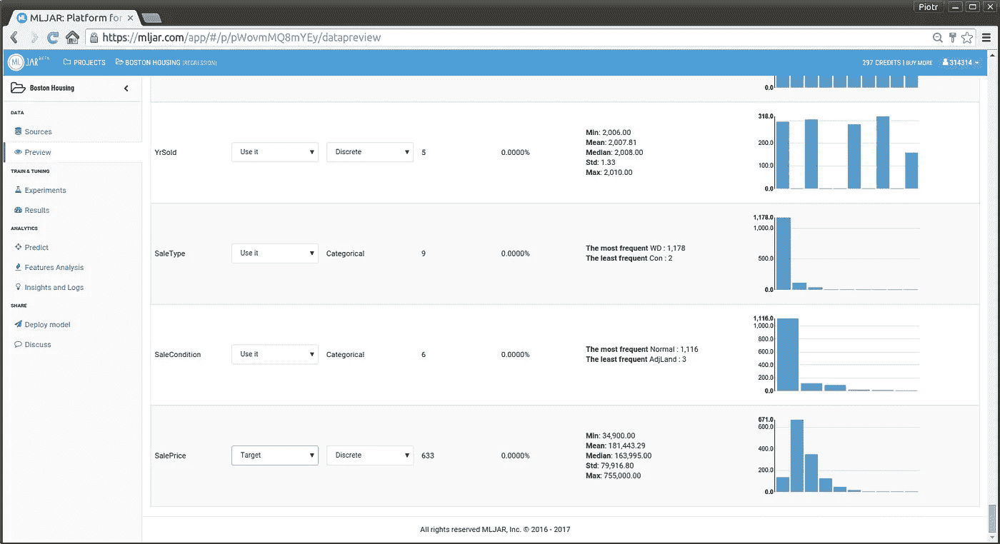

我们准备定义 ML 实验。作为输入，我们将使用“训练”数据。请将预处理保留为默认值。对于学习算法，我们将使用极端梯度推进(xgboost)——它是超级强大的，你会看到！在调整详细资料中，请选择要优化的度量:均方根误差。然后点击开始！

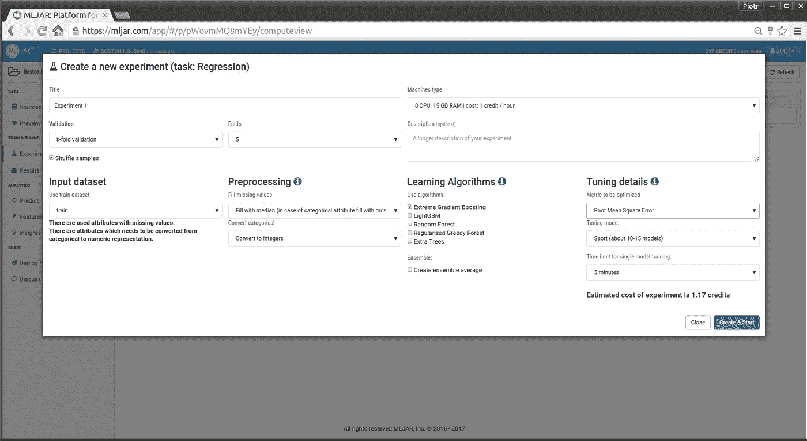

哇！但是等等，什么是均方根误差(RMSE)，为什么我需要这个？好问题。在训练阶段，您的模型希望预测的值尽可能接近目标值。为了跟踪它做得有多好，我们需要一些度量——它被称为成本函数。在我们的例子中，我们选择 [RMSE](https://www.kaggle.com/wiki/RootMeanSquaredError) 作为成本函数。当我们进入结果页面时，我们会看到许多模型，每个模型都有不同的 RMSE 值(分数栏)。

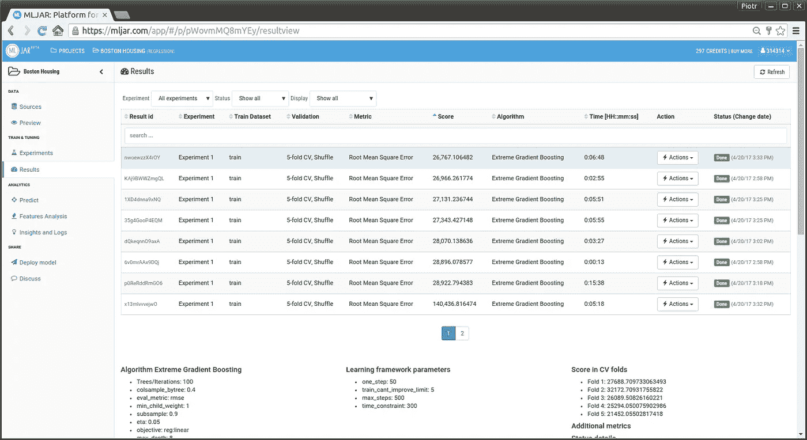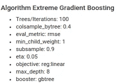

可以吗？我们使用一种算法，它产生不同的分数？当然，因为当你点击每个算法时，你会发现它们有不同的参数——所谓的超参数。所以不同的算法参数会得到不同的模型。这就是为什么 [MLJAR](https://mljar.com) 会为您检查许多不同的参数，并让您获得最佳模型(最有用)。在我们的案例中，最佳模型将是得分最低的模型，因此请通过单击该列对模型进行排序。

我们训练了一组模型，选出了最好的一个。那又怎样？

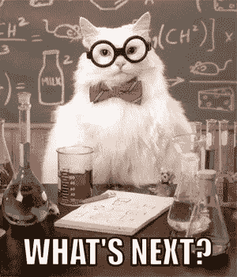

我们需要使用我们的模型！这就是为什么我留下测试样本，向您展示如何使用训练模型。在我们的测试数据集中有真值，但我们不会使用它们，让我们假设它们不存在。所以我们的测试数据中有 100 栋房子，我们想知道它们的价格。要计算预测，请转到**预测**视图。获得预测有 4 个步骤:

*   步骤 1 —请选择您想要用作输入的数据集，在我们的示例中是“测试”。
*   步骤 2-请选择您要用于计算预测的算法，在我们的情况下，我们将使用具有最小分值的算法。
*   第 3 步—点击“开始预测”按钮！:)
*   步骤 4-请等待一段时间进行预测，并下载包含模型响应的文件。

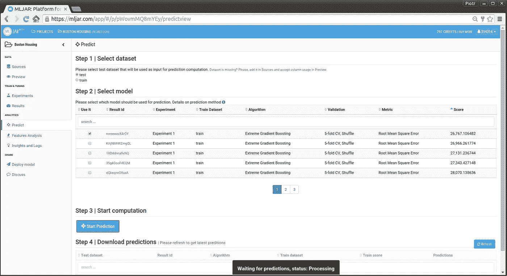

太棒了。您刚刚使用了 ML 模型，因此现在是将预测价格与真实价格进行比较的好时机—这是可以做到的，因为我们在测试集中有真实的销售价格，而在现实生活中，我们没有这样的值，因此只能手动(以某种方式)检查预测。好了，我们来目测一下。

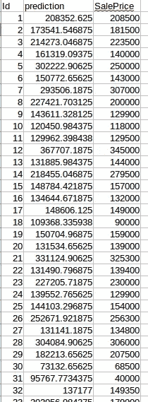

在一列中有模型的预测,“销售价格”是真实值，在图片中显示了前几个数据样本(房屋)。你可以看到，在某些情况下预测是非常准确的。例如，对于 Id=1 的房子，真实价格是 208500 美元，预测价值是 208352 美元，因此超过 200，000 美元的房产只有 148 美元的差异——相当不错！

但是，也有预测值相差几千的房子。这个不用担心。这在 ML 中很常见，模型有时会出错。原因可能有很多:

*   数据不足——样本太少，T4 无法根据数据很好地概括 T5
*   杂乱的数据——数据中经常有错误
*   模型问题—模型太简单或太复杂

这就是为什么计算成本函数对于衡量我们的预测有多准确很重要。

好了，今天就到这里。我们已经创建了 ML 模型来预测房价并使用它！:)