# XGBOOST 回归预测区间

> 原文：<https://towardsdatascience.com/regression-prediction-intervals-with-xgboost-428e0a018b?source=collection_archive---------1----------------------->

*(更新 2019-04-12:真不敢相信已经两年了。由于我一直收到各种更新代码的请求，我花了一些时间来重构、更新 gists，甚至创建了一个合作笔记本***。我为那些在运行过去版本时遇到困难的人道歉。如果您有任何问题，请提问，我很乐意抽出时间来回答！)**

*(更新 2020–08–19:感谢您 [Hassen Miri](https://medium.com/u/231b8b24164f?source=post_page-----428e0a018b--------------------------------) 帮助我完善分割收益论点)*

*对于任何希望对自己的业务进行认真预测分析的人来说，了解算法预测的不确定性是至关重要的。预测从来都不是绝对的，了解潜在的变化是非常必要的。如果一个人希望知道每个航班的乘客量，他还需要知道有多少乘客的预测可能不同。另一个可以决定预测上岸时间。当然，在几个小时的预测和半个小时内 95%的正确率和 10 个小时的潜在误差之间是有区别的！*

*在这里，我提出了一个定制的成本函数，用于将著名的 xgboost 回归器应用于分位数回归。Xgboost 或极端梯度提升是一个非常成功和强大的基于树的算法。由于分位数回归成本函数的梯度和 Hessian 性质，xgboost 的表现明显不佳。我表明，通过添加一个随机成分到平滑梯度，分位数回归可以成功应用。我展示了这种方法可以胜过流行的 scikit-learn 包中的`GradientBoostingRegressor`算法。*

## *为什么是预测区间？*

*虽然模型输出的是准确的预测，但它们本身是随机变量，也就是说，它们有分布。为了了解我们的结果正确的可能性，预测区间是必要的。这种可能性决定了可能值的区间。*

*比方说，我们希望知道 90%确定概率的可能预测的范围，那么我们需要提供两个值`Q_alpha, Q_{1-alpha}`，这样，真实值的概率在区间内*

*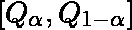*

*是 90%。*

*线性回归的基本陈述是，*

*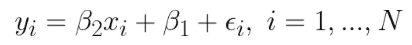*

*假设观测值`x_i`和`ε_i`是独立的并且是正态分布的。*

*假设误差项正态分布，系数`β_j`的最大似然估计使这些误差项的方差最小。*

*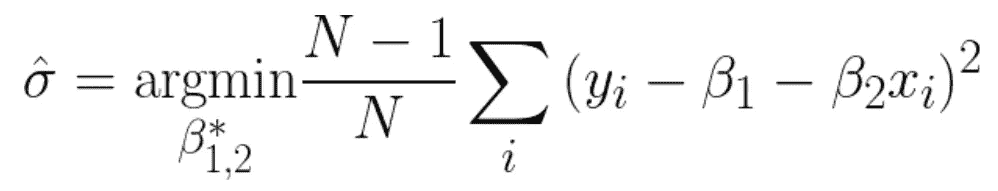*

*这个方差当然是预测方差的最大似然(ML)估计。在我们假设特征和误差都是正态分布的情况下，预测也是正态分布的。*

*正态分布的预测区间很容易从期望和方差的最大似然估计中计算出来:*

*68%的预测区间介于*

*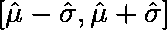*

*，95%的预测区间介于*

*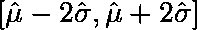*

*99.7%的预测区间在*

**

*这种方法有一些限制。首先，我们非常依赖正态性的基本假设，当然这并不总是正确的。最后，线性回归的简单性将我们限制在一个非常宽的预测区间。理想情况下，我们希望我们的预测边界也依赖于更多的特征。在下一节课中，我们将讨论使用树模型的实现。*

## *树模型*

*回归树是一个非常强大的预测工具。树的一般思想是对要素进行分区，并为每个分区分配一个值。该值以这样的方式分配，使得分区内的成本函数最小化。*

*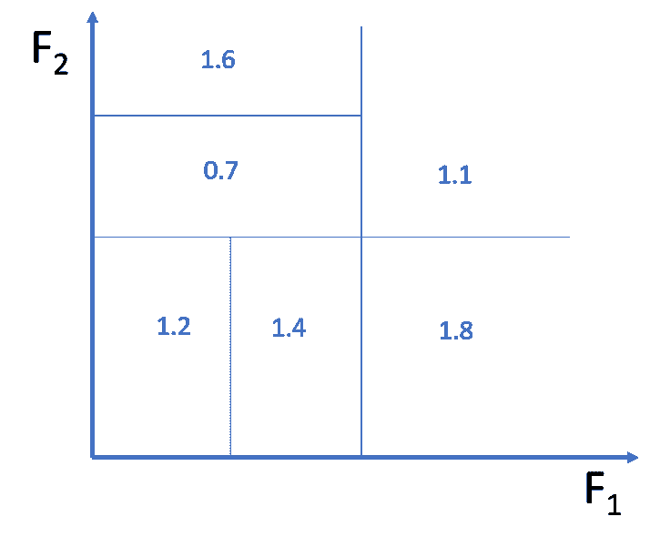*

*Fig 1: Illustration of a tree model. The tree defines a partition of the features-space and assigns a values to each partition.*

*分位数可以通过下面的优化问题找到，*

*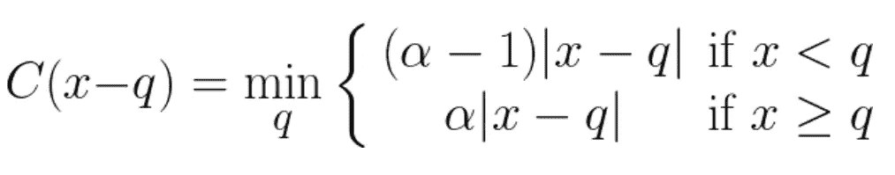**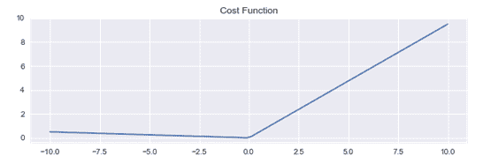*

*Fig 2: Cost function of Quantile Regression*

## *xgboost 的分位数回归*

*我还没有解释如何给每个分区赋值。*

*Xgboost 是一个强大的算法，它为我们做到了这一点。为了进一步参考，读者应该检查原始论文，*

*陈，田琦和卡洛斯.盖斯特林。" Xgboost:一个可扩展的树增强系统."*第 22 届 ACM SIGKDD 知识发现和数据挖掘国际会议论文集*。ACM，2016。*

*将体积`I`进一步划分成两个更小的子体积`I_L`、`I_R`的主要因素是得分函数，*

*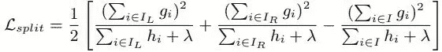*

*如果发生分裂，那么通过将下面的值加到较大体积`q_old`的分位数的旧值上，来更新每个子体积`I_α`内的分位数`q_new`的新值。*

*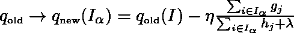*

*参数λ和η分别是正则化和收缩参数，我在这里不做进一步讨论。*

*这里重要的是梯度和 Hessian 的值:*

**

*在下图中，我们看到了梯度和黑森曲线。*

*正如我们所见，梯度是一个阶跃函数，而海森函数处处为零，在原点处无穷大。*

*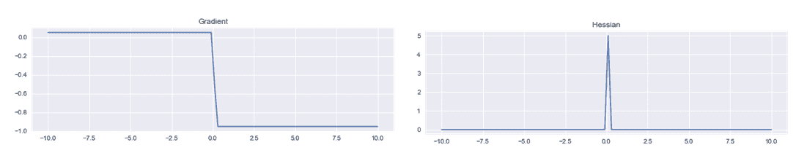*

*Fig 3: Gradient and Hessian of the cost-function of quantile regression with respect to the estimate*

*回头看看分裂的得分函数`L_split`，我们看到几个问题。*

*让我们看看分位数值`q_old`与分区内的观察值相距相对较远的情况。除非，我们运气好，在升压开始的时候是这种情况。梯度和 Hessian 对于大的差异都是常数`x_i — q`。这意味着分离增益与任何特性无关。更糟糕的是，最佳分割增益告诉我们，只要我们将数据量分成两半，任何分割都是足够的！当寻找分割时，xgboost 将尝试寻找具有最佳分割的特征。因为所有特征产生相同的分离增益，即节点中一半的数据向左，另一半向右，所以不会发生分离。*

*如果我们使用上面显示的梯度和 Hessian，甚至使用平滑的变体，很少会出现分裂，模型将表现不佳。*

*一个有趣的解决方案是通过向渐变添加随机化来强制拆分。当分区内的观察值`x_i`和旧的分位数估计值`q_old`之间的差异很大时，这种随机化将强制随机分割该体积。*

*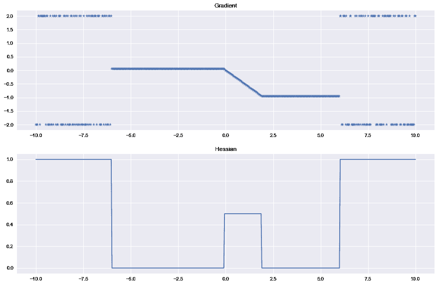*

*Fig 4: Plots of the new Gradient and Hessian used to estimate the quantile. Close to the origin, we use a smoothed version of the Gradient and Hessian. Far from the origin, randomization has been added to force a random split of the partition.*

*也就是说，我提出梯度和 Hessian 的以下平滑变型，*

*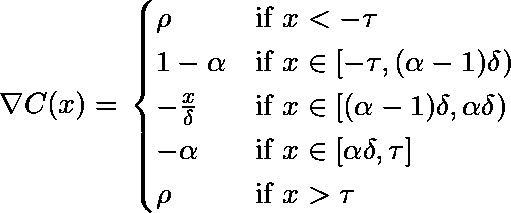*

*Gradient*

*随机变量ρ。对于这个实验，我简单地选择ρ，对于某个参数`s`，以相等的概率取两个值`s`或`-s`中的一个。*

*黑森:*

*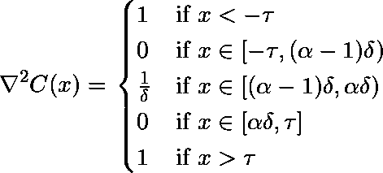*

*Hessian*

*在代码中:*

*我们将此代码应用于由以下代码生成的数据，这些数据也在 sklearn 示例中使用:[http://sci kit-learn . org/stable/auto _ examples/ensemble/plot _ gradient _ boosting _ quantile . html](http://scikit-learn.org/stable/auto_examples/ensemble/plot_gradient_boosting_quantile.html)*

*下图显示了 sklearn 的`GradientBoostingRegressor`和我们定制的`XGBRegressor`的 90%预测区间的比较结果，该区间是根据 95%和 5%分位数计算的。*

*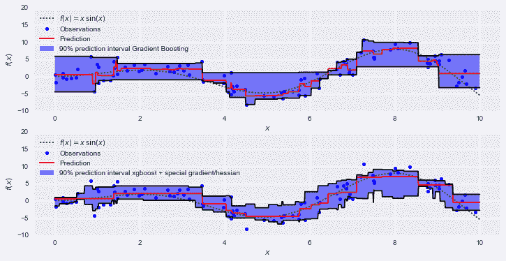*

*对于 95%的分位数，我使用了参数值*

*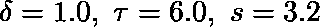*

*对于 5%的分位数，我用了*

*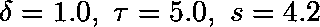*

*是通过网格搜索找到的。当使用成本函数对测试集进行评分时，发现定制 xgboost 的 95%和 5%分位数都是优越的。*

*[**点击此处查看合作笔记本！！！**](https://colab.research.google.com/drive/1KlRkrLi7JmVpprL94vN96lZU-HyFNkTq?usp=sharing)*