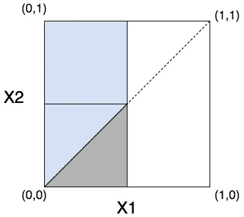

# 回归美好

> 原文：<https://towardsdatascience.com/regression-to-the-nice-c7059cf81a7c?source=collection_archive---------8----------------------->

以下是一个真实的故事。一家公司的人力资源部对员工满意度进行了年度调查。他们比较了前一年报告低于中间值的人和今年的结果。他们得意洋洋地宣布，去年 75%的不满者在最新调查中得分更高，这是士气提高的明显迹象。

但是房间里的统计学家更清楚。得出的结论不正确， [**回归谬误**](https://en.wikipedia.org/wiki/Regression_fallacy) 的一个例子。回归均值是极端变量在下一次迭代中变得不那么极端的趋势。这种现象不是由任何原因引起的，而仅仅是一种随机性的产物。假设调查结果是独立且同向抽取(iid)的连续随机变量，75%的改善正是不太快乐的那一半人所期望的。

设 *X1* 为上一年的调查结果， *X2* 为本年的调查结果。要计算的值是 P(*X2>X1 |*F(*X1)≤*0.5)其中 F 是累积密度函数(CDF)。目前假设 *X1* 和 *X2* 是iid 标准均匀随机变量，这就简化为 P( *X2 > X1|X1≤* 0.5)。下面是对 *X1* 和 *X2* 的联合概率分布的支持的可视化。

该区域内的联合概率值是常数，是两个独立均匀随机变量的乘积。彩色区域为 *X1≤* 0.5，蓝色区域为 *X2 > X1* 和 *X1≤* 0.5 *的区域。*蓝色区域除以彩色区域得到 P(*X2>X1 | X1≤*0.5)= 0.75 当 *X1* ， *X2* ~ *均匀* (0，1)。

即使调查结果不是均匀分布的，只要连续分布，这个 0.75 的值仍然成立。

若 *Y1* 和 *Y2* 为 iid 随机变量，具有某种任意连续分布和 CDF F，则感兴趣的值为 P(*Y2>Y1 |*F(*Y1*)*≤*0.5)。将 CDF 应用于 *Y1* 和 *Y2* ，由于是单调递增的，所以这个概率相当于 P(F(*Y2*)>F(*Y1*)| F(*Y1*)*≤*0.5)。[概率积分变换](https://en.wikipedia.org/wiki/Probability_integral_transform)陈述了将任意连续随机变量的 CDF 应用于随机变量给出了标准的均匀随机变量。因此，P(F(*Y2*)>F(*Y1*)| F(*Y1*)*≤*0.5)等价于 P( *X2 > X1|X1≤* 0.5)，P 也是 0.75。

回归谬误的另一个例子是“大二滑坡”，即运动员在第一个赛季的出色表现不会在接下来的赛季重复。虽然冷漠或紧张可能是罪魁祸首，但在某种程度上，运气在最初的表现中发挥了作用，这种下降是意料之中的。同一个运动员不太可能第二次这么幸运。