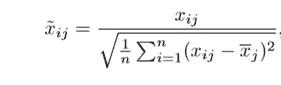
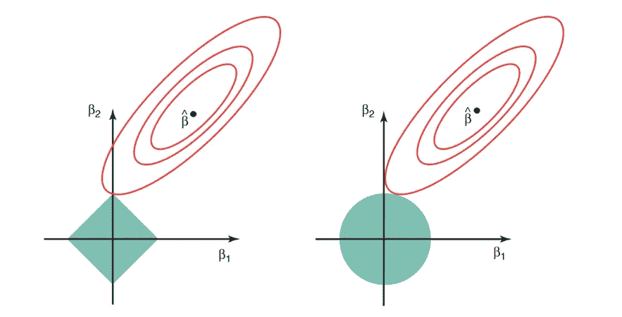

# 机器学习中的正则化

> 原文：<https://towardsdatascience.com/regularization-in-machine-learning-76441ddcf99a?source=collection_archive---------0----------------------->

训练机器学习模型的一个主要方面是避免过度拟合。如果模型过拟合，精度会很低。发生这种情况是因为您的模型过于努力地试图捕捉您的训练数据集中的噪声。 ***我们所说的噪音是指那些并不能真正代表你的数据的真实属性的数据点，而是随机的*** 。学习这样的数据点，使你的模型更加灵活，但有过度拟合的风险。

***平衡偏差和方差的概念，有助于理解过度拟合现象。***

 [## 平衡偏差和方差以控制机器学习中的错误

### 在机器学习的世界里，准确性就是一切。您努力通过调整和…使您的模型更加精确

medium.com](https://medium.com/towards-data-science/balancing-bias-and-variance-to-control-errors-in-machine-learning-16ced95724db) 

> 避免过度拟合的方法之一是使用交叉验证，这有助于估计测试集的误差，并决定哪些参数最适合您的模型。

 [## 机器学习中的交叉验证

### 总是需要验证你的机器学习模型的稳定性。我的意思是，你就是不能让模型符合…

medium.com](https://medium.com/towards-data-science/cross-validation-in-machine-learning-72924a69872f) 

本文将关注一种有助于避免过度拟合并增加模型可解释性的技术。

## 正规化

这是一种回归形式，它将系数估计值约束/调整或缩小到零。换句话说， ***这种技术不鼓励学习更复杂或更灵活的模型，以避免过度拟合的风险。***

线性回归的一个简单关系如下。这里，Y 表示学习的关系，而 *β表示不同变量或预测值(X)的系数估计值。*

***Y≈β0+β1 x1+β2 x2+…+βpXp***

拟合过程涉及一个损失函数，称为残差平方和或 RSS。选择系数，使得它们最小化这个损失函数。

现在，这将根据您的训练数据调整系数。*如果训练数据中有噪声，那么估计的系数将不能很好地推广到将来的数据。这就是正则化的用武之地，它将这些学习到的估计缩小或正则化到零。*

## 里脊回归

上图显示了岭回归，其中 ***RSS 通过添加收缩量进行了修改。*** 现在，通过最小化这个函数来估计系数。这里， ***λ是调节参数，它决定了我们想要对模型的灵活性进行多少惩罚。*** 一个模型的灵活性的增加是通过其系数的增加来表示的，如果我们想要最小化上述函数，那么这些系数需要很小。这就是岭回归技术如何防止系数升得太高。此外，请注意，我们缩小了每个变量与响应的估计关联，除了截距β0，此截距是当 xi1 = xi2 = …= xip = 0 时响应平均值的度量。

*当λ = 0 时，罚项没有 effect* ，岭回归产生的估计将等于最小二乘。然而， ***随着λ→∞，收缩惩罚的影响增大，岭回归 coefficient 估计将趋近于零*** 。可以看出，选择一个好的λ值至关重要。为此，交叉验证很方便。用这种方法产生的系数估计值是 ***也称为 L2 范数*** 。

*****然而，岭回归的情况并非如此，因此，在进行岭回归*** 之前，我们需要标准化预测因子或将预测因子带到相同的尺度。下面给出了实现这一点的公式。**

## 套索

套索是另一种变化，其中上述功能被最小化。很明显，这种变化与岭回归的不同之处仅在于惩罚高系数。它使用|βj|(模数)而不是β的平方作为它的惩罚。在统计学中，这种 ***被称为 L1 常模*** 。

让我们从不同的角度来看看上面的方法。*岭回归可视为求解一个方程，其中系数的平方和小于或等于 s* 。并且*套索可以被认为是一个方程，其中系数的模数之和小于或等于 s* 。这里，s 是对于收缩因子 *λ的每个值都存在的常数。* ***这些方程也被称为约束函数。***

***认为自己是给定问题中的 2 个参数*** 。那么根据上述公式， ***岭回归由β1 + β2 ≤ s*** 表示。这意味着*岭回归系数对于位于由β1 + β2 ≤ s 给出的圆内的所有点具有最小的 RSS(损失函数)*

同样， ***对于套索，方程变成，|β1|+|β2|≤ s*** 。这意味着*拉索系数对于位于由|β1|+|β2|≤ s 给出的菱形内的所有点具有最小的 RSS(损失函数)*

下图描述了这些等式。

Credit : An Introduction to Statistical Learning by Gareth James, Daniela Witten, Trevor Hastie, Robert Tibshirani

***上图显示了套索(左)和岭回归(右)的约束函数(绿色区域)，以及 RSS 的轮廓(红色椭圆)*** 。椭圆上的点共享 RSS 的值。对于非常大的 s 值，绿色区域将包含椭圆的中心，使两种回归技术的系数估计值等于最小二乘估计值。但是，上图中的情况并非如此。在这种情况下，套索和岭回归系数估计值由椭圆接触约束区域的第一个点给出。 ***由于岭回归具有没有尖锐点的圆形约束，所以这种相交一般不会出现在轴上，因此岭回归 coefficient 估计将专门是非零的。*** ***然而，套索约束在每个轴上都有角，所以椭圆通常会在一个轴上与约束区域相交。当这种情况发生时，其中一个 coefficients 将等于零。*** 在更高维度(其中参数远多于 2)，许多 coefficient 估计可能同时等于零。

这揭示了岭回归的明显缺点，即模型的可解释性。它将缩小最不重要预测因子的系数，非常接近于零。但这永远不会使它们完全为零。换句话说，最终的模型将包括所有的预测值。然而，在套索的情况下，当调谐参数λ是 sufficiently 大时，L1 罚函数具有迫使一些 coefficient 估计恰好等于零的 effect。**因此，套索法也执行变量选择，据说能产生稀疏模型。**

## 正规化实现了什么？

标准最小二乘模型往往会有一些差异，即该模型对于不同于其训练数据的数据集不能很好地泛化。 ***正则化，显著降低模型的方差，而不大幅增加其偏差*** 。因此，在上述正则化技术中使用的调谐参数λ控制对偏差和方差的影响。随着λ值的上升，它会降低系数的值，从而降低方差。 ***直到某一点，λ的增加是有益的，因为它只是减少了方差(因此避免了过度拟合)，而没有丢失数据中的任何重要属性。*** 但是在某个值之后，模型开始失去重要的属性，导致模型出现偏差，从而拟合不足。因此，应该仔细选择λ的值。

这是你开始正规化所需要的所有基础。这是一种有用的技术，有助于提高回归模型的准确性。实现这些算法的一个流行库是 [**Scikit-Learn**](https://becominghuman.ai/implementing-decision-trees-using-scikit-learn-5057b27221ec) 。它有一个很棒的 api，只需几行 python 代码就能让你的模型运行起来。

如果你喜欢这篇文章，请务必**为下面这篇文章鼓掌**以示支持，如果你有任何问题，请**留下评论**，我会尽力回答。

为了更加了解机器学习的世界，**跟我来**。这是最好的办法，等我多写点这样的文章就知道了。

你也可以在 [**关注我【推特】**](https://twitter.com/Prashant_1722)[**直接发邮件给我**](mailto:pr.span24@gmail.com) 或者 [**在 linkedin**](https://www.linkedin.com/in/prashantgupta17/) 上找我。我很乐意收到你的来信。

乡亲们，祝你们有美好的一天:)

## 信用

这篇文章的内容来自 Gareth James，Daniela Witten，Trevor Hastie，Robert Tibshirani 的《统计学习导论》