# 正则化:偏差-方差权衡之路

> 原文：<https://towardsdatascience.com/regularization-the-path-to-bias-variance-trade-off-b7a7088b4577?source=collection_archive---------2----------------------->

Photo credit: [Pixabay](https://pixabay.com/en/photos/?order=popular)

DataRobot 的首席产品官 Owen Zheng 说:

> **如果你在没有正则化的情况下使用回归，你必须非常特别。**

任何有监督的机器学习问题的最终目标都是找到一个模型或函数来预测一个目标或标签，并且*在所有可能的输入和标签上最小化期望误差*。最小化所有可能输入的误差意味着函数必须能够对未知输入进行归纳和准确预测。换句话说，机器学习的基本目标是让算法在训练集之外进行推广。因此，[正则化](https://en.wikipedia.org/wiki/Regularization_(mathematics))简单来说就是引入附加信息以解决不适定问题或防止过度拟合的过程。

## 说明性示例

假设我们想根据一个独立变量——教育水平来预测某人的工资。我们可以在拉各斯随机选择 1000 人，给他们每个人打电话，问他们的工资。如果我们拟合一条年龄对工资的曲线，我们能准确地用这条曲线来预测所取数据中人的年龄吗？你我都知道这个模式会失败，因为太简单了。这就是所谓的具有高偏差或拟合不足的模型。

假设我们现在从 10 个不同的城市取样，询问受访者的年龄、性别、教育水平、职业和工作经验、父母的职业、体重、身高、最好的食物等等。它变得更加复杂。我们的模型现在可以对我们的训练数据进行归纳和很好的预测。但是它能对其他它没有见过的测试集做出好的预测吗？不会，因为它会像记忆了数据一样一直粘在数据上。这就是我们所说的过度拟合。当一个学习者输出一个对训练数据 100%准确而对测试数据 50%准确的模型时，当它可以输出，比如说对训练和测试数据都是 80%准确时，它已经'**过度拟合了**。因此，我们说我们的模型有很高的方差，这就是正则化想要解决的问题。

这是一个线性回归问题，我们知道我们的独立变量(年龄、受教育程度等)会以不同的权重组合来预测工资。现在我们的正则化技术来了。我们希望惩罚或调整独立变量的每个权重，这样它就可以对一个以前没有见过的测试集做出很好的预测。换句话说，我们说正则化通过缩小每个特征的贡献来执行特征选择。正则化将有助于在高偏差的第一种情况和高方差的第二种情况之间选择一个中点。就偏差和方差而言，一般化的理想目标是低偏差和低方差，这几乎不可能或难以实现。因此，需要权衡取舍。我们可能不得不将训练数据的准确率从 100%降低到 80%,而将未知数据的准确率从 50%提高到 80%。下图说明了偏差-方差分解。

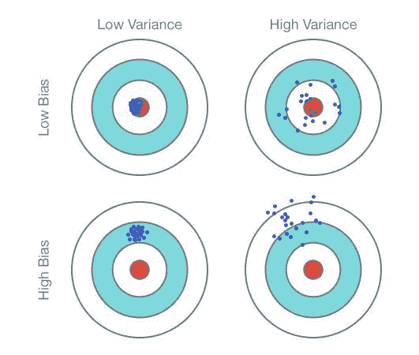

Fig. 1: Graphical Illustration of bias-[variance trade](#)-off , Source: *Scott Fortmann-Roe., Understanding Bias-*[*Variance Trade*](#)*-off*

数学理解

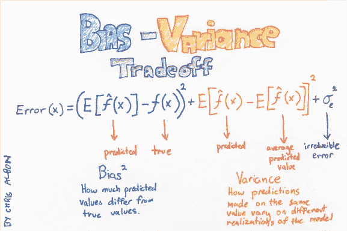

Machine Learning Flashcard by Chris Albon

当我们说我们有一个对测试和训练数据进行良好预测的算法时，这意味着该算法绘制了一条使误差平方和最小化的回归线。MSE 是我们的实际值(y 或 f(x))和预测值之间的平方差的平均值。详细的数学证明可以在这里找到[。](https://robjhyndman.com/files/2-biasvardecomp.pdf)

模型 f(x)越复杂，它捕获的数据点就越多，偏差就越低。然而，复杂性将使模型“移动”更多以捕捉数据点，因此其方差将更大。

从抽认卡中可以看出，为了减少偏差，我们必须确保预测的期望值尽可能接近真实值，这意味着我们要增加偏差方程中预测值的平均值。随着预测值平均值的增加，方差公式中第二项的平均预测值也会增加。如果我们增加太多，那么它将远远大于单点的预测值，这将使方差增加更多(高方差)。但是，如果期望值或预测值的平均值增加，使其小于单个点，则方差将在此过程中最小化。因此，当我们调整模型时，我们必须观察它对方差和偏差的影响。
不可约误差作为泛化误差是无法避免的。这是一个来自我们数据集中噪音的错误。然而，在预处理过程中通过有效的数据清理可以减少这种情况。

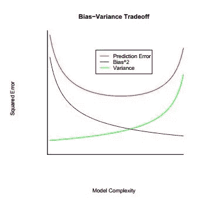

Graph showing relationship between model complexity and the squared error.

## **可视化正规化**

本节讨论带有随机噪声的模拟正弦数据的图形表示。这将用于测试不同模式的模型选择与正则化。

下图清楚地显示了确保我们在训练样本/数据上获得最佳拟合线的尝试。可以看出，随着模型复杂度随着多项式次数的增加而增加，该模型试图捕获所有数据点，如 20 次多项式所示。作为一个 20 次多项式，该模型已经记忆了数据集，并且由于高方差而过度拟合数据。但是在 2 次多项式中，模型相对于数据有很大的偏差。

多项式次数为 2 时，我们有高偏差，多项式次数为 20 时，我们有高方差和低偏差。我们现在将使用正则化来尝试减少方差，同时将偏差上移一点。所有插图都将形象化。但是，也可以使用定量可视化，如观察特征的均方误差、观察系数和截距。

因此，当我们的模型过度拟合时，正则化可以派上用场，这将在随后的会议中讨论。

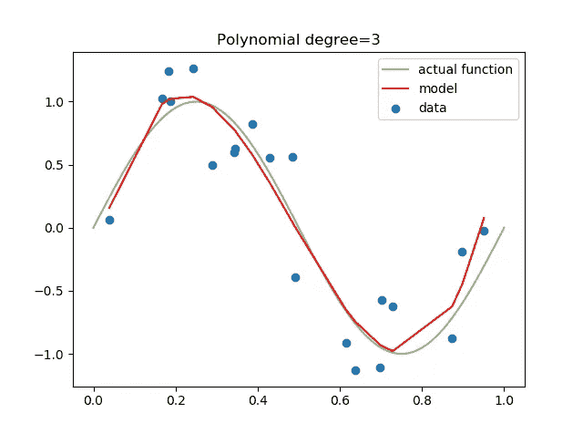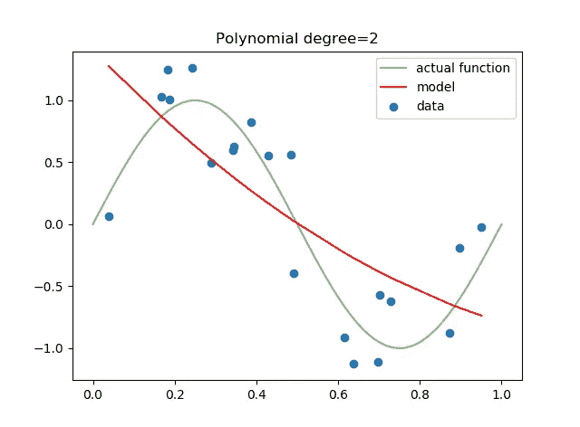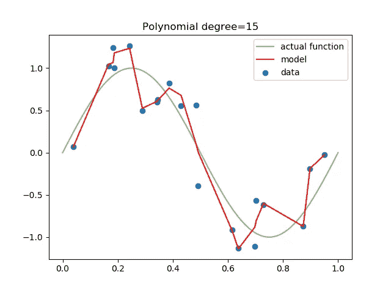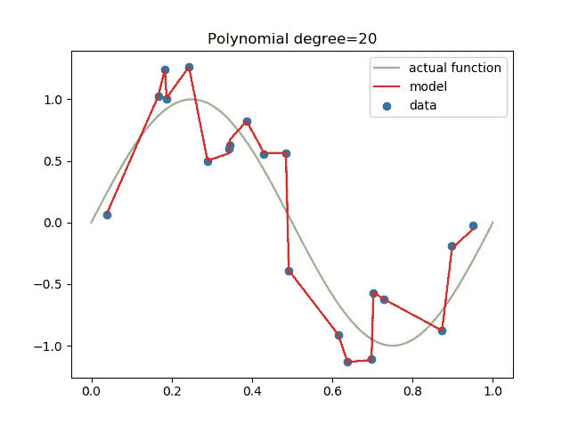

Varying polynomial degrees model on on training data

## 我们如何使用 20 次多项式并防止过度拟合？:正规化

# 里脊回归

岭回归是一种正则化技术，它使用 L2 正则化对系数的大小施加惩罚。因此，最小化惩罚后的剩余平方和。正则化参数(根据文本使用α或λ)。目标是最大限度地减少:

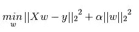

α控制系数的大小和正则化的量。必须对其进行适当的调整，否则我们旨在使用正则化来校正的过度拟合模型将会变得欠拟合。当λ=1 时，这可以在下图中观察到。

岭回归交叉验证可用于选择最佳λ值，以确保选择最佳模型。

下面可以观察到，仔细选择作为我们的正则化参数的λ可以帮助消除过拟合。

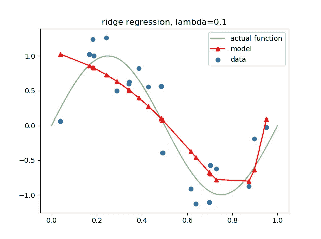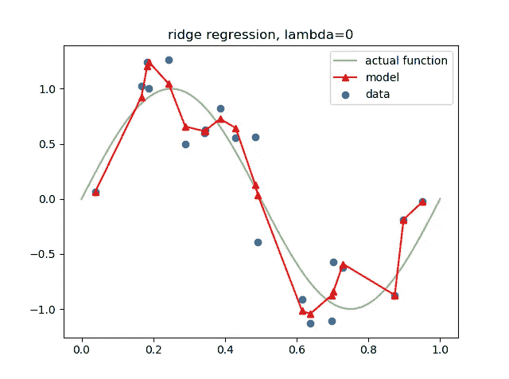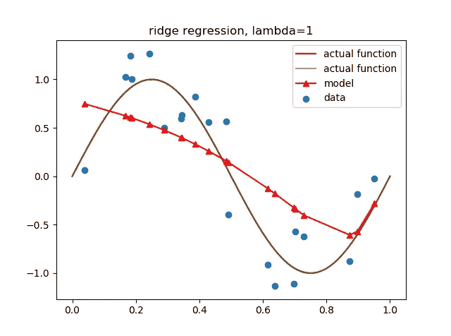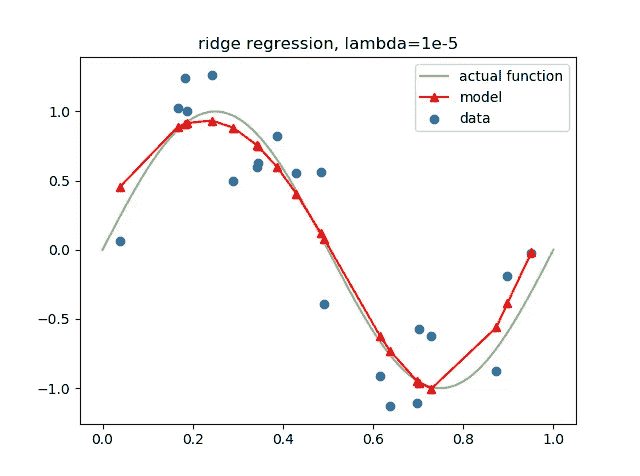

Plots showing the effect of varying lambda on model

# 套索回归

Lasso 回归使用 L1 正则化技术作为系数大小的惩罚。然而，我们不是使用重量的平方来施加惩罚，而是采用重量的绝对值。目标是最大限度地减少:

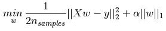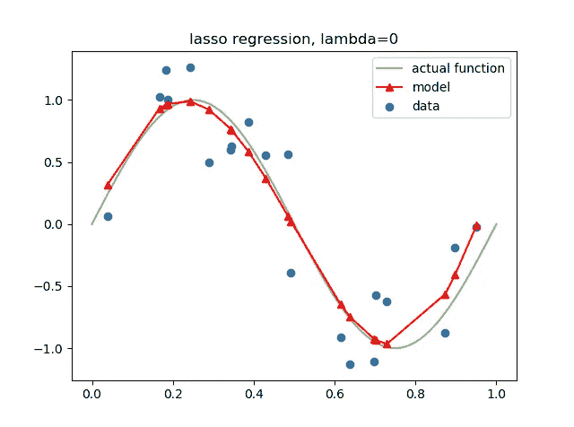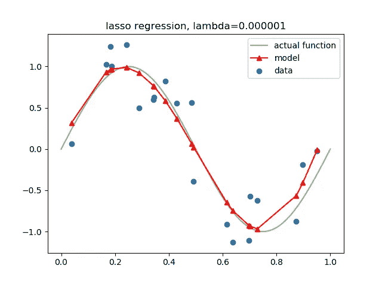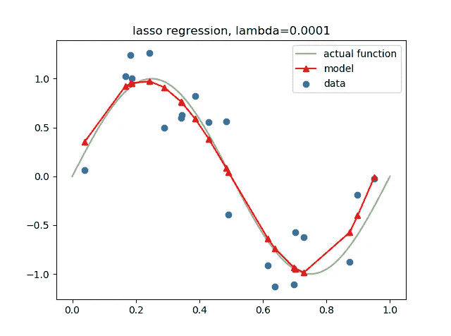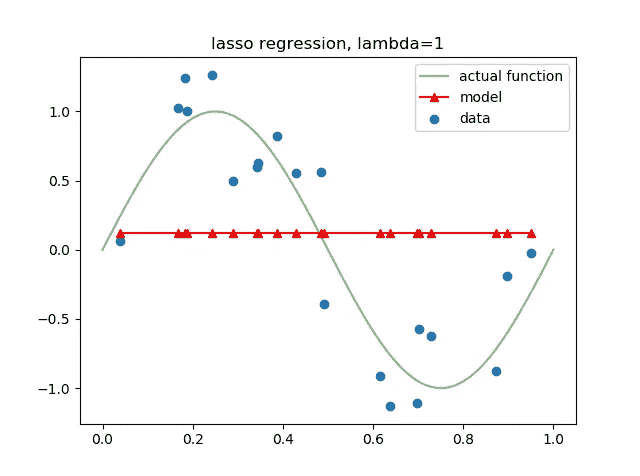

Plots showing the effect of varying lambda on lasso regression model

# 弹性净回归

弹性网络结合岭(L2 作为正则)和套索(L1 作为正则)来训练模型。目标是最大限度地减少:

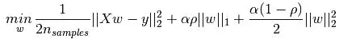

我们还可以看到，随着λ的增加，系数的损失也增加。这导致最终欠拟合，如λ=1 时所示。

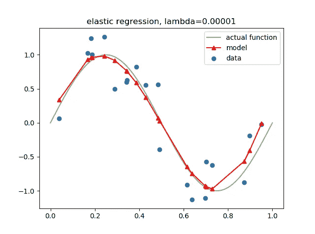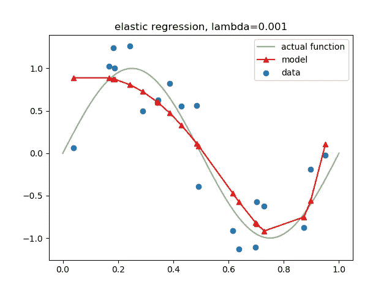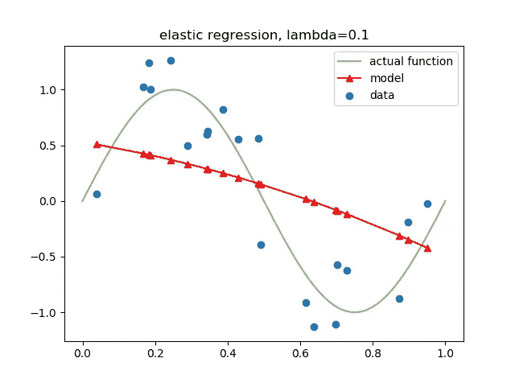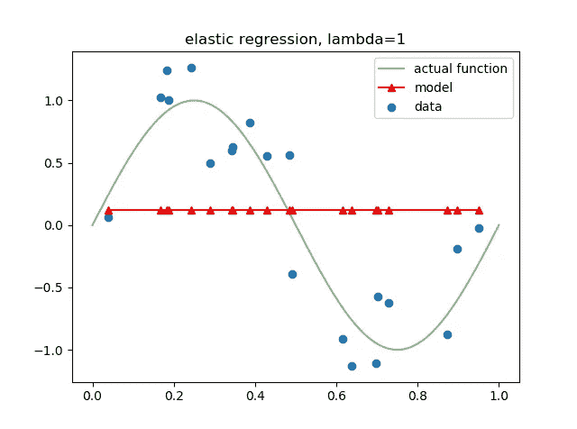

Plots showing the effect of varying lambda on lasso regression model

## 最终礼物

这篇文章并不详尽，因为关于正则化技术还有很多内容要写。我们可以看看[这篇论文](http://homes.cs.washington.edu/~pedrod/papers/cacm12.pdf)中关于机器学习的一些小知识和 scikit 的学习文档[其他技术](http://scikit-learn.org/stable/modules/linear_model.html)。

我们也可以使用交叉验证结合不同的回归技术，旨在正则化我们的模型，以选择正则化参数的最佳值。

我的下一篇与正则化相关的文章将讨论线性回归的前向和后向消除算法的特征选择。敬请关注。

不要忘记分享和一些掌声给更多的人。谢谢你。

我有空 [@Holafisayo](https://twitter.com/HOlafisayo) 。