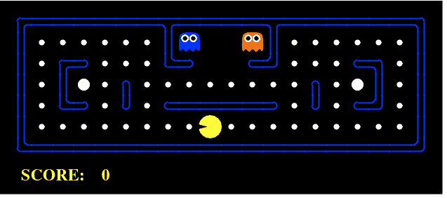
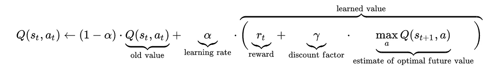
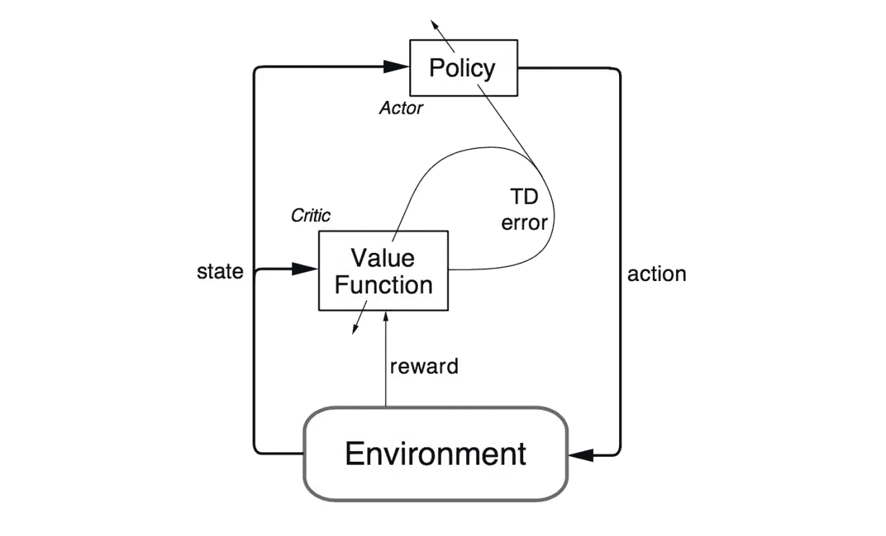

# 强化学习 101

> 原文：<https://towardsdatascience.com/reinforcement-learning-101-e24b50e1d292?source=collection_archive---------0----------------------->

## 学习强化学习的要领！

Photo by [Daniel Cheung](https://unsplash.com/@danielkcheung) on [Unsplash](https://unsplash.com/)

强化学习(RL)是现代人工智能领域最热门的研究课题之一，其受欢迎程度还在不断增长。让我们看看开始学习 RL 需要知道的 5 件有用的事情。

# **1。什么是强化学习？** **与其他 ML 技术相比如何？**

强化学习(RL)是一种机器学习技术，它使代理能够在交互式环境中使用来自其自身行为和经验的反馈通过试错来学习。

虽然监督学习和强化学习都使用输入和输出之间的映射，但与监督学习不同，监督学习向代理提供的反馈是执行任务的**正确的动作集**，强化学习使用**奖励和惩罚**作为积极和消极行为的信号。

与无监督学习相比，强化学习在目标方面是不同的。虽然无监督学习的目标是找到数据点之间的相似性和差异，但在强化学习的情况下，目标是找到一个合适的动作模型，使代理的总累积报酬最大化。下图显示了通用 RL 模型的**行动奖励反馈回路**。

# **2。如何公式化一个基本的强化学习问题？**

描述 RL 问题基本要素的一些关键术语是:

1.  **环境—** 代理运行的物理世界
2.  **状态—** 代理人的现状
3.  **奖励—** 环境的反馈
4.  **策略—** 将代理的状态映射到动作的方法
5.  **价值—** 代理在特定状态下采取行动将获得的未来回报

一个 RL 的问题可以通过游戏得到最好的解释。就拿 [**吃豆人**](https://en.wikipedia.org/wiki/Pac-Man) 这个游戏来说，代理人(吃豆人)的目标是吃掉格子里的食物，同时避开途中的鬼魂。在这种情况下，网格世界是代理的交互环境。代理人会因为吃了食物而得到奖励，如果被鬼魂杀死(输掉游戏)则会受到惩罚。状态是代理在网格世界中的位置，总的累积奖励是代理赢得游戏。

为了建立一个最优策略，代理人面临着探索新状态，同时最大化其整体报酬的困境。这就是所谓的**勘探与开发**权衡。为了平衡这两者，最好的整体策略可能需要短期的牺牲。因此，代理应该收集足够的信息，以便在未来做出最佳的整体决策。

[**马尔可夫决策过程**](https://en.wikipedia.org/wiki/Markov_decision_process)**【MDPs】**是描述 RL 中环境的数学框架，几乎所有的 RL 问题都可以用 MDPs 来公式化。一个 MDP 由一组有限的环境状态 S，一组在每个状态下的可能动作 A(s)，一个实值奖励函数 R(s)和一个转移模型 P(s '，s | a)组成。然而，真实世界的环境更可能缺乏任何关于环境动态的先验知识。在这种情况下，无模型 RL 方法就派上了用场。

[**Q-learning**](https://en.wikipedia.org/wiki/Q-learning)**是一种常用的无模型方法，可用于构建自玩 PacMan 代理。它围绕着更新 Q 值的概念，Q 值表示在状态 *s* 中执行动作 *a* 的值。下面的值更新规则是 Q 学习算法的核心。**

****

**这里有一个使用深度强化学习的 PacMan 代理的视频演示。**

# ****3。最常用的强化学习算法有哪些？****

****Q-learning** 和 **SARSA** (状态-动作-奖励-状态-动作)是两种常用的无模型 RL 算法。它们的勘探战略不同，但开发战略相似。Q-learning 是一种非策略方法，其中代理基于从另一个策略导出的动作 a*来学习值，而 SARSA 是一种策略方法，其中它基于从其当前策略导出的当前动作 *a* 来学习值。这两种方法实现起来很简单，但是缺乏通用性，因为它们不具备估计未知状态值的能力。**

**这可以通过更高级的算法来克服，例如使用神经网络来估计 Q 值的 [**深度 Q 网络(DQNs)**](https://deepmind.com/research/dqn/) 。但是 dqn 只能处理离散的、低维的动作空间。**

**[**【DDPG】**](https://arxiv.org/abs/1509.02971)深度确定性策略梯度是一种无模型、非策略、行动者-批评家算法，通过在高维、连续的动作空间中学习策略来解决这个问题。下图是**演员兼评论家**建筑的代表。**

****

# ****4。强化学习有哪些实际应用？****

**由于 RL 需要大量数据，因此它最适用于模拟数据容易获得的领域，如游戏、机器人。**

1.  **RL 在构建用于玩电脑游戏的 AI 方面应用相当广泛。 [**AlphaGo Zero**](https://deepmind.com/blog/alphago-zero-learning-scratch/) 是第一个在中国古代围棋比赛中击败世界冠军的计算机程序。其他包括雅达利游戏，西洋双陆棋等**
2.  **在机器人和工业自动化中，RL 用于使机器人能够为自己创建一个高效的自适应控制系统，该系统从自己的经验和行为中学习。 [DeepMind 的工作](https://deepmind.com/research/publications/deep-reinforcement-learning-robotic-manipulation/)关于**利用异步策略** **更新**进行机器人操作的深度强化学习就是一个很好的例子。观看这个有趣的演示视频。**

**RL 的其他应用包括抽象文本摘要引擎、可以从用户交互中学习并随时间改进的对话代理(文本、语音)、学习医疗保健中的最佳治疗策略以及用于在线股票交易的基于 RL 的代理。**

# ****5。强化学习怎么入门？****

**为了理解 RL 的基本概念，可以参考以下资源。**

1.  ****强化学习——一本介绍**的书，作者是强化学习之父——[**理查德·萨顿**](https://en.wikipedia.org/wiki/Richard_S._Sutton) 和他的博士生导师 [**安德鲁·巴尔托**](https://en.wikipedia.org/wiki/Andrew_Barto) 。这本书的在线草稿可以在[这里](http://incompleteideas.net/book/the-book-2nd.html)找到。**
2.  **[**教材**](http://www0.cs.ucl.ac.uk/staff/d.silver/web/Teaching.html) 来自**大卫·西尔弗**包括视频讲座是一门很棒的 RL 入门课程。**
3.  **下面是另一个关于 RL 的 [**技术教程**](http://people.eecs.berkeley.edu/~pabbeel/nips-tutorial-policy-optimization-Schulman-Abbeel.pdf) ，作者是**彼得·阿比尔**和**约翰·舒尔曼**(开放人工智能/伯克利人工智能研究实验室)。**

**对于开始构建和测试 RL 代理，以下资源可能会有所帮助。**

1.  **[**这篇博客**](http://karpathy.github.io/2016/05/31/rl/) 讲述了 Andrej Karpathy**如何利用原始像素的策略梯度来训练神经网络 ATARI Pong 智能体**将帮助您在仅 130 行 Python 代码中建立并运行您的第一个深度强化学习智能体。**
2.  **[**DeepMind Lab**](https://deepmind.com/blog/open-sourcing-deepmind-lab/) 是一个开源的 3D 类游戏平台，为基于智能体的人工智能研究创建了丰富的模拟环境。**
3.  **项目马尔默 是另一个支持人工智能基础研究的人工智能实验平台。**
4.  **[**OpenAI gym**](https://gym.openai.com/) 是一个构建和比较强化学习算法的工具包。**