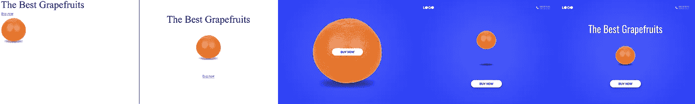
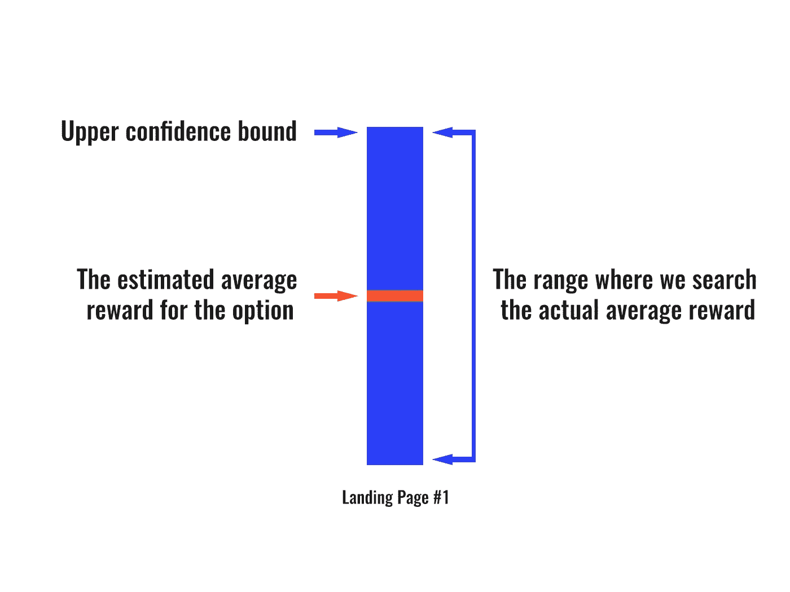
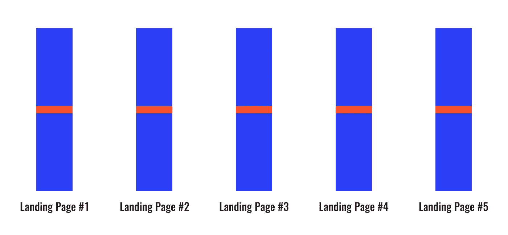
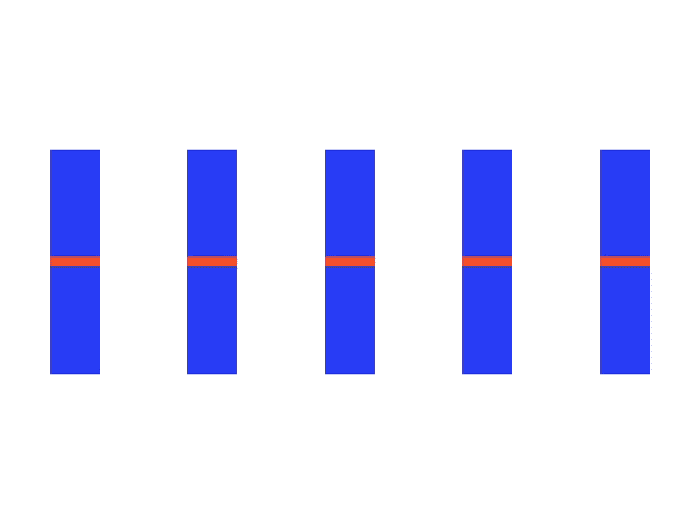
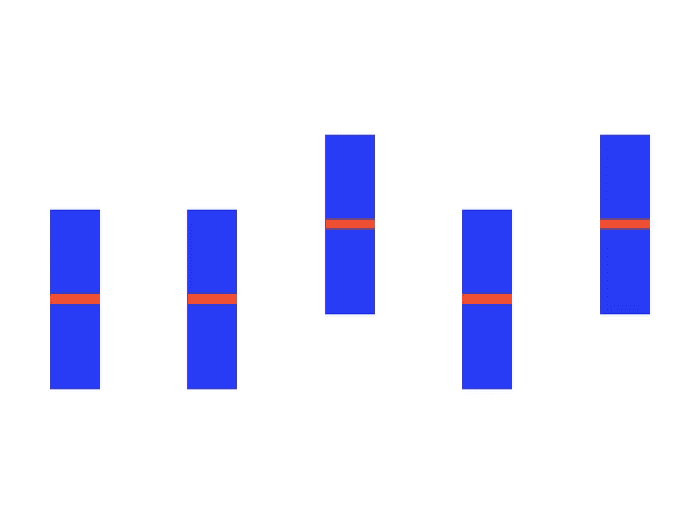
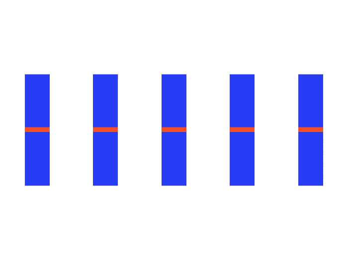
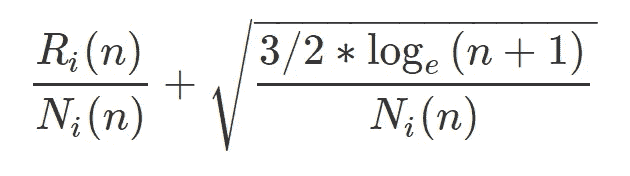
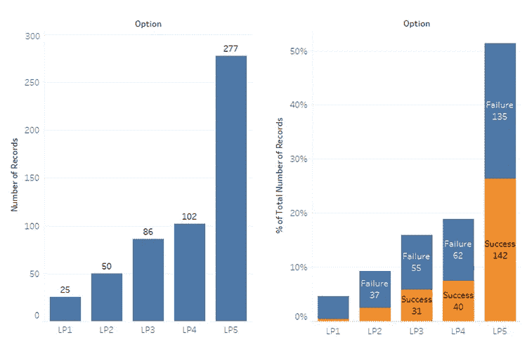

# 如何产生更多的销售线索并降低成本？A/B 测试 vs 强化学习。

> 原文：<https://towardsdatascience.com/reinforcement-learning-64730aaa46c9?source=collection_archive---------12----------------------->

## 你会发现进入机器学习世界的迷人而直观的旅程，其中有有趣的实验和非常有用的结论。

营销人员经常使用 A/B 测试——一种比较产品的两个或更多版本(广告、设计、登陆页面等)的技术。)来评估它们中的哪一个更好地执行其功能。但是你想知道如何达到同样的目标，得到好得多的结果，降低成本吗？在这篇文章中，我将告诉你强化学习。

## 下面您将了解到:

*   A/B 测试最大的问题是什么，如何解决
*   机器如何学习
*   如何在强化学习的帮助下优化几乎任何网络产品
*   简单而强大的置信上限算法
*   如何实际实现置信上限算法(以 Node.js 为例)

# 市场营销中的多臂强盗问题

在概率论中，有所谓的多臂土匪问题。让我们以登录页面为例深入探讨这个问题。

假设你有 5 个版本的登陆页面。众所周知，在最初几秒钟内保持网站用户的注意力是非常重要的。但是如何选择最能应对这种情况的版本呢？

第一个(也是不好的)解决方案是 A/B 测试。我们可以向用户展示我们的登陆页面的随机版本，并根据大量访问的结果，确定哪个版本的性能更好。

## 你为什么不应该这样做？

1.  你将花费金钱和时间来推广你网站的“坏”版本
2.  你的企业服务的潜在客户可能会离开，因为他们对你的登录页面的“坏”版本
3.  结果你得到的统计数据没什么用，因为大多数用户已经看过你的登陆页面了

如果机器本身能够决定你的登陆页面哪个版本效果最好，那该多好啊……而且是有可能的！

# 机器如何学习

因此，强化学习是一种机器学习，机器通过试错来学习如何达到目标。每一个动作机器都会获得一份奖励。机器的主要目标是报酬最大化。在我看来，它是最有趣的机器学习类型。它用于训练机器人行走，以及训练无人机自主飞行。使用这种算法的最有趣的例子可以在这个视频中看到。

我给你看一个简单但非常有效的强化学习算法——置信上限。

# 置信上限

好，假设我们的登录页面有以下选项:

1.  糟糕透了。10%的用户将成为客户
2.  不好。20%的用户将成为客户
3.  中等。30%的用户将成为客户
4.  很好。40%的用户将成为客户
5.  太好了。50%的用户将成为客户

Landing Pages

一开始，我们不知道哪个版本更好，哪个版本更差。我们的任务是让机器解决这个问题。

## 我们开始吧！

啊，不对，先表示一件事……注意这个方案。这对我们将来会有用的。

# 我们终于开始了！

## 第一步

现在我们登陆页的每个版本都有“平权”。我的意思是，它有相等的估计平均回报和相同的范围，我们将搜索实际的平均回报。让我们向用户展示一次网站的每个版本。

发生了什么事？

访问了我们登录页面第一版的客户还没有成为客户。对于这个选项，机器的回报是 0。这个选项的估计平均回报变低了，我们搜索实际平均回报的范围也缩小了。

同样的事情也发生在第二版和第四版上。

选项#3 和选项#5 会出现相反的情况。访问过这些版本的登录页面的客户已经成为客户。对于这些选择，机器的回报是 1。这些选项的估计平均回报已经变得更大，我们搜索实际平均回报的范围已经缩小。

## 步骤 2+

厉害！现在让我们看看我们的范围的上限。第三个和第五个选项具有最大的上限。因此，现在他们是我们的最佳登陆页面的主要候选人。

新访问者已经看到了站点版本#3。他也没有成为我们的客户。但是来到 5 号站点的访问者变成了买家！我们登陆页面的哪个版本是领导？是的，5 号。我想你已经明白了主要意思。

**让我们看看整个过程。**

当然，这个过程被大大加速了，但是我认为这个想法是明确的。通过反复试验，机器本身找到了我们网站的最佳版本，并越来越准确地向用户展示它。

## 如何计算置信上限？

公式如下:

其中:

*   *n* 是访客总数；
*   N *i* ( *n* )是登陆页面 *i* 展现给访问者 *n 的次数；*
*   R *i* ( *n* )是登陆页面 *i* 到访客*n*的奖励总和

一切都比看起来简单得多。使用 UCB，你不需要深入研究数学。

# 实验时间到了！

我使用 Node.js 和 Firebase 创建了一个工作示例。我绝对不想让你厌烦阅读代码，所以那些感兴趣的人可以在这里看到它。

现在让我们把注意力集中在结果上。在对我们的登录页面进行了 540 次访问后，我们看到了下图:

我们可以肯定，机器处理了任务，并找到了我们的登录页面的最佳版本。 **277/540** 用户已经看到登陆页面# 5。

**228/540** 游客变成了顾客！为了进行比较，我随机选择了登陆页面版本(就像 A / B 测试一样)来模拟这种情况，只有 **148/540** 访问者成为了客户。

恭喜你！我们刚刚将付费用户的数量增加了 1.5 倍。

# 结论

我相信你毫不怀疑强化学习可以给几乎任何网络产品带来巨大的价值。重要的是，它实现起来非常简单。

如果你还有问题，请在评论中提问，我很乐意回答。