# 强化学习。

> 原文：<https://towardsdatascience.com/reinforcement-learning-79ffd92886a7?source=collection_archive---------5----------------------->

我们人类从日常活动中学到了很多东西。我们观察我们的环境，采取一些行动，看看我们的行动如何影响我们的环境，并采取我们的下一步行动。强化学习类似于系统建模或编写计算机程序，其中系统看到或观察其环境，并采取一些行动来实现某些目标。

在这个博客中，我们将从零开始，学习蒙特卡罗估计方法，并训练一个代理来实现一个目标。特别是，我们将学习训练一个代理来平衡一个推车杆！！我们还将学习如何将方程式转换成代码，并亲眼看看它是如何工作的。

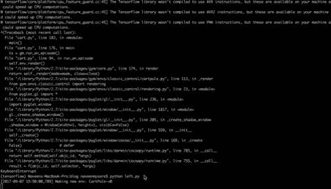

Pushing cart towards left.

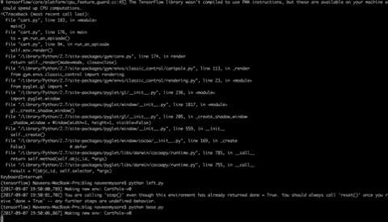

pushing cart towards right.

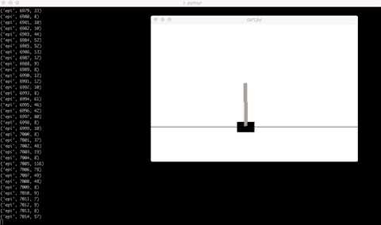

Trained agent taking correct decions.

萨顿的经典教科书和大卫·西尔弗的 T2 讲座是详细理解主题的最佳途径，但是如果他/她应用这些概念，建立一些东西并看到它为自己工作，他/她会学得更好，这也是这篇博客的主要动机。如果你看过他的讲座，这个博客会非常有用，但如果没有，不要担心，我已经尽力用简单的方式解释了这些概念。

我们将以经典的推车杆子游戏环境为例，通过它学习强化学习(RL)。在 RL 设置中，我们将试图学习的东西称为*代理*。在这篇博客中，我将交替使用代理/我们。例如，在动物中，大脑是一种媒介。在计算机中，你的 RL 代码是一个代理。人类进化得如此复杂，以至于即使是我们最顶尖的研究人员也不知道它是如何学习一切的。当人们说人工智能的时候，你需要意识到它不是什么超级有意识的东西，它能够像人类一样学习一切，交流和行动！！这只是一个如预期运行的代码。神经网络只是其中很小的一部分，重要的是你的设计系统如何使用这些网络。类似地，我们的 RL 程序只能学习我们要编程做的事情。

RL Setup

在典型的 RL 设置中，我们的代理通过在时间 *t* 采取一些动作(在的*)来与环境交互。代理采取的动作也通过修改环境改变了环境，或者如果代理移动了，那么它的摄像机/传感器视角将会改变，所以代理将会看到新的状态( *St+1* )。就像我们一样，你看到一些东西，闭上眼睛向前迈一步，然后你会发现你所看到的和你之前看到的有些不同。如果智能体的行为是好的，环境会给予奖励( *Rt+1* )。使用这些奖励代理将学到一些东西，看到这个新的国家代理将采取新的行动。而且还在继续。让我们通过例子来理解这一点，首先让我们设置我们的环境。*

**设置**

OpenAI 通过他们的 OpenAI 健身房提供 RL 环境。看一看。我们将使用 Cartpole 环境。这里是设置您的环境的[链接](https://gym.openai.com/docs)。一旦你安装好了，试一下这段代码。

你会看到一个车杆游戏环境将显示，并按照代码。我们将随机抽样一个动作( *0 或 1* ) 0 表示左，1 表示右，我们通过调用 env.step 来采取该动作，然后我们得到采取该动作的结果。结果将是新的状态，奖励，终端，信息。终端指示游戏是否已经结束(如果游戏结束，则为真)。现在，如果您打印 new_state 值，您将会看到类似于[28.53394423 4.91374739-43.098292439-9.这是一个 1×4 的向量。这个向量中的每一个值都代表一个类似角度的东西，或者是从中心移动的距离。这个向量中的每个唯一的数字代表那个推车杆子的唯一的状态。现在，我们的目标是利用这些向量，通过决策而不是随机行动来选择行动，并查看我们的行动如何使车杆移动。如果这些值中的一个变得极端，比如只采取向左的动作(向左推)，将导致新的状态向左移动，如果购物车越过某个阈值，游戏将结束。类似地，如果杆子掉下来或形成极端角度，游戏结束。在每个时间步，我们/代理都有两种可能的操作(向左推或向右推)。我们需要观察我们的推车杆子是如何移动的，并调整我们的动作，使杆子停留在同一个地方。这是你只向左推时的样子。

Pushing cart to left.

**状态**

状态可以是描述代理当前状况的任何东西。例如，让我们说你正在玩玉米迷宫游戏。如果将位置视为州，什么参数可以唯一地描述您的位置？我们可以选择人的纬度，经度和方向作为状态，我们可以用向量数组[37.338，-121.88，0.234]来表示它们，或者让我们说你正在教机器人移动，然后我们可以考虑像传感器读数，它的摄像头，位置等作为状态表示。显然传感器越多，我们就能越独特地识别它的状态。

**目标**

如果你考虑任何动物，它做的每一件事，都是为了最大化某样东西。比如你为了考试努力学习，让成绩最大化。在这种情况下，你的学校、班级、家庭、考试都是环境的一部分。你采取行动学习，环境根据成绩给你奖励。如果你成绩不好，你会努力学习，这样下次考试你就能提高成绩。最终，你试图最大化你的成绩。请注意，你不会一学习就立即获得奖励，但奖励会延迟。所以当我们说我们得到了奖励时，我们需要考虑从你的学习时间到考试时间到结果日的所有事情。让我们在下一节量化这个目标和奖励。

在手推车杆的情况下，平衡杆是我们的目标

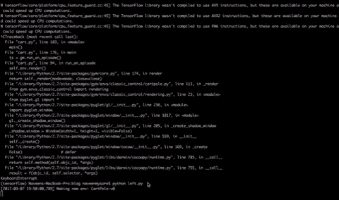

initial agen`t effort

Goal achieved

**奖励**

在代码中，如果你打印奖励值，你会看到它的 1。实际上，你可以定义你想要的任何奖励，但让我们理解这个术语叫做*贴现回报*。

每当你处于一种状态时，你采取一个行动，你就会得到一些奖励(比如说 1)。在游戏设置中，如果你一直向左推手推车，你会看到有东西向右移动，杆子倒了(试试看)。

根据代码，您只需向左/向右推，每次设置时，您将获得 1 的奖励，在某个点上，极点会高于/低于阈值，游戏结束。那么，我们得到的总回报是多少呢？

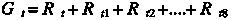

我们说 t=1 时的总收益是 8。类似地，如果你想计算 t3 时刻的回报。只需添加从时间步长 t3 开始的所有返回。你可以这样想。从游戏第 1 帧的回报是游戏结束前所有奖励的总和。游戏框架 4 的回报(time_step = 4)是游戏框架 4 上所有奖励的总和。或者一般来说，如果一个博弈在时间步长 tn 结束，你想从时间步长 t 开始计算收益。我们可以这样表示。

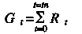

现在有一个问题。有些环境，比如这个横竿，是终结性的，也就是说，在某个时刻游戏结束了(如果你采取了错误的行动)。然而，有些环境可能没有终点，比如说你正在教一个代理阅读英语，这里没有有限的终点。我们需要将我们的回报推广到所有代理商。概括来说，我们添加额外的*终端状态*，称为 *ST* 。终结状态的特殊属性是它永不结束的 ie。如果您进入终端状态，我们将返回到相同的终端状态。同样进入终极状态会给你 0 奖励。现在不要担心终端状态，你最终会明白的。但是，现在稍微修改一下，我们可以把方程写成。

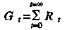

其中 t 从 0 到无穷大。如果你注意到 Gt 的值没有改变，因为在终端状态我们得到 0 奖励。即使我们向无穷大求和。

现在还有一个关于非终态环境的问题。就像那个英语阅读问题，我们可以看到，如果我们不断增加奖励，GT 值就会爆炸。此外，对于在时间 t 采取的行动，我们在下一个时间步骤获得的奖励(即时奖励)很重要，而从下一个时间步骤获得的奖励(延迟奖励)很不重要，等等。概括来说，我们引入了*折扣奖励*。在某些情况下，只有在你实现了某些目标之后，奖励才会到来。因此，我们需要在设计我们的系统时牢记这些事情。因此，给这些奖励增加权重是一个开始。ie 奖励在每一个时间步会被一些伽玛因子打折。现在我们可以想象所有这些。

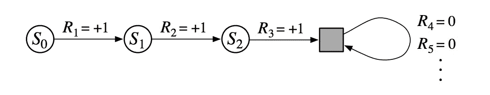

state to state transitions with rewards and terminal state.

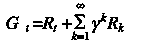

Discounted return

在一些初始状态下，我们采取一些行动，我们得到回报 R1，然后我们的新状态是 S1，我们采取一些行动，我们得到回报 R2，等等。在 S2，我们/代理人做了一些不好的行为，把我们/代理人推到了某种终结状态，因此从那时起，我们得到的奖励为 0。

现在，为了计算回报 Gt，我们采用下一个奖励(即时奖励)并通过用 gamma 对所有其他奖励进行贴现来添加所有其他奖励。典型地，我们保留 1 作为正奖励，对于终止前的最后一个状态，我们给出负奖励，因为在那个状态中，我们的代理采取了不好的行动，并以终止状态结束。

让我们运行一个简单的代码来看看它的作用。

Total returns for different states in an episode.

浏览代码，看看状态是如何转换的。在时间步骤 1，我们处于初始状态。我们果断地采取了行动 1，结果我们进入了新的状态。从那个状态我们再次确定性地采取行动 1，以此类推。在时间步骤 t=11 时，我们处于状态[ 0.15274551，1.70880722，-0.17696351，-2.69724965]并采取行动 1，我们到达最后状态[ 0.18692165，1.90472068，-0.2309085，-3.03828657]。尽管 reward 显示 1，但在计算回报时，我们会将其设置为-10。之后我们可以用 0.9 的折现率来计算回报

*注意这里重要的一点，为了计算一个州的回报，我们必须等到游戏结束。*我们可以将一场比赛作为一集来运行。如果我们运行两个游戏，我们可以说我们运行了两集。在文学作品中，它通常被称为展开。

让我们稍微修改一下代码，看看 10 个不同情节的第一个状态和最后一个状态的返回结果。注意每集的长度是如何变化的！！这就是我们用终端状态，导出一般返回函数 Gt 的原因。不管每集的长度如何，我们可以从时间 sigma 到无穷大，因为最终状态的回报为零，所以我们的回报在每集中都是一致的。这里是 10 个不同剧集的状态 s1 和 st(最后一个状态)的总回报计算代码。

Total returns for state s1 and st(last state) for 10 different episodes.

**马尔可夫性质和马尔可夫决策过程。**

到目前为止，我们已经确定地选择了单个动作(左/右)。我们没有考虑任何直观的方式来决定采取哪些行动。在我们能够跳到决策之前，我们需要知道整个状态动作转换是如何发生的。在现实世界中，宇宙决定了转变应该如何发生。例如，如果你制作一架纸飞机，并将其射向目标，即使你的目标是完美的，风、湿度、摩擦等宇宙因素将决定你的飞机是否应该击中目标。

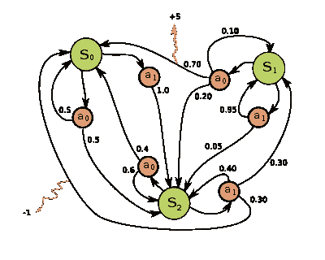

Finite MDP

横竿是一个简单的环境。让我们考虑一个通用环境。假设这个环境只有 3 个状态，在每个状态下你可以采取行动 a0 或 a1。在现实世界中，一切都是随机发生的，也就是说，假设你处于状态 S0，那么有 30%的几率你会采取行动 a0，有 70%的几率你会采取行动 a1。假设你选择了 ao 行动，那么可能有 50%的机会你可以转到 S2，或者可能你会回到同一个州，任何事情都可能发生！！。上面提供的例子是有限 MDP，因为有有限数量的状态，即 3.在 cartpole 的情况下，可以有任何数量的状态，所以我们可以使用所谓的棒图和贝尔曼方程来捕捉它们。在每一个状态中，环境控制着你如何过渡到下一个状态。给定一个状态，每个行为都会有一些概率，我们知道只有在我们采取行动后，我们才会得到回报。

我们应该知道如何将信息编码到每个状态，这样当我们处于特定状态时，我们就可以看到采取这些行动的可能性和价值。如果状态能保持这样的值，它们被称为具有马尔可夫性。一旦我们到达本博客中关于状态值 V(s)和 Q 值 Q(s，a)的部分，你将更好地理解每个状态如何保持值，并且我们可以使用马尔可夫决策过程来采取正确的行动。在我们开始寻找这些状态的值之前，让我们给这些概率项取一些名字。

**政策**

在一个给定的状态下，将会有与支配我们的代理行为的每个动作相关的概率。例如，如果机器人是一个代理人，比方说在一个特定的状态(山顶)有大风吹，有时把机器人推到悬崖，那么机器人应该避免去那个状态。机器人可以通过减少与导致该状态的那些动作相关联的概率来避免该状态。

政策只不过是在给定状态下采取行动的概率。

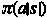

pi 是概率，a 是动作，|是给定的，s 是状态。

**跃迁概率**

如果你处于一种状态，你会采取特定的行动。那么你可能会在任何一个州结束。如果你的环境有 n 种状态，那么每种状态都有一定的关联概率，假设你处于这种状态并采取了某种行动。

转移概率就是从一个给定的状态转移到另一个状态，采取某种行动，我们在上面讨论过，宇宙编码了这些概率，我们需要恢复它。

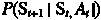

p 是概率，St+1 是下一个状态，St 是你当前的状态，At 是你采取的行动。从 St 状态到 St+1 状态的概率。

**前方数学**！！:)

**过渡棒图。**

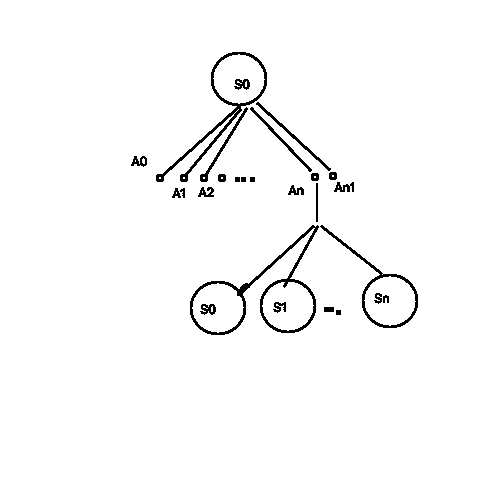

State Transitions.

从简笔画中可以很容易地推断出，开始时我们处于这样的状态。在这种状态下，我们可以选择采取 *n+1* 个行动。我们随机决定采取行动*和*。在采取行动后，现在的环境可能会把我们推回到索州、S1 和其他州。因为我们有这么多的行动要做，我们可能会在任何状态下结束，让我们把概率和它们联系起来。

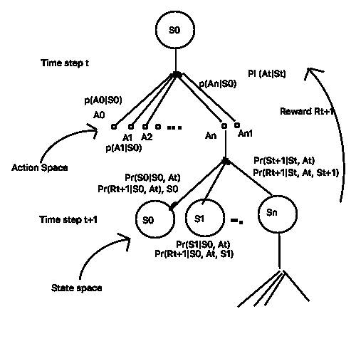

State Transitions with probabilities over state and action space.

让我们浏览一下这个图表。最初，代理/我们处于状态*，因此*，在该状态下，我们可以从动作空间 *A 中选择 *n+1* 个动作:{A0，A1，A2…An，An+1}* 对于这些动作中的每一个，都有选择它的概率，这定义了代理的行为。一个好的代理将有很高的概率选择正确的行动。Medium 不允许我使用数学符号来表示 *PI* ，所以我将使用 *PI* 。PI(At|St) 代表在给定的 St 状态下选择行动的概率，这是我们的策略。

注意，代理选择的动作取决于它所处的状态。就像你一样！！你开车的速度(动作=踩油门？)是以你的妈妈/爸爸在车上是否坐在你旁边为条件的(St =妈妈，爸爸)！！

猜测..PI(动作=按压气体？| St =闺蜜)？:)

好了，现在我们的环境是随机的(“风可能会把我们吹到任何地方”)，所以我们的代理有可能最终处于状态 *S0，S1..序列号*。这些状态来自状态空间 *S:{S0，S1，S2…Sn}* 。我们可以把它写成 *Pr(St+1| St，At)* ，这意味着概率代理可能结束于状态 St+1，假设它处于状态 St 并在采取行动*。如果代理最终处于正确的状态，它将获得好的奖励(正奖励)，如果它最终处于坏的状态，它将获得坏的奖励(负奖励)。因此，代理人的回报取决于它最终所处的状态，所以我们可以将概率放在 Pr(Rt+1| St，at，St+1)上，这意味着代理人将获得回报 Rt+1 的概率，假设我们处于状态 St，在状态 St+1 采取行动并着陆。*

**状态值 V(s)**

假设我们有一个机器人代理，它处于状态 *S0* 。如果它采取行动 *A0* 它会在火坑结束，这是不好的，如果它采取行动 A1 它会送上平坦的道路，这是好的。现在，我们需要从数学上量化好/坏意味着什么。在另一个世界中，我们需要估计这些状态的值。我们可以使用*贝尔曼方程来估算价值。*

贝尔曼方程是一个动态规划方程。为了理解它，假设我们已经估计了状态 *S0* 的某个值，下次我们访问相同的状态*时，因此*我们可以使用旧的估计值，计算新的估计值并更新该相同状态的值。下次你访问同一个州*时，你会有一个更好的估计。*

我们可以做的一件事就是简单地建立一个字典，用 states 作为键，state-values 作为值。我们可以用总收益作为这个状态的值。但是，如果您查看标题为“10 个不同剧集的状态 s1 和 st(最后一个状态)的总回报”的代码贴在上面，我们可以看到 S1 州的回报不断变化，每集我们可以有任何数量的州。我们可以对一个特定的州的总收益进行简单的平均，这将是一个开始估算的好方法。

所以，我们将上面代码运行几集，比如 10 集，然后我们将它平均。现在，让我们想想如何才能做到这一点？我们可以保留一个计数器。我们将运行 10 集，每次我们访问一个特定的州，我们可以更新该州的计数器。在所有状态的 10 集之后，我们可以对它们进行总结和更新。

*请注意，当我们说相同状态时，请记住所有值必须相同。例如，如果在剧集中，第一个游戏帧是状态 S0:[1.1，1.2，1.3，1.4]，而在第二集中，第一个游戏帧是状态 S0:[0.1，0.1，1.1，0.4]，那么它们都不表示相同的状态。如果在第二集第五个游戏帧是状态 S5:[1.1，1.2，1.3，1.4]，那么它们都表示相同的状态。*

下面是一个简单的**伪**代码

**蒙特卡洛学习**

这种估算状态值的方法，我们从头到尾运行一集。收集所有州的回报，并运行许多这样的插曲。最后停止运行游戏，并通过取收集状态值的平均值来更新状态值。这可能是游戏情节。

第 0 集:S00-> S01-> S02-> Sot

第一集:S10 -> S11 -> S12->S1t

第二集:S20 ->S2t

…

第 N 集:Sn0-> Sn1-> Sn2-> Sn3-> Sn4-> Snt

这里没有什么需要注意的。S10 表示第 1 集的状态 0，类似地，S01 表示第 0 集的状态 1。

S00 S10 可能不相同！！可能是 S01 和 S12 相同的状态！！

在一个随机环境中，转变到由 Pr(St+1|St，At)决定的状态，正如我们之前看到的。

假设 S10 和 S12 都是相同的状态，我们称之为 Sb。让我们初步估计 sb ti 的值为 0.1 ie。V(sb) = 0.1。经过两集 0，1，我们知道真实的回报 Gt(S10)和 Gt(S12)让我们说它是 0.2 和 0.3，然后我们可以保持一个计数器，并更新它 N(sb) += 1，所以它将是 2。为了估计新值，将状态 Gt(S10)+G(S12)的所有返回相加，并计算平均值 Gt(S10)+G(S12)/N(sb ),这就是新的估计值。

因此，我们可以更新 V(sb) ← Gt(S10)+G(S12)/N(sb)，其中 S10 和 S12 表示不同剧集中的相同状态。如果在一个状态 ie 中不增加计数器。如果你在一集内访问同一个州，并且没有更新计数器，那么首先访问蒙特卡洛。如果你每次访问一个州就增加一个计数器，那么它就叫做*每次访问蒙特卡洛*。

现在我们看到一个小问题。为了更新 V(s ),我们必须运行 n 集，然后停止运行，计算平均值，然后更新 V(s ),然后我们继续做同样的事情。能找到解决办法吗？我们可以在移动中进行批量更新，而不是停下来进行批量更新吗？让我们做一个简单的推导。我们知道 V(s)是我们运行一集时的估计状态值，在我们运行该集后，我们知道该状态的真实回报，即。燃气轮机。所以，Gt(s)-V(s)是我们在估计状态值时产生的误差。

让我们的初始状态估计为 V(s)。在我们运行 k 数之后，如果 N(s)k 集代表我们访问状态 s 的次数，我们知道状态 V(s)k 的值是总收益的平均值，直到 N(s)k 集的 k 集。

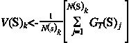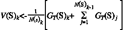

我们可以将适马拆分为当前真实回报+所有先前回报的总和。我们知道在 k-1 第五集，k-1 一定是收益的平均值。因此

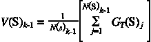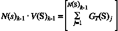

我们可以用 V(S)k-1 中的 N(S)k-1 代替 V(S)k 中的 sigma 项，N(S)k-1 为(N(S)k)-1。因此

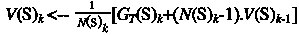

重新安排

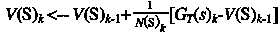

我们可以用 N(s)来计算所有状态的出现次数，或者我们可以放松，只考虑一小部分事件，这样我们就可以摆脱计数器。让我们用阿尔法修正它。

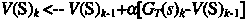

现在我们有一个蒙特卡洛更新。这就是说，每次你访问一个州，你可以得到我们到目前为止对该州所做的估计，在剧集结束后，我们可以得到该州的真实回报，我们发现我们犯的错误，并在错误的方向上更新我们的旧估计。所以下次我们访问同一个州时，我们会有更好的估计。

注意，要更新，我们仍然需要运行完整的剧集，但是要更新值，我们不需要停下来批量更新，但是我们可以在每集之后更新。但是，我们仍然必须运行一个完整的插曲来计算总回报，这个问题可以通过时间差异学习来解决，我们稍后将访问。

**数学够了让我们编码吧！！**

但是等等，我们如何存储状态值呢？以前我说过我们可以用一些字典把状态作为键，把它的值作为状态值，但是状态可以有这么多！！让我们用一个近似为 0r 的函数。

函数逼近器以数组向量为输入，乘以权重，结果就是近似值。当然，最初的值会是错误的，但是因为我们知道它的真实值，我们可以找到错误并改变权重。该函数逼近器可以是神经网络或简单的乘法运算。

从我们之前的代码中选择一个状态 s =[-0.02553977，-0.5716606，0.03765532，0.90520343]，选择随机权重 w = [0.1，0.21，0.14，0.18]，然后 V(s)=-0.02553977 * 0.1+-0.5716606 * 0.21+0.03777 其中 0.3 是偏置项。

所以 V(s)是 0.3456056592。但是如果真实返回 Gt(S)是 0.234，那么这个状态的真实值应该是

0.345605659+0.9 *[0.234–0.3456056592]即 0.24516056572。但是我们的估算者预测它是 0.345605659，所以它产生的误差是-0.10044。现在我们只需要相应地改变权重来做出正确的预测。我不会详细讲述如何改变权重，因为这是一个单独的主题，但我们将使用 python 包来完成(我们将使用 Tensorflow)

第一个数组表示状态，第二个数组表示函数近似值。现在我们知道了真实的回报，所以让我们来计算这些州的真实价值估计。

**期望值**

之前我们已经看过这个图表，现在让我们从状态值的角度来看，看看我们要考虑的状态值到底是多少。众所周知，我们的环境是随机的。我们的政策决定我们选择什么样的行动，我们的环境决定我们应该降落在什么样的状态，我们有可能捕捉到它们。让我们写出方程来捕捉它们。我在这里想说的是，我们估计的值不是真实的估计值。理想情况下，如果你认为宇宙是真实的，那么每个状态都有一些真实的宇宙编码状态值！！我们的模型通过探索和更新其状态值视图来预测该状态值可能是什么。当我们的状态值等于宇宙编码的状态值时，我们的模型将收敛到真正的理想状态值。我们不知道真正的理想状态值是什么，但是利用这个图表，我们可以得出一个数学方程。

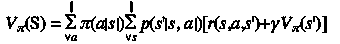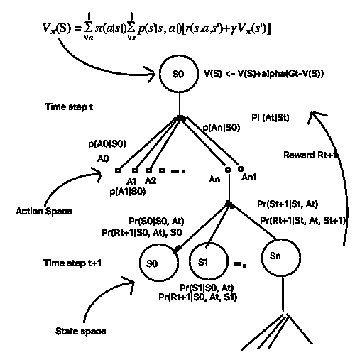

在策略 pi 下，假设您的策略是始终采取左操作(向左推)。假设你处于状态 *S0* ，那么你可以从该状态 *S0* 采取所有行动。我们考虑行动的概率 *pi(a|s)* ，对于所有这些行动，你可以降落在由宇宙概率 *p(s'|s，a)* 控制的任何状态，我们添加下一个状态的即时奖励和贴现值。这意味着我们的行为会影响我们的价值评估。

**对于具有 Q 值 Q(S，A)的动作的判定**

到目前为止，我们已经估计了状态 V(S)的值。在前面的代码中，你可能已经注意到，我们看到了我们的函数逼近状态的近似值，我们也计算了状态的真实值。我们可以计算它们之间的误差，并更新我们的权重，以预测良好的估计，但如果你想一想，即使你准确地估计了状态值，如果你在一个状态中，你无法知道下一个状态的值会是什么。如果你处于 S0 状态，如果某个先知告诉你，你的下一个状态将是 Sa 或 Sc，而绝对不是 Sb，那么我们可以只计算 V(Sa)，V(Sc ),并朝着最大值采取行动，但我们没有这样神奇的先知。所以我们需要计算一些联系。如果你可以计算采取行动的价值，那么我们就可以预测好的行动。也就是说，嘿，我在这个州，上次我在这个州，我采取了这个行动，一些不好的事情发生了，所以我会避免它。如果我采取另一个动作，我会得到这个预测值。就像我们如何估计状态的值一样，我们可以估计在给定状态下采取行动的值，这些值是 Q 值 Q(S，A)。现在 Q 值很相似。

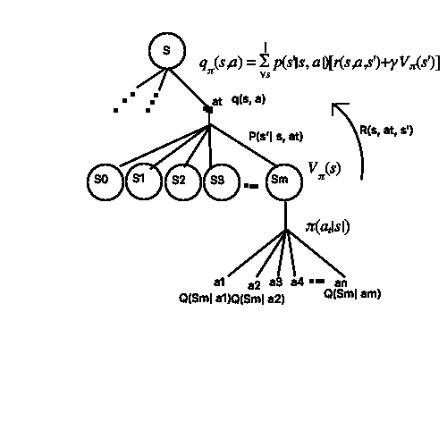

在这里，如果我们在状态 S，采取了一个动作 a，那么从那个状态我们可以到达由 P(s'|s，a)控制的 m 个状态中的任何一个，然后我们可以在策略 pi 下取这些状态的值。

现在在我们的代码中，就像我们如何估算 V(s)一样

我们可以估计 Q(S，A)

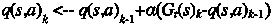

当我们随着时间探索所有状态时，我们采取状态-动作的估计值将收敛到宇宙编码的状态-动作值。

现在我想对政策做一些改变，这样我们就能确保探索所有可能的状态，我们还需要确保达到目标(最大化总回报)，我们可以做这些事情。

1.  我们将对一个状态中的所有行为进行估计，然后选择给出最大值的行为。这是一个贪婪的政策，因为如果我们发现这个行动很好，我们会一直坚持下去，可能不会探索不同的国家。
2.  最初我们采取随机行动，偶尔我们会采取与最大 q 值相对应的行动。随着时间的推移，我们将减少随机行动，采取更多的贪婪行动。
3.  为了预测 q 值，我们可以使用相同的函数逼近器，但这次我们将输出两个值，因为我们有两个动作，向左推/向右推。
4.  我们将跟踪总回报、采取的行动和当前对 q 值的估计，然后我们可以计算误差并更新我们的权重。

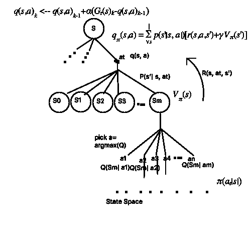

这是代码。

运行这段代码，你可以看到大约 5000 集，你会看到我们的政策开始改善。我没有对学习参数进行实验，但我们可以看到它的改进，最终大约 7000 集的目标得以实现。但是我们能做得更好吗？我们能从少量的插曲中学到什么吗？让我们在下一篇博客中探讨这个问题。第一个 for 循环收集经验，第二个开始学习。

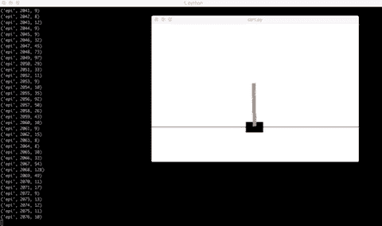

Around episode 2000

around 7000 episode

**缺点**

这种蒙特卡罗方法有一些缺点。

1.  我们需要等到我们运行一个完整的插曲来计算回报。
2.  这对非终结性发作不起作用。
3.  MC 法方差大，偏倚小。
4.  低偏差，因为我们考虑的回报是该州在一集中的真实值。
5.  方差很大，因为这种方法没有考虑太多的环境动态。我们更新的值是为整个剧集计算的回报。有时，只考虑眼前的回报是好的，可能是未来评估的一部分，因为这将更好地捕捉环境动态。

我们将在下一篇博客中探讨解决这些问题的时间差异学习。