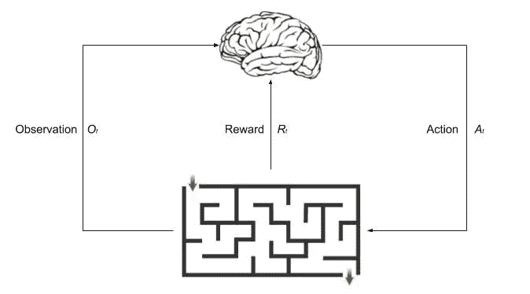
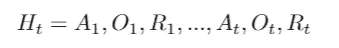
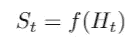
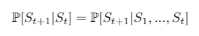
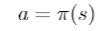
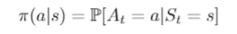
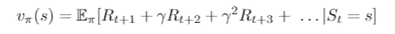
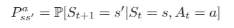
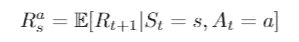

# 强化学习:概念、应用和代码介绍

> 原文：<https://towardsdatascience.com/reinforcement-learning-an-introduction-to-the-concepts-applications-and-code-ced6fbfd882d?source=collection_archive---------5----------------------->

## 第 1 部分:强化学习的介绍，解释常见的术语、概念和应用。

在这一系列强化学习的博客文章中，我将尝试对理解强化学习及其应用所需的概念进行简单的解释。在这第一篇文章中，我强调了强化学习中的一些主要概念和术语。这些概念将在未来的博客文章中进一步解释，并结合实际问题中的应用和实现。

零件:1[2](/getting-started-with-markov-decision-processes-reinforcement-learning-ada7b4572ffb)3[3](https://medium.com/@taggatle/planning-by-dynamic-programming-reinforcement-learning-ed4924bbaa4c)4[4](/model-free-prediction-reinforcement-learning-507297e8e2ad)…

# *强化学习*

强化学习(RL)可以被视为一种介于*监督*和*非监督*学习之间的方法。它不是严格监督的，因为它不仅仅依赖于一组标记的训练数据，但也不是无监督的学习，因为我们有一个回报，我们希望我们的代理最大化。代理需要找到在不同情况下采取的“正确”行动，以实现其总体目标。

> 强化学习是决策的科学。

强化学习不涉及主管，只有一个 ***奖励*** *信号*用于代理确定他们做得好还是不好。*是 RL 中的关键组成部分，其中流程是**。代理做出的每个 ***动作*** 都会影响它接收的下一个数据。***

**Reinforcement Learning applied to Atari games by DeepMind**

## **强化学习问题是什么？**

**到目前为止，我们已经说过代理需要找到“正确的”动作。正确的行动取决于**奖励。****

> *****奖励:*** *奖励* Rₜ *是一个标量反馈信号，它指示代理在步骤时间* t *做得有多好。***

**在强化学习中，我们需要定义我们的问题，以便它可以被应用来满足我们的**奖励假设**。一个例子是下一盘棋，代理人赢了一局得到正奖励，输了一局得到负奖励。**

> *****报酬假设*** : *所有的目标都可以用期望累积报酬的最大化来描述。***

**由于我们的过程涉及到*系列决策*任务，我们早期的行动可能会对我们的总体 ***目标*** 产生长期影响。有时候牺牲*即时奖励*(时间步 *Rₜ* 奖励)来获得更多*长期奖励可能更好。*一个应用于国际象棋的例子是牺牲一个卒在稍后阶段夺取一辆车。**

> ****目标** *:目标是选择行动以最大化未来总报酬。***

## **设置强化学习问题**

**在强化学习中，**代理**决定在每个时间步 *Aₜ* 采取哪些*动作*。代理基于其接收的标量*奖励 Rₜ* 和*观察到的环境* *Oₜ* 做出这些决定。**

****

**Reinforcement learning process diagram**

****环境**接收代理的动作并发出新的观察 *Oₜ* 和标量奖励 *Rₜ* 。接下来发生的环境取决于 ***历史*** 。**

> *****历史*** *:历史* Hₜ *是到时间 t 为止的一系列观察、行动和奖励***

****

> *****状态:*** *状态是用来决定接下来发生什么的信息。***

****

***历史*和*状态*的主要区别在于状态是历史的函数。这些状态可以分为三种主要类型:**

*   *****环境状态****(sₜᵉ*)*—*环境的私有表示，可能对代理不可见。它用于选择下一个观察值。**
*   *****代理状态****(sₜᵃ*)*——*代理的内部表示，被代理用来挑选下一个动作。**
*   *****信息状态*** */* ***马氏状态****(sₜ*)*—*包含了来自历史的有用信息。因此，给定这种状态，将有足够的信息来模拟未来，并且可以丢弃历史。**

> **马尔可夫状态:一个状态 Sₜ是马尔可夫的当且仅当**

****

> **我们相信接下来会发生什么取决于代理的状态表示。**

**环境又分为*完全可观测环境*和*部分可观测环境*。**

*   *****完全可观测环境*** *(马尔可夫决策过程):*智能体直接观测环境状态。 *Oₜ=Sₜᵃ=Sₜᵉ***
*   *****部分可观测环境*** *(部分可观测马尔可夫决策过程):*智能体间接观测环境。 *Sₜᵃ≠Sₜᵉ***

## **强化学习代理**

**到目前为止，我们已经定义了如何设置 RL 问题，但没有定义 RL 代理如何学习或代理由什么组成。RL 代理可以具有三个主要组件中的一个或多个:**

*   *****策略:*** Agent 的行为函数，是从状态到动作的映射。它可以是*确定性政策*或*随机政策。***

****

**Deterministic policy function**

****

**Stochastic policy function**

*   *****价值函数:*** 代表每个状态和/或动作有多好。这是对未来回报的预测。**

****

**Example value function**

*   *****模型:*** 智能体对环境的表征。它预测环境下一步会做什么。预测的是下一个状态和下一个直接奖励。**

****

**Example equation to predict of the next state**

****

**Example equation to predict the next immediate reward**

**RL 代理可分为以下几类:**

*   ****基于值:**没有策略，基于状态值贪婪地选择动作。**
*   ****基于策略:**没有值函数，使用策略函数选择动作。**
*   ****演员评论家:**同时使用价值和政策功能。**
*   ****无模型:**使用策略和/或值函数，但没有*无*模型。**
*   ****基于模型:**使用策略和/或值函数，并有一个模型。**

**这些代理类别中的每一个都将在以后的博客中详细描述。**

## *****问题内部强化学习*****

**在顺序决策中有两个基本问题:**

*   *****学习:*** 环境最初是*未知的*并且代理需要与环境交互以改进其策略**
*   *****规划:*** 如果环境是*已知的*代理用它的模型执行计算，然后改进它的策略。**

**由于强化学习就像一种试错学习方法，代理需要从环境中的经验中学习，以便在不损失太多回报的情况下做出决策。它需要考虑*开发*和*探索*，在探索新信息和利用已知信息之间取得平衡，以实现回报最大化。**

# **参考**

*   **[关于 RL 的 UCL 课程——第一讲](http://www0.cs.ucl.ac.uk/staff/d.silver/web/Teaching_files/intro_RL.pdf)**
*   **《强化学习导论》，萨顿和巴尔托，1998 年**

**如果你喜欢这篇文章，并想看到更多，不要忘记关注和/或留下掌声。**