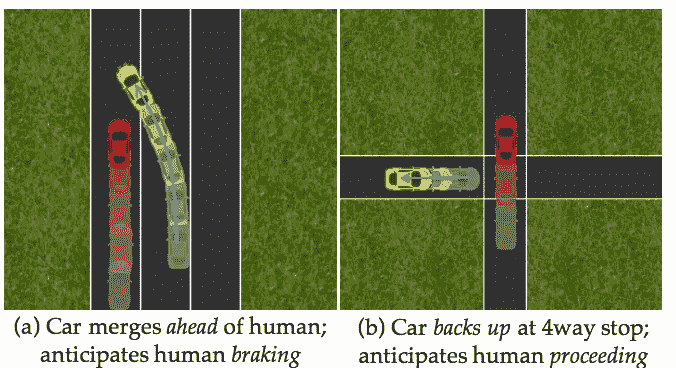
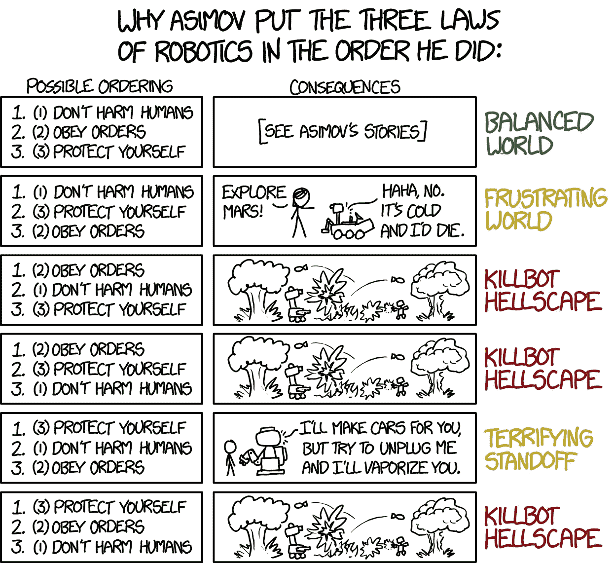
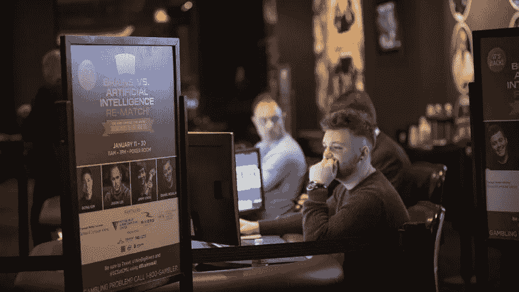

# 2017 年纽约奥莱利人工智能大会上的强化学习

> 原文：<https://towardsdatascience.com/reinforcement-learning-at-oreilly-artificial-intelligence-conference-ny-2017-404f62c99002?source=collection_archive---------8----------------------->

几周前，2017 年奥莱利人工智能大会在纽约举行。这是一次令人惊叹的会议，来自学术界和工业界的演讲都非常精彩。这篇文章总结了我在那里做的关于[强化学习](https://en.wikipedia.org/wiki/Reinforcement_learning)的一些演讲和一个教程，“机器学习领域关注的是软件代理应该如何在一个环境中采取行动，以便最大化一些累积回报的概念”。

## 与人协调的汽车

Fantasia, Disney 1940

来自伯克利的 Anca D. Dragan 发表了题为“ [**与人协调的汽车**](https://www.oreilly.com/ideas/cars-that-coordinate-with-people) ”的主题演讲，她在演讲中介绍了论文“[规划对人类行动产生影响的自动驾驶汽车](https://people.eecs.berkeley.edu/~sseshia/pubdir/rss16.pdf)”的结果他们没有进行纯粹的避障，即试图避免妨碍其他移动物体，而是能够将驾驶员建模为遵循自己政策的其他代理。这意味着机器人知道其他汽车也会避免撞到障碍物，所以它可以预测其他车辆对它的行动会有什么反应。

Figure from “Planning for Autonomous Cars that Leverages Effects on Human Actions”

自主车辆还能够采取行动，收集其他车辆的信息。例如，它可以开始慢慢合并人类前面的车道，直到有足够的证据表明司机没有侵略性，并将实际刹车以避免碰撞。

关键的音符是如此之好，以至于我改变了我的时间表去看她的演讲，名为“**逆奖励函数**”，在我看来，这是大会中最好的演讲。她从迪士尼的电影《幻想曲》开始讲起。它是根据歌德在 1797 年写的诗《巫师的学徒》改编的。正如 W [ikipedia 总结](https://en.wikipedia.org/wiki/The_Sorcerer%27s_Apprentice)它，

> 这首诗以一个老巫师离开他的工作室开始，留下他的徒弟做杂务。厌倦了用桶打水，这个学徒用一把扫帚附魔来为他做这件事——使用他还没有完全训练好的魔法。地板很快就被水淹没了，学徒意识到他无法停止扫帚，因为他不知道如何停止。

随着我们创造更多与人类直接互动的机器人，Dragan 正在研究我们如何确保它们会做我们真正想要的事情，即使我们发出的命令并不十分精确。我曾经读过一个假设的故事，也说明了这个问题。不幸的是，我找不到参考文献，但它是这样的:

> 假设我们创造了一台超级智能机器，并要求它找到治疗疟疾的方法。我们设定的目标是尽量减少死于这种疾病的人数。机器人发现，解决问题的最快和最有保证的方法是侵入世界上所有的核武器，并发射它们杀死所有的人类，确保没有人会再次死于疟疾。机器能够实现它的目标，但显然不是以程序员想要的方式。

艾萨克·阿西莫夫也写了几个关于类似情况的好故事，并提出了机器人三定律作为解决问题的方法。

[https://xkcd.com/1613/](https://xkcd.com/1613/)

Dragan 和她的小组在这方面做了很多研究:“[机器人应该听话吗？](https://arxiv.org/pdf/1705.09990.pdf)、[机器人用数学模型规划人的状态和动作](https://arxiv.org/pdf/1705.04226.pdf)、[关闸游戏](https://arxiv.org/pdf/1611.08219.pdf)简而言之，他们的方法是让机器人考虑到人类指定的命令或政策并不完美，并通过不做与训练时看到的太不同的事情来避免风险。

[**战略推理的超人 AI:在单挑无限注德州扑克**](https://www.oreilly.com/ideas/superhuman-ai-for-strategic-reasoning) **中击败顶级职业选手，作者 Tuomas Sandholm(卡内基梅隆大学):**他们能够在一场难度相当的比赛中击败顶级人类选手，但没有得到媒体的同等关注。这个游戏增加了额外的复杂性，因为玩家没有完整的信息。桑德霍尔姆评论了除了典型的[探索与利用权衡](https://medium.com/@jbochi/how-not-to-sort-by-popularity-92745397a7ae)之外游戏必须考虑的第三个变量:可利用性。他们的代理人 Liberatus 试图将剥削最小化。它并不真正擅长探索糟糕的玩家，但可以用这种方法击败最好的人类。

[https://www.cmu.edu/news/stories/archives/2017/january/AI-tough-poker-player.html](https://www.cmu.edu/news/stories/archives/2017/january/AI-tough-poker-player.html)

**深度强化学习教程，作者 Arthur Juliani。非常好的教程，代码易于理解和运行。朱利安尼提出了几种不同的强化学习方法，包括多武装匪徒理论、Q 学习、政策梯度和行动者-批评家代理。看一看[资源库](https://github.com/awjuliani/oreilly-rl-tutorial)中的教程。**

Multi-Armed Bandit Dungeon environment

**使用 OpenAI 的 Gym 和 Universe 构建游戏机器人，作者 Anmol Jagetia:** 不幸的是，他遇到了几个技术问题:一些例子崩溃了，运行的例子帧率很差，我们看不到代理在做什么，但他的教程笔记本看起来很有趣:【https://github.com/anmoljagetia/OReillyAI-Gamebots】T2

敬请关注更多内容。我会写另一篇关于我在那里看到的其他主题的帖子:推荐系统、张量流和自然语言理解。