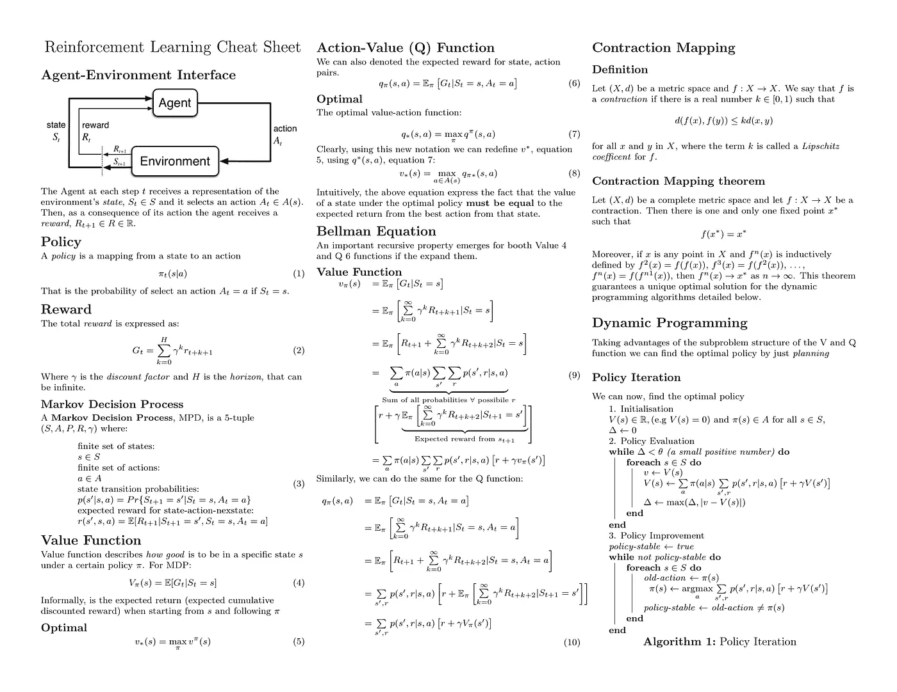
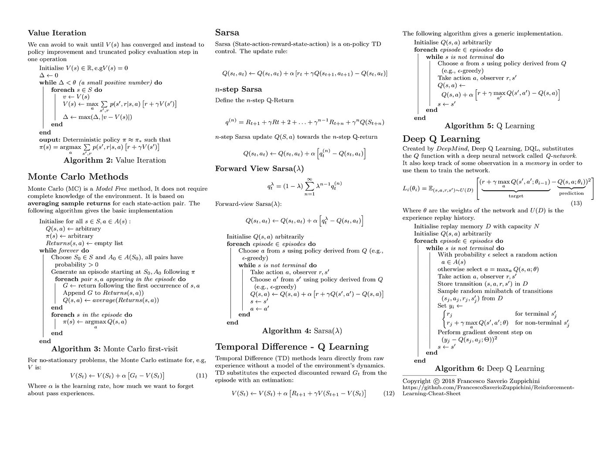

# 强化学习备忘单

> 原文：<https://towardsdatascience.com/reinforcement-learning-cheat-sheet-2f9453df7651?source=collection_archive---------7----------------------->

***免责声明:这是一个正在进行的项目，可能会有错误！***

为了快速回顾我的强化学习知识，我用所有的基本公式和算法创建了这个备忘单。我希望这可能对你有用。

你可以在这里找到完整的 pdf [，在这里](https://github.com/FrancescoSaverioZuppichini/Reinforcement-Learning-Cheat-Sheet/blob/master/rl_cheatsheet.pdf)找到回购[。](https://github.com/FrancescoSaverioZuppichini/Reinforcement-Learning-Cheat-Sheet)

*2018 年 3 月 19 日更新*。重写了 Sarsa 以遵循萨顿和巴尔托算法

*2018 年 3 月 15 日更新*。感谢[Alexandre baullne](https://github.com/AlexandreBeaulne)增加了收缩贴图、Sarsa 和清理乳胶。

具有新功能的拉式请求非常受欢迎！

主要参考资料是萨顿和巴尔托的《强化学习导论》。这里可以找到[。](https://github.com/yetweka/yet-weka/blob/master/book/Reinforcement%20Learning-An%20Introduction%2C%202nd-Sutton-Barto-14-15.pdf)

也许你还可以找到值得一读的我的其他文章:

[https://towards data science . com/let-fool-a-neural-network-B1 cded 8 C4 c 07](/lets-fool-a-neural-network-b1cded8c4c07)

[https://towards data science . com/how-to-use-dataset-in-tensor flow-c 758 ef 9 e 4428](/how-to-use-dataset-in-tensorflow-c758ef9e4428)

感谢您的阅读。

弗朗西斯科·萨维里奥