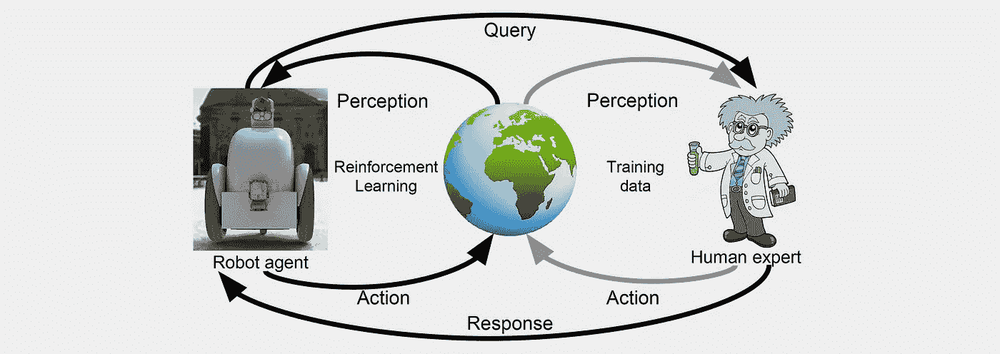
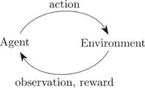

# 强化学习:必要性和挑战

> 原文：<https://towardsdatascience.com/reinforcement-learning-its-necessity-and-challenges-febef1470e9a?source=collection_archive---------1----------------------->

lemme learn ..

**简介:**

这是我第一篇关于强化学习的博客。过去几个月我一直在学习和应用 RL。我试图通过这篇文章呈现对 RL 及其含义的高度理解。

在深入讨论之前，我们先了解一下什么是强化学习，它与其他机器学习技术有什么不同。

强化学习(RL)是机器学习的一个子领域，其中代理通过与其环境交互，观察这些交互的结果并相应地接收奖励(积极或消极)来学习。这种学习方式模仿了我们人类学习的基本方式。

Reinforcement learning system

**必要性和挑战:**

当我们走向人工智能(AGI)时，设计一个可以解决多种任务的系统(例如，分类图像，玩游戏..)真的很有挑战性。目前机器学习技术的范围，无论是监督学习还是非监督学习，都擅长在任何时刻处理一项任务。这就限制了 AI 实现通用性的范围。

为了实现 AGI 的目标，RL 要让代理执行许多不同类型的任务，而不是只专攻一种。这可以通过多任务学习和记忆学习来实现。

我们已经看到了 Google Deep Mind 最近在多任务学习方面的工作，其中代理学习识别数字和玩雅达利。然而，当您扩展流程时，这确实是一项非常具有挑战性的任务。学习任务需要大量的训练时间和大量的迭代。

另一个挑战来自代理感知环境的方式。在许多现实世界的任务中，代理没有观察整个环境的范围。这种局部观察使代理人不仅根据当前的观察，而且根据过去的观察采取最佳行动。因此，记住过去的状态并根据当前观察采取最佳行动是 RL 成功解决现实世界问题的关键。

RL 代理总是从探索和开发中学习。RL 是一种基于不断试错的学习，其中代理试图对一个状态应用不同的动作组合，以找到最高的累积奖励。这种探索在现实世界中变得几乎不可能。让我们考虑一个例子，你想让机器人学会在复杂的环境中导航，避免碰撞。当机器人在环境中移动学习时，它会探索新的状态，并采取不同的行动来导航。然而，在现实世界中采取最好的行动是不可行的，因为环境的动态变化非常频繁，并且对于机器人来说学习变得非常昂贵。

因此，为了避免上述问题，在 RL 代理上应用了不同的其他机制来使其学习。很少有像通过模仿想要的行为来学习，通过演示来学习这样的方法正在机器人身上进行尝试，以在模拟中学习环境。然而，通过这种方式，学习变得非常特定于环境，并且它失去了一般化学习的实际目标。

在过去的几个月里，从开放式人工智能和 DeepMind 到人工智能，几乎没有什么积极的进展。开放人工智能的最新发展之一是*进化策略(ES)* 一种克服许多 RL 缺点的优化技术(【https://blog.openai.com/evolution-strategies/】T2)。DeepMind 的另一个发展是 [*路径网*](https://arxiv.org/abs/1701.08734) 是一个新的模块化深度学习(DL)架构([https://arxiv.org/abs/1701.08734](https://arxiv.org/abs/1701.08734))

> 任何需要手册才能工作的产品都是坏的。埃隆·马斯克

**致谢:**

我要感谢 David Silver，Google DeepMind 在 youtube 上的教程，Denny Britz，Google Brain 和 Arthur Juliani。

**参考文献:**

 [## Denny britz/强化学习

### 强化学习-强化学习算法的实现。Python，OpenAI 健身房，Tensorflow。练习…

github.com](https://github.com/dennybritz/reinforcement-learning)  [## OpenAI

### OpenAI 是一家非营利性的人工智能研究公司，旨在发现和制定通往安全人工智能的道路。

openai.com](https://openai.com)  [## 深度思维

### 解决智能问题，用它让世界变得更美好

deepmind.com](https://deepmind.com)