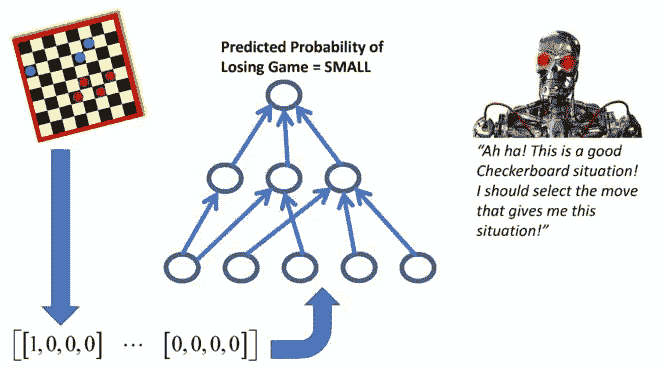
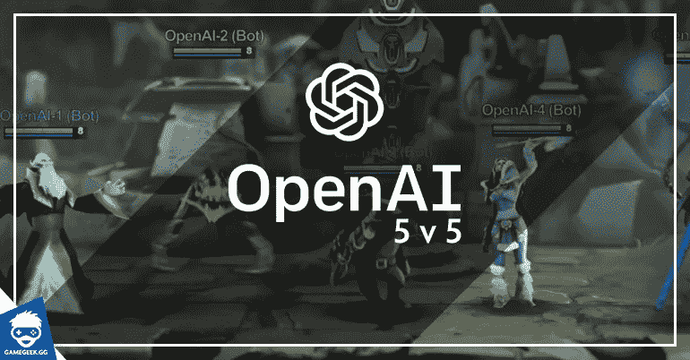
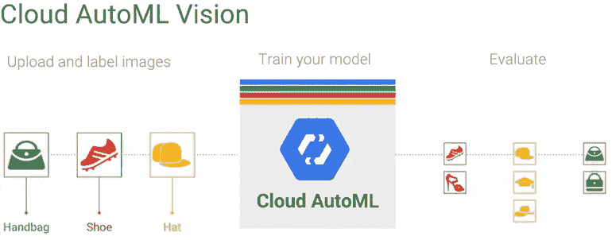
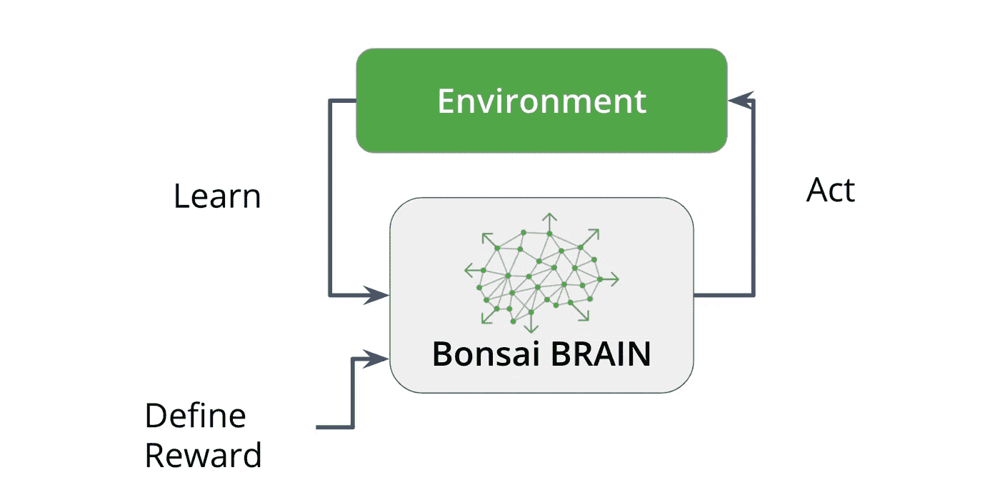
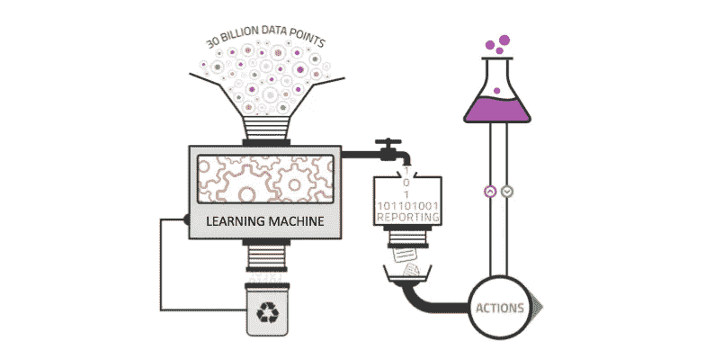
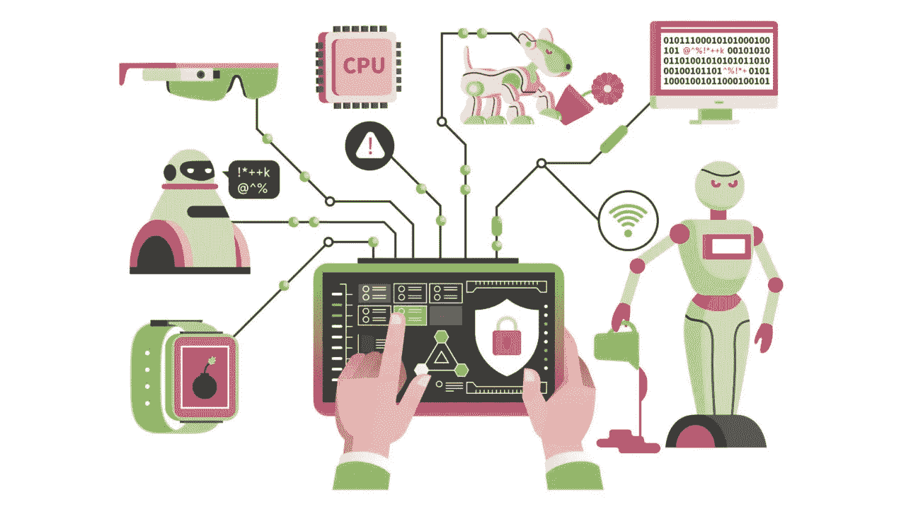
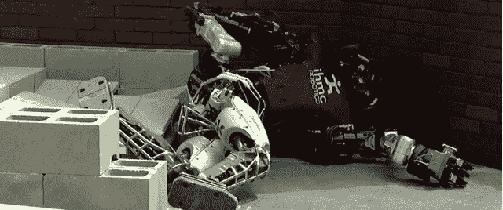

# 强化学习第 3 部分:实用强化学习

> 原文：<https://towardsdatascience.com/reinforcement-learning-part-3-practical-reinforcement-learning-e562c4089633?source=collection_archive---------14----------------------->

如果你还没有看过我们强化学习系列的[第一部分](https://recast.ai/blog/the-future-with-reinforcement-learning-part-1/)或[第二部分](https://recast.ai/blog/the-future-with-reinforcement-learning-part-2-comparisons-and-applications/)，你可以在这里查看[，在这里](https://recast.ai/blog/the-future-with-reinforcement-learning-part-1/)查看[。在第 1 部分中，您将学习强化学习的关键概念，这将帮助您更好地理解强化学习。第 2 部分将带您了解强化学习算法的比较和具体考虑。](https://recast.ai/blog/the-future-with-reinforcement-learning-part-2-comparisons-and-applications/)

在这篇文章中，我们将庆祝我们所学到的强化学习！我们将看看人们在强化学习方面做的一些很酷的事情，在强化学习中仍然存在的一些主要障碍，并讨论一些如果你想自己开始从事强化学习的话可以开始使用的资源！

Who knows… Maybe you’ll create the next AI system to defeat humans at games like Google did with AlphaGo!

# 酷 RL 成就

有了所有的强化学习知识，我们现在对 RL 如何工作以及开发人员在决定如何开发 RL 应用程序时必须考虑的一些因素有了一个很好的基础。我们来过一遍 RL 都实现了哪些很酷的东西。

## RL 在 Dota 2 击败人类

OpenAI 开发了一套五个神经网络，它们学会了相互协调，在 RTS 游戏 Dota 2 中击败了真正的人类。2018 年 8 月 5 日，由五个神经网络组成的团队与真实的、人类的、有竞争力的玩家进行了比赛，并赢得了三局两胜。游戏人工智能的巨大成就！

OpenAI’s Five aren’t done yet either. This first competition they held was just the start of what they really hope to do: Compete at an international and professional level. They ended up doing this in late August, which they won one round and then lost against two other professional human competitors. A loss, but in a way, also still a win!

## 超参数调谐的 RL

谷歌开发了一种使用强化学习的超参数调整方法，他们称之为 AutoML。他们设置了一个问题，并基于潜在的网络突变(动作)进化出新的神经网络，并以新的网络性能的形式获得反馈。

Tweaking hyperparameters to get the best performance out of machine learning models is really hard. Google’s AutoML service can this for us using what we know about reinforcement learning to come up with better parameters and faster.

## 工业用盆景

Bonsai 是一家很酷的初创公司，最近被微软收购，专注于在工业和企业领域使用 RL。他们的重点是改进控制系统和实时决策，以提高机器人、制造、能源等领域的自动化和效率。

Bonsai’s idea was that we could train industrial grade machinery in simulation using machine learning. By doing so, we mitigate the risk of breaking anything which could cost a company a lot of money.

## Pit.ai 了解交易策略

Pit.ai 是一个很酷的团队，它利用 RL 来更好地推理和理解交易算法。他们有一个崇高的使命，即使用 RL 来帮助取代投资管理人员，以帮助降低成本。

Using RL to come up with good trading strategies… Sounds a lot like our example with the stock market. Do you think they frame their tasks as episodic or continuous?

## DeepMind 降低冷却成本

使用 RL，谷歌的 DeepMind 帮助其数据中心降低了 40%的冷却成本。

Think about how much 40% is at a Google-level scale… Oh my!

# RL 中的障碍

不可否认，强化学习可以做很多很酷的事情。它提供了一种新的思考机器学习的方式；这是处理机器学习问题的不同方式。

这并不意味着这是解决所有问题的最佳方式。强化学习有时可能是解决问题最困难的方式。我们可以通过查看阻止围绕 RL 构建应用程序的一些障碍来最好地理解这一点。

# 数据

数据对于机器学习至关重要。句号。RL 需要大量数据才能正常工作。想想我们的代理通过马里奥玩。它必须一遍又一遍地玩这个游戏，以学习如何完成最基本的任务。没有所有的游戏数据，我们的代理将永远不会学会玩游戏，更不用说玩好游戏了。这是一个问题，尤其是在难以获得数据的情况下。

Data is a big issue for all machine learning for sure. But where for supervised tasks, sometimes data is simply an input and label pair, RL tasks oftentimes require much more complex data in order to teach systems to do what we wish.

# 目标是什么

RL 算法需要有目标。因为他们是任务驱动的，他们总是需要努力实现目标，不管是赚最多的钱还是尽可能快地超越水平。在复杂的任务中，“目标是什么”的问题很快变得越来越难回答。如果没有恰当地考虑目标，代理可能会倾向于做一些你不希望它做的事情。

想象一个假设的算法被放置在一个负责保护人类安全的机器人中。假设它运行了一个模拟程序，并得出结论，保证人类安全的最好方法是消灭所有其他人类生命，并使有问题的人类镇静下来。这根本不是我们想要开始的，但这是算法根据其目标、策略和价值函数的定义方式计算出的尽可能长时间保持该人安全的最佳方式。因此，目标定义至关重要。

Making sure our algorithms and agents do what we want and expect them to do is critical for deploying systems in the real world. These are issues that touch security, ethics, safety, and more.

# 稀疏环境中的复杂任务

这个问题继承了前两个问题的最坏情况。我们如何在一个很少收到奖励信号的环境中，让一个需要学习做非常复杂的事情的智能体？有许多方法可以解决这个问题，例如创建一个复杂的策略来处理复杂的任务，或者将复杂的任务分解为更小、更明显的任务(参见 OpenAI with Dota 2，其中他们制定了代理可以收到的小奖励，这些小奖励自然会导致期望的大奖励)。这仍然是一个巨大的研究领域。

Think about the task of trying to teach a robot how to physically play the piano. This is an incredibly complex task that doesn’t necessarily feature a lot of feedback that can be turned into a reward signal. This would require some major goal engineering, which ties back into our previous issue.

# 大量的状态和动作

在 Mario 中，代理可以采取的动作数量是有限的。在现实世界中，代理可以采取的动作数量是无限的。可以观察到的环境状态的数量也是如此。代理如何处理这种情况？一个算法如何在数学上表现这一点？这些都是巨大的问题，巨大的研究领域，以及需要更好地理解以制造可以在现实世界中交互的复杂代理的关键事情。

The second we try to deploy an agent into the real world, the stakes are higher, and the problem becomes exponentially more difficult. Even teaching a robot to walk using RL can become very hard.

现在，你可能在想“哇，强化学习可以做这么多很酷的事情，还有这么多很酷的问题需要解决。怎么才能入门？”

考虑到这一点，我找到了一些我认为是学习 RL 的好地方的资源:

*   [强化学习:简介](http://incompleteideas.net/book/bookdraft2018jan1.pdf)——如果你准备阅读大量的书籍，这是一本很好的书，可以深入了解强化学习背后的理论成分。它是由理查德·萨顿和安德鲁·巴尔托(他们在 RL 方面做了很多工作)写的，真的很好(我自己目前也在研究)。
*   [伦敦大学学院的强化学习课程](http://www0.cs.ucl.ac.uk/staff/d.silver/web/Teaching.html)——这是一门很好学习的课程(主要基于上一本书)。它也有幻灯片和视频讲座！
*   [加州大学伯克利分校——CS 294](https://www.youtube.com/playlist?list=PLkFD6_40KJIznC9CDbVTjAF2oyt8_VAe3)——这些是加州大学伯克利分校强化学习课程的视频。
*   [Udacity 的深度强化学习课程](https://www.udacity.com/course/deep-reinforcement-learning-nanodegree--nd893) —感觉你想得到更多的机会？你通过实践学得更好吗？那么尝试 Udacity 的深度强化学习课程可能更适合你！
*   [强化学习 GitHub Repo](https://github.com/dennybritz/reinforcement-learning) —这个 Repo 有一系列用 Python 实现的强化学习算法。但更重要的是，它采用了萨顿和巴尔托的书以及 UCL 的视频，并将它们结合成一个带有一些练习的学习计划，以指导您如何使用这两种资源。如果这听起来更像你的速度，你应该检查一下！

# 结论

我相信，强化学习将会是一种带来机器学习新革命的技术，创造出真正智能的应用程序，使用监督和非监督学习的技术来观察智能体活动的环境。如果强化学习在未来，那将是一个光明的未来！

*原载于 2018 年 9 月 5 日*[*recast . ai*](https://recast.ai/blog/reinforcement-learning-part-3-practical-reinforcement-learning/)*。*