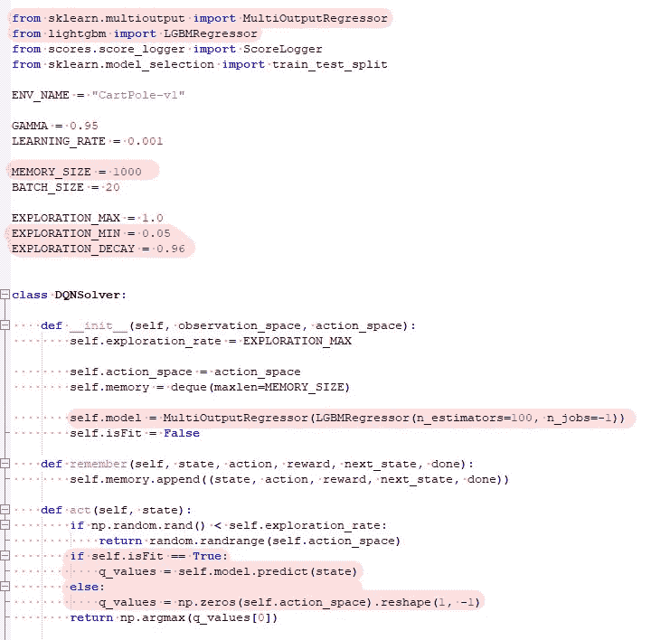
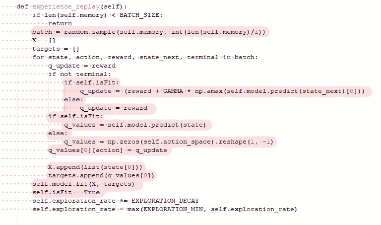
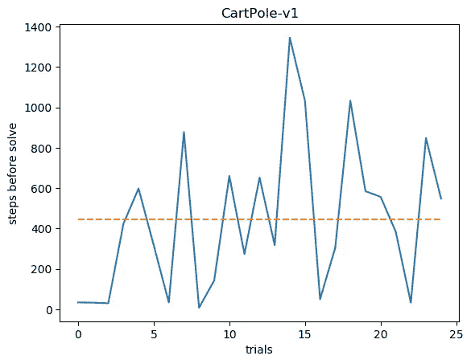

# 基于决策树的强化学习 Q-Learning 简介

> 原文：<https://towardsdatascience.com/reinforcement-learning-q-learning-with-decision-trees-ecb1215d9131?source=collection_archive---------6----------------------->

Photo by [Jachan DeVol](https://unsplash.com/@jachan_devol?utm_source=medium&utm_medium=referral) on [Unsplash](https://unsplash.com?utm_source=medium&utm_medium=referral)

强化学习(RL)是机器学习中的一种范式，在这种范式中，计算机学习执行任务，如[驾驶车辆](https://www.analyticsvidhya.com/blog/2018/07/autonomous-car-learnt-drive-itself-20-minutes-using-reinforcement-learning/)、[玩雅达利游戏](https://deepmind.com/research/publications/playing-atari-deep-reinforcement-learning/)和[在围棋比赛中击败人类](https://deepmind.com/research/alphago/)，几乎没有人类专家的监督。几个 RL 算法被评为 2017 年[最有趣的突破](https://www.forbes.com/sites/mariyayao/2018/02/05/12-amazing-deep-learning-breakthroughs-of-2017/#2b54354a65db)。每个人都对新的可能性感到兴奋。我很兴奋。

> 然而，有一件事一直困扰着我。几乎所有的 RL 实现都依赖于深度神经网络。

诚然，我喜欢神经网络，但我更喜欢梯度增强树，只要我可以选择。我只是觉得设计、训练和测试神经网络很乏味，评估结果中有很多不确定性和波动。就个人而言，[梯度增强树提供了更好的性能(至少在结构化数据集上)，同时收敛得更快并给出一致的结果。因此，我开始了用梯度增强树实现 RL(这里是 Q-Learning)的旅程。](https://www.kdnuggets.com/2017/10/xgboost-top-machine-learning-method-kaggle-explained.html)

理论上，对于 Q-Learning 的底层机器学习算法没有限制。最基本的版本使用表格形式来表示(状态 x 行动 x 预期回报)三元组。但是，因为实际上这个表经常太大，所以我们需要一个模型来近似这个表。该模型可以是任何回归算法。在这个探索中，我尝试了线性回归、支持向量回归、KNN 回归、随机森林等等。相信我，它们都有效(程度不同)。

那么，深度神经网络为什么会在总体上主导 Q-Learning 和 RL 呢？有几个原因:

1.  部分适合——有了神经网络，你可以要求网络只学习新的经验。即使有了经验回放，你通常也只能用一小部分记忆来训练网络。其他算法不支持部分拟合，必须用整体记忆训练。这导致在存储器变大的后续训练步骤中训练时间过长。
2.  输入源——如果你的输入源是图像或视频，卷积网络是一个不错的选择。既然你已经在用 CNN 了，用 FCN 来做 Q-Learning 是有意义的。
3.  文学——因为其他人都是用深度学习来做的，所以万一你卡住了，会有更多的文学。

好的。所以，深度学习是 RL 的灵魂伴侣？别急，我的朋友。

1.  性能—并非所有问题都涉及非结构化数据。结构化数据是梯度推进的亮点。Kaggle 竞赛被 XGBoost 和它的朋友们所主宰是有充分理由的。
2.  收敛——梯度增强树通常快速可靠地收敛，不像神经网络需要一点运气。

这两个是优于神经网络的主要优势，这使它们成为强有力的竞争者。但是将 GBT 引入 Q-Learning 可行吗？或者它会不会太慢，太消耗资源，或者对于任务来说表现太差？

在我们继续之前，我想为那些不熟悉强化学习和 Q-Learning 的人提供一些介绍。然而，有很多更好的作家已经优雅地解释了这些话题，所以我将简单地在这里放下链接。

 [## 使用 Q-Learning 更深入地研究强化学习

### 本文是🕹️. tensor flow 深度强化学习课程的一部分点击这里查看教学大纲。

medium.freecodecamp.org](https://medium.freecodecamp.org/diving-deeper-into-reinforcement-learning-with-q-learning-c18d0db58efe)  [## 深度 Q-Learning 简介:让我们玩毁灭战士

### 本文是🕹️. tensor flow 深度强化学习课程的一部分点击这里查看教学大纲。

medium.freecodecamp.org](https://medium.freecodecamp.org/an-introduction-to-deep-q-learning-lets-play-doom-54d02d8017d8)  [## 强化学习介绍(DQN 深度 Q 学习)

### 在今天的文章中，我将向你介绍强化学习的热门话题。在这篇文章之后，你将…

towardsdatascience.com](/cartpole-introduction-to-reinforcement-learning-ed0eb5b58288)  [## RL—深度强化学习简介

### 深度强化学习是从我们的所见所闻中采取最佳行动。不幸的是，强化…

medium.com](https://medium.com/@jonathan_hui/rl-introduction-to-deep-reinforcement-learning-35c25e04c199) 

以及梯度增强树上的一些引物。

 [## 从零开始的渐变提升

### 简化复杂的算法

medium.com](https://medium.com/mlreview/gradient-boosting-from-scratch-1e317ae4587d)  [## 梯度增强与随机森林

### 在这篇文章中，我将比较两种流行的集成方法，随机森林(RM)和梯度推进机器…

medium.com](https://medium.com/@aravanshad/gradient-boosting-versus-random-forest-cfa3fa8f0d80)  [## 梯度增强和 XGBoost

### 从我们结束的地方开始，让我们继续讨论不同的 boosting 算法。如果您还没有阅读…

hackernoon.com](https://hackernoon.com/gradient-boosting-and-xgboost-90862daa6c77) 

# 问题定式化

这个项目开始于我对其他算法是否可以用于 Q 学习的纯粹好奇。因此，我们没有触及更深层次的问题，比如实现专门用于强化学习的决策树，或者对性能和速度的更深层次的分析等等。

我们要用一个最基本的 RL 问题来做实验——cart pole v 0。这个环境是由 OpenAI Gym 提供的——一个由各种环境组成的库，用于测试驱动强化学习框架。基本上，手推车上有一根杆子。你可以向左或向右移动。你的目标是尽可能长时间保持杆子不倒。

我从格雷戈·苏尔马那里获得了一个 GitHub 库，他在那里提供了一个 Keras 模型来解决 CartPole 问题。我重用了他的大部分代码——只修改需要修改的部分。我要感谢[格雷戈·苏尔马](/cartpole-introduction-to-reinforcement-learning-ed0eb5b58288)的代码库。

 [## gsurma/cartpole

### OpenAI 的 cartpole env 解算器。在 GitHub 上创建一个帐户，为 gsurma/cartpole 的发展做出贡献。

github.com](https://github.com/gsurma/cartpole) 

让我们一步一步地回顾一下苏尔马的模型是怎么做的。

1.  掷骰子游戏初始化。记下行动次数。
2.  在每一个时间步，给我们一个元组 ***(x1，x2，x3，x4)*** 。这个元组表示购物车和杆子的当前状态。
3.  我们告诉游戏我们是想向左还是向右移动。决策来自我们的模型(一般是神经网络),通过询问模型在这种状态下执行每个动作的预期回报。
4.  在动作执行之后，我们获得一个新的状态和一个奖励。
5.  我们要求我们的模型预测新状态下每个行动的预期回报。取最高奖励作为处于这个新状态的预期奖励，用一个因子 ***GAMMA*** 折现，加到现在的奖励上。这是该状态和动作组合的新 q 值(或预期回报)。
6.  将状态/动作/奖励/新状态元组放入某种缓冲区或内存中。
7.  选择全部或部分内存。用回忆的记忆部分拟合模型。
8.  回到步骤 2。重复，直到我们得到满意的结果。

正如你所看到的，当应用神经网络(或者至少是 Keras)时，整个过程很简单。我们可以要求神经网络对行动的预期回报进行预测，甚至在网络被训练之前(当然，你会得到随机数，但这对于第一轮来说是可以的。)一旦我们计算了新的 q 值，我们就可以从内存中选择一个实例，并将其拟合到神经网络，而不会丢失我们迄今为止已经训练的所有内容(诚然，会有退化。这是首先引入体验重放的基础。)

如果我们想用其他回归器代替神经网络，有几个要求。

1.  回归器应该支持多标签。我用“应该”而不是“必须”，因为它不是必不可少的。通过几行代码，我们可以分别为每个动作实现一个单独回归器；但是原生的多标签支持使用起来更干净。SKLearn 中的大多数算法本身都支持多标签，因此您几乎可以放弃线性回归、支持向量回归和随机森林。梯度增强树有点棘手，因为流行的库，如 XGBoost、CatBoost 和 LightGBM，不提供多标签支持。幸运的是，我们可以将 SKLearn 的 MultiOutputRegressor 包裹在它们周围，解决这个问题。
2.  因为 GBT 在打电话预测之前必须是健康的，我们必须为第一轮提供我们自己的预期奖励。这包括首先检查模型是否合适。如果不是这样，我们可以提供一个固定值或一个随机数。我选择提供 0 作为初始值。
3.  我们不能和 GBT 做部分契合。我们必须构建整个内存以及一组 q 值，并在每个时间步完全重新训练回归变量，而不是一次拟合一个实例。
4.  因为我们用整个记忆进行再训练，带有陈旧 q 值的陈旧经验永远不会自行消失。与神经网络不同，我们必须将内存的大小限制在一个小得多的数字。我选择了 1000。
5.  作为一个副作用，我们必须提高最小探索率，以防止学习者陷入困境。很可能我们的小记忆会被低质量的经历填满，所以我们需要继续探索。

下图突出显示了我对原始代码所做的更改。鉴于 LightGBM 的性能和速度，我在实验中使用了它。

Changes I made to the original code

***备注*** 我通过 Jupyter 笔记本运行代码，令人惊讶的是，这比从命令行运行要快。可能与使用 Windows 机器有关。

代码也可以在 GitHub 上找到。

 [## 掌上电脑/墨盒

### OpenAI 的 cartpole env 解算器。在 GitHub 上创建一个帐户，为 palmbook/cartpole 的开发做出贡献。

github.com](https://github.com/palmbook/cartpole) 

# 结果

它工作了。有时候效果出奇的好。有时，令人沮丧的是，它需要超过 1000 个时间步骤来解决问题。很少，它根本不能解决问题。

这是每次试验解决问题前的时间步骤图。

Number of Rounds before the problem was considered “solved.”

从图中可以清楚地看出，平均而言，该方法不如神经网络。令人欣慰的是，即使在达到第 100 轮之前，LightGBM 也可以通过一些试验解决问题，这实际上意味着它可以从一开始就解决问题。这表明了这种方法的潜力。我相信我们需要更好的体验重放/内存管理来充分利用 Q-Learning 中的 LightGBM，这将使整个代码库变得更加复杂。

至少，我们现在知道 Q-Learning 也可以用其他回归变量来完成。但是为了实用的目的，我想在可预见的将来我会坚持使用神经网络。

# 未来作品

我喜欢在项目中实施提前停止技术。队列管理是另一个需要改进的领域。我们应该只删除 q 值失效的内存实例，而不是 FIFO。此外，我想知道我们是否可以应用类似的技术，可能结合卷积层，来玩视频游戏。