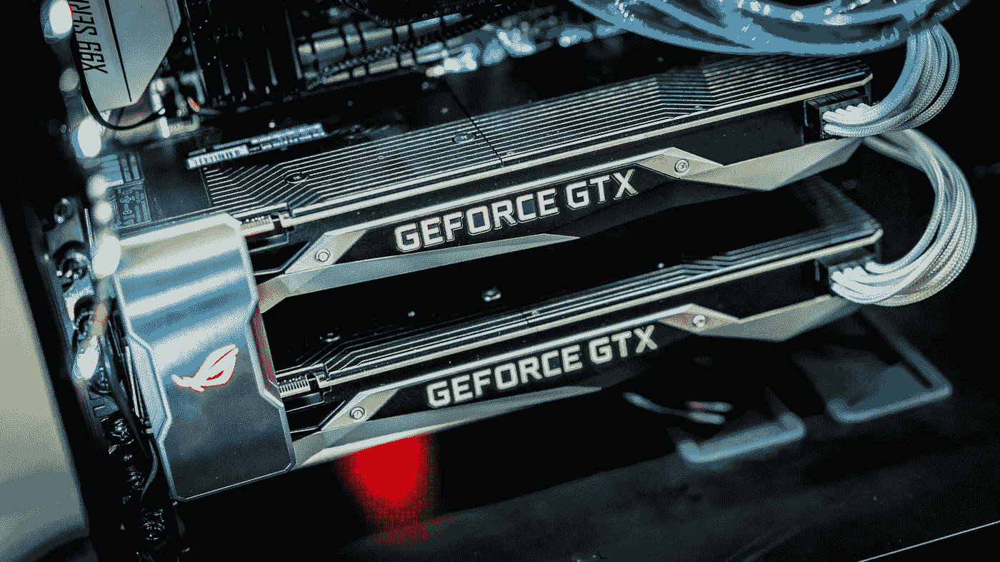

# 强化学习:怪癖

> 原文：<https://towardsdatascience.com/reinforcement-learning-the-quirks-44b0e315fed2?source=collection_archive---------1----------------------->

在过去的几个月里，我一直致力于强化学习，对此我只能说:它是不同的。我所经历的强化学习的常见怪癖和挫折的记录。

# 位置

作为实习的一部分，我一直在各种[开放人工智能体育馆](http://gym.openai.com)环境中应用 A3C 和 GA3C 算法的变体。在此之前，除了一些入门课程，我没有任何广泛的强化学习经验，所以这对我来说很新鲜。

我很快了解到，强化学习与我之前完成的默认分类和回归任务非常不同——但它非常令人兴奋！让我告诉你我在整个过程中遇到的问题。

# 时间

在深度强化学习中，训练数据通常是“在工作中”收集的，这意味着代理在没有他的环境的先验知识的情况下开始，然后在与模拟交互时开始收集经验。

这意味着需要一些时间来收集内存缓冲区中的数据，然后需要更多时间来将其传递到算法中并更新网络权重。这可以通过使用异步方法来优化——比如上面提到的 A3C 算法——这使得事情变得更加复杂。这意味着即使一些简单的代理也需要几个小时的培训，而更复杂的系统需要几天甚至几周的时间。

# 计算能力

在 [NVIDIA AI](https://medium.com/u/ab69c39a85e1?source=post_page-----44b0e315fed2--------------------------------) 工作带来了一些明显的好处——纯粹的无限计算能力。

Two NVIDIA Geforce GTX GPUs

意识到大多数强化学习工作是在 CPU 上完成的就越糟糕。

使用 GA3C 算法，一些权力被转移到 GPU，允许更大和更复杂的网络，但在我的经验中，限制通常来自 CPU，这在深度学习领域的其他领域非常不寻常。

# 探索与开发

这个最疼。“探索与剥削”似乎是一个非常普遍的问题。基本上，在探索你的环境和采取最好的行动之间有一个权衡。让我们从迷宫的角度来看这个问题。

如果你探索得太多，你的机器人总是会尝试寻找新的方法来更好地解决迷宫。一开始听起来不错，但这也意味着，如果你的机器人找到了解决迷宫的完美方法——它不会相信这是最好的，下次会尝试另一条路线，可能永远不会再找到“最佳方法”。

如果你探索得太少/利用得太多，你的机器人可能会找到一种方法来解决这个迷宫，并会继续走同样的路。这可能意味着它在到达迷宫的核心之前会穿过每一条走廊——但这对它来说已经足够了，它会永远这样做。

根据我的经验，第二种情况发生得更多。我读了由[亚瑟·朱利安尼](https://medium.com/u/18dfe63fa7f0?source=post_page-----44b0e315fed2--------------------------------)写的这篇关于一些探索技巧的精彩文章，我可以把它推荐给任何尝试 RL 的人。