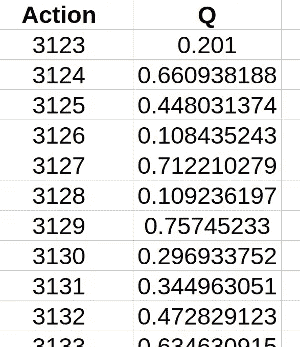
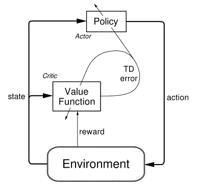
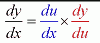
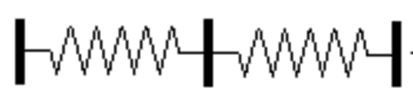

# 具有 Keras + OpenAI 的强化学习:演员-评论家模型

> 原文：<https://towardsdatascience.com/reinforcement-learning-w-keras-openai-actor-critic-models-f084612cfd69?source=collection_archive---------0----------------------->

**快速回顾**

上次在我们的 Keras/OpenAI 教程中，我们讨论了强化学习中一个非常基础的算法:DQN。深度 Q 网络实际上是一个相当新的出现，仅在几年前才出现，所以如果你能够理解并实现这个刚刚在该领域起步的算法，那将是非常不可思议的。与最初的帖子一样，让我们花一点时间来欣赏一下**我们取得了多么不可思议的**结果:在连续输出空间场景中，从绝对*没有*关于“获胜”需要什么的知识开始，我们能够探索我们的环境并“完成”试验。

把自己放在这个模拟的情境中。这基本上就像要求你玩一个游戏，没有规则手册或具体的最终目标，并要求你继续玩，直到你赢了为止(这似乎有点残酷)。不仅如此:你可以通过一系列动作达到的可能结果状态是无限的(即连续的观察空间)！然而，DQN 惊人地快速收敛，通过维持和缓慢更新行动的内在价值来解决这个看似不可能的任务。

**更加复杂的环境**

从之前的登山车环境到钟摆的升级与从横拉杆到登山车的升级非常相似:我们正在从离散的环境扩展到连续的环境。钟摆环境有一个无限的输入空间，这意味着您在任何给定时间可以采取的行动数量是无限的。为什么 DQN 不再适用于这种环境？我们的实现不是完全独立于环境动作的结构吗？


Unlike the MountainCar-v0, Pendulum-v0 poses an even greater challenge by giving us an infinite input space to work with.

虽然*与*的动作*无关，但 DQN 基本上是以有限的输出空间为前提的。毕竟，想想我们是如何构建代码的:预测试图在每个时间步(给定当前环境状态)为每个可能的操作分配一个分数，并简单地采取具有最高分数的操作。我们之前已经将强化学习的问题简化为有效地给动作分配分数。但是，如果我们有一个无限的输入空间，这怎么可能呢？我们需要一个无限大的表来记录所有的 Q 值！*



Infinite spreadsheets sound pretty far from ideal!

那么，我们如何着手解决这个看似不可能的任务呢？毕竟，我们被要求做一些比以前更疯狂的事情:我们不仅得到了一个没有玩和赢的指令的游戏，而且这个游戏有一个上面有无限按钮的控制器！让我们看看为什么 DQN 被限制在有限数量的行动。

原因源于模型是如何构建的:我们必须能够在每个时间步*迭代*来更新我们在特定动作上的位置是如何变化的。这就是为什么我们让模型预测 Q 值，而不是直接预测采取什么行动。如果我们做了后者，我们将不知道如何更新模型来考虑预测以及我们对未来预测的回报。因此，基本问题源于这样一个事实，似乎我们的模型*已经*输出了与所有可能的行动相关的回报的列表计算。相反，如果我们打破这个模式会怎么样？如果我们有两个独立的模型:一个输出期望的动作(在连续空间中),另一个接受动作作为输入，从 dqn 产生 Q 值，会怎么样？这似乎解决了我们的问题，也正是演员-评论家模式的基础！

**演员-评论家模式理论**



Unlike DQNs, the Actor-critic model (as implied by its name) has two separate networks: one that’s used for doing predictions on what action to take given the current environment state and another to find the value of an action/state

正如我们在上一节中所讲的，整个演员-评论家(AC)方法的前提是有两个相互作用的模型。拥有多个相互作用的神经网络的主题在 RL 和监督学习中越来越相关，即 GANs、AC、A3C、DDQN(决斗 DQN)等。第一次熟悉这些体系结构可能有些令人生畏，但肯定是一次值得的练习:您将能够理解并编写一些处于该领域现代研究前沿的算法！

回到当前的主题，AC 模型有两个恰当命名的组件:演员和评论家。前者考虑当前的环境状态，并从中确定最佳的行动。本质上，这似乎是实现 DQN 的自然方式。批评家在 DQN 中扮演“评估”的角色，他接受环境状态和一个动作，并返回一个表示该动作对该状态有多合适的分数。

想象这是一个有一个孩子(“演员”)和她的父母(“评论家”)的游乐场。这个孩子四处张望，探索这个环境中所有可能的选择，比如滑上滑梯，荡秋千，拔地上的草。父母会看着孩子，根据她所做的，考虑到环境因素，进行批评或补充。父母的决定取决于环境这一事实既重要又直观:毕竟，如果孩子试图在秋千上荡来荡去，得到的赞扬远不如她试图在滑梯上荡来荡去！

**简述:链式法则(可选)**

你需要理解的理论要点是支撑现代机器学习的一大部分:链式法则。可以毫不夸张地说，链式法则可能是理解实用机器学习的最关键(尽管有些简单)的思想之一。事实上，如果你只是直觉地理解链式法则在概念上的约定，你可能没有什么数学背景。我将花很短的时间来描述链式法则，但是如果你对它感觉很舒服，请随意跳到下一部分，在那里我们实际上看到了开发 AC 模型的实用大纲是什么样子的，以及链式法则如何适应该计划。



A seemingly simple concept probably from your first calculus class, but one that forms the modern basis of practical machine learning, due to the incredible speedup it enabled in backprop and similar algorithms

形象地说，这个等式似乎非常直观:毕竟，只是“取消分子/分母。”然而，这种“直觉解释”有一个主要问题:这种解释中的推理完全是逆向的！重要的是要记住，数学不仅是为了理解概念，也是为了发展直觉符号。因此，人们开发了这个“分数”符号*，因为*链式法则的行为非常类似于简化分数乘积。所以，试图仅仅通过符号来解释概念的人跳过了一个关键步骤:为什么这个符号是适用的？比如，为什么*的*衍生品会有这样的表现？



The classic series of springs example is actually a pretty direct way you can visualize the chain rule in movement

潜在的概念实际上并不比这个符号更难理解。想象一下，我们有一系列的绳子，在一些固定的点绑在一起，类似于串联弹簧的连接方式。假设你拿着弹簧系统的一端，你的目标是以 10 英尺/秒的速度摇动另一端。你*可以*以这个速度摇动你的一端，并让它传播到另一端。*或*您可以连接一些中间系统，以较低的速率(即 5 英尺/秒)振动中间连接。在这种情况下，您只需以 2 英尺/秒的速度移动您的末端，因为无论您做什么移动，都将从您移动的位置持续到终点。这是因为物理连接迫使一端的运动进行到底。*注意:当然，与任何类比一样，这里也有不一致的地方，但这主要是为了形象化。*

同样，如果我们有两个系统，其中一个系统的输出馈入另一个系统的输入，摇动“馈入网络”的参数将会摇动其输出，输出将会传播并被任何进一步的变化放大，直到管道的末端。

**AC 型号概述**

因此，我们必须开发一个 ActorCritic 类，它与我们以前实现的 DQN 有一些重叠，但是在训练方面更复杂。因为我们需要一些更高级的特性，所以我们必须利用 Keras 所依赖的底层库:Tensorflow。注意:你当然也可以在 Theano 中实现它，但是我过去没有使用过它，所以没有包括它的代码。如果你愿意的话，可以随时向 Theano 提交这段代码的扩展！

模型实施将由四个主要部分组成，这与我们实施 DQN 代理的方式直接相关:

*   模型参数/设置
*   培训代码
*   预测代码

**交流参数**

首先，只是我们需要的进口品:

```
import gym
import numpy as np 
from keras.models import Sequential, Model
from keras.layers import Dense, Dropout, Input
from keras.layers.merge import Add, Multiply
from keras.optimizers import Adam
import keras.backend as Kimport tensorflow as tfimport random
from collections import deque
```

这些参数与 DQN 的参数非常相似。毕竟，除了在两个独立的模块中，这种演员兼评论家的模式必须做与 DQN 完全相同的任务。我们还继续使用我们在《DQN 邮报》中讨论过的“目标网络黑客”来确保网络成功收敛。唯一的新参数被称为“tau ”,并且涉及在这种情况下目标网络学习如何发生的微小变化:

```
class ActorCritic:
    def __init__(self, env, sess):
        self.env  = env
        self.sess = sess self.learning_rate = 0.001
        self.epsilon = 1.0
        self.epsilon_decay = .995
        self.gamma = .95
        self.tau   = .125
        self.memory = deque(maxlen=2000)
```

tau 参数的确切使用将在随后的训练部分中详细解释，但其本质上起着从预测模型逐渐转换到目标模型的作用。现在，我们到达感兴趣的要点:定义模型。如上所述，我们有两个独立的模型，每个模型都与自己的目标网络相关联。

我们从定义演员模型开始。参与者模型的目的是，给定环境的当前状态，确定要采取的最佳行动。再一次，这个任务有给我们的数字数据，这意味着除了我们到目前为止使用的简单的密集/全连接层之外，没有空间或需要在网络中涉及任何更复杂的层。因此，演员模型是一系列完全连接的层，从环境观察映射到环境空间中的一个点:

```
def create_actor_model(self):
        state_input = Input(shape=self.env.observation_space.shape)
        h1 = Dense(24, activation='relu')(state_input)
        h2 = Dense(48, activation='relu')(h1)
        h3 = Dense(24, activation='relu')(h2)
        output = Dense(self.env.action_space.shape[0],  
            activation='relu')(h3)

        model = Model(input=state_input, output=output)
        adam  = Adam(lr=0.001)
        model.compile(loss="mse", optimizer=adam)
        return state_input, model
```

主要的区别是我们返回一个对输入层的引用。这一点的原因在本节结束时会更加清楚，但简单地说，这是为了我们如何以不同的方式处理 actor 模型的训练。

演员模型的棘手之处在于决定如何训练它，这就是链式法则发挥作用的地方。但在我们讨论之前，让我们想想为什么它与标准的评论家/DQN 网络培训有所不同。毕竟，我们不就是要像 DQN 的情况一样，根据当前的状态来拟合模型，并根据当前和贴现的未来回报来拟合最佳行动吗？问题在于:如果我们能够做到我们所要求的，那么这将是一个解决的问题。问题在于我们如何决定采取什么样的“最佳行动”，因为现在在评论家网络中 Q 分数是分开计算的。

因此，为了克服这一点，我们选择了另一种方法。我们本质上是在爬山，而不是找到“最佳选择”并适应它。对于那些不熟悉这个概念的人来说，爬山是一个简单的概念:从你当地的视点出发，确定最陡的倾斜方向，然后朝那个方向递增。换句话说，爬山就是试图通过简单地做一些简单的事情，并遵循局部最大值的方向来达到全局最大值。有些情况下，你可以想象这是完全错误的，但通常情况下，它在实际情况下工作得很好。

因此，我们希望使用这种方法来更新我们的演员模型:我们希望确定(演员模型中)参数的什么变化会导致 Q 值的最大增加(由 critic 模型预测)。由于行动者模型的输出是动作，而批评家基于环境状态+动作对进行评估，因此我们可以看到链式规则将如何发挥作用。我们想看看改变 actor 的参数将如何改变最终的 Q，使用 actor 网络的输出作为我们的“中间链接”(下面的代码都在“ *__init__(self)* ”方法中):

```
 self.actor_state_input, self.actor_model = \
            self.create_actor_model()
        _, self.target_actor_model = self.create_actor_model() self.actor_critic_grad = tf.placeholder(tf.float32, 
            [None, self.env.action_space.shape[0]]) 

        actor_model_weights = self.actor_model.trainable_weights
        self.actor_grads = tf.gradients(self.actor_model.output, 
            actor_model_weights, -self.actor_critic_grad)
        grads = zip(self.actor_grads, actor_model_weights)
        self.optimize =  tf.train.AdamOptimizer(
            self.learning_rate).apply_gradients(grads)
```

我们看到，这里我们保持模型权重和输出(动作)之间的梯度。我们还通过否定自我来缩放它。actor_critic_grad(因为我们想在这种情况下做梯度上升)，它由一个占位符保存。对于不熟悉 Tensorflow 或第一次学习的人，占位符在运行 Tensorflow 会话时充当“输入数据”的角色。我不会详细说明它是如何工作的，但是 tensorflow.org 教程很好地介绍了这些材料。

转到评论家网络，我们基本上面临着相反的问题。也就是说，网络定义稍微复杂一些，但是它的训练相对简单。批评家网络旨在将*和*环境状态和行为作为输入，并计算相应的估价。我们通过一系列完全连接的层来实现这一点，中间有一层在组合成最终 Q 值预测之前将两者合并:

```
def create_critic_model(self):
        state_input = Input(shape=self.env.observation_space.shape)
        state_h1 = Dense(24, activation='relu')(state_input)
        state_h2 = Dense(48)(state_h1)

        action_input = Input(shape=self.env.action_space.shape)
        action_h1    = Dense(48)(action_input)

        merged    = Add()([state_h2, action_h1])
        merged_h1 = Dense(24, activation='relu')(merged)
        output = Dense(1, activation='relu')(merged_h1)
        model  = Model(input=[state_input,action_input], 
            output=output)

        adam  = Adam(lr=0.001)
        model.compile(loss="mse", optimizer=adam)
        return state_input, action_input, model
```

值得注意的要点是我们处理输入和返回内容的不对称。对于第一点，与动作相比，我们在环境状态输入上有一个额外的 FC(全连接)层。我之所以这样做，是因为这是这些交流网络的推荐架构，但在两个输入端都加上 FC 层的情况下，它可能同样工作良好(或稍差)。至于后一点(我们返回的内容)，我们需要保留对输入状态和动作的引用，因为我们需要在更新参与者网络时使用它们:

```
 self.critic_state_input, self.critic_action_input, \
            self.critic_model = self.create_critic_model()
        _, _, self.target_critic_model = self.create_critic_model() self.critic_grads = tf.gradients(self.critic_model.output, 
            self.critic_action_input)

        # Initialize for later gradient calculations
        self.sess.run(tf.initialize_all_variables())
```

这里我们设置要计算的缺失梯度:关于动作权重的输出 Q。这在训练代码中被直接调用，正如我们现在将要研究的。

**交流训练**

这个代码与 DQN 不同的最后一个主要部分是实际的训练。然而，我们确实利用了同样的基本结构，从记忆中提取情节并从中学习。由于我们有两种训练方法，我们将代码分成不同的训练函数，明确地称它们为:

```
def train(self):
        batch_size = 32
        if len(self.memory) < batch_size:
            return rewards = []
        samples = random.sample(self.memory, batch_size)
        self._train_critic(samples)
        self._train_actor(samples)
```

现在我们定义两种训练方法。然而，这与 DQN 的情况非常相似:我们只是找到了贴现的未来奖励和培训。唯一的区别是，我们正在对状态/动作对进行训练，并使用 *target_critic_model* 来预测未来的回报，而不是演员:

```
 def _train_critic(self, samples):
        for sample in samples:
            cur_state, action, reward, new_state, done = sample
            if not done:
                target_action = 
                    self.target_actor_model.predict(new_state)
                future_reward = self.target_critic_model.predict(
                    [new_state, target_action])[0][0]
                reward += self.gamma * future_reward
            self.critic_model.fit([cur_state, action], 
                reward, verbose=0)
```

至于演员，我们很幸运地做了之前所有的努力！我们已经设置了梯度在网络中的工作方式，现在只需用我们遇到的动作和状态来调用它:

```
def _train_actor(self, samples):
        for sample in samples:
            cur_state, action, reward, new_state, _ = sample
            predicted_action = self.actor_model.predict(cur_state)
            grads = self.sess.run(self.critic_grads, feed_dict={
                self.critic_state_input:  cur_state,
                self.critic_action_input: predicted_action
            })[0] self.sess.run(self.optimize, feed_dict={
                self.actor_state_input: cur_state,
                self.actor_critic_grad: grads
            })
```

如前所述，我们利用了目标模型。因此，我们必须在每个时间步更新它的权重。然而，我们只是缓慢地这样做。更具体地，我们通过分数*selfτ*保留目标模型的值，并将其更新为相应的模型权重余数*(1-selfτ)*分数。我们对演员/评论家都这样做，但下面只给出了演员(你可以在帖子底部的完整代码中看到评论家):

```
def _update_actor_target(self):
        actor_model_weights  = self.actor_model.get_weights()
        actor_target_weights =self.target_critic_model.get_weights()

        for i in range(len(actor_target_weights)):
            actor_target_weights[i] = actor_model_weights[i]
        self.target_critic_model.set_weights(actor_target_weights
```

**交流预测**

这与我们在 DQN 的做法相同，因此没有太多关于其实施的讨论:

```
def act(self, cur_state):
  self.epsilon *= self.epsilon_decay
  if np.random.random() < self.epsilon:
   return self.env.action_space.sample()
  return self.actor_model.predict(cur_state)
```

**预测码**

预测代码也与以前的强化学习算法非常相似。也就是说，我们只需重复试验，并在代理上调用预测、记忆和训练:

```
def main():
    sess = tf.Session()
    K.set_session(sess)
    env = gym.make("Pendulum-v0")
    actor_critic = ActorCritic(env, sess)

    num_trials = 10000
    trial_len  = 500

    cur_state = env.reset()
    action = env.action_space.sample()
    while True:
        env.render()
        cur_state = cur_state.reshape((1, 
            env.observation_space.shape[0]))
        action = actor_critic.act(cur_state)
        action = action.reshape((1, env.action_space.shape[0]))

        new_state, reward, done, _ = env.step(action)
        new_state = new_state.reshape((1, 
            env.observation_space.shape[0]))

        actor_critic.remember(cur_state, action, reward, 
            new_state, done)
        actor_critic.train()

        cur_state = new_state
```

**完整代码**

这里是使用 AC(演员-评论家)在“钟摆-v0”环境下进行训练的完整代码！

好家伙，那很长:谢谢你从头到尾读完(或者至少略读)！敬请关注下一期 Keras+OpenAI 教程！

# 评论并点击下面❤️以示支持！