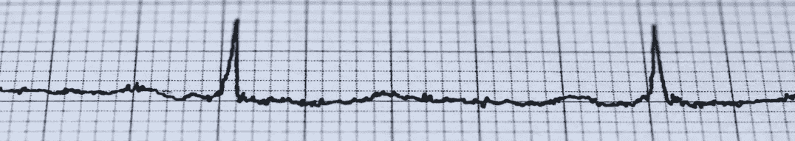
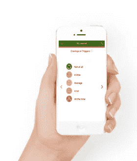
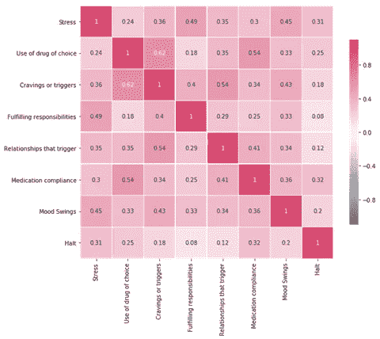
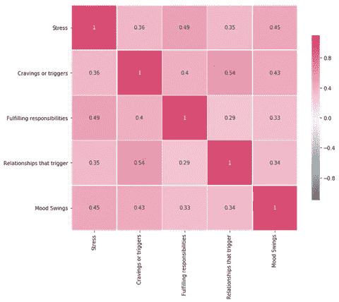
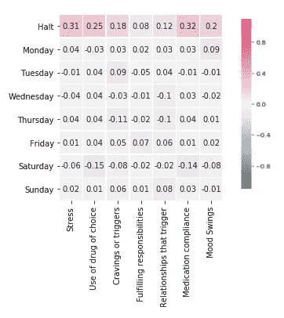
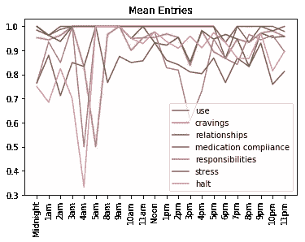
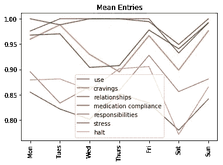
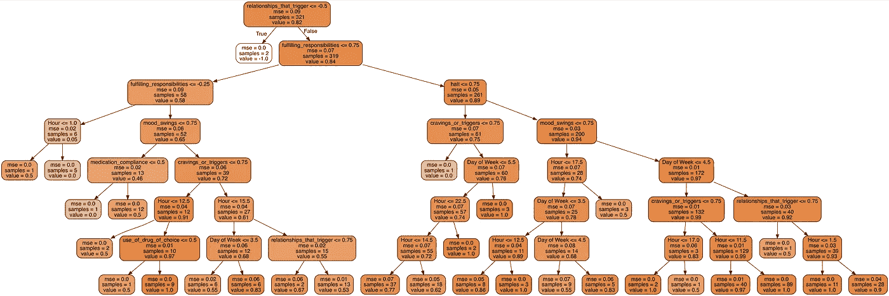

# 复发触发因素:用人工智能预测压力

> 原文：<https://towardsdatascience.com/relapse-trigger-predicting-stress-with-a-i-f559af5a19a3?source=collection_archive---------27----------------------->

从问题的形成到解决方案的部署，今天的文章全面介绍了数据科学和机器学习在帮助阿片类药物成瘾患者的道路上的旅程。

## 问题定式化

[try cycle Data](http://trycycledata.com/)(【trycycledata.com】T2)于 2017 年开始开发一个数据驱动的系统，以帮助解决阿片类药物的流行。这个概念的早期阶段可以追溯到 2012 年。针对处于危险或危机中的个人的自助解决方案不起作用。相反，TryCycle 采取了相反的方法，将他们的技术专长集中在寻找帮助卫生资源与客户保持联系的方法上，并监控他们作为门诊病人的复发风险。具体来说，TryCycle 设计了一个简单但功能强大的移动数据收集系统，用于收集受控护理环境之外的数据。这使得现有的临床医生-客户关系和治疗得以扩展，因此临床医生可以在风险水平上升之前更好地了解和监测复发的症状。

## 成瘾者研究压力预测因子的动机

根据美国疾病控制中心(CDC)的数据，药物过量死亡的人数从未如此之高，其中大多数死亡病例，2016 年有 66%涉及阿片类药物。提高数据质量和跟踪趋势，[已被 CDC](https://www.cdc.gov/features/confronting-opioids/index.html) 认可为帮助了解问题的严重程度、将资源集中在最需要的地方以及评估预防和应对工作的成功的关键。

慢性压力与吸毒和易成瘾有很大关系(更多[在这里](https://www.ncbi.nlm.nih.gov/pmc/articles/PMC2732004/)、[和这里](http://psycnet.apa.org/record/2007-00566-000))。我们也知道压力会增加上瘾的风险(这里的、[和这里的](https://www.sciencedirect.com/science/article/pii/S0006322313001340))。有大量的研究将压力与成瘾联系起来(这里有更多的)，并表明压力会导致康复中的人退出治疗(这里有更多的)。

嗯，我们可以看到复发与压力有关，但为什么不简单地预测复发呢？为什么要从预测压力开始？预测复发太远了，无法纠正。我们希望这种工具能够预测压力，以便在复发即将来临之前，能够在护理范围内减轻复发的触发因素。

# 数据收集

本文使用的专有数据集包含来自 16 个个人的 500 多个条目，历时五个月(2018 年 5 月-2018 年 9 月)。这是整个 TryCycle 数据集的一个小样本，是在知情同意的情况下收集的，用于研究。TryCycle 的移动应用程序收集了手机位置和其他数据，以及个人日志条目和定期自我评估，如下所示。

The TryCycle dashboard for reviewing client history and risk of relapse.

## 数据收集:J **日志**

鼓励客户保持私人日志，并定期更新。这些数据可以由机器以保护隐私的方式进行分析，[揭示情绪和其他有助于监控风险因素的因素](https://www.ibm.com/blogs/client-voices/ai-cloud-technology-fight-opioid-addiction/)。

## **数据收集:定期自我评估**

按照规定的时间表(每天、每天两次、每周或每周两次，取决于诊所如何设置)提示客户完成基于技术的评估，包括八个复发指标，也称为复发线索或警告信号。这些因素与复发前行为、态度、感觉或想法的变化有关。由于许多研究表明[压力是成瘾发展的主要因素，并可能引发复发过程](https://www.ncbi.nlm.nih.gov/pmc/articles/PMC2732004/)，TryCycle 将压力作为其指标测量之一。

One screen in the TryCycle mobile app for collecting self-reports on relapse indicators.

TryCycle 评估监测的复发指标如下。在自我评估过程中，客户使用一系列滑动条给每个指标打分，范围从-1(差)到+1(好)。

为了了解复发风险，TryCycle 开发了一种专有算法，对上述所有 8 个复发指标以及数据趋势和计算提交之间的差异进行加权，为每个被监测的人分配一个分数和风险水平。

有了这个数据收集系统，下一个问题是如何从这些数据中预测未来的压力水平。目标是找到导致复发的预警信号之间的相关性。我们决定把重点放在压力上，更具体地说，从收集的数据中的其他因素来预测压力。

# **数据科学**

在构建预测模型之前，我们需要评估和探索数据，以了解数据集中的特征。这里的关键免责声明是，如上所述，这个数据集相对较小，因此这些初步分析在这一点上是非常初步的。

## 研究复发指标如何相互关联

我们研究了复发指标之间的相互关系。如下图所示，每个指标之间都有关联。

Correlation matrix showing how the relapse indicators are all related.

这个结果很有意义。这些因素应该都指向同一个东西(复发)。它们都是同一个风险等式中的因素，一些比另一些更强。我们有一些根据相关性的强度将相关性分成不同类别的标准。以下是我们的相关标准:

使用上述标准，三个强相关指标是:

1.“渴望或触发”和“使用您选择的药物”

2.“药物治疗依从性”和“使用您选择的药物”

3.“渴望或触发”和“触发的关系”

基于这些早期发现，如果我们监测正确的指标，就有可能提前发现复发的诱因。上述发现是一个好迹象，表明预测模型可以告诉我们一些有用的东西。

随着我们对数据的深入挖掘，并查看适度的相关性，我们发现了“情绪波动”、“压力”和“履行责任”之间的关系。

Correlation matrix focusing in on how a subset of indicators are all related.

观察这些指标之间的相关性，我们得出结论:

1.“压力”与“情绪波动”和“履行职责”都有关联

2.“情绪波动”和“履行责任”与“渴望和触发因素”有适度的关联，在较小程度上与“触发关系”有关联

现在，相关性不是因果关系，但我们开始围绕压力指标到压力本身的路径建立一个论题。我们从前面提到的文章中知道，压力会导致复发。也许我们在这里有一个信号，我们在数据集中收集的因素可以提供一个做出结论的途径。例如:“压力”导致“情绪波动”和(不)履行责任，从而导致“渴望和触发”和“触发关系”，最终旧病复发？

我们在数据中寻找其他佐证信息。如果我们评估复发指标与一周中各天的相关性，我们会得到以下结果:

这些相关性都很弱。看起来周一可能会对情绪产生一些影响。这证实了我们的直觉，即回去工作并不有趣。我们还可以看到，“渴望和触发”和“触发的关系”似乎仍然在同一天匹配(周二、周三和周日)。

让我们继续查看按一周中的**天**和一天中的**小时**分组的平均值，看看是否有任何线索(下面并排的图表)。

The average value for each relapse indicator was grouped by **day of the week (right)**, and **hour of the day (left)**

我们观察到，如果我们按一天中的小时或一周中的天对数据进行分组，压力(棕色)始终是输入的最低值之一。回想一下，低意味着坏。这告诉我们，正如我们所预料的那样，人口报告了高压力。现在，我们能预测这种压力，然后，也许，在咨询或医疗访问中解决这种压力吗？

# 预测模型

我们希望根据最近报告到系统中的可用数据来预测**未来的**压力水平。这种预测分析模型有助于护理圈内的每个人在压力转化为复发之前做出反应。

深入挖掘机器学习解决方案的细节，我们使用了 scikit learn 的[随机森林分类器](http://RandomForestClassifier)，因为这个模型非常适合数据。这种分类器通过学习与数据分离方式相对应的决策树来拟合数据。理解这种方法的一种方式是把这个模型想象成一本“[选择你自己的冒险](https://www.amazon.ca/Choose-Your-Own-Adventure-24/dp/1933390247/ref=sr_1_5/130-7517399-2746714?ie=UTF8&qid=1540310849&sr=8-5&keywords=choose+your+own+adventure+book)”的书。正如这本书创建了一个从故事开始到一些逻辑结论的分支路径，这个模型学习设置哪些路径来模仿数据中的模式。房地产领域一个直观的例子是 R2D3 的 [**这个。向下滚动链接可以看到这个过程的一个很好的动画例子。TryCycle 的模型从一个复发风险参数开始，并定义了一个决策树(又称决策树)，即“如果高就向左走”，否则就“向右走”。当然，该模型还知道每个决策使用什么权重。**](http://www.r2d3.us/visual-intro-to-machine-learning-part-1/)

用于预测未来压力的数据包括七个指标，以及收集这些数据时的“星期几”和“一天中的小时”数据。当模型符合数据时，我们就可以进行预测。生成的决策树如下所示:

让我们后退一步，看看每个指标的重要性，以便更好地理解模型的作用。

从这些结果来看，“药物治疗依从性”和“选择药物的使用”这两个指标不能很好地预测压力，这是有道理的，因为我们认为压力才是它们的预测因素。似乎责任和关系是预测未来压力的关键因素。该模型现在检查这一小时是在午餐之前还是之后(12.5 小时)还是在工作之前和之后(14-17 小时)，这显然比一天中的实际时间与压力有更强的联系。该模型还区分了工作日和周末报告的结果。

既然我们已经了解了模型是如何做出决策的，那么这些决策有多正确呢？

为了制作下面的图表，我们为一个测试用户在给定的一天将一个指标数据传递到我们的模型中，模型返回第二天的压力预测。我们对 61 个数据点反复这样做，以得到应力预测曲线(橙色)和实际报告的应力(蓝色)。同样，蓝线是该用户报告的压力水平，而橙线是基于前一天数据的预测压力值。如果两条线完全重叠，那么我们将有一个完美的预测。我们可以看到预测实际上相当不错。在一些地方，应力预测先于实际应力观测！

准确度是每个预测值与下一个报告值之间差异的平均值，上图中该患者的标称准确度为 95.63%。然而，点的平均精度是**而不是**我们正在寻找的值。我们真正想要的是能够在压力的**变化**和**发生**之前预测它们。看下面图表中的数据，客户报告的压力变化有 7 次。

Observing the prediction of changes in stress level (orange) against the actual changes in reported stress level (blue).

在上图中，我们可以看到，在许多压力变化被报道之前，我们确实猜测到了或者至少是朝着正确的方向发展(有时甚至是提前几天)。预测有许多小的变化，但预测中较大的变化通常接近实际报告的变化。因此，较大的预测似乎比较小的预测更精确，但趋势变化也有助于预测。

我们可以调整我们的算法，以支持精确度(低假阳性，但有时会错过压力峰值)或回忆(捕捉更多的压力峰值，但更多的假阳性)。数据集在不断增长，因此随着时间的推移，结果有望得到改善。随着收集的数据越来越多，我们也在考虑数据的季节性，以及数据中的特殊情况，如假期。

# 把这些放在一起帮助真实的人

TryCycle 从一个问题开始:识别复发的触发因素，并在护理圈内积极应对这些触发因素。希望本文能让您对产品的开发和部署有所了解。这个数据科学和机器学习之旅的最终结果是一个帮助陷入阿片类药物流行的成瘾者的系统。

> 来自 TryCycle Data 的消息:我们希望将我们的方法推广到更多的医疗保健机构。**要预订演示**并了解定量门诊护理的好处，请 [**点击此处联系**](http://trycycledata.com/contact/) 。

这篇文章是关于预测恢复中的吸毒者的压力。有关总体评估工具的更广泛概述，请参阅以下 2018 年案例报告:

*   [病例报告:评估 TryCycle(一种基于智能手机的应用程序和临床医生工具)帮助患者从酒精和阿片类药物滥用中恢复](http://trycycledata.com/resources/)

如果你喜欢这篇关于人工智能预测戒毒者压力的文章，那么按下跟随按钮，拍拍拍手的东西，在社交频道上分享，并看看我过去读过的一些最热门的文章，比如“T2”如何为人工智能项目定价“和“T4”如何聘请人工智能顾问”。此外，[退房请尝试循环](http://trycycledata.com/)。除了商业相关的文章之外，我还准备了一些关于那些希望采用深度机器学习的公司所面临的其他问题的文章，比如“没有云或 API 的机器学习”。

下次见！

-丹尼尔

[daniel@lemay.ai](mailto:daniel@lemay.ai) 问好。
[LEMAY . AI](https://lemay.ai)
1(855)LEMAY-AI

您可能喜欢的其他文章:

*   [人工智能与不良数据](/artificial-intelligence-and-bad-data-fbf2564c541a)
*   [人工智能图像数据集](/image-datasets-for-artificial-intelligence-bbb12615edd7)
*   [人工智能:让您的用户为您的数据贴上标签](https://medium.com/towards-data-science/artificial-intelligence-get-your-users-to-label-your-data-b5fa7c0c9e00)