# 伦科砖尺寸优化

> 原文：<https://towardsdatascience.com/renko-brick-size-optimization-34d64400f60e?source=collection_archive---------1----------------------->

大家好！

我在 Quantroom 研究金融时间序列。我们致力于股票和密码市场的算法策略问题。今天，我将概述一项关于如何使用 Renko 图对金融时间序列进行降噪的研究。本文的目的是回答这个问题**“是否有比众所周知的方法更好的方法来确定最佳砖块尺寸？”**。

# **什么是伦科图表？**

伦科图表是一种只关注价格变动的图表类型，不包括时间和成交量。伦科图表没有显示每个价格变动。您应该在创建 Renko 图表之前设置这些参数:

*   选择多大尺寸的图表来代表价格变动的幅度？如果砖块尺寸较小，图表会有更多的移动，但是这个图表会更嘈杂。
*   什么类型的价格将用于构建图表(如开盘价、收盘价等)。)?此外，应该选择一个时间框架，它可以是天，小时，分钟和滴答。分笔成交点数据更准确，因为没有遗漏移动。

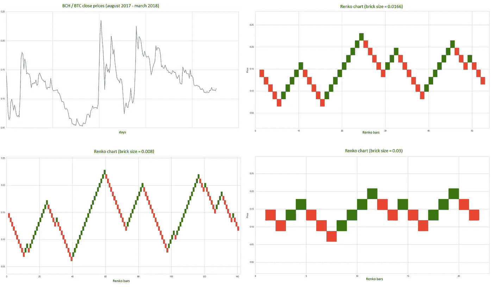

Renko charts built on different brick size

**连科海图制作的基本原理:**

*   只有当价格变动超过指定的阈值水平时，才会生成新的砖块。
*   砖块大小总是一样的。例如，如果尺寸是 10 点，价格增加了 20，那么将画 2 块砖。如果价格上涨，砖块将为绿色(浅色)，如果价格下跌，砖块将为红色(深色)。
*   将所选价格变量的下一个值与前一个砖块的最大值和最小值进行比较。新矩形总是显示在前一个矩形的右侧。
*   如果价格超过前一个砖块的顶部，超出砖块大小或更多，则绘制相应数量的绿色(浅色)矩形，使新砖块的下边界与前一个砖块的上边界相对应。
*   如果价格比前一个砖块的底部低了砖块大小或更多，则绘制相应数量的红色(黑色)矩形，新砖块的上边界与前一个砖块的下边界相对应。

图表分析师 Ranga 的这篇文章介绍了 Renko 图表。

在本文的下一部分，将使用我实现的 [pyrenko](https://github.com/quantroom-pro/pyrenko) 模块进行分析。

# 确定砖块尺寸的现有方法

1.  **传统**。这种方法使用预定义的砖块大小绝对值。
2.  **ATR** 。这种方法使用平均真实范围(ATR)指标生成的值。ATR 用于过滤掉金融工具的正常噪音或波动。ATR 方法“自动”确定好的砖块尺寸。它计算出常规蜡烛图中的 ATR 值，然后将该值作为砖块大小。

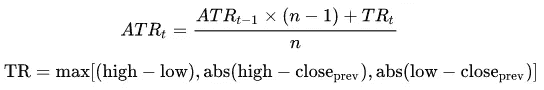

使用算术平均值公式计算第一个 ATR 值:

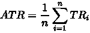

# **质量评估和评分功能**

这将是一个很好的衡量伦科图表的质量。让我们假设一个简单的策略，使用这些趋势跟随规则:当当前砖块是绿色(亮的)时，你的位置应该是“长的”。如果砖块的颜色已经改变，则改变到“短”位置。使用此逻辑，我们有以下参数:

*   *余额*是正负交易的总和。如果当前砖块与前一个砖块方向相同，则平衡值应增加+1。如果方向已经改变，平衡值应减少-2。正值就好。价值越大越好。
*   *sign_changes* 是趋势被改变了多少次的数字。价值越低越好。
*   *price_ratio* 是多个原始价格条与多个 renko 砖块的比率。大于 1 的值是好的。价值越大越好。

***得分函数*试图将这些参数整合成一个单一值。正值就好。价值越大越好。**

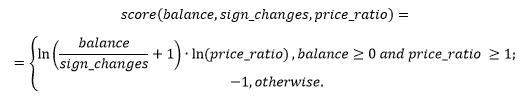

如果 *sign_changes* 等于 0，则在计算前应设置为 1。

让我们尝试在 3D 空间中模拟和可视化这个*得分函数*。球体的大小对应于一个*分数*值。红色球体的*分数*等于-1 值。

导入模块和包:

Imported modules and packages

生成、计算并可视化*得分函数*的结果:

Simulating and visualizing of score function

得分值乘以常数，以获得更明确的球体尺寸。

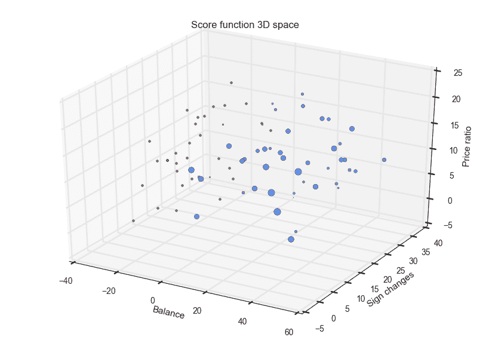

Score function 3D visalization

**本研究**的关键思想是测试假设，即我们可以使用*得分函数优化*来获得比当前方法( *ATR* 方法)更好的砖块大小。给定的结果将通过统计学方法进行显著性检验。

# **实验**

实验由三部分组成。

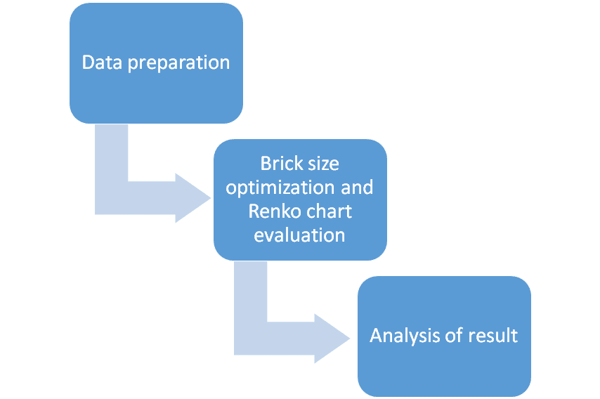

Experiment pipeline

## **数据准备**

*   从维基百科获取股票列表(标准普尔 500 指数)。
*   过去 3 年每天的收市价(高、低、收盘)。
*   删除数据中缺少值的股票。

该部分的代码块:

Downloading and cleaning the stocks

由于这部分数据集中包含了 *470 只股票*。

## **砖块尺寸优化和 Renko 图表评估**

该部分负责 Renko 图表评估。最佳砖块尺寸在包含 *70%* 天的列车组上确定。使用*得分函数*对剩余 *30%* 天进行 Renko 图评估。

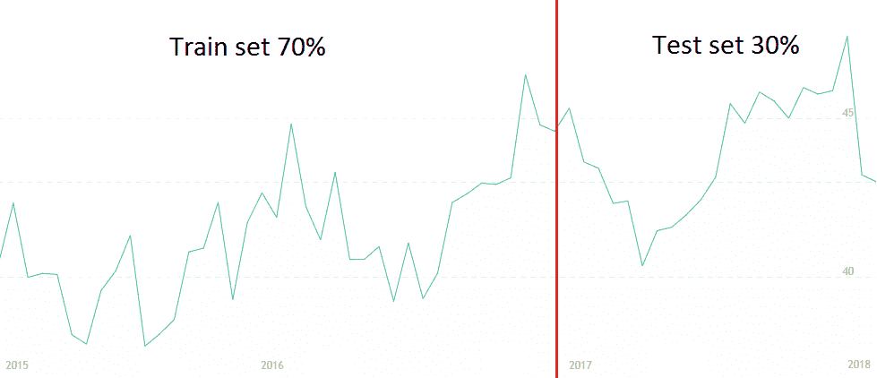

Train test split method

这两种操作(优化和评估)是针对两种方法( *ATR* 和*得分函数优化*)执行的。在 *ATR* 情况下，序列的最后一个 ATR 值被认为是最佳砖块尺寸。

在*得分函数优化*的情况下，最佳砖块尺寸是给出*得分函数*的最大值。

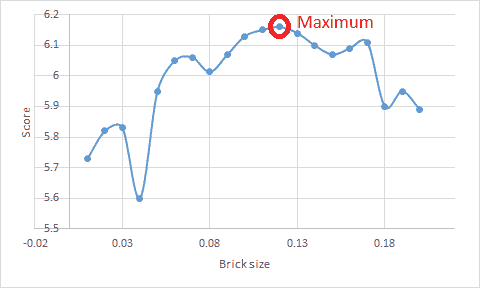

Score(brick_size) plot

这种方法使用基于 Brent 方法的一维函数最小化。*带负号的评分函数*要用，因为是逆问题。

此代码包含应优化的功能，以及评分/优化流程:

Optimization process

Brent 的方法是一种结合二分法、割线法和逆二次插值法的求根算法。它具有二分法的可靠性，但它可以像一些不太可靠的方法一样快。如果可能的话，该算法尝试使用潜在的快速收敛割线方法或反二次插值，但是如果必要的话，它退回到更健壮的二分法。边界点可以作为训练集上的最低和最高 ATR 值给出，这将是一个很好的初始近似值。更多关于布伦特方法的信息[这里](http://www2.geog.ucl.ac.uk/~plewis/invert/mat_stuff.html)。

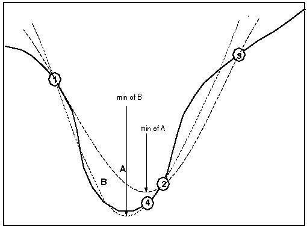

Brent’s method visualization

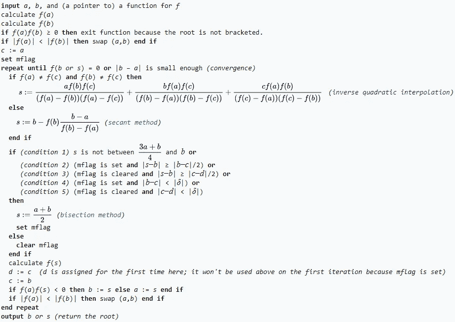

Brent’s method algorithm

让我们通过两种方法的*得分*值来得到股票排序列表。*分数*值是在测试集上计算的。

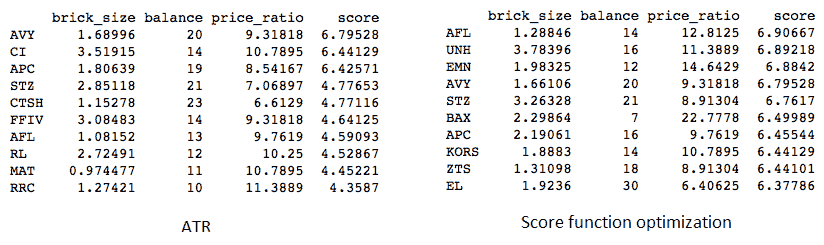

画出得分*最好的股票*的 Renko 图(AVY 股票为 *ATR* ，AFL 股票为*得分函数优化*)。

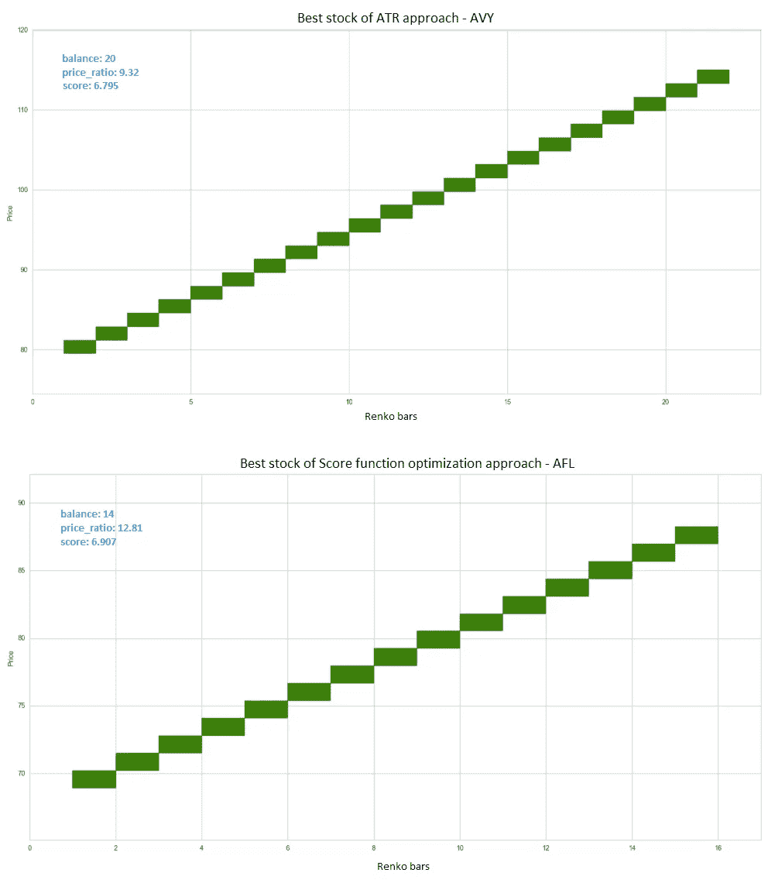

Renko charts of highest score stocks

结果可视化的代码块:

Result visualization

## **结果分析**

该散点图展示了*价格比率*如何对应于*余额*:

Scatter plots

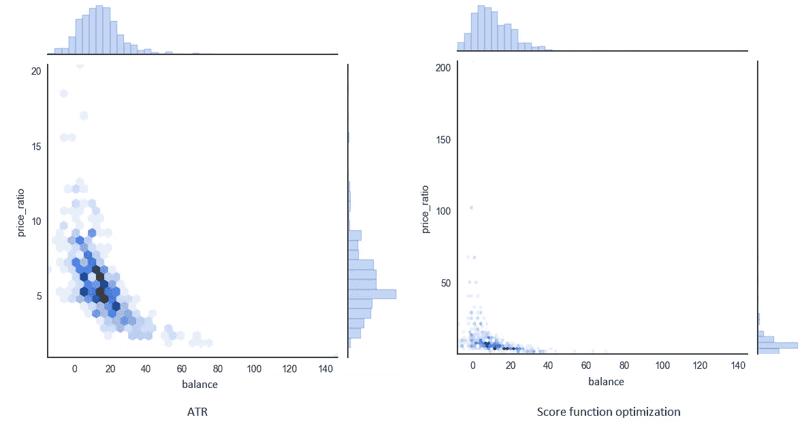

Visualization of how price_ratio corresponds to balance

我们可以得出结论，*得分函数优化*方法更好地压缩了数据，因为*价格比率*有更大的趋势。

画一个柱状图，显示测试集上有多少股票的*阳性/中性/阴性*结果:*阳性:得分>0；中性:得分= 0；负:分数< 0。*

计算和可视化结果的代码:

Positive / Neutral / Negative histogram

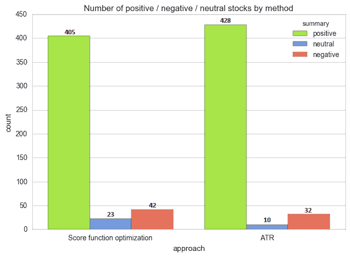

Histogram of result distribution for two approaches

频率有一些差异，但分布的形状是相似的。让我们展示两种方法的*分数*直方图，以及它们的差异分布:

Score histograms

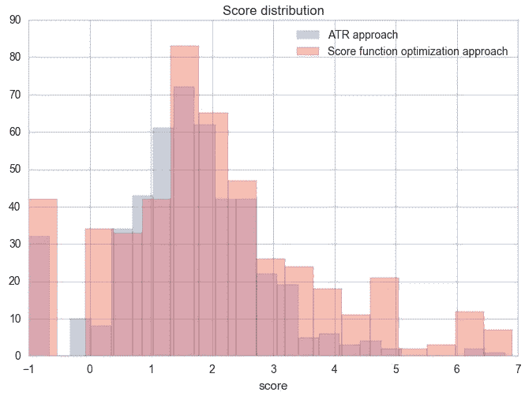

Score histogram for two approaches

Score difference histogram

将好估计一个*分数的置信区间*差。这将清楚地表明哪种方法平均起来会给出更好的分数。

检验样本来自正态分布的零假设。 *p 值为 1.085e-11* ，非常低，说明样本来自非正态分布:

Test on normal distribution

在非正态分布上计算置信区间是不可接受的。

我们可以使用 bootstrapping 得到一个置信区间。Bootstrapping 是一种实用的计算机方法，用于通过基于可用样本的蒙特卡罗方法来研究基于多代样本的统计分布。允许您快速轻松地评估各种统计数据(置信区间、方差、相关性等)。)对于复杂的模型。

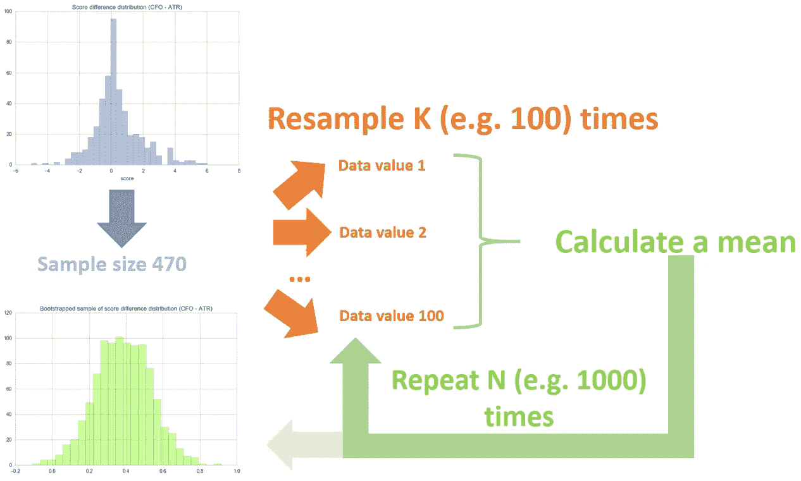

Boostrapping alogorithm

引导示例如下所示。该样本服从正态分布， *p 值为 0.9816* 。

重采样的代码块:

Bootstrapping

Bootstrapped sample of score difference

**几乎所有的平均值都大于 0** 。*t 检验的 p 值为 0.0(零假设:score_diff = 0.0)* ，我们拒绝零假设。**这些计算证实，对于所提出的方法，*得分函数优化*和 *ATR* 方法之间的平均*得分*差异更大。**

这是方法差异的一个特殊例子(UNH 股票)。

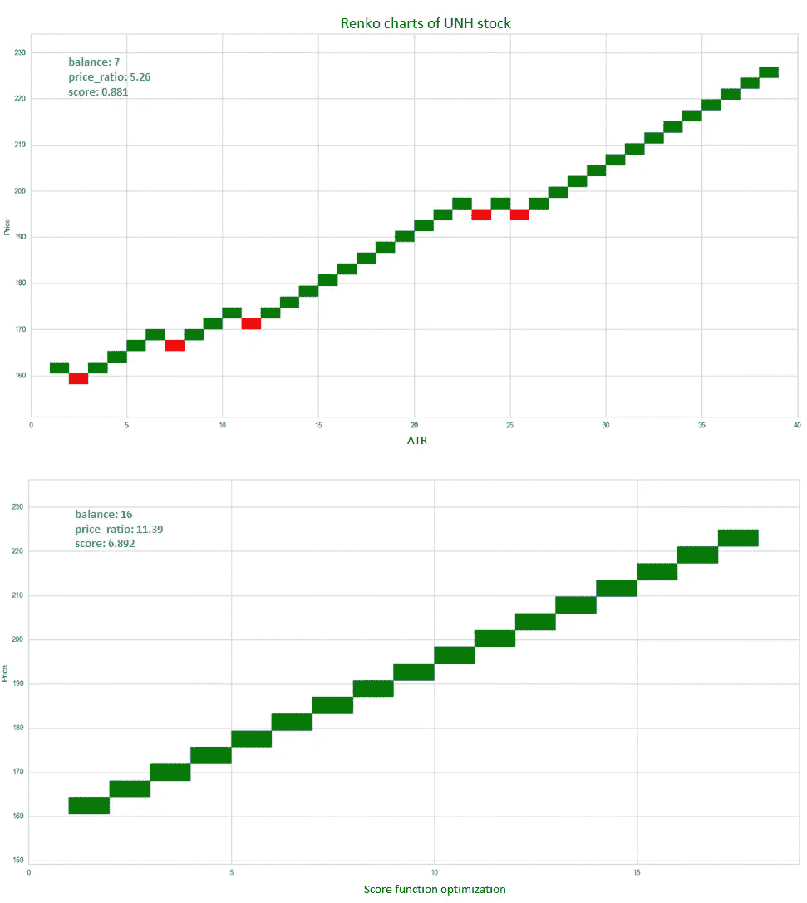

Renko charts of UNH for two approaches

# **结论**

1.  形式化了评估已建 Renko 图质量的*得分函数*。
2.  描述了一个*分数*优化的过程。
3.  所提出的方法比经典的 *ATR* 获得了更好的质量。这种优势在统计学上是显著的。
4.  pyrenko 是本分析中演示的一个模块，任何研究人员都可以使用。
5.  使用 Renko 演示了完整的降噪过程。包括代码。
6.  理论上，*平衡*参数乘以 *brick_size* 可以解释为测试集上的利润。这个简单的趋势跟踪策略是进一步研究的良好基础。为了更准确地估算利润，必须包括交易成本(经纪人费用、差价、滑点等)。).
7.  发展的方法可用于策略，如配对交易，趋势跟踪，支持和阻力等。经过处理的无噪声图表变得易于理解，趋势线更加清晰。

如果你在股票分析中使用伦科图表或者打算使用，请告诉我。此外，有趣的是，您使用什么方法来确定砖块大小？

**更新**

下一章研究[这里](https://hackernoon.com/adaptive-trend-following-trading-strategy-based-on-renko-9248bf83554)。

最诚挚的问候，

谢尔盖