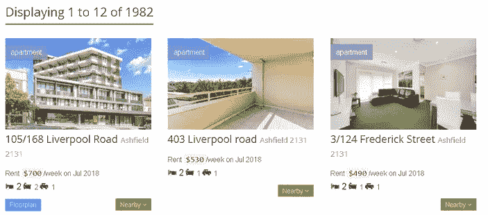
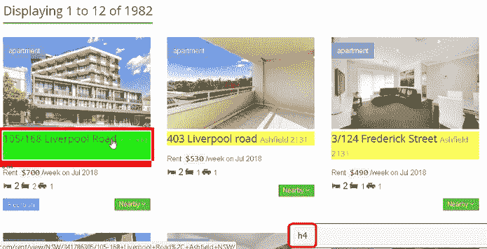
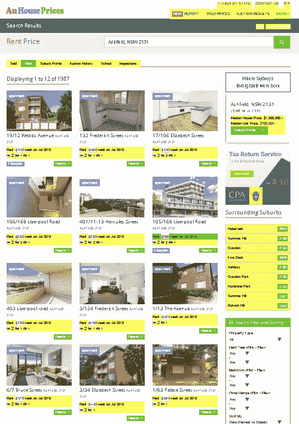
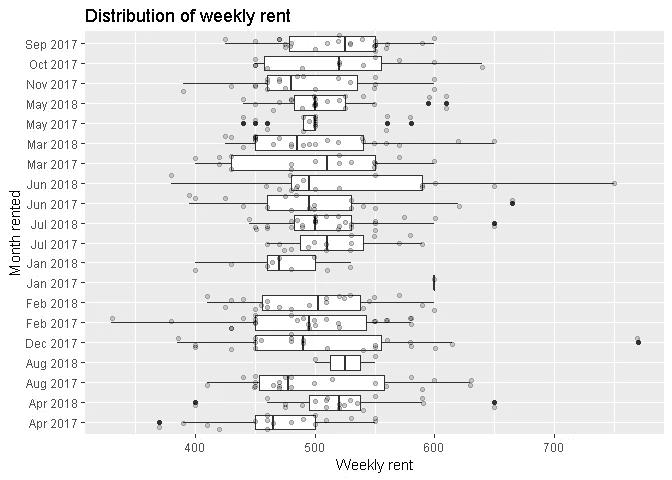
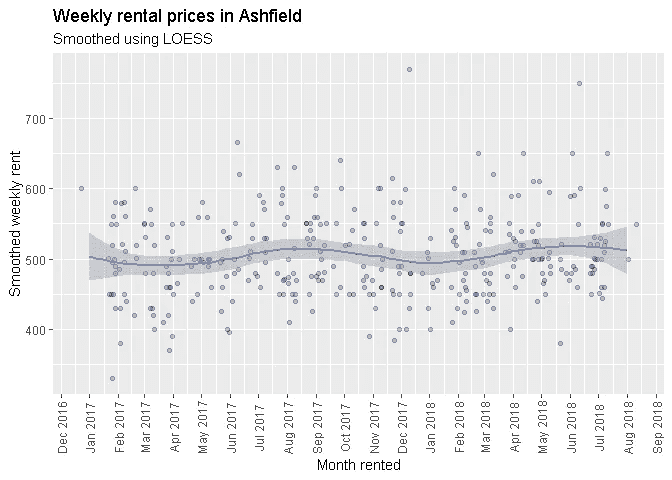
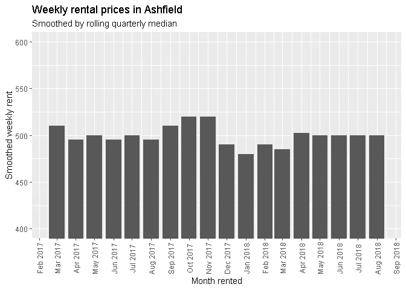
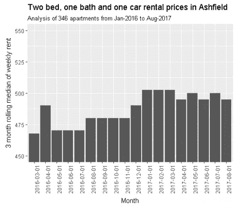

# 刮租:我如何用 R 省钱

> 原文：<https://towardsdatascience.com/rent-scraping-how-i-saved-money-using-r-fc93925ca11b?source=collection_archive---------8----------------------->

## 了解我如何使用 R 和网络抓取来对抗房租上涨并获胜。

*(TD；博士:收到房地产公司的信，增加我的周租金。增加的原因没有证据支持。利用 R 寻找支持房地产索赔的证据。与权力斗争并取得胜利！)*

围过来，围过来。来听一个关于一个人战胜当权者的故事。我难以置信地读到，他竭尽全力避免支付每周 5 美元的房租上涨，理由是没有实证证据证明这是合理的。

***(严重上注:这是关于 R 中的网页抓取)***

# “…根据当前的市场状况…”

我目前公寓的 12 个月租约即将到期。正当我想知道我的房地产经纪人给我一份为期 12 个月的新租约的年度电子邮件什么时候会到的时候，我收到了这个:

> 您目前以每周 500 美元的价格租赁您的房产，租约将于 2017 年 11 月 18 日到期。我们最近完成了对您的物业的租金审核，并建议业主根据当前的市场情况，您的物业租金应每周增加 5 美元。

渴求专一，我的思维超速运转:*什么市场条件？他们是如何定义它们的？5 美元太少了——什么样的市场条件变化能证明每周增加 5 美元是合理的呢？*

一年前，我的房租每周涨了 20 美元，再涨 5 美元对我来说似乎没有意义。我也感觉到了一种我不喜欢的力量不平衡。一方面，我们有房地产经纪人，他可以访问房地产价格和报告的数据库。另一方面，我们有一个租户，他不能访问同样多的信息。这种信息不对称传统上会使承租人处于弱势地位，因此更有可能接受房地产经纪人的建议。

不幸的是，对我的房地产经纪人来说，我有点疯狂。

我住在一套两居室的公寓里，有一个停车位和一个卫生间。我想寻找具有类似配置的公寓的数据。

# 数据在哪里？

## 新南威尔士州政府的家庭和社区服务——“出租桌”

我知道新南威尔士州政府每季度都会发布新出租房屋和公寓的报告。报告中有一个标签显示了一居室和两居室公寓周租金分布的第一个四分位数、中间值和第三个四分位数。

## 当然，这对我来说不够精确。我知道，如果我没有停车位，我的租金很可能会更便宜。我也知道如果我有两个浴室，我的房租会更贵。所以我继续我的探索。

## 给我一些'英寸'刮

在谷歌搜索了一番后，我发现了房价。看看这张截图:



它有我需要的所有信息:

*   每周租金，
*   公寓出租的月份
*   就卧室、浴室和停车位数量而言的公寓配置

这个网站另一个吸引人的地方是循环友好的 URL。这是第一页的 URL:

> [*https://www . auhouseprice . com/rent/list/NSW/2131/Ashfield/1/？排序=日期&类型=公寓&bmin = 2&bmax = 2*](https://www.auhouseprices.com/rent/list/NSW/2131/Ashfield/1/?sort=date&type=apartment&bmin=2&bmax=2)

以下是第二页的 URL:

> [*https://www . auhouseprice . com/rent/list/NSW/2131/Ashfield/2/？排序=日期&类型=公寓&bmin = 2&bmax = 2*](https://www.auhouseprices.com/rent/list/NSW/2131/Ashfield/2/?sort=date&type=apartment&bmin=2&bmax=2)

有什么变化？

“阿什菲尔德”后面的数字！

现在猜猜前 50 个 URL 可能是什么。很简单，对吧？

# 哈德利万岁:R 的 rvest 包

[rvest](https://blog.rstudio.com/2014/11/24/rvest-easy-web-scraping-with-r/) 是 R royalty，Hadley Wickham 的一个网络抓取 R 包。像大多数 Hadley 的包一样，rvest 以其直观的语法易于使用。该软件包是为与 magritter 的[管道操作员(dplyr](https://magrittr.tidyverse.org/) 的用户将熟悉该操作员)合作而构建的，允许我们创建优雅的数据管理管道。

开始使用 rvest 很容易:

1.  找到您想要刮除的页面
2.  获取该页面的 url
3.  使用 rvest**read _ html()**函数将页面读入 R
4.  使用 **html_node()** 或 **html_nodes()** 函数访问包含所需数据的 CSS 选择器(更多关于找到相关选择器和函数间差异的信息，见下文)。
5.  使用 **html_text()** 函数访问包含在前面步骤中提取的 CSS 选择器中的文本。
6.  使用 regex 提取上一步中访问的 CSS 选择器文本中的相关文本。

我们如何找出哪个 CSS 选择器包含了我们想要的数据？

# 带有 SelectorGadget 的 CSS 选择器

SelectorGadget 是谷歌 Chrome 的一个扩展，你只需点击它就可以快速发现哪个 CSS 选择器包含了你的目标数据。你不再需要在浏览器的开发工具中挖掘 HTML。这是一个巨大的时间节省。

安装它…现在！

# 让我们去战斗吧

我们现在已经有了使用 r 从网站收集数据的所有必要成分。我最终想要创建的输出是公寓租赁月份的每周租金时间序列。我想确保我的抓取工作符合预期，所以我想提取公寓的地址，以便我可以根据 Chrome 中的网页样本直观地检查我的数据。

让我们建立一个原型，刮第一页。

```
library(rvest)first_page <- read_html('https://www.auhouseprices.com/rent/list/NSW/2131/Ashfield/1/?sort=date&type=apartment&bmin=2&bmax=2')
```

## 目标:地址

进入 Chrome，点击右上角的 SelectorGadget 图标。点击其中一个地址，您应该会看到类似这样的内容出现在浏览器的右下角。



这是包含地址数据的 CSS 选择器。为了访问这个选择器中包含的数据，我们可以将页面通过管道传输到 *html_nodes()* ，指定 CSS 选择器名称作为它的参数。为了访问其中包含的文本，我们可以将这个结果通过管道传输到 *html_text()* 。

让我们来看看它的输出:

```
first_page %>%
  html_nodes('h4') %>%
  html_text() ##  [1] "2/93 Alt Street Ashfield 2131"             
##  [2] "9/23 Orpington Street Ashfield 2131"       
##  [3] "9/60 Bland Street Ashfield 2131"           
##  [4] "4/122 Frederick Street Ashfield 2131"      
##  [5] "3/13 Frederick Street Ashfield 2131"       
##  [6] "Address available on request Ashfield 2131"
##  [7] "19/12 Webbs Avenue Ashfield 2131"          
##  [8] "132 Frederick Street Ashfield 2131"        
##  [9] "17/106 Elizabeth Street Ashfield 2131"     
## [10] "106/168 Liverpool Road Ashfield 2131"      
## [11] "401/11-13 Hercules Street Ashfield 2131"   
## [12] "105/168 Liverpool Road Ashfield 2131"      
## [13] " Search Filter and Sorting
```

我们不希望元素 13(“搜索过滤和排序”)出现在我们的地址向量中，所以我们将其排除。

```
addresses <- first_page %>%
  html_nodes('h4') %>%
  html_text() %>%
  .[which(. != ' Search Filter and Sorting ')]
```

## 目标:租赁的周租金和月租金

点击每周租金和公寓出租的月份给我们提出了一个挑战。包含我们要寻找的数据的选择器(“li”)由一大堆其他数据共享。看一下突出显示的内容:



让我们来看看从“li”选择器中可以提取的前几个元素:

```
first_page %>%
  html_nodes('li') %>%
  html_text() %>%
  head(10)##  [1] "  View By State Melbourne, VIC Sydney, NSW Brisbane, QLD Adelaide, SA Perth, WA Canberra, ACT Darwin, NT Hobart, TAS "
##  [2] "Melbourne, VIC"                                                                                                       
##  [3] "Sydney, NSW"                                                                                                          
##  [4] "Brisbane, QLD"                                                                                                        
##  [5] "Adelaide, SA"                                                                                                         
##  [6] "Perth, WA"                                                                                                            
##  [7] "Canberra, ACT"                                                                                                        
##  [8] "Darwin, NT"                                                                                                           
##  [9] "Hobart, TAS"                                                                                                          
## [10] ""
```

我们知道我们想要提取的文本的模式。事情是这样的:

> Mmm yyyy 每周租金$###

让我们使用一些 regex 和来自 [stringr](https://cran.r-project.org/web/packages/stringr) 包的 str_extract()函数(再次向 Hadley 致敬),在“li”选择器的元素向量中提取任何匹配这个模式的文本。注意，str_extract()为不匹配我们模式的元素返回一个与 NAs 输入长度相同的向量。最后一步，我们将过滤掉 NAs。

## 那些符号是什么？从正则表达式到英语的翻译

我的主张是，上述模式可以用 regex 表示如下:

> ^Rent.+/周。*\\d{4}$

不要害怕。这看起来很疯狂，但所有这些都是在说:

*   ***^* —** 我们应该匹配目标字符串开头的内容。
*   ***租金。+*** —查找单词“租金”后跟一个或多个任意字符。句点是 regex 中的一个特殊字符，表示“匹配任何字符”。加号意味着“一个或多个”紧接在它前面的任何事物。
*   **/周 T5。*** —查找“每周”，后跟零个或多个任意字符。零或更多用星号表示，它是加号的不太严格的表亲。
*   ***\\d{4}*** —目标字符串应以 4 位数字结尾。“\\d”是 regex 中的另一个特殊字符，它表示“匹配从 0 到 9 的任何数字”。额外的斜线在那里，因为我们需要转义 r 中的反斜线，“{4}”意味着“重复紧接在前面的内容 4 次”。换句话说，匹配 4 位数。
*   ***$*** —目标字符串应该以紧跟在我之前的内容结束。在这种情况下，4 位数。

让我们来测试一下:

```
library(stringr)

price_month <- first_page %>%
  html_nodes('li') %>%
  html_text() %>%
  str_extract('^Rent.+/week.*\\d{4}$') %>%
  .[which(!is.na(.))]

price_month##  [1] "Rent $420/week on Aug 2018" "Rent $510/week on Aug 2018"
##  [3] "Rent $490/week on Aug 2018" "Rent $500/week on Aug 2018"
##  [5] "Rent $550/week on Aug 2018" "Rent $730/week on Aug 2018"
##  [7] "Rent $510/week on Jul 2018" "Rent $480/week on Jul 2018"
##  [9] "Rent $520/week on Jul 2018" "Rent $630/week on Jul 2018"
## [11] "Rent $630/week on Jul 2018" "Rent $700/week on Jul 2018"
```

呜哇！我们有 12 个地址的 12 组数据。我们可以很容易地使用更多的正则表达式来提取每月和每周的租金。我将向你展示我是如何做到的，但是试着像我上面做的那样分解它，所有那些符号会显得不那么令人生畏。首先，提取月份…

```
str_extract(price_month, '[A-Z][a-z]{2} \\d{4}$') %>%
  head(5)## [1] "Aug 2018" "Aug 2018" "Aug 2018" "Aug 2018" "Aug 2018"
```

…然后是每周租金:

```
str_extract(price_month, '(?<=Rent \\$).*(?=/week)') %>%
  head(5)## [1] "420" "510" "490" "500" "550"
```

## 目标:属性配置

我们开始想要分析与我的公寓相似的公寓。也就是说，我们想要分析有 2 间卧室、1 间浴室和 1 个停车位的公寓。查看搜索结果可以发现，我们需要考虑两种情况:

*   大多数房产至少有一间浴室和一个停车位，所以我们有 3 个数字——卧室数量、浴室数量和停车位数量。
*   有些酒店没有停车位。所以我们有两个数字——卧室的数量，后面是浴室的数量。

我想捕捉这两种模式，这样我就有 12 套公寓配置，它们可以很容易地与 12 个地址、月和周租金组合在一起。一旦它们被组合成一个数据框，我就可以很容易地过滤掉那些不符合我的目标公寓配置的公寓。

尝试将下面的正则表达式翻译成简单的英语:

```
first_page %>%
  html_nodes('li') %>%
  html_text() %>%
  str_extract(' \\d \\d (\\d )*$') %>%
  str_trim() %>%
  .[which(!is.na(.))]##  [1] "2 1 1" "2 1 1" "2 1 1" "2 1 1" "2 1 1" "2 2 1" "2 1 1" "2 1 1"
##  [9] "2 2 1" "2 2 1" "2 2 1" "2 2 1"
```

# 像 Voltron 这样的表单:创建我们的最终数据集

那么，我们学到了什么？

*   我们知道前 **n** 页的 URL 是什么。
*   我们知道如何从这些页面中提取感兴趣的数据。

在分析我们的数据之前，我们需要做的就是编写一个循环，遍历公寓的 **n** 个页面，同时将每个页面的数据追加到某个主数据集。然后，我们将这个主数据集子集用于匹配我们期望的公寓配置的公寓。描述这个过程不是本文的重点，所以我将在本文的最后提供我的最终代码。

# 亲爱的房地产经纪人…

两室一卫一车位公寓的周租金在几个月内变化很大。



导致这种情况的一些可能原因如下:

*   新公寓的租金比旧公寓贵——快速浏览一些更贵公寓的照片可以发现，它们位于火车站附近新建的公寓里。
*   离火车站和购物区较近的公寓比离这些较远的公寓租金更贵。

我的公寓很旧了，离火车站大约 10 分钟的路程。这绝不是例外，所以我觉得一个“典型”的价格最能描述我公寓的“真实”周租金。所以我尝试了一些平滑的方法。

我个人喜欢通过 ggplot 的 geom_smooth()使用黄土。



然而，我不想向我的房地产经纪人解释黄土是如何工作的。所以我决定采用季度租金中值。不是取个平均值那么简单。但我认为，考虑到异常值，中位数是合适的，如果有人问我对统计数据的选择，这很容易解释。



所以我写了一封邮件:

> 1.去年，租金每周上涨 20 美元，这似乎超过了当时的市场价格(更多信息见下文)。
> 
> 2.我自己对数据进行了审查，发现我们目前支付的租金是合理的:
> 
> *我使用 webscraping 收集了 2016 年 1 月至 2017 年 8 月在阿什菲尔德新租的 346 套“两室一卫一车位”公寓的数据。租金从旧公寓每周约 400 美元到全新公寓每周 600 多美元不等。
> 
> *自 2017 年 1 月以来，租金中位数似乎一直徘徊在 500 美元以上或略低于 500 美元的水平(请参见下图)。事实上，这一时期每周租金的中位数是 495 美元。
> 
> *我已将此与最新的新南威尔士州房屋租赁和销售报告进行了交叉核对。阿什菲尔德一套两居室公寓上个季度的租金中值是 500 美元。中位数略高于我的数字是有道理的，因为新南威尔士州的住房数据将包括拥有不止一个浴室或不止一个停车位的公寓。
> 
> *去年我们的租金提高到每周 500 美元时，中位数价格徘徊在每周 480 美元左右。我已经将此与新南威尔士州 12 月份的房屋租赁和销售报告进行了交叉核对，并可以确认这是准确的。



# 故事的寓意:数据是强大的

这封邮件我一直没有收到回复。相反，我收到了一份未来 12 个月每周租金相同的合同！

数据是强大的，所以要学会如何使用它。去存点钱吧，伙计们！

贾斯廷

*原载于 2018 年 9 月 1 日*[*【https://embracingtherandom.com】*](https://embracingtherandom.com/r/web-scraping/rent-scraping/)*。*